# ふるまい / 処理フロー

## シーケンス：ログイン
**説明（一般）**: 画面操作からAPI応答までの手順と役割分担を示します。  
**このプロジェクトでは**: 認証成功時にJWTを発行し、Cookieに保存して以降のAPI認証に使います。
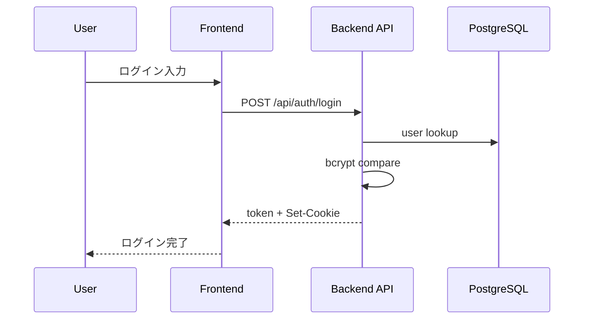

## シーケンス：Chatwork同期（管理者）
**説明（一般）**: 非同期ジョブの起動と処理の流れを示します。  
**このプロジェクトでは**: 管理者操作でジョブを作成し、BullMQワーカーが同期を実行します。
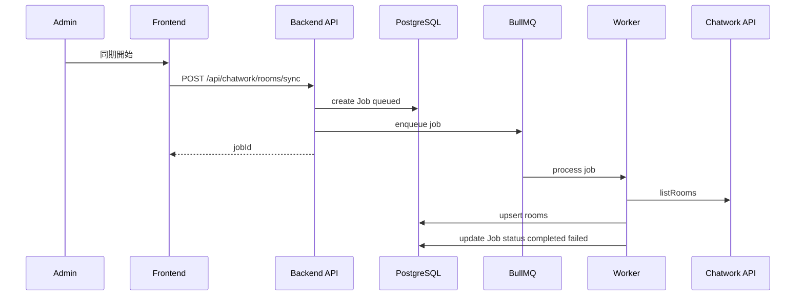

## シーケンス：要約ドラフト生成
**説明（一般）**: キャッシュ確認と非同期処理の分岐を示します。  
**このプロジェクトでは**: 期限内ドラフトがあれば即返し、なければジョブ経由で生成します。
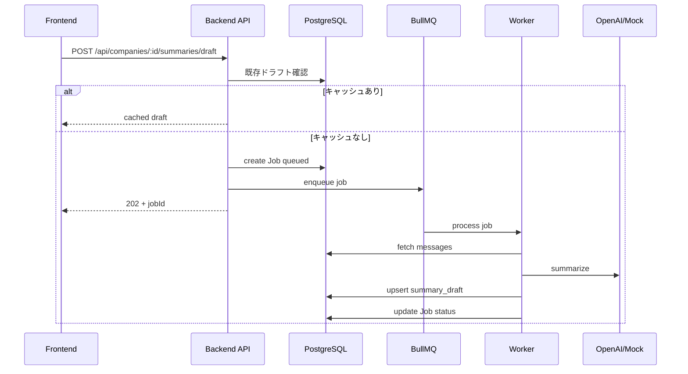

## アクティビティ：Chatworkメッセージ同期
**説明（一般）**: ループ処理や分岐を含む処理の流れを示します。  
**このプロジェクトでは**: ルームごとに取得・保存し、失敗時はエラー情報を記録します。
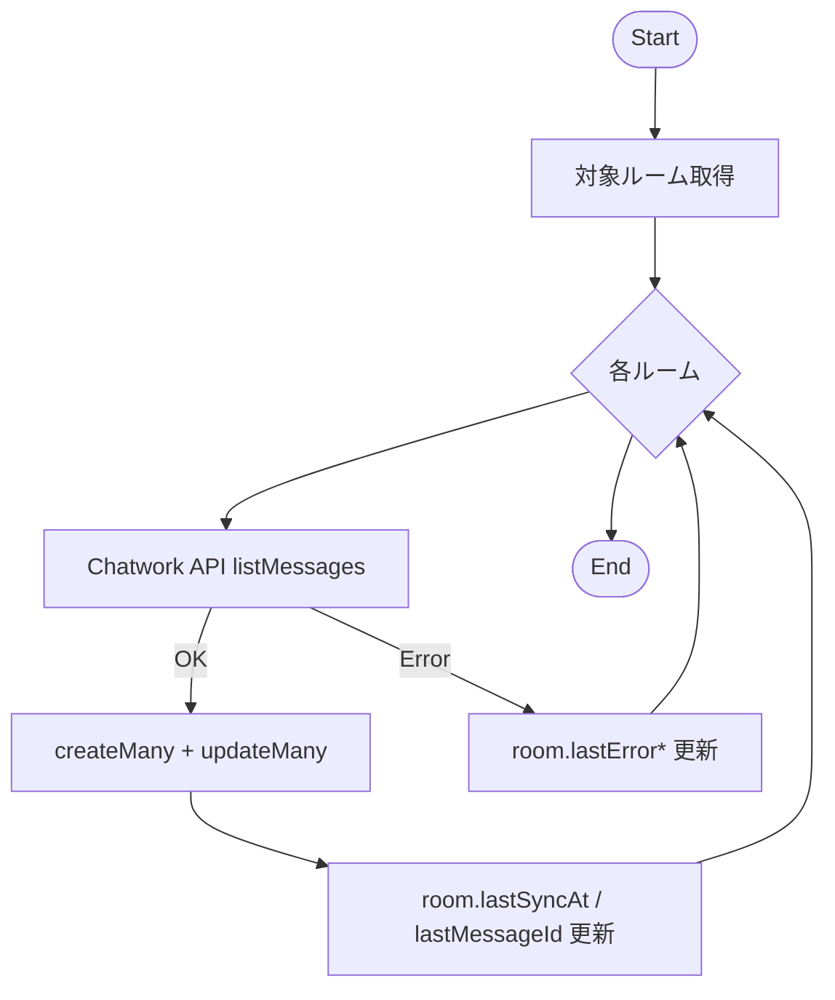

## ステートマシン：JobStatus
**説明（一般）**: ジョブの状態遷移を示します。  
**このプロジェクトでは**: DBの`jobs.status`がqueued→processing→completed/failed/canceledで更新されます。
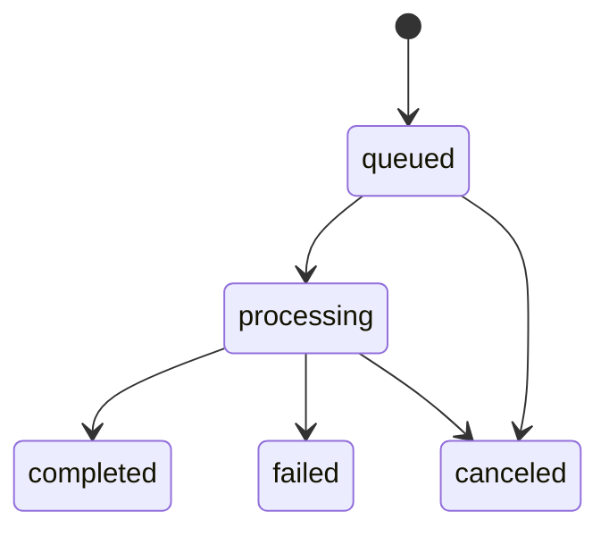

## ステートマシン：TaskStatus
**説明（一般）**: タスクの状態遷移を示します。  
**このプロジェクトでは**: todo/in_progress/done/cancelledを画面とAPIで管理します。
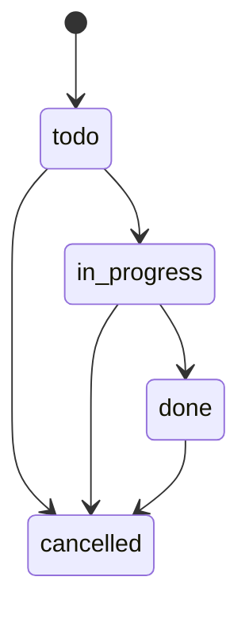

## タイミング：自動同期スケジュール
**説明（一般）**: 定期処理のタイミングを示します。  
**このプロジェクトでは**: 環境変数で設定した間隔でChatwork同期ジョブを投入します。
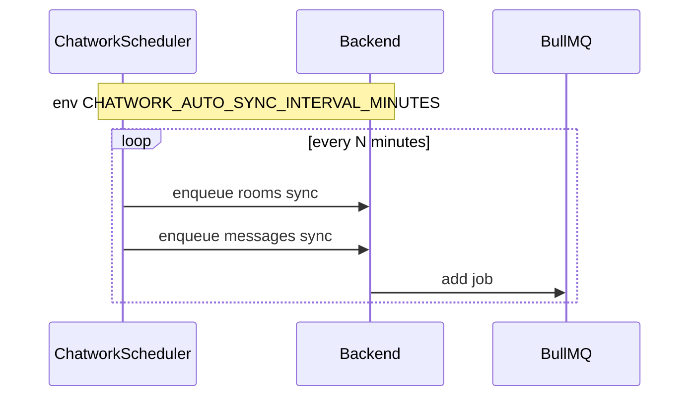

## 相互作用概要（代表シナリオ）
**説明（一般）**: 代表的なユーザーフローを短くまとめた図です。  
**このプロジェクトでは**: ダッシュボードから会社詳細へ進み、同期や要約を実行します。
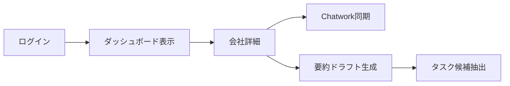

## 例外伝播（APIエラーハンドリング）
**説明（一般）**: 例外がどのように捕捉・整形されて返るかを示します。  
**このプロジェクトでは**: `setErrorHandler` と `normalizeErrorPayload` で共通形式に揃えます。
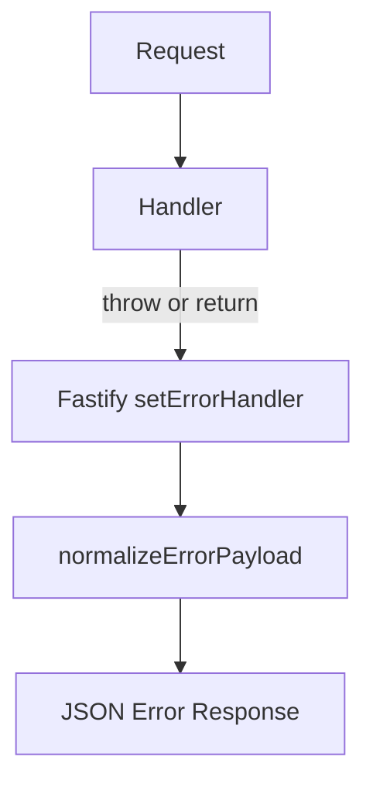

## リトライ / タイムアウト / サーキットブレーカ
**説明（一般）**: 外部API失敗時の再試行やタイムアウトの扱いを示します。  
**このプロジェクトでは**: Chatworkは簡易リトライ、OpenAIは失敗時にジョブ失敗として扱います。
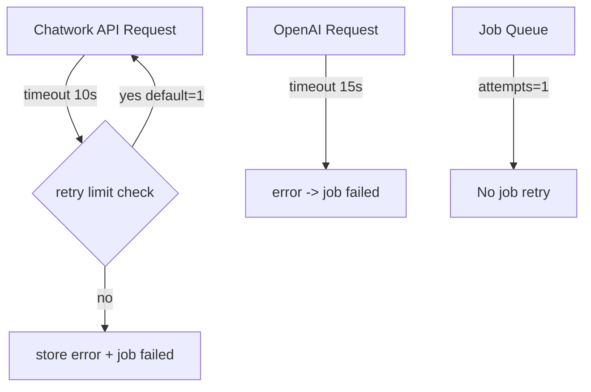

## 冪等性の設計（現状）
**説明（一般）**: 同じ操作を繰り返しても結果が崩れない工夫を示します。  
**このプロジェクトでは**: ユニーク制約と`upsert`で重複登録を避けます。
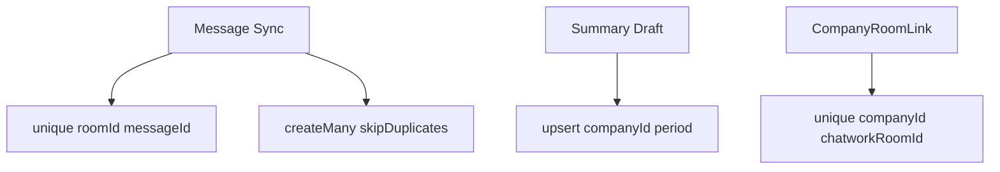

## 備考（未実装/非該当）
- 分散トランザクション / サガ：未実装
- 明示的ロック設計：未実装（DB制約に依存）
- サーキットブレーカ：未実装（簡易リトライのみ）
