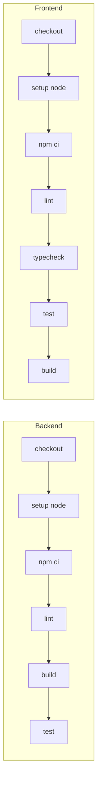

# CI/CD / リリース

## CI パイプライン
**説明（一般）**: ビルドやテストの自動実行の流れを示します。  
**このプロジェクトでは**: Front/Backを分けて lint → build → test を回します。


## CD / デプロイフロー（現状）
**説明（一般）**: リリースまでの流れを示します。  
**このプロジェクトでは**: Docker/Staticのビルド後にRenderまたはComposeでデプロイします。
```mermaid
flowchart LR
  Push[Push/Tag] --> Build[Build Docker/Static]
  Build --> Deploy[Deploy (Render or Docker Compose)]
```

## 環境一覧
| 環境 | 構成 |
| --- | --- |
| Dev | ローカル (Vite + Fastify + Docker DB/Redis) |
| Prod | Render or Docker Compose (docker-compose.prod.yml) |

## ロールバック（方針）
- Docker Compose: 前のイメージで再起動
- Render: 直前のデプロイに戻す（ダッシュボード操作）
