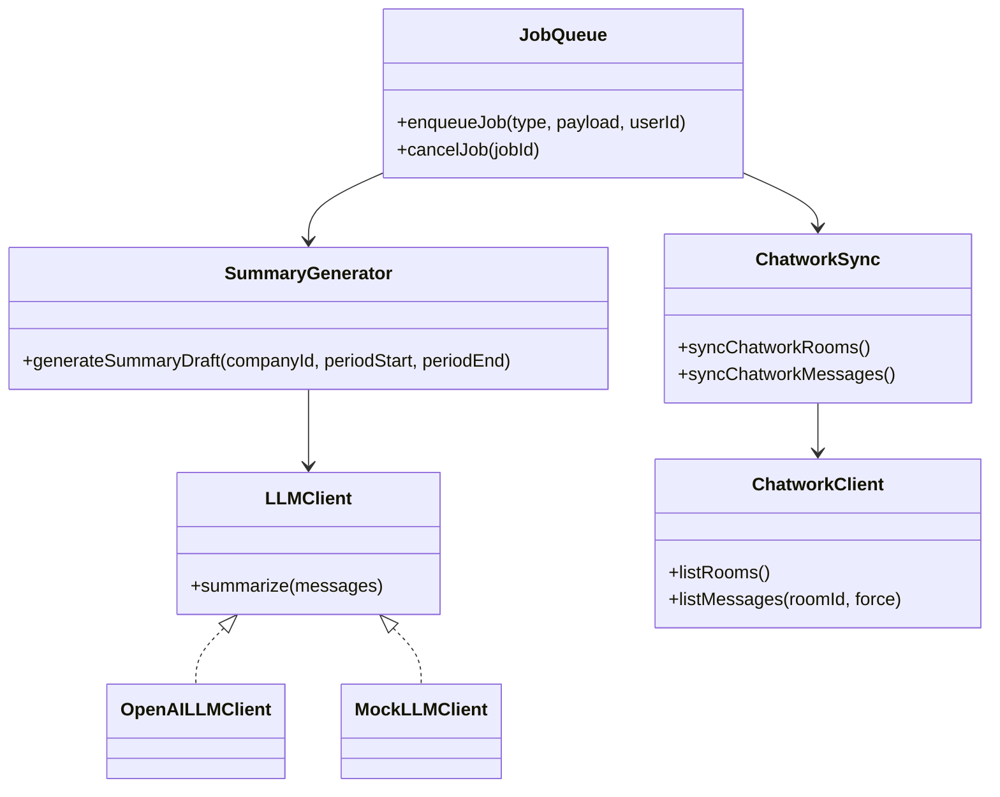

# 実装設計 / 規約

## クラス図（主要コンポーネント）
**説明（一般）**: 主要クラス/インタフェースの関係を示します。  
**このプロジェクトでは**: `LLMClient`がOpenAI/Mockで切替可能、ジョブが同期/要約を呼び出します。


## インタフェース契約（抜粋）
| インタフェース | 入力 | 出力 |
| --- | --- | --- |
| `LLMClient.summarize` | `LLMInputMessage[]` | `LLMResult` |
| `ChatworkClient.listRooms` | - | `ChatworkRoom[]` |
| `ChatworkClient.listMessages` | `roomId`, `force` | `ChatworkMessage[]` |
| `enqueueSummaryDraftJob` | `companyId, periodStart, periodEnd` | `Job` |
| `cancelJob` | `jobId` | `Job` |

## 例外設計
| 種別 | 発生源 | 扱い |
| --- | --- | --- |
| `ChatworkApiError` | Chatwork API | ルームにエラー記録、ジョブ失敗 |
| `JobCanceledError` | Job処理 | `canceled` で終了 |
| API Error Payload | API | `buildErrorPayload` に統一 |

## エラーメッセージ規約
```json
{
  "error": {
    "code": "BAD_REQUEST",
    "message": "Invalid period",
    "details": {}
  }
}
```

## ログ設計（API）
| フィールド | 内容 |
| --- | --- |
| `requestId` | `x-request-id` |
| `method` | HTTPメソッド |
| `url` | リクエストURL |
| `statusCode` | ステータス |
| `userId` / `role` | JWT由来 |

## 設定項目（環境変数）
`NODE_ENV`, `PORT`, `BACKEND_PORT`, `JWT_SECRET`, `CORS_ORIGINS`,  
`DATABASE_URL`, `DATABASE_URL_TEST`,  
`RATE_LIMIT_MAX`, `RATE_LIMIT_WINDOW_MS`, `TRUST_PROXY`,  
`CHATWORK_API_TOKEN`, `CHATWORK_API_BASE_URL`, `CHATWORK_AUTO_SYNC_ENABLED`,  
`CHATWORK_AUTO_SYNC_INTERVAL_MINUTES`, `CHATWORK_AUTO_SYNC_ROOM_LIMIT`,  
`CHATWORK_NEW_ROOMS_ACTIVE`, `CHATWORK_WEBHOOK_TOKEN`,  
`CHATWORK_WEBHOOK_COOLDOWN_SECONDS`,  
`OPENAI_API_KEY`, `OPENAI_MODEL`, `REDIS_URL`, `JOB_WORKER_ENABLED`

### Seed / テスト用（任意）
`ADMIN_EMAIL`, `ADMIN_PASSWORD`, `ADMIN_ROLE`

## Feature Flags（実質）
| 変数 | 目的 |
| --- | --- |
| `CHATWORK_AUTO_SYNC_ENABLED` | 自動同期ON/OFF |
| `JOB_WORKER_ENABLED` | Worker有効化 |
| `CHATWORK_NEW_ROOMS_ACTIVE` | 新規ルームの初期Active |

## 依存ライブラリ（主要）
### Backend
- Fastify / Prisma / BullMQ / Redis / Zod / bcryptjs
- OpenAI 呼び出し（標準 fetch）

### Frontend
- React / React Router
- Tailwind CSS + clsx / tailwind-merge
- @dnd-kit（D&D UI）

## ADR
- まだ管理されていません（追加する場合は `Docs/ADR/` 推奨）
