# 蝗ｳ陦ｨ・亥・菴薙∪縺ｨ繧・ｼ・

> 逕滓・蜈・ Docs/diagrams/*.md

---

# 繧｢繝ｼ繧ｭ繝・け繝√Ε / 讒矩€

## 繧ｷ繧ｹ繝・Β繧ｳ繝ｳ繝・く繧ｹ繝茨ｼ・4 Context・・
**隱ｬ譏趣ｼ井ｸ€闊ｬ・・*: 蛻ｩ逕ｨ閠・・螟夜Κ繧ｷ繧ｹ繝・Β繝ｻ閾ｪ繧ｷ繧ｹ繝・Β縺ｮ髢｢菫ゅ→蠅・阜繧偵＊縺｣縺上ｊ謗ｴ繧€蝗ｳ縺ｧ縺吶€・ 
**縺薙・繝励Ο繧ｸ繧ｧ繧ｯ繝医〒縺ｯ**: 繝悶Λ繧ｦ繧ｶ蛻ｩ逕ｨ閠・′繝輔Ο繝ｳ繝育ｵ檎罰縺ｧAPI繧剃ｽｿ縺・€，hatwork/OpenAI縺ｨ騾｣謳ｺ縺励∪縺吶€・
```mermaid
flowchart TB
  subgraph Users[蛻ｩ逕ｨ閠・
    Admin[邂｡逅・€・
    Staff["荳€闊ｬ繝ｦ繝ｼ繧ｶ繝ｼ sales/ops/readonly"]
  end

  subgraph System[CWLLM]
    FE["Frontend React + Vite"]
    BE["Backend API Fastify"]
  end

  DB[(PostgreSQL)]
  Redis[(Redis BullMQ)]
  Chatwork[Chatwork API]
  OpenAI[OpenAI API]

  Admin --> FE
  Staff --> FE
  FE --> BE
  BE --> DB
  BE --> Redis
  BE --> Chatwork
  BE --> OpenAI
  Chatwork --> BE
```

## C4 Container
**隱ｬ譏趣ｼ井ｸ€闊ｬ・・*: 荳ｻ隕√↑螳溯｡悟腰菴搾ｼ・I/API/繝ｯ繝ｼ繧ｫ繝ｼ/DB/繧ｭ繝｣繝・す繝･・峨ｒ縺ｾ縺ｨ繧√※遉ｺ縺励∪縺吶€・ 
**縺薙・繝励Ο繧ｸ繧ｧ繧ｯ繝医〒縺ｯ**: API縺ｨBullMQ繝ｯ繝ｼ繧ｫ繝ｼ縺訓ostgreSQL縺ｨRedis繧貞・譛峨＠縲∝､夜ΚAPI縺ｸ繧｢繧ｯ繧ｻ繧ｹ縺励∪縺吶€・
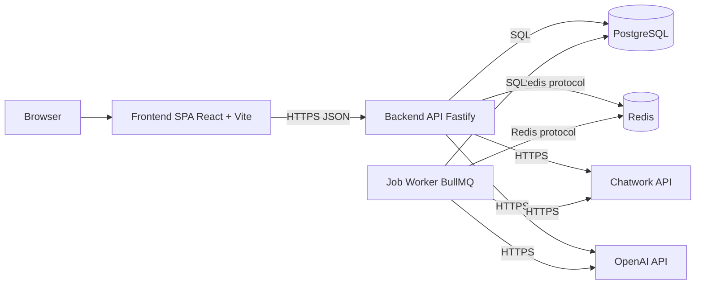

## 繝舌ャ繧ｯ繧ｨ繝ｳ繝峨・繧ｳ繝ｳ繝昴・繝阪Φ繝亥峙・・ML Component 逶ｸ蠖難ｼ・
**隱ｬ譏趣ｼ井ｸ€闊ｬ・・*: 繝舌ャ繧ｯ繧ｨ繝ｳ繝牙・驛ｨ縺ｮ讒区・隕∫ｴ縺ｨ萓晏ｭ倬未菫ゅｒ遉ｺ縺励∪縺吶€・ 
**縺薙・繝励Ο繧ｸ繧ｧ繧ｯ繝医〒縺ｯ**: Routes竊辿andlers竊担ervices竊単risma縺ｮ豬√ｌ縺ｧ縲∝酔譛・隕∫ｴ・↑縺ｩ縺ｮ讖溯・縺悟ｮ溯｣・＆繧後※縺・∪縺吶€・
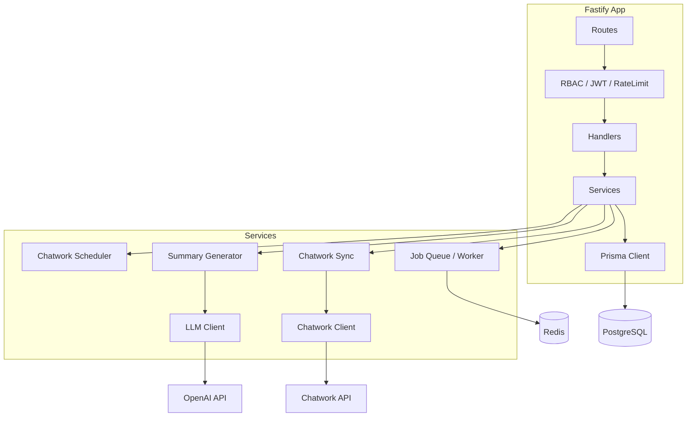

## 隲也炊繧｢繝ｼ繧ｭ繝・け繝√Ε・亥ｱ､繝ｻ雋ｬ蜍呻ｼ・
**隱ｬ譏趣ｼ井ｸ€闊ｬ・・*: 螻､縺斐→縺ｮ雋ｬ蜍吶→萓晏ｭ俶婿蜷代ｒ謨ｴ逅・☆繧句峙縺ｧ縺吶€・ 
**縺薙・繝励Ο繧ｸ繧ｧ繧ｯ繝医〒縺ｯ**: UI竊但PI竊担ervice竊棚nfra縺ｮ荳€譁ｹ蜷代〒縲．B/Redis/螟夜ΚAPI縺ｯInfra蛛ｴ縺ｫ髮・ｴ・＠縺ｦ縺・∪縺吶€・
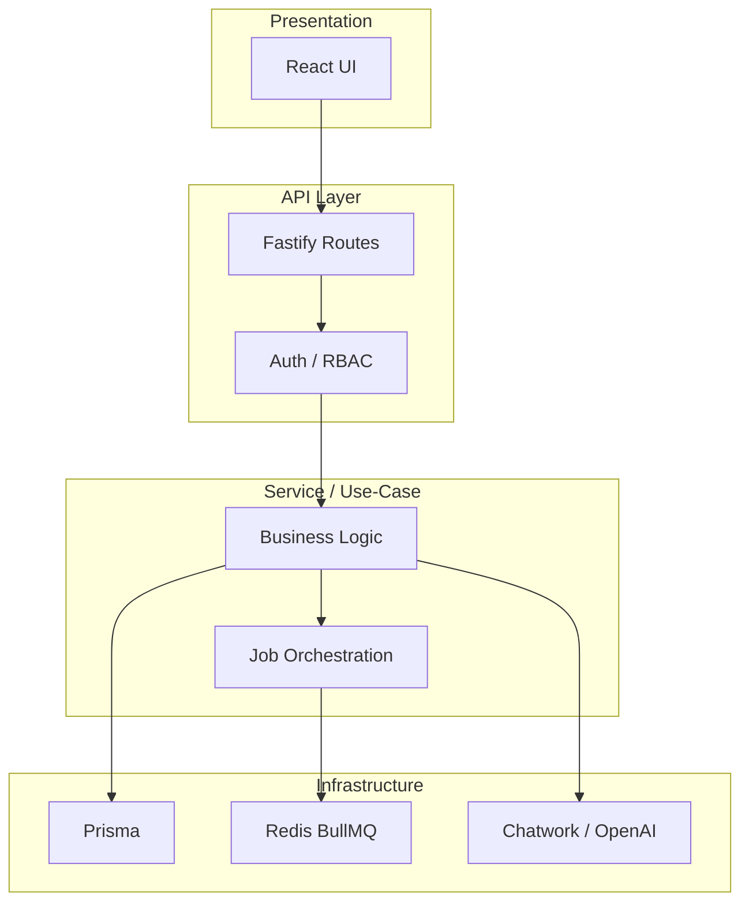

## 迚ｩ逅・い繝ｼ繧ｭ繝・け繝√Ε・・ev / Prod・・
**隱ｬ譏趣ｼ井ｸ€闊ｬ・・*: 螳溯｡檎腸蠅・〒縺ｮ驟咲ｽｮ・医・繝ｭ繧ｻ繧ｹ/繧ｳ繝ｳ繝・リ/繧ｵ繝ｼ繝薙せ・峨ｒ遉ｺ縺励∪縺吶€・ 
**縺薙・繝励Ο繧ｸ繧ｧ繧ｯ繝医〒縺ｯ**: 髢狗匱縺ｯVite+Fastify縺ｨDocker縺ｮDB/Redis縲・°逕ｨ縺ｯRender縺ｾ縺溘・Docker讒区・縺ｧ縺吶€・
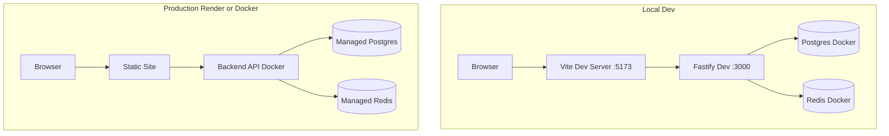

## 繝阪ャ繝医Ρ繝ｼ繧ｯ讒区・ / 繝医Λ繝輔ぅ繝・け繝輔Ο繝ｼ
**隱ｬ譏趣ｼ井ｸ€闊ｬ・・*: 繝ｪ繧ｯ繧ｨ繧ｹ繝医・蜈･蜿｣縺九ｉ蜀・Κ繝ｻ螟夜Κ騾｣謳ｺ縺ｾ縺ｧ縺ｮ騾壻ｿ｡邨瑚ｷｯ繧堤､ｺ縺励∪縺吶€・ 
**縺薙・繝励Ο繧ｸ繧ｧ繧ｯ繝医〒縺ｯ**: 繝悶Λ繧ｦ繧ｶ竊偵ヵ繝ｭ繝ｳ繝遺・API竊奪B/Redis竊貞､夜ΚAPI縺ｮ豬√ｌ縺ｫ縺ｪ繧翫∪縺吶€・
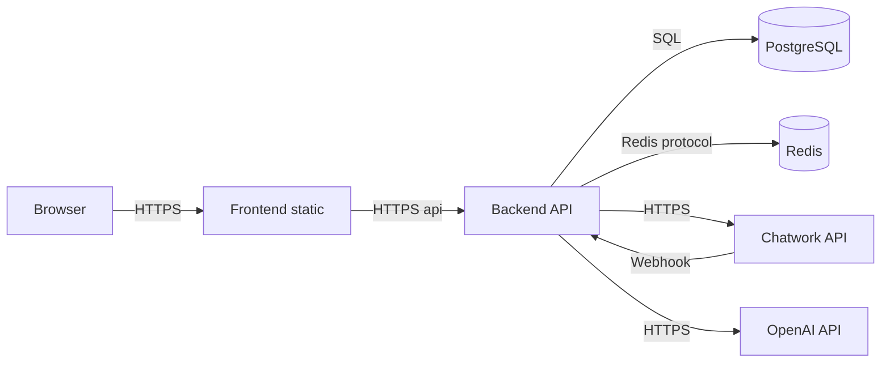

## 隱崎ｨｼ繝ｻ隱榊庄蠅・阜・・rust Boundary・・
**隱ｬ譏趣ｼ井ｸ€闊ｬ・・*: 縺ｩ縺薙〒隱崎ｨｼ繝ｻ隱榊庄縺瑚｡後ｏ繧後ｋ縺九€∽ｿ｡鬆ｼ蠅・阜繧堤､ｺ縺吝峙縺ｧ縺吶€・ 
**縺薙・繝励Ο繧ｸ繧ｧ繧ｯ繝医〒縺ｯ**: JWT讀懆ｨｼ縺ｨRBAC縺ｯ繝舌ャ繧ｯ繧ｨ繝ｳ繝牙・縺ｧ螳滓命縺励€√け繝ｩ繧､繧｢繝ｳ繝医・譛ｪ菫｡鬆ｼ蜑肴署縺ｧ縺吶€・
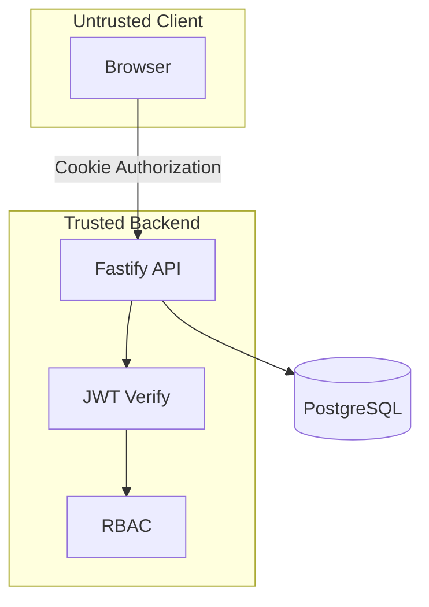

## 繧ｹ繝医Ξ繝ｼ繧ｸ / 繧ｭ繝｣繝・す繝･驟咲ｽｮ
**隱ｬ譏趣ｼ井ｸ€闊ｬ・・*: 繝・・繧ｿ縺ｮ菫晏ｭ伜・繝ｻ繧ｭ繝｣繝・す繝･縺ｮ驟咲ｽｮ繧堤､ｺ縺励∪縺吶€・ 
**縺薙・繝励Ο繧ｸ繧ｧ繧ｯ繝医〒縺ｯ**: 繝輔Ο繝ｳ繝医・useFetch縺ｮ繝｡繝｢繝ｪ繧ｭ繝｣繝・す繝･縲√ヰ繝・け縺ｯPostgreSQL/Redis繧貞茜逕ｨ縺励∪縺吶€・
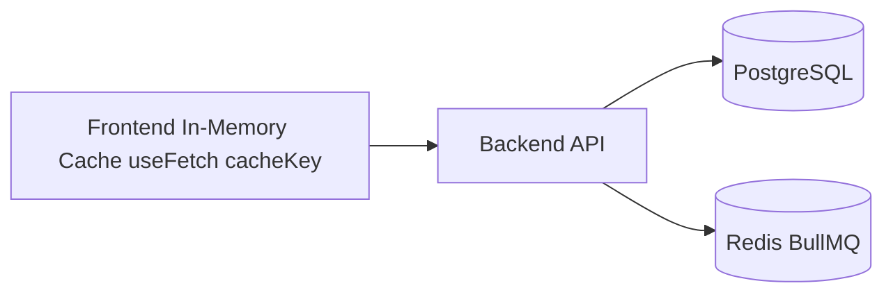

## 繧ｸ繝ｧ繝門渕逶､ / 繧､繝吶Φ繝磯ｧ・虚縺ｮ蜈ｨ菴・
**隱ｬ譏趣ｼ井ｸ€闊ｬ・・*: 髱槫酔譛溷・逅・・豬√ｌ縺ｨ繧ｭ繝･繝ｼ/繝ｯ繝ｼ繧ｫ繝ｼ縺ｮ髢｢菫ゅｒ遉ｺ縺励∪縺吶€・ 
**縺薙・繝励Ο繧ｸ繧ｧ繧ｯ繝医〒縺ｯ**: Chatwork蜷梧悄繧・ｦ∫ｴ・函謌舌・繧ｸ繝ｧ繝門喧縺輔ｌ縲。ullMQ繝ｯ繝ｼ繧ｫ繝ｼ縺悟・逅・＠縺ｾ縺吶€・
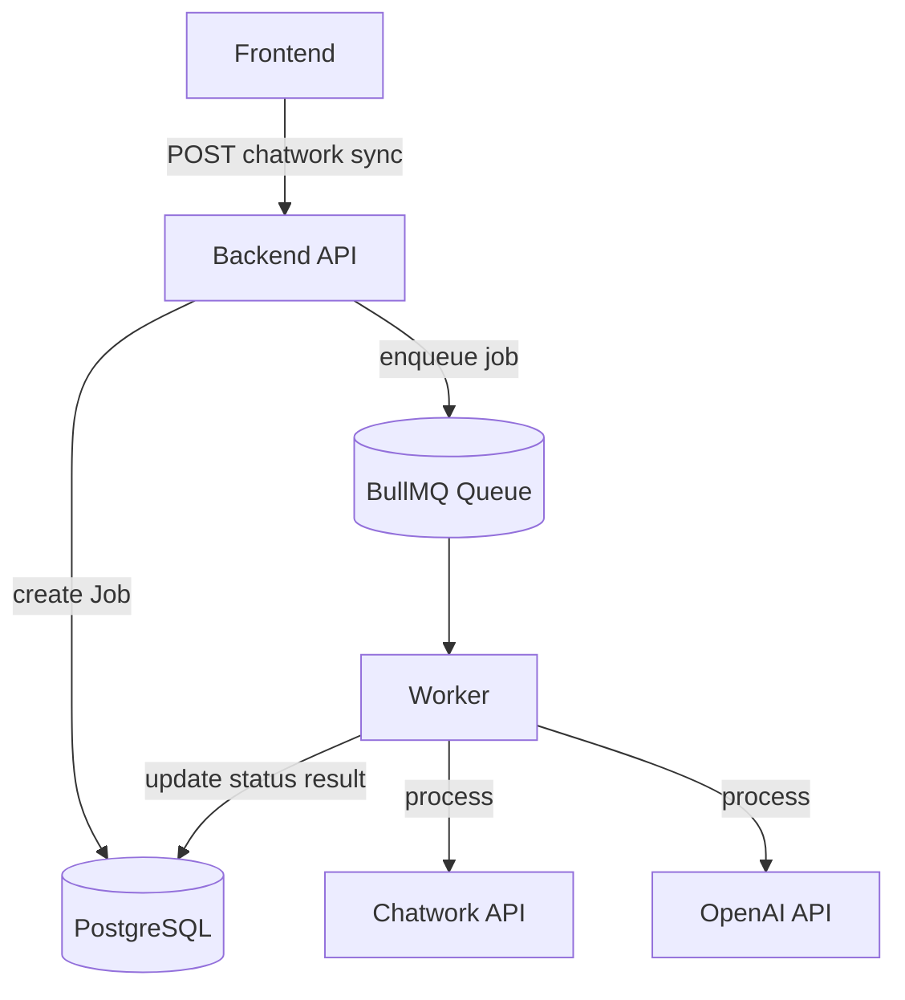

## 萓晏ｭ倬未菫ゅげ繝ｩ繝包ｼ医Δ繧ｸ繝･繝ｼ繝ｫ萓晏ｭ假ｼ・
**隱ｬ譏趣ｼ井ｸ€闊ｬ・・*: 繝｢繧ｸ繝･繝ｼ繝ｫ髢薙・萓晏ｭ俶婿蜷代ｒ菫ｯ迸ｰ縺吶ｋ蝗ｳ縺ｧ縺吶€・ 
**縺薙・繝励Ο繧ｸ繧ｧ繧ｯ繝医〒縺ｯ**: Routes/Handlers/Services縺御ｸｭ蠢・〒縲￣risma/Redis/螟夜ΚAPI縺ｸ萓晏ｭ倥＠縺ｾ縺吶€・
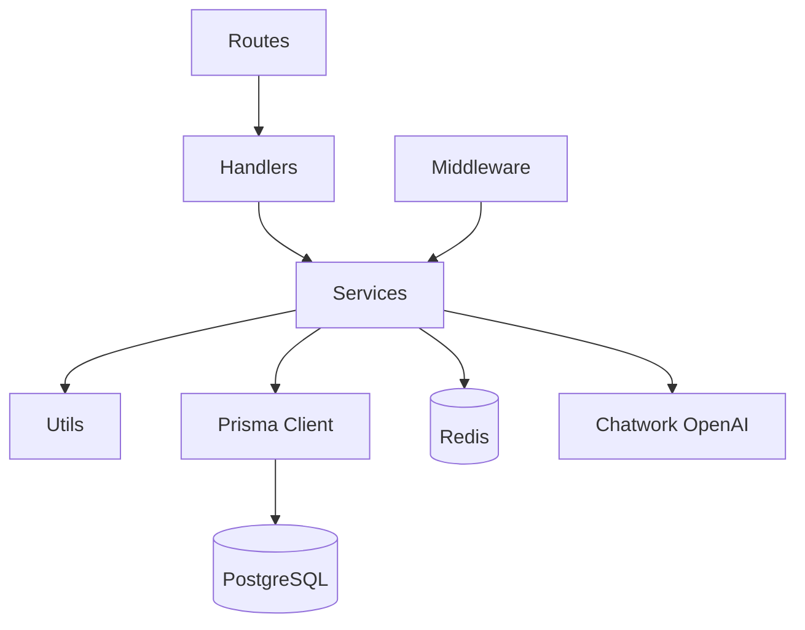

## 繝｢繧ｸ繝･繝ｼ繝ｫ讒区・・医Μ繝昴ず繝医Μ・・
**隱ｬ譏趣ｼ井ｸ€闊ｬ・・*: 繝ｪ繝昴ず繝医Μ縺ｮ荳ｻ隕√ョ繧｣繝ｬ繧ｯ繝医Μ讒区・繧堤､ｺ縺励∪縺吶€・ 
**縺薙・繝励Ο繧ｸ繧ｧ繧ｯ繝医〒縺ｯ**: frontend/backend/infra/Docs縺ｫ蛻・牡縺励※雋ｬ蜍吶ｒ譏守｢ｺ蛹悶＠縺ｦ縺・∪縺吶€・
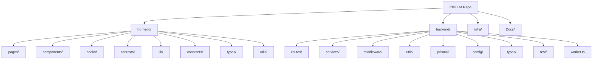

## 繝ｬ繧､繝､繝ｼ蝗ｳ・・resentation / Domain / Infra・・
**隱ｬ譏趣ｼ井ｸ€闊ｬ・・*: 繝励Ξ繧ｼ繝ｳ繝・・繧ｷ繝ｧ繝ｳ/繝峨Γ繧､繝ｳ/繧､繝ｳ繝輔Λ縺ｮ謚ｽ雎｡螻､繧堤､ｺ縺励∪縺吶€・ 
**縺薙・繝励Ο繧ｸ繧ｧ繧ｯ繝医〒縺ｯ**: Routes/Services縺後ラ繝｡繧､繝ｳ逶ｸ蠖薙€￣risma/Redis/螟夜ΚAPI縺後う繝ｳ繝輔Λ逶ｸ蠖薙〒縺吶€・
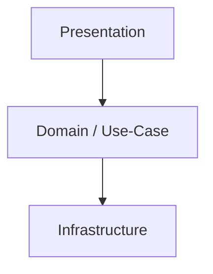

## Hexagonal・・orts & Adapters・・
**隱ｬ譏趣ｼ井ｸ€闊ｬ・・*: 繧ｳ繧｢縺ｨ螟夜Κ繧｢繝€繝励ち縺ｮ蠅・阜繧堤､ｺ縺呵ｨｭ險亥峙縺ｧ縺吶€・ 
**縺薙・繝励Ο繧ｸ繧ｧ繧ｯ繝医〒縺ｯ**: Inbound縺ｯHTTP/Scheduler縲＾utbound縺ｯDB/Redis/Chatwork/OpenAI縺ｧ縺吶€・
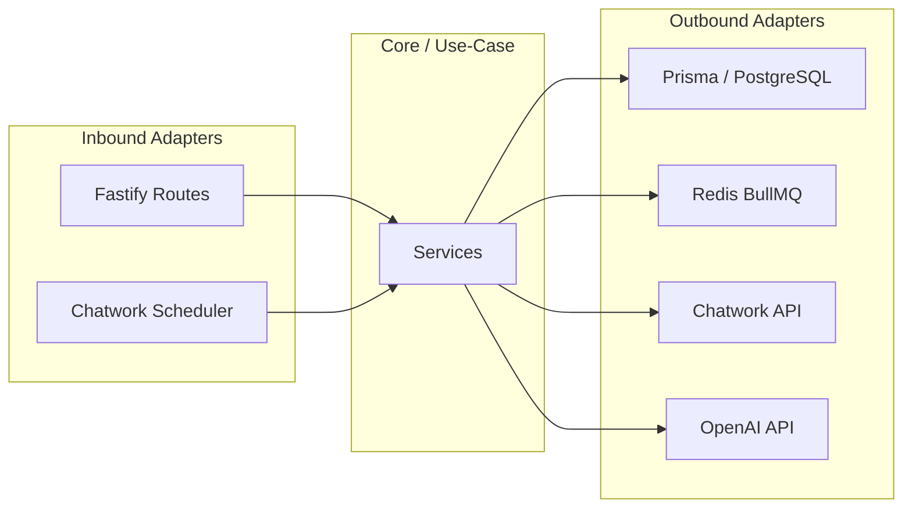

## DDD Context Map・亥｢・阜縺･縺托ｼ・
**隱ｬ譏趣ｼ井ｸ€闊ｬ・・*: 讌ｭ蜍咎伜沺・医さ繝ｳ繝・く繧ｹ繝茨ｼ蛾俣縺ｮ髢｢菫ゅｒ遉ｺ縺励∪縺吶€・ 
**縺薙・繝励Ο繧ｸ繧ｧ繧ｯ繝医〒縺ｯ**: Companies繧剃ｸｭ蠢・↓Projects/Wholesales/Tasks縺碁€｣謳ｺ縺励∪縺吶€・
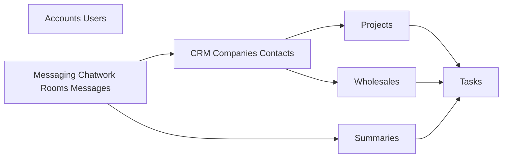

## 4+1 繝薙Η繝ｼ・亥ｯｾ蠢懆｡ｨ・・
| View | 蟇ｾ蠢懷峙 |
| --- | --- |
| Logical | 隲也炊繧｢繝ｼ繧ｭ繝・け繝√Ε / 繝ｬ繧､繝､繝ｼ蝗ｳ |
| Process | 繧ｸ繝ｧ繝門渕逶､ / 繧､繝吶Φ繝磯ｧ・虚 / 繧ｷ繝ｼ繧ｱ繝ｳ繧ｹ |
| Development | 繝｢繧ｸ繝･繝ｼ繝ｫ讒区・ / 萓晏ｭ倬未菫・|
| Physical | 迚ｩ逅・い繝ｼ繧ｭ繝・け繝√Ε / 繝阪ャ繝医Ρ繝ｼ繧ｯ |
| Scenarios | 繧ｷ繝ｼ繧ｱ繝ｳ繧ｹ蝗ｳ・医Ο繧ｰ繧､繝ｳ繝ｻ蜷梧悄繝ｻ隕∫ｴ・ｼ・|

## 雋ｬ蜍吝・蜑ｲ・医し繝槭Μ・・
| 鬆伜沺 | 荳ｻ諡・ｽ・| 蠖ｹ蜑ｲ |
| --- | --- | --- |
| 逕ｻ髱｢/UI | Frontend | 逕ｻ髱｢陦ｨ遉ｺ縲∝・蜉帙€、PI蜻ｼ縺ｳ蜃ｺ縺・|
| 隱崎ｨｼ/隱榊庄 | Backend | JWT逋ｺ陦後€ヽBAC縲√い繧ｯ繧ｻ繧ｹ蛻ｶ蠕｡ |
| 讌ｭ蜍吶Ο繧ｸ繝・け | Backend Services | 蜷梧悄/隕∫ｴ・繧ｿ繧ｹ繧ｯ蛹也ｭ・|
| 豌ｸ邯壼喧 | PostgreSQL + Prisma | 荳ｻ隕√ョ繝ｼ繧ｿ縺ｮ豌ｸ邯壼喧 |
| 髱槫酔譛溷・逅・| Redis + BullMQ | Chatwork蜷梧悄繝ｻ隕∫ｴ・函謌舌・螳溯｡・|
| 螟夜Κ騾｣謳ｺ | Chatwork/OpenAI | 繝｡繝・そ繝ｼ繧ｸ蜿門ｾ励・隕∫ｴ・函謌・|

---

# 縺ｵ繧九∪縺・/ 蜃ｦ逅・ヵ繝ｭ繝ｼ

## 繧ｷ繝ｼ繧ｱ繝ｳ繧ｹ・壹Ο繧ｰ繧､繝ｳ
**隱ｬ譏趣ｼ井ｸ€闊ｬ・・*: 逕ｻ髱｢謫堺ｽ懊°繧陰PI蠢懃ｭ斐∪縺ｧ縺ｮ謇矩・→蠖ｹ蜑ｲ蛻・球繧堤､ｺ縺励∪縺吶€・ 
**縺薙・繝励Ο繧ｸ繧ｧ繧ｯ繝医〒縺ｯ**: 隱崎ｨｼ謌仙粥譎ゅ↓JWT繧堤匱陦後＠縲，ookie縺ｫ菫晏ｭ倥＠縺ｦ莉･髯阪・API隱崎ｨｼ縺ｫ菴ｿ縺・∪縺吶€・
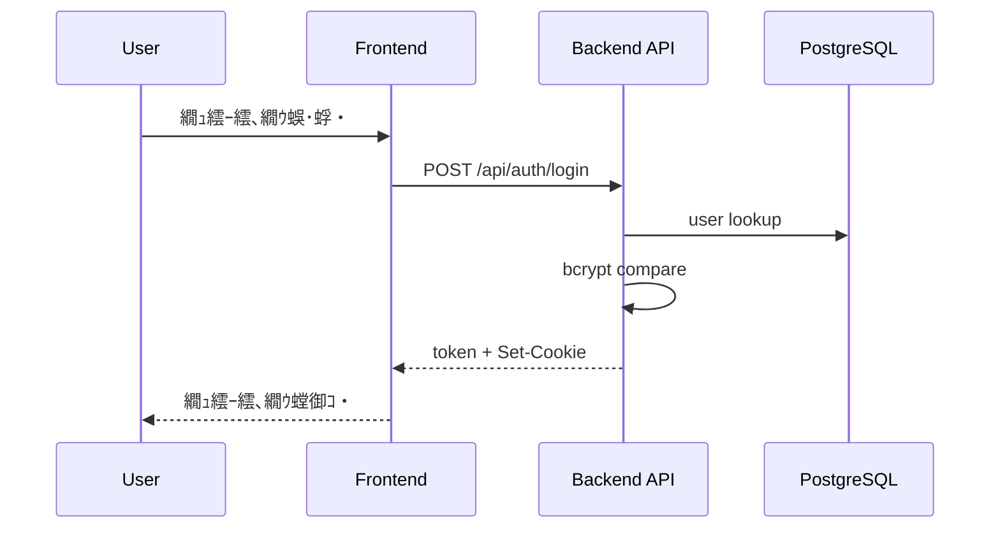

## 繧ｷ繝ｼ繧ｱ繝ｳ繧ｹ・咾hatwork蜷梧悄・育ｮ｡逅・€・ｼ・
**隱ｬ譏趣ｼ井ｸ€闊ｬ・・*: 髱槫酔譛溘ず繝ｧ繝悶・襍ｷ蜍輔→蜃ｦ逅・・豬√ｌ繧堤､ｺ縺励∪縺吶€・ 
**縺薙・繝励Ο繧ｸ繧ｧ繧ｯ繝医〒縺ｯ**: 邂｡逅・€・桃菴懊〒繧ｸ繝ｧ繝悶ｒ菴懈・縺励€。ullMQ繝ｯ繝ｼ繧ｫ繝ｼ縺悟酔譛溘ｒ螳溯｡後＠縺ｾ縺吶€・
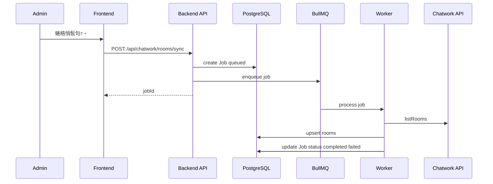

## 繧ｷ繝ｼ繧ｱ繝ｳ繧ｹ・夊ｦ∫ｴ・ラ繝ｩ繝輔ヨ逕滓・
**隱ｬ譏趣ｼ井ｸ€闊ｬ・・*: 繧ｭ繝｣繝・す繝･遒ｺ隱阪→髱槫酔譛溷・逅・・蛻・ｲ舌ｒ遉ｺ縺励∪縺吶€・ 
**縺薙・繝励Ο繧ｸ繧ｧ繧ｯ繝医〒縺ｯ**: 譛滄剞蜀・ラ繝ｩ繝輔ヨ縺後≠繧後・蜊ｳ霑斐＠縲√↑縺代ｌ縺ｰ繧ｸ繝ｧ繝也ｵ檎罰縺ｧ逕滓・縺励∪縺吶€・
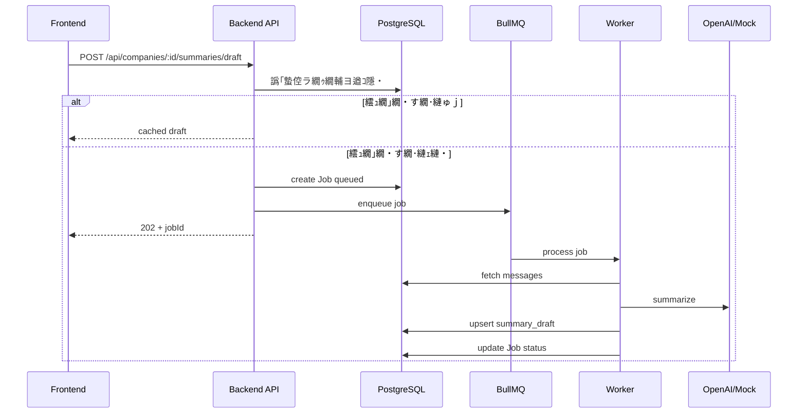

## 繧｢繧ｯ繝・ぅ繝薙ユ繧｣・咾hatwork繝｡繝・そ繝ｼ繧ｸ蜷梧悄
**隱ｬ譏趣ｼ井ｸ€闊ｬ・・*: 繝ｫ繝ｼ繝怜・逅・ｄ蛻・ｲ舌ｒ蜷ｫ繧€蜃ｦ逅・・豬√ｌ繧堤､ｺ縺励∪縺吶€・ 
**縺薙・繝励Ο繧ｸ繧ｧ繧ｯ繝医〒縺ｯ**: 繝ｫ繝ｼ繝縺斐→縺ｫ蜿門ｾ励・菫晏ｭ倥＠縲∝､ｱ謨玲凾縺ｯ繧ｨ繝ｩ繝ｼ諠・ｱ繧定ｨ倬鹸縺励∪縺吶€・
```mermaid
flowchart TD
  Start([Start]) --> LoadRooms[蟇ｾ雎｡繝ｫ繝ｼ繝蜿門ｾ余
  LoadRooms --> Loop{蜷・Ν繝ｼ繝}
  Loop --> Fetch["Chatwork API listMessages"]
  Fetch -->|OK| Save["createMany + updateMany"]
  Save --> UpdateRoom["room.lastSyncAt / lastMessageId 譖ｴ譁ｰ"]
  UpdateRoom --> Loop
  Fetch -->|Error| MarkErr["room.lastError* 譖ｴ譁ｰ"]
  MarkErr --> Loop
  Loop --> End([End])
```

## 繧ｹ繝・・繝医・繧ｷ繝ｳ・哽obStatus
**隱ｬ譏趣ｼ井ｸ€闊ｬ・・*: 繧ｸ繝ｧ繝悶・迥ｶ諷矩・遘ｻ繧堤､ｺ縺励∪縺吶€・ 
**縺薙・繝励Ο繧ｸ繧ｧ繧ｯ繝医〒縺ｯ**: DB縺ｮ`jobs.status`縺繋ueued竊恥rocessing竊団ompleted/failed/canceled縺ｧ譖ｴ譁ｰ縺輔ｌ縺ｾ縺吶€・
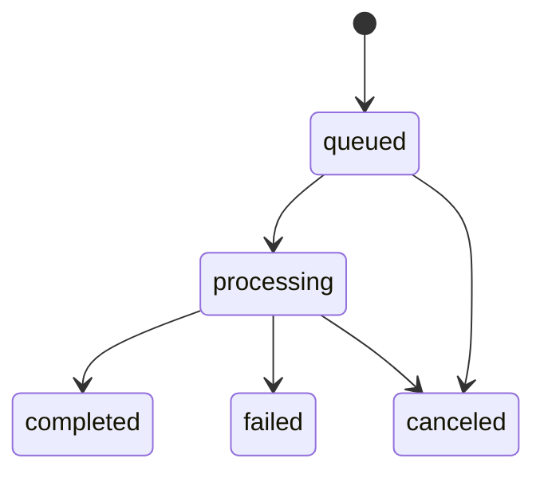

## 繧ｹ繝・・繝医・繧ｷ繝ｳ・啜askStatus
**隱ｬ譏趣ｼ井ｸ€闊ｬ・・*: 繧ｿ繧ｹ繧ｯ縺ｮ迥ｶ諷矩・遘ｻ繧堤､ｺ縺励∪縺吶€・ 
**縺薙・繝励Ο繧ｸ繧ｧ繧ｯ繝医〒縺ｯ**: todo/in_progress/done/cancelled繧堤判髱｢縺ｨAPI縺ｧ邂｡逅・＠縺ｾ縺吶€・
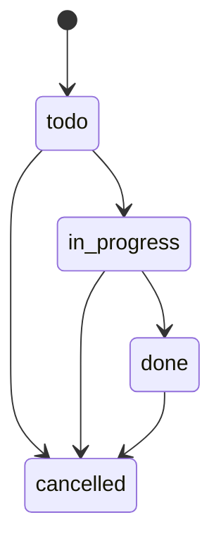

## 繧ｿ繧､繝溘Φ繧ｰ・夊・蜍募酔譛溘せ繧ｱ繧ｸ繝･繝ｼ繝ｫ
**隱ｬ譏趣ｼ井ｸ€闊ｬ・・*: 螳壽悄蜃ｦ逅・・繧ｿ繧､繝溘Φ繧ｰ繧堤､ｺ縺励∪縺吶€・ 
**縺薙・繝励Ο繧ｸ繧ｧ繧ｯ繝医〒縺ｯ**: 迺ｰ蠅・､画焚縺ｧ險ｭ螳壹＠縺滄俣髫斐〒Chatwork蜷梧悄繧ｸ繝ｧ繝悶ｒ謚募・縺励∪縺吶€・
```mermaid
sequenceDiagram
  participant Scheduler as ChatworkScheduler
  participant API as Backend
  participant Q as BullMQ

  Note over Scheduler,API: env CHATWORK_AUTO_SYNC_INTERVAL_MINUTES
  loop every N minutes
    Scheduler->>API: enqueue rooms sync
    Scheduler->>API: enqueue messages sync
    API->>Q: add job
  end
```

## 逶ｸ莠剃ｽ懃畑讎りｦ・ｼ井ｻ｣陦ｨ繧ｷ繝翫Μ繧ｪ・・
**隱ｬ譏趣ｼ井ｸ€闊ｬ・・*: 莉｣陦ｨ逧・↑繝ｦ繝ｼ繧ｶ繝ｼ繝輔Ο繝ｼ繧堤洒縺上∪縺ｨ繧√◆蝗ｳ縺ｧ縺吶€・ 
**縺薙・繝励Ο繧ｸ繧ｧ繧ｯ繝医〒縺ｯ**: 繝€繝・す繝･繝懊・繝峨°繧我ｼ夂､ｾ隧ｳ邏ｰ縺ｸ騾ｲ縺ｿ縲∝酔譛溘ｄ隕∫ｴ・ｒ螳溯｡後＠縺ｾ縺吶€・
```mermaid
flowchart LR
  Login["繝ｭ繧ｰ繧､繝ｳ"] --> Dashboard["繝€繝・す繝･繝懊・繝芽｡ｨ遉ｺ"]
  Dashboard --> Company["莨夂､ｾ隧ｳ邏ｰ"]
  Company --> Sync["Chatwork蜷梧悄"]
  Company --> Draft["隕∫ｴ・ラ繝ｩ繝輔ヨ逕滓・"]
  Draft --> Tasks["繧ｿ繧ｹ繧ｯ蛟呵｣懈歓蜃ｺ"]
```

## 萓句､紋ｼ晄眺・・PI繧ｨ繝ｩ繝ｼ繝上Φ繝峨Μ繝ｳ繧ｰ・・
**隱ｬ譏趣ｼ井ｸ€闊ｬ・・*: 萓句､悶′縺ｩ縺ｮ繧医≧縺ｫ謐墓拷繝ｻ謨ｴ蠖｢縺輔ｌ縺ｦ霑斐ｋ縺九ｒ遉ｺ縺励∪縺吶€・ 
**縺薙・繝励Ο繧ｸ繧ｧ繧ｯ繝医〒縺ｯ**: `setErrorHandler` 縺ｨ `normalizeErrorPayload` 縺ｧ蜈ｱ騾壼ｽ｢蠑上↓謠・∴縺ｾ縺吶€・
```mermaid
flowchart TD
  Request --> Handler
  Handler -->|throw or return| ErrorHandler["Fastify setErrorHandler"]
  ErrorHandler --> Normalize["normalizeErrorPayload"]
  Normalize --> Response["JSON Error Response"]
```

## 繝ｪ繝医Λ繧､ / 繧ｿ繧､繝繧｢繧ｦ繝・/ 繧ｵ繝ｼ繧ｭ繝・ヨ繝悶Ξ繝ｼ繧ｫ
**隱ｬ譏趣ｼ井ｸ€闊ｬ・・*: 螟夜ΚAPI螟ｱ謨玲凾縺ｮ蜀崎ｩｦ陦後ｄ繧ｿ繧､繝繧｢繧ｦ繝医・謇ｱ縺・ｒ遉ｺ縺励∪縺吶€・ 
**縺薙・繝励Ο繧ｸ繧ｧ繧ｯ繝医〒縺ｯ**: Chatwork縺ｯ邁｡譏薙Μ繝医Λ繧､縲＾penAI縺ｯ螟ｱ謨玲凾縺ｫ繧ｸ繝ｧ繝門､ｱ謨励→縺励※謇ｱ縺・∪縺吶€・
```mermaid
flowchart TB
  ChatworkReq["Chatwork API Request"] -->|timeout 10s| Retry{"retry limit check"}
  Retry -->|yes default=1| ChatworkReq
  Retry -->|no| ChatworkErr["store error + job failed"]

  OpenAIReq["OpenAI Request"] -->|timeout 15s| LLMErr["error -> job failed"]
  JobQueue["Job Queue"] -->|attempts=1| NoRetry["No job retry"]
```

## 蜀ｪ遲画€ｧ縺ｮ險ｭ險茨ｼ育樟迥ｶ・・
**隱ｬ譏趣ｼ井ｸ€闊ｬ・・*: 蜷後§謫堺ｽ懊ｒ郢ｰ繧願ｿ斐＠縺ｦ繧らｵ先棡縺悟ｴｩ繧後↑縺・ｷ･螟ｫ繧堤､ｺ縺励∪縺吶€・ 
**縺薙・繝励Ο繧ｸ繧ｧ繧ｯ繝医〒縺ｯ**: 繝ｦ繝九・繧ｯ蛻ｶ邏・→`upsert`縺ｧ驥崎､・匳骭ｲ繧帝∩縺代∪縺吶€・
```mermaid
flowchart TB
  MsgSync["Message Sync"] --> Unique1["unique roomId messageId"]
  MsgSync --> CreateMany["createMany skipDuplicates"]
  Draft["Summary Draft"] --> Upsert["upsert companyId period"]
  CompanyLink["CompanyRoomLink"] --> Unique2["unique companyId chatworkRoomId"]
```

## 蛯呵€・ｼ域悴螳溯｣・髱櫁ｩｲ蠖難ｼ・
- 蛻・淵繝医Λ繝ｳ繧ｶ繧ｯ繧ｷ繝ｧ繝ｳ / 繧ｵ繧ｬ・壽悴螳溯｣・
- 譏守､ｺ逧・Ο繝・け險ｭ險茨ｼ壽悴螳溯｣・ｼ・B蛻ｶ邏・↓萓晏ｭ假ｼ・
- 繧ｵ繝ｼ繧ｭ繝・ヨ繝悶Ξ繝ｼ繧ｫ・壽悴螳溯｣・ｼ育ｰ｡譏薙Μ繝医Λ繧､縺ｮ縺ｿ・・

---

# 繝・・繧ｿ縺ｾ繧上ｊ

## ER 蝗ｳ・郁ｫ也炊・・
**隱ｬ譏趣ｼ井ｸ€闊ｬ・・*: 繝・・繧ｿ縺ｮ繧ｨ繝ｳ繝・ぅ繝・ぅ縺ｨ髢｢菫ゅｒ菫ｯ迸ｰ縺吶ｋ蝗ｳ縺ｧ縺吶€・ 
**縺薙・繝励Ο繧ｸ繧ｧ繧ｯ繝医〒縺ｯ**: Companies繧剃ｸｭ蠢・↓Projects/Wholesales/Tasks/Chatwork騾｣謳ｺ縺檎ｹ九′繧翫∪縺吶€・
```mermaid
erDiagram
  USER {
    string id PK
    string email
    string role
  }
  COMPANY {
    string id PK
    string name
    string normalizedName
    string ownerId FK
  }
  CONTACT {
    string id PK
    string companyId FK
    string name
  }
  PROJECT {
    string id PK
    string companyId FK
    string ownerId FK
    string status
  }
  WHOLESALE {
    string id PK
    string projectId FK
    string companyId FK
    string ownerId FK
    string status
  }
  CHATWORK_ROOM {
    string id PK
    string roomId UK
    boolean isActive
  }
  COMPANY_ROOM_LINK {
    string id PK
    string companyId FK
    string chatworkRoomId FK
  }
  MESSAGE {
    string id PK
    string chatworkRoomId FK
    string roomId
    string messageId
    string companyId FK
    string projectId FK
    string wholesaleId FK
  }
  SUMMARY {
    string id PK
    string companyId FK
    string type
  }
  SUMMARY_DRAFT {
    string id PK
    string companyId FK
  }
  TASK {
    string id PK
    string targetType
    string targetId
    string assigneeId FK
    string status
  }
  JOB {
    string id PK
    string type
    string status
    string userId FK
  }
  AUDIT_LOG {
    string id PK
    string entityType
    string entityId
  }
  APP_SETTING {
    string id PK
    string key UK
  }

  USER ||--o{ COMPANY : owns
  COMPANY ||--o{ CONTACT : has
  COMPANY ||--o{ PROJECT : has
  PROJECT ||--o{ WHOLESALE : has
  COMPANY ||--o{ WHOLESALE : has
  CHATWORK_ROOM ||--o{ MESSAGE : contains
  COMPANY ||--o{ MESSAGE : assigned
  PROJECT ||--o{ MESSAGE : assigned
  WHOLESALE ||--o{ MESSAGE : assigned
  COMPANY ||--o{ SUMMARY : has
  COMPANY ||--o{ SUMMARY_DRAFT : has
  COMPANY ||--o{ COMPANY_ROOM_LINK : links
  CHATWORK_ROOM ||--o{ COMPANY_ROOM_LINK : links
  USER ||--o{ TASK : assigned
  USER ||--o{ JOB : created
```

## 繝・・繧ｿ繝輔Ο繝ｼ・・FD 繝ｬ繝吶Ν0・・
**隱ｬ譏趣ｼ井ｸ€闊ｬ・・*: 繝・・繧ｿ縺後←縺薙°繧峨←縺薙∈豬√ｌ繧九°繧堤､ｺ縺励∪縺吶€・ 
**縺薙・繝励Ο繧ｸ繧ｧ繧ｯ繝医〒縺ｯ**: 繝輔Ο繝ｳ繝遺・API竊奪B/Redis竊貞､夜ΚAPI・・hatwork/OpenAI・峨・豬√ｌ縺ｧ縺吶€・
```mermaid
flowchart LR
  User[User] --> FE[Frontend]
  FE --> API[Backend API]
  API --> DB[(PostgreSQL)]
  API --> Redis["Redis/BullMQ"]
  API --> Chatwork[Chatwork API]
  API --> OpenAI[OpenAI API]
  Chatwork --> API
```

## 繧､繝吶Φ繝・/ 繧ｸ繝ｧ繝悶せ繧ｭ繝ｼ繝橸ｼ育樟迥ｶ・・
| JobType | payload | 隱ｬ譏・|
| --- | --- | --- |
| `chatwork_rooms_sync` | `{}` | 繝ｫ繝ｼ繝荳€隕ｧ蜷梧悄 |
| `chatwork_messages_sync` | `{ roomId?: string, roomLimit?: number }` | 繝｡繝・そ繝ｼ繧ｸ蜷梧悄 |
| `summary_draft` | `{ companyId, periodStart, periodEnd }` | 隕∫ｴ・ラ繝ｩ繝輔ヨ逕滓・ |

## 繝・・繧ｿ霎樊嶌・井ｸｻ隕√お繝ｳ繝・ぅ繝・ぅ・・
| 繧ｨ繝ｳ繝・ぅ繝・ぅ | 荳ｻ縺ｪ鬆・岼 | 蛯呵€・|
| --- | --- | --- |
| User | `email`, `role`, `password` | 隱崎ｨｼ繝ｻ讓ｩ髯・|
| Company | `name`, `normalizedName`, `status`, `tags` | CRM荳ｭ蠢・|
| Contact | `companyId`, `name`, `role`, `email` | 莨夂､ｾ騾｣邨｡蜈・|
| Project | `companyId`, `name`, `status`, `periodStart/End` | 譯井ｻｶ |
| Wholesale | `projectId`, `companyId`, `status`, `margin` | 蜊ｸ |
| ChatworkRoom | `roomId`, `name`, `lastSyncAt`, `isActive` | 騾｣謳ｺ繝ｫ繝ｼ繝 |
| Message | `roomId`, `messageId`, `sender`, `body`, `sentAt` | 騾｣謳ｺ繝｡繝・そ繝ｼ繧ｸ |
| Summary | `companyId`, `content`, `type` | 遒ｺ螳夊ｦ∫ｴ・|
| SummaryDraft | `companyId`, `content`, `expiresAt` | 閾ｪ蜍慕函謌・|
| Task | `targetType`, `targetId`, `assigneeId`, `status` | 繧ｿ繧ｹ繧ｯ |
| Job | `type`, `status`, `payload`, `result` | 髱槫酔譛溷・逅・|
| AppSetting | `key`, `value` | 險ｭ螳・|

## 螳溯｣・ｷｮ蛻・ｼ井ｸｻ隕∬ｿｽ蜉鬆・岼・・**隱ｬ譏趣ｼ井ｸ€闊ｬ・・*: ER蝗ｳ/霎樊嶌縺ｯ荳ｻ隕・・岼縺ｮ謚懃ｲ九〒縺吶€ょｮ溯｣・↓縺ｯ莉･荳九・霑ｽ蜉鬆・岼縺後≠繧翫∪縺吶€・ 
- Company: `category`, `profile`, `ownerId`
- Contact: `phone`, `memo`, `sortOrder`
- Project: `conditions`, `unitPrice`, `periodStart`, `periodEnd`, `ownerId`
- Wholesale: `conditions`, `unitPrice`, `margin`, `agreedDate`, `ownerId`
- ChatworkRoom: `description`, `lastMessageId`, `lastErrorAt`, `lastErrorMessage`, `lastErrorStatus`
- Message: `labels`, `sender`, `sentAt`
- Summary / SummaryDraft: `periodStart`, `periodEnd`, `sourceLinks`, `model`, `promptVersion`, `sourceMessageCount`, `tokenUsage`, `expiresAt`・・raft縺ｮ縺ｿ・・- Task: `title`, `description`, `dueDate`, `assigneeId`
- Job: `error`, `startedAt`, `finishedAt`

## CRUD 繝槭ヨ繝ｪ繧ｯ繧ｹ・井ｸｻ隕・ｼ・| 繝ｪ繧ｽ繝ｼ繧ｹ | Create | Read | Update | Delete |
| --- | --- | --- | --- | --- |
| Users | 笨・| 笨・| 笨・role) | - |
| Companies | 笨・| 笨・| 笨・| 笨・|
| Contacts | 笨・| 笨・| 笨・| 笨・|
| Projects | 笨・| 笨・| 笨・| 笨・|
| Wholesales | 笨・| 笨・| 笨・| 笨・|
| Messages | - | 笨・| 笨・assign/labels) | - |
| Summaries | 笨・| 笨・| - | - |
| SummaryDraft | 笨・job) | 笨・| - | - |
| Tasks | 笨・| 笨・| 笨・| 笨・|
| Jobs | 笨・enqueue) | 笨・| 笨・cancel) | - |
| Settings | - | 笨・| 笨・| - |

## 繧､繝ｳ繝・ャ繧ｯ繧ｹ / 蛻ｶ邏・ｼ域栢邊具ｼ・
| 繝・・繝悶Ν | 繧､繝ｳ繝・ャ繧ｯ繧ｹ / 繝ｦ繝九・繧ｯ |
| --- | --- |
| companies | `normalizedName` unique |
| contacts | `(companyId, sortOrder)` |
| projects | `(companyId)` |
| wholesales | `(companyId, projectId)` |
| chatwork_rooms | `roomId` unique |
| company_room_links | `(companyId, chatworkRoomId)` unique |
| messages | `unique(roomId, messageId)`, `(companyId)`, `(companyId, sentAt)` |
| summary_drafts | `unique(companyId, periodStart, periodEnd)`, `(companyId, periodStart, periodEnd)` |
| tasks | `(targetType, targetId)`, `(dueDate, status)`, `(assigneeId)` |
| jobs | `(type, status)`, `(createdAt)` |
| app_settings | `key` unique |

## 繧ｭ繝｣繝・す繝･繧ｭ繝ｼ險ｭ險茨ｼ医ヵ繝ｭ繝ｳ繝茨ｼ・
| 繧ｭ繝ｼ | TTL | 隱ｬ譏・|
| --- | --- | --- |
| `cacheKey`・域悴謖・ｮ壽凾縺ｯURL・・| `cacheTimeMs` | `useFetch` 縺後Γ繝｢繝ｪ縺ｫ菫晄戟 |

## 謨ｴ蜷域€ｧ繝｢繝・Ν
- 荳ｻ繝・・繧ｿ・・ostgreSQL・会ｼ壼ｼｷ謨ｴ蜷・
- 髱槫酔譛溷・逅・ｼ・ob/Queue・会ｼ夂ｵ先棡謨ｴ蜷茨ｼ医ず繝ｧ繝門ｮ御ｺ・ｒ蠕・▽・・
- 隕∫ｴ・ラ繝ｩ繝輔ヨ・壽悄髯蝉ｻ倥″繧ｭ繝｣繝・す繝･・・summary_drafts.expiresAt`・・

## 繝槭う繧ｰ繝ｬ繝ｼ繧ｷ繝ｧ繝ｳ驕狗畑・育樟迥ｶ・・
| 迺ｰ蠅・| 繧ｳ繝槭Φ繝・| 蛯呵€・|
| --- | --- | --- |
| 髢狗匱 | `npm run migrate:dev` | Prisma migrate dev |
| 譛ｬ逡ｪ | `npm run migrate:deploy` | Prisma migrate deploy |

---

# API / 繧､繝ｳ繧ｿ繝ｼ繝輔ぉ繝ｼ繧ｹ

## API 荳€隕ｧ・井ｸｻ隕・ｼ・
### Auth
| Endpoint | Method | Auth | Role |
| --- | --- | --- | --- |
| `/api/auth/login` | POST | - | - |
| `/api/auth/logout` | POST | - | - |
| `/api/auth/me` | GET | 笨・| any |

### Users
| Endpoint | Method | Auth | Role |
| --- | --- | --- | --- |
| `/api/users` | GET | 笨・| admin |
| `/api/users` | POST | 笨・| admin |
| `/api/users/options` | GET | 笨・| any |
| `/api/users/:id/role` | PATCH | 笨・| admin |

### Companies / Contacts / Related
| Endpoint | Method | Auth | Role |
| --- | --- | --- | --- |
| `/api/companies` | GET | 笨・| any |
| `/api/companies` | POST | 笨・| admin/sales/ops |
| `/api/companies/:id` | GET | 笨・| any |
| `/api/companies/:id` | PATCH | 笨・| admin/sales/ops |
| `/api/companies/:id` | DELETE | 笨・| admin/sales/ops |
| `/api/companies/search` | GET | 笨・| any |
| `/api/companies/options` | GET | 笨・| any |
| `/api/companies/:id/contacts` | GET | 笨・| any |
| `/api/companies/:id/contacts` | POST | 笨・| admin/sales/ops |
| `/api/companies/:id/contacts/reorder` | PATCH | 笨・| admin/sales/ops |
| `/api/contacts/:id` | PATCH | 笨・| admin/sales/ops |
| `/api/contacts/:id` | DELETE | 笨・| admin/sales/ops |
| `/api/companies/:id/projects` | GET | 笨・| any |
| `/api/companies/:id/wholesales` | GET | 笨・| any |
| `/api/companies/:id/tasks` | GET | 笨・| any |
| `/api/companies/:id/messages` | GET | 笨・| any |
| `/api/companies/:id/summaries` | GET | 笨・| any |
| `/api/companies/:id/summaries` | POST | 笨・| admin/sales/ops |
| `/api/companies/:id/summaries/draft` | POST | 笨・| admin/sales/ops |

### Projects / Wholesales
| Endpoint | Method | Auth | Role |
| --- | --- | --- | --- |
| `/api/projects` | GET | 笨・| any |
| `/api/projects` | POST | 笨・| admin/sales/ops |
| `/api/projects/:id` | GET | 笨・| any |
| `/api/projects/:id` | PATCH | 笨・| admin/sales/ops |
| `/api/projects/:id` | DELETE | 笨・| admin/sales/ops |
| `/api/projects/search` | GET | 笨・| any |
| `/api/projects/:id/wholesales` | GET | 笨・| any |
| `/api/projects/:id/tasks` | GET | 笨・| any |
| `/api/wholesales` | GET | 笨・| any |
| `/api/wholesales` | POST | 笨・| admin/sales/ops |
| `/api/wholesales/:id` | GET | 笨・| any |
| `/api/wholesales/:id` | PATCH | 笨・| admin/sales/ops |
| `/api/wholesales/:id` | DELETE | 笨・| admin/sales/ops |
| `/api/wholesales/:id/tasks` | GET | 笨・| any |

### Messages
| Endpoint | Method | Auth | Role |
| --- | --- | --- | --- |
| `/api/messages/search` | GET | 笨・| any |
| `/api/messages/unassigned` | GET | 笨・| any |
| `/api/messages/:id/assign-company` | PATCH | 笨・| admin/sales/ops |
| `/api/messages/assign-company` | PATCH | 笨・| admin/sales/ops |
| `/api/messages/:id/labels` | POST | 笨・| admin/sales/ops |
| `/api/messages/:id/labels/:label` | DELETE | 笨・| admin/sales/ops |
| `/api/messages/labels` | GET | 笨・| any |
| `/api/messages/labels/bulk` | POST | 笨・| admin/sales/ops |
| `/api/messages/labels/bulk/remove` | POST | 笨・| admin/sales/ops |

### Tasks
| Endpoint | Method | Auth | Role |
| --- | --- | --- | --- |
| `/api/tasks` | GET | 笨・| any |
| `/api/tasks` | POST | 笨・| admin/sales/ops |
| `/api/tasks/:id` | GET | 笨・| any |
| `/api/tasks/:id` | PATCH | 笨・| admin/sales/ops |
| `/api/tasks/:id` | DELETE | 笨・| admin/sales/ops |
| `/api/tasks/bulk` | PATCH | 笨・| admin/sales/ops |
| `/api/me/tasks` | GET | 笨・| any |

### Jobs / Summaries
| Endpoint | Method | Auth | Role |
| --- | --- | --- | --- |
| `/api/jobs` | GET | 笨・| any |
| `/api/jobs/:id` | GET | 笨・| any |
| `/api/jobs/:id/cancel` | POST | 笨・| any |
| `/api/summaries/:id/tasks/candidates` | POST | 笨・| any |

### Chatwork
| Endpoint | Method | Auth | Role |
| --- | --- | --- | --- |
| `/api/chatwork/rooms` | GET | 笨・| admin |
| `/api/chatwork/rooms/sync` | POST | 笨・| admin |
| `/api/chatwork/rooms/:id` | PATCH | 笨・| admin |
| `/api/chatwork/messages/sync` | POST | 笨・| admin |
| `/api/chatwork/webhook` | POST | - | - |
| `/api/companies/:id/chatwork-rooms` | GET | 笨・| any |
| `/api/companies/:id/chatwork-rooms` | POST | 笨・| admin/sales/ops |
| `/api/companies/:id/chatwork-rooms/:roomId` | DELETE | 笨・| admin/sales/ops |

### Dashboard / Settings / Export / Audit / Search
| Endpoint | Method | Auth | Role |
| --- | --- | --- | --- |
| `/api/dashboard` | GET | 笨・| any |
| `/api/settings` | GET | 笨・| admin |
| `/api/settings` | PATCH | 笨・| admin |
| `/api/search` | GET | 笨・| any |

### Health
| Endpoint | Method | Auth | Role |
| --- | --- | --- | --- |
| `/healthz` | GET | - | - |

## 隱崎ｨｼ繝輔Ο繝ｼ
**隱ｬ譏趣ｼ井ｸ€闊ｬ・・*: 繝ｭ繧ｰ繧､繝ｳ縺九ｉ隱崎ｨｼ貂医∩API蛻ｩ逕ｨ縺ｾ縺ｧ縺ｮ豬√ｌ繧堤､ｺ縺励∪縺吶€・ 
**縺薙・繝励Ο繧ｸ繧ｧ繧ｯ繝医〒縺ｯ**: 繝ｭ繧ｰ繧､繝ｳ縺ｧJWT繧堤匱陦後＠縲，ookie/Authorization縺ｧ`/api/auth/me`縺ｫ繧｢繧ｯ繧ｻ繧ｹ縺励∪縺吶€・
```mermaid
sequenceDiagram
  participant FE as Frontend
  participant API as Backend
  participant DB as PostgreSQL

  FE->>API: POST /api/auth/login
  API->>DB: find user
  API-->>FE: token + Set-Cookie
  FE->>API: GET /api/auth/me (Cookie/Authorization)
  API-->>FE: user
  FE->>API: POST /api/auth/logout
  API-->>FE: clear cookie
```

## 繧ｹ繝・・繧ｿ繧ｹ / 繧ｨ繝ｩ繝ｼ繧ｳ繝ｼ繝我ｸ€隕ｧ
| HTTP | Code | 隱ｬ譏・|
| --- | --- | --- |
| 400 | `BAD_REQUEST` | 蜈･蜉帑ｸ肴ｭ｣ |
| 401 | `UNAUTHORIZED` | 隱崎ｨｼ螟ｱ謨・|
| 403 | `FORBIDDEN` | 讓ｩ髯蝉ｸ崎ｶｳ |
| 404 | `NOT_FOUND` | 繝ｪ繧ｽ繝ｼ繧ｹ荳榊惠 |
| 409 | `CONFLICT` | 遶ｶ蜷・|
| 422 | `VALIDATION_ERROR` | 繝舌Μ繝・・繧ｷ繝ｧ繝ｳ |
| 429 | `TOO_MANY_REQUESTS` | 繝ｬ繝ｼ繝亥宛髯・|
| 500 | `INTERNAL_SERVER_ERROR` | 莠域悄縺励↑縺・お繝ｩ繝ｼ |

Prisma 萓句､悶・繝・ヴ繝ｳ繧ｰ・井ｾ具ｼ・
- `P2025` 竊・404
- `P2002` 竊・409
- `P2003` 竊・400

## 繝ｬ繝ｼ繝亥宛髯・
| 蟇ｾ雎｡ | 險ｭ螳・| 逕ｱ譚･ |
| --- | --- | --- |
| `/api/auth/login` | `RATE_LIMIT_MAX` / `RATE_LIMIT_WINDOW_MS` | Fastify rate-limit |
| Chatwork API | 5蛻・00蝗樒嶌蠖薙・髢馴囈蛻ｶ蠕｡ | 繧ｯ繝ｩ繧､繧｢繝ｳ繝亥・驛ｨ蛻ｶ蠕｡ |

## 繝壹・繧ｸ繝ｳ繧ｰ / 繝輔ぅ繝ｫ繧ｿ / 繧ｽ繝ｼ繝茨ｼ医け繧ｨ繝ｪ縺ゅｊ・・

## 繝舌・繧ｸ繝ｧ繝九Φ繧ｰ譁ｹ驥・
- 迴ｾ迥ｶ縺ｯ `/api` 縺ｧ蝗ｺ螳夲ｼ医ヰ繝ｼ繧ｸ繝ｧ繝ｳ辟｡縺暦ｼ・

## Webhook 繧､繝吶Φ繝・
| 騾∽ｿ｡蜈・| 蜿嶺ｿ｡繧ｨ繝ｳ繝峨・繧､繝ｳ繝・| 隱崎ｨｼ |
| --- | --- | --- |
| Chatwork | `/api/chatwork/webhook` | `CHATWORK_WEBHOOK_TOKEN` |

## 髱槫酔譛・API・医ず繝ｧ繝厄ｼ・
**隱ｬ譏趣ｼ井ｸ€闊ｬ・・*: 繧ｸ繝ｧ繝悶ｒ菴ｿ縺・撼蜷梧悄API縺ｮ豬√ｌ繧堤､ｺ縺励∪縺吶€・ 
**縺薙・繝励Ο繧ｸ繧ｧ繧ｯ繝医〒縺ｯ**: API縺形jobs`繧剃ｽ懈・縺励€。ullMQ繝ｯ繝ｼ繧ｫ繝ｼ縺悟・逅・＠縺ｦ邨先棡繧奪B縺ｫ蜿肴丐縺励∪縺吶€・
```mermaid
flowchart LR
  API[Backend API] --> DB[(jobs)]
  API --> Queue[(BullMQ)]
  Queue --> Worker[Worker]
  Worker --> DB
```

## OpenAPI / Swagger
- `/api/docs` 縺ｧ Swagger UI 繧呈署萓・

## 螟夜Κ騾｣謳ｺ縺ｮ螂醍ｴ・ｼ域ｦりｦ・ｼ・
| 騾｣謳ｺ蜈・| 逕ｨ騾・| 繧ｨ繝ｳ繝峨・繧､繝ｳ繝・|
| --- | --- | --- |
| Chatwork API | 繝ｫ繝ｼ繝/繝｡繝・そ繝ｼ繧ｸ蜿門ｾ・| `https://api.chatwork.com/v2` |
| OpenAI API | 隕∫ｴ・函謌・| `https://api.openai.com/v1/chat/completions` |

---

# 繝輔Ο繝ｳ繝医お繝ｳ繝・/ 逕ｻ髱｢縺ｾ繧上ｊ

## 繧ｵ繧､繝医・繝・・
**隱ｬ譏趣ｼ井ｸ€闊ｬ・・*: 逕ｻ髱｢讒区・繧剃ｸ€隕ｧ縺ｧ遉ｺ縺吝峙縺ｧ縺吶€・ 
**縺薙・繝励Ο繧ｸ繧ｧ繧ｯ繝医〒縺ｯ**: 荳ｻ隕√Μ繧ｽ繝ｼ繧ｹ・・ompanies/Tasks/Projects/Wholesales・峨→險ｭ螳夂ｳｻ逕ｻ髱｢縺ｫ蛻・°繧後∪縺吶€・
```mermaid
flowchart TB
  Root["/"]
  Login["/login"]
  NotFound["*"]
  Companies["/companies"]
  CompanyDetail["/companies/:id"]
  Tasks["/tasks"]
  TaskDetail["/tasks/:id"]
  Projects["/projects"]
  ProjectDetail["/projects/:id"]
  Wholesales["/wholesales"]
  WholesaleDetail["/wholesales/:id"]
  Settings["/settings"]
  Accounts["/settings/accounts"]
  ChatworkSettings["/settings/chatwork"]

  Root --> Companies
  Root --> Tasks
  Root --> Projects
  Root --> Wholesales
  Root --> Settings
  Settings --> Accounts
  Settings --> ChatworkSettings
  Companies --> CompanyDetail
  Tasks --> TaskDetail
  Projects --> ProjectDetail
  Wholesales --> WholesaleDetail
  Login --> Root
  Root --> NotFound
```

## 逕ｻ髱｢驕ｷ遘ｻ・域ｦりｦ・ｼ・
**隱ｬ譏趣ｼ井ｸ€闊ｬ・・*: 莉｣陦ｨ逧・↑逕ｻ髱｢驕ｷ遘ｻ縺ｮ豬√ｌ繧堤､ｺ縺励∪縺吶€・ 
**縺薙・繝励Ο繧ｸ繧ｧ繧ｯ繝医〒縺ｯ**: 繝€繝・す繝･繝懊・繝峨ｒ襍ｷ轤ｹ縺ｫ隧ｳ邏ｰ逕ｻ髱｢繧・ｨｭ螳夂判髱｢縺ｸ遘ｻ蜍輔＠縺ｾ縺吶€・
```mermaid
flowchart LR
  Login[Login] --> Home[Dashboard]
  Home --> Companies
  Home --> Tasks
  Home --> Projects
  Home --> Wholesales
  Companies --> CompanyDetail
  Projects --> ProjectDetail
  Wholesales --> WholesaleDetail
  Settings --> Accounts
  Settings --> ChatworkSettings
```

## 繧ｳ繝ｳ繝昴・繝阪Φ繝医ヤ繝ｪ繝ｼ・井ｸｻ隕・ｼ・
**隱ｬ譏趣ｼ井ｸ€闊ｬ・・*: UI縺ｮ隕ｪ蟄宣未菫ゅ→雋ｬ蜍吶・蛻・球繧堤､ｺ縺励∪縺吶€・ 
**縺薙・繝励Ο繧ｸ繧ｧ繧ｯ繝医〒縺ｯ**: `App` 竊・`AuthProvider` 竊・`ProtectedRoute` 竊・`Layout` 竊・蜷・・繝ｼ繧ｸ縺ｮ讒区・縺ｧ縺吶€・
```mermaid
flowchart TB
  App --> AuthProvider
  AuthProvider --> Routes
  Routes --> ProtectedRoute
  ProtectedRoute --> Layout
  Layout --> Pages[Pages]
  Pages --> Components[UI Components]
```

## 迥ｶ諷狗ｮ｡逅・ｼ育樟迥ｶ・・
**隱ｬ譏趣ｼ井ｸ€闊ｬ・・*: 迥ｶ諷九・鄂ｮ縺榊ｴ謇€縺ｨ莨晄眺縺ｮ縺励°縺溘ｒ遉ｺ縺励∪縺吶€・ 
**縺薙・繝励Ο繧ｸ繧ｧ繧ｯ繝医〒縺ｯ**: 隱崎ｨｼ縺ｯContext縲√ョ繝ｼ繧ｿ蜿門ｾ励・`useFetch`縺ｨ繝｡繝｢繝ｪ繧ｭ繝｣繝・す繝･縺ｧ邂｡逅・＠縺ｾ縺吶€・
```mermaid
flowchart LR
  AuthContext["AuthContext user role"] --> ProtectedRoute2[ProtectedRoute]
  LocalState["local state useState"] --> Pages2[Pages]
  useFetch["useFetch/useMutation"] --> apiRequest[apiRequest]
  apiRequest --> BackendAPI["Backend API"]
  useFetch --> Cache["In-memory cache"]
```

## 繝・・繧ｿ蜿門ｾ励ヵ繝ｭ繝ｼ
**隱ｬ譏趣ｼ井ｸ€闊ｬ・・*: 逕ｻ髱｢縺窟PI縺九ｉ繝・・繧ｿ繧貞叙蠕励☆繧区ｵ√ｌ繧堤､ｺ縺励∪縺吶€・ 
**縺薙・繝励Ο繧ｸ繧ｧ繧ｯ繝医〒縺ｯ**: `useFetch` 竊・`apiRequest` 竊・`fetch` 竊・API 縺ｮ鬆・〒蜻ｼ縺ｳ蜃ｺ縺励∪縺吶€・
```mermaid
flowchart LR
  Component --> useFetch
  useFetch --> apiRequest
  apiRequest --> fetch[fetch API]
  fetch --> BackendAPI
  BackendAPI --> useFetch
  useFetch --> Component
```

## UI 迥ｶ諷矩・遘ｻ
**隱ｬ譏趣ｼ井ｸ€闊ｬ・・*: 隱ｭ縺ｿ霎ｼ縺ｿ/謌仙粥/遨ｺ/繧ｨ繝ｩ繝ｼ縺ｪ縺ｩ縺ｮUI迥ｶ諷九ｒ遉ｺ縺励∪縺吶€・ 
**縺薙・繝励Ο繧ｸ繧ｧ繧ｯ繝医〒縺ｯ**: `useFetch`縺ｮ迥ｶ諷九↓蜷医ｏ縺帙※繝ｭ繝ｼ繝・ぅ繝ｳ繧ｰ繧・お繝ｩ繝ｼ陦ｨ遉ｺ繧貞・繧頑崛縺医∪縺吶€・
```mermaid
stateDiagram-v2
  [*] --> idle
  idle --> loading : fetch
  loading --> success : data
  loading --> empty : no data
  loading --> error : error
  error --> loading : retry
```

## 繝輔か繝ｼ繝 / 繝舌Μ繝・・繧ｷ繝ｧ繝ｳ・域ｦりｦ・ｼ・
| 逕ｻ髱｢ | 蜈･蜉・| 繝舌Μ繝・・繧ｷ繝ｧ繝ｳ |
| --- | --- | --- |
| Login | email/password | 繧ｵ繝ｼ繝仙・(Zod)縺ｧ讀懆ｨｼ縲√け繝ｩ繧､繧｢繝ｳ繝医・譛€蟆城剞 |
| Company/Project/Task | 蜷・ｨｮ鬆・岼 | 繧ｵ繝ｼ繝仙・(Zod)縺ｧ讀懆ｨｼ |

## 繧｢繧ｯ繧ｻ繧ｷ繝薙Μ繝・ぅ・域悴逶｣譟ｻ繝ｻ繝√ぉ繝・け繝ｪ繧ｹ繝茨ｼ・
- 繧ｭ繝ｼ繝懊・繝画桃菴懊〒荳ｻ隕∝ｰ守ｷ壹′謫堺ｽ懷庄閭ｽ
- 繝輔か繝ｼ繧ｫ繧ｹ繝ｪ繝ｳ繧ｰ縺瑚ｦ冶ｪ阪〒縺阪ｋ
- 荳ｻ隕√・繧ｿ繝ｳ縺ｫ `aria-label` 縺御ｻ倅ｸ弱＆繧後※縺・ｋ
- 繧ｳ繝ｳ繝医Λ繧ｹ繝域ｯ斐′遒ｺ菫昴＆繧後※縺・ｋ

## i18n / 繝・じ繧､繝ｳ繝医・繧ｯ繝ｳ
- i18n: 譛ｪ蟆主・・域律譛ｬ隱槫崋螳夲ｼ・
- 繝・じ繧､繝ｳ繝医・繧ｯ繝ｳ: 譛ｪ蟆主・・・ailwind繝ｦ繝ｼ繝・ぅ繝ｪ繝・ぅ荳ｭ蠢・ｼ・

---

# 螳溯｣・ｨｭ險・/ 隕冗ｴ・

## 繧ｯ繝ｩ繧ｹ蝗ｳ・井ｸｻ隕√さ繝ｳ繝昴・繝阪Φ繝茨ｼ・
**隱ｬ譏趣ｼ井ｸ€闊ｬ・・*: 荳ｻ隕√け繝ｩ繧ｹ/繧､繝ｳ繧ｿ繝輔ぉ繝ｼ繧ｹ縺ｮ髢｢菫ゅｒ遉ｺ縺励∪縺吶€・ 
**縺薙・繝励Ο繧ｸ繧ｧ繧ｯ繝医〒縺ｯ**: `LLMClient`縺薫penAI/Mock縺ｧ蛻・崛蜿ｯ閭ｽ縲√ず繝ｧ繝悶′蜷梧悄/隕∫ｴ・ｒ蜻ｼ縺ｳ蜃ｺ縺励∪縺吶€・
```mermaid
classDiagram
  class LLMClient {
    +summarize(messages)
  }
  class OpenAILLMClient
  class MockLLMClient
  LLMClient <|.. OpenAILLMClient
  LLMClient <|.. MockLLMClient

  class ChatworkClient {
    +listRooms()
    +listMessages(roomId, force)
  }

  class JobQueue {
    +enqueueJob(type, payload, userId)
    +cancelJob(jobId)
  }

  class ChatworkSync {
    +syncChatworkRooms()
    +syncChatworkMessages()
  }

  class SummaryGenerator {
    +generateSummaryDraft(companyId, periodStart, periodEnd)
  }

  SummaryGenerator --> LLMClient
  ChatworkSync --> ChatworkClient
  JobQueue --> ChatworkSync
  JobQueue --> SummaryGenerator
```

## 繧､繝ｳ繧ｿ繝輔ぉ繝ｼ繧ｹ螂醍ｴ・ｼ域栢邊具ｼ・
| 繧､繝ｳ繧ｿ繝輔ぉ繝ｼ繧ｹ | 蜈･蜉・| 蜃ｺ蜉・|
| --- | --- | --- |
| `LLMClient.summarize` | `LLMInputMessage[]` | `LLMResult` |
| `ChatworkClient.listRooms` | - | `ChatworkRoom[]` |
| `ChatworkClient.listMessages` | `roomId`, `force` | `ChatworkMessage[]` |
| `enqueueSummaryDraftJob` | `companyId, periodStart, periodEnd` | `Job` |
| `cancelJob` | `jobId` | `Job` |

## 萓句､冶ｨｭ險・
| 遞ｮ蛻･ | 逋ｺ逕滓ｺ・| 謇ｱ縺・|
| --- | --- | --- |
| `ChatworkApiError` | Chatwork API | 繝ｫ繝ｼ繝縺ｫ繧ｨ繝ｩ繝ｼ險倬鹸縲√ず繝ｧ繝門､ｱ謨・|
| `JobCanceledError` | Job蜃ｦ逅・| `canceled` 縺ｧ邨ゆｺ・|
| API Error Payload | API | `buildErrorPayload` 縺ｫ邨ｱ荳€ |

## 繧ｨ繝ｩ繝ｼ繝｡繝・そ繝ｼ繧ｸ隕冗ｴ・
```json
{
  "error": {
    "code": "BAD_REQUEST",
    "message": "Invalid period",
    "details": {}
  }
}
```

## 繝ｭ繧ｰ險ｭ險茨ｼ・PI・・
| 繝輔ぅ繝ｼ繝ｫ繝・| 蜀・ｮｹ |
| --- | --- |
| `requestId` | `x-request-id` |
| `method` | HTTP繝｡繧ｽ繝・ラ |
| `url` | 繝ｪ繧ｯ繧ｨ繧ｹ繝・RL |
| `statusCode` | 繧ｹ繝・・繧ｿ繧ｹ |
| `userId` / `role` | JWT逕ｱ譚･ |

## 險ｭ螳夐・岼・育腸蠅・､画焚・・`NODE_ENV`, `PORT`, `BACKEND_PORT`, `JWT_SECRET`, `CORS_ORIGINS`,  
`DATABASE_URL`, `DATABASE_URL_TEST`,  
`RATE_LIMIT_MAX`, `RATE_LIMIT_WINDOW_MS`, `TRUST_PROXY`,  
`CHATWORK_API_TOKEN`, `CHATWORK_API_BASE_URL`, `CHATWORK_AUTO_SYNC_ENABLED`,  
`CHATWORK_AUTO_SYNC_INTERVAL_MINUTES`, `CHATWORK_AUTO_SYNC_ROOM_LIMIT`,  
`CHATWORK_NEW_ROOMS_ACTIVE`, `CHATWORK_WEBHOOK_TOKEN`,  
`CHATWORK_WEBHOOK_COOLDOWN_SECONDS`,  
`OPENAI_API_KEY`, `OPENAI_MODEL`, `REDIS_URL`, `JOB_WORKER_ENABLED`

### Seed / 繝・せ繝育畑・井ｻｻ諢擾ｼ・`ADMIN_EMAIL`, `ADMIN_PASSWORD`, `ADMIN_ROLE`

## Feature Flags・亥ｮ溯ｳｪ・・
| 螟画焚 | 逶ｮ逧・|
| --- | --- |
| `CHATWORK_AUTO_SYNC_ENABLED` | 閾ｪ蜍募酔譛欅N/OFF |
| `JOB_WORKER_ENABLED` | Worker譛牙柑蛹・|
| `CHATWORK_NEW_ROOMS_ACTIVE` | 譁ｰ隕上Ν繝ｼ繝縺ｮ蛻晄悄Active |

## 萓晏ｭ倥Λ繧､繝悶Λ繝ｪ・井ｸｻ隕・ｼ・
### Backend
- Fastify / Prisma / BullMQ / Redis / Zod / bcryptjs
- OpenAI 蜻ｼ縺ｳ蜃ｺ縺暦ｼ域ｨ呎ｺ・fetch・・

### Frontend
- React / React Router
- Tailwind CSS + clsx / tailwind-merge
- @dnd-kit・・&D UI・・

## ADR
- 縺ｾ縺邂｡逅・＆繧後※縺・∪縺帙ｓ・郁ｿｽ蜉縺吶ｋ蝣ｴ蜷医・ `Docs/ADR/` 謗ｨ螂ｨ・・

---

# 繝・せ繝・/ 蜩∬ｳｪ

## 繝・せ繝域姶逡･・井ｿｯ迸ｰ・・
**隱ｬ譏趣ｼ井ｸ€闊ｬ・・*: 縺ｩ縺ｮ繝ｬ繧､繝､繝ｼ縺ｧ菴輔ｒ繝・せ繝医☆繧九°縺ｮ蜈ｨ菴灘ワ縺ｧ縺吶€・ 
**縺薙・繝励Ο繧ｸ繧ｧ繧ｯ繝医〒縺ｯ**: Front/Back縺ｮ繝ｦ繝九ャ繝医ユ繧ｹ繝医→Playwright E2E繧剃ｽｵ逕ｨ縺励∪縺吶€・
```mermaid
flowchart TB
  UnitFE[Frontend Unit (Vitest)]
  UnitBE[Backend Unit (Vitest)]
  E2E[Playwright E2E]
  UnitFE --> E2E
  UnitBE --> E2E
```

## 繝・せ繝医ヴ繝ｩ繝溘ャ繝・
**隱ｬ譏趣ｼ井ｸ€闊ｬ・・*: 繝ｦ繝九ャ繝遺・邨ｱ蜷遺・E2E縺ｮ豈皮紫繧堤､ｺ縺呵€・∴譁ｹ縺ｧ縺吶€・ 
**縺薙・繝励Ο繧ｸ繧ｧ繧ｯ繝医〒縺ｯ**: 繝ｦ繝九ャ繝井ｸｭ蠢・〒縲・㍾隕√ヵ繝ｭ繝ｼ繧脱2E縺ｧ陬懷ｼｷ縺励∪縺吶€・
```mermaid
flowchart TB
  E2E2[E2E]
  Integration[Integration/API]
  Unit[Unit]
  Unit --> Integration --> E2E2
```

## 繝・せ繝郁ｨ育判・育樟迥ｶ・・
| 遞ｮ蛻･ | 逶ｮ逧・| 繧ｳ繝槭Φ繝・|
| --- | --- | --- |
| Frontend Unit | 繧ｳ繝ｳ繝昴・繝阪Φ繝・繝輔ャ繧ｯ | `cd frontend && npm run test` |
| Backend Unit | 繝ｫ繝ｼ繝・繧ｵ繝ｼ繝薙せ | `cd backend && npm run test` |
| E2E | UI荳€騾｣蜍穂ｽ・| `cd frontend && npm run test:e2e` |

## 迺ｰ蠅・・繝医Μ繧ｯ繧ｹ・育樟迥ｶ・・
| 迺ｰ蠅・| OS | 繝悶Λ繧ｦ繧ｶ |
| --- | --- | --- |
| 繝ｭ繝ｼ繧ｫ繝ｫ | Windows/macOS/Linux | Playwright (Chromium) |
| CI | Ubuntu | Playwright (繝・ヵ繧ｩ繝ｫ繝・ |

## 繝｢繝・け / 繧ｹ繧ｿ繝匁婿驥・
- 螟夜ΚAPI・・hatwork/OpenAI・峨・蠢・ｦ√↓蠢懊§縺ｦ繝｢繝・け
- 繝ｦ繝九ャ繝医ユ繧ｹ繝医・DB萓晏ｭ倥ｒ貂帙ｉ縺・

## 蜩∬ｳｪ繧ｲ繝ｼ繝茨ｼ・I・・
| 蟇ｾ雎｡ | 螳溯｡・|
| --- | --- |
| Backend | lint 竊・build 竊・test |
| Frontend | lint 竊・typecheck 竊・test 竊・build |

---

# CI/CD / 繝ｪ繝ｪ繝ｼ繧ｹ

## CI 繝代う繝励Λ繧､繝ｳ
**隱ｬ譏趣ｼ井ｸ€闊ｬ・・*: 繝薙Ν繝峨ｄ繝・せ繝医・閾ｪ蜍募ｮ溯｡後・豬√ｌ繧堤､ｺ縺励∪縺吶€・ 
**縺薙・繝励Ο繧ｸ繧ｧ繧ｯ繝医〒縺ｯ**: Front/Back繧貞・縺代※ lint 竊・build 竊・test 繧貞屓縺励∪縺吶€・
```mermaid
flowchart LR
  subgraph Backend
    B1[checkout] --> B2[setup node] --> B3[npm ci] --> B4[lint] --> B5[build] --> B6[test]
  end
  subgraph Frontend
    F1[checkout] --> F2[setup node] --> F3[npm ci] --> F4[lint] --> F5[typecheck] --> F6[test] --> F7[build]
  end
```

## CD / 繝・・繝ｭ繧､繝輔Ο繝ｼ・育樟迥ｶ・・
**隱ｬ譏趣ｼ井ｸ€闊ｬ・・*: 繝ｪ繝ｪ繝ｼ繧ｹ縺ｾ縺ｧ縺ｮ豬√ｌ繧堤､ｺ縺励∪縺吶€・ 
**縺薙・繝励Ο繧ｸ繧ｧ繧ｯ繝医〒縺ｯ**: Docker/Static縺ｮ繝薙Ν繝牙ｾ後↓Render縺ｾ縺溘・Compose縺ｧ繝・・繝ｭ繧､縺励∪縺吶€・
```mermaid
flowchart LR
  Push[Push/Tag] --> Build[Build Docker/Static]
  Build --> Deploy[Deploy (Render or Docker Compose)]
```

## 迺ｰ蠅・ｸ€隕ｧ
| 迺ｰ蠅・| 讒区・ |
| --- | --- |
| Dev | 繝ｭ繝ｼ繧ｫ繝ｫ (Vite + Fastify + Docker DB/Redis) |
| Prod | Render or Docker Compose (docker-compose.prod.yml) |

## 繝ｭ繝ｼ繝ｫ繝舌ャ繧ｯ・域婿驥晢ｼ・
- Docker Compose: 蜑阪・繧､繝｡繝ｼ繧ｸ縺ｧ蜀崎ｵｷ蜍・
- Render: 逶ｴ蜑阪・繝・・繝ｭ繧､縺ｫ謌ｻ縺呻ｼ医ム繝・す繝･繝懊・繝画桃菴懶ｼ・

---

# 驕狗畑 / 逶｣隕・/ 繧､繝ｳ繧ｷ繝・Φ繝・

## 逶｣隕厄ｼ育樟迥ｶ・・
| 鬆・岼 | 蜿門ｾ玲婿豕・|
| --- | --- |
| 繝倥Ν繧ｹ繝√ぉ繝・け | `/healthz` |
| 繧｢繝励Μ繝ｭ繧ｰ | Fastify logger |
| 繧ｸ繝ｧ繝悶Ο繧ｰ | Job status / error in DB |

## SLI / SLO・域悴螳夂ｾｩ・・
| 謖・ｨ・| 逶ｮ讓・| 蛯呵€・|
| --- | --- | --- |
| API謌仙粥邇・| TBD | 譛ｪ螳夂ｾｩ |
| 繝ｬ繧､繝・Φ繧ｷ | TBD | 譛ｪ螳夂ｾｩ |

## 繧｢繝ｩ繝ｼ繝医Ν繝ｼ繝ｫ・域悴螳夂ｾｩ・・
- 逶｣隕門渕逶､縺ｮ謨ｴ蛯吝ｾ後↓險ｭ螳・

## Runbook・域怙蟆擾ｼ・
1. `/healthz` 繧堤｢ｺ隱・
2. 繧｢繝励Μ繝ｭ繧ｰ・・equestId・峨ｒ遒ｺ隱・
3. DB/Redis 縺ｮ逍朱€夂｢ｺ隱・
4. 蠢・ｦ√↓蠢懊§縺ｦ蜀崎ｵｷ蜍・

## 繧､繝ｳ繧ｷ繝・Φ繝医ち繧､繝繝ｩ繧､繝ｳ・医ユ繝ｳ繝励Ξ・・
| 譎ょ綾 | 莠玖ｱ｡ | 蟇ｾ蠢・| 蠖ｱ髻ｿ |
| --- | --- | --- | --- |

## 繝舌ャ繧ｯ繧｢繝・・ / 繝ｪ繧ｹ繝医い
**隱ｬ譏趣ｼ井ｸ€闊ｬ・・*: 繝舌ャ繧ｯ繧｢繝・・蜿門ｾ励→蠕ｩ蜈・・蝓ｺ譛ｬ逧・↑豬√ｌ繧堤､ｺ縺励∪縺吶€・ 
**縺薙・繝励Ο繧ｸ繧ｧ繧ｯ繝医〒縺ｯ**: `pg_dump`/`pg_restore`・医∪縺溘・繧ｹ繧ｯ繝ｪ繝励ヨ・峨〒PostgreSQL繧呈桶縺・∪縺吶€・
```mermaid
flowchart LR
  DB[(PostgreSQL)] -->|pg_dump| Backup[backup.dump]
  Backup -->|pg_restore| DB
```

## 萓晏ｭ伜・繧ｵ繝ｼ繝薙せ荳€隕ｧ
| 繧ｵ繝ｼ繝薙せ | 逕ｨ騾・| 蛯呵€・|
| --- | --- | --- |
| Chatwork API | 繝｡繝・そ繝ｼ繧ｸ/繝ｫ繝ｼ繝蜿門ｾ・| 螟夜Κ |
| OpenAI API | 隕∫ｴ・函謌・| 螟夜Κ |
| PostgreSQL | 荳ｻDB | Render / Docker |
| Redis | Job Queue | Render / Docker |

---

# 繧ｻ繧ｭ繝･繝ｪ繝・ぅ

## 閼・ｨ√Δ繝・Μ繝ｳ繧ｰ・・FD + Trust Boundary・・
**隱ｬ譏趣ｼ井ｸ€闊ｬ・・*: 繝・・繧ｿ縺ｮ豬√ｌ縺ｨ菫｡鬆ｼ蠅・阜繧貞庄隕門喧縺励※閼・ｨ√ｒ豢励＞蜃ｺ縺励∪縺吶€・ 
**縺薙・繝励Ο繧ｸ繧ｧ繧ｯ繝医〒縺ｯ**: 繝悶Λ繧ｦ繧ｶ縺ｯ譛ｪ菫｡鬆ｼ縲√ヰ繝・け繧ｨ繝ｳ繝峨′隱崎ｨｼ/隱榊庄縺ｨ螟夜ΚAPI騾｣謳ｺ縺ｮ荳ｭ蠢・〒縺吶€・
```mermaid
flowchart TB
  subgraph Client[Untrusted]
    Browser[Browser]
  end
  subgraph Server[Trusted]
    API[Backend API]
    DB[(PostgreSQL)]
    Redis[(Redis)]
  end
  External["External APIs Chatwork OpenAI"]

  Browser -->|HTTPS| API
  API --> DB
  API --> Redis
  API -->|HTTPS| External
  External --> API
```

## STRIDE・育樟迥ｶ縺ｮ蟇ｾ遲厄ｼ・
| 閼・ｨ・| 蟇ｾ蠢・|
| --- | --- |
| Spoofing | JWT + RBAC |
| Tampering | DB蛻ｶ邏・/ 逶｣譟ｻ繝ｭ繧ｰ |
| Information Disclosure | Cookie `httpOnly`, `secure`(prod) |
| Denial of Service | rate-limit (login) |
| Elevation of Privilege | `requireAdmin` / `requireWriteAccess` |

## 讓ｩ髯舌・繝医Μ繧ｯ繧ｹ・域ｦら払・・
| 蠖ｹ蜑ｲ | 隱ｭ縺ｿ蜿悶ｊ | 譖ｸ縺崎ｾｼ縺ｿ | 邂｡逅・|
| --- | --- | --- | --- |
| admin | 笨・| 笨・| 笨・|
| sales | 笨・| 笨・| - |
| ops | 笨・| 笨・| - |
| readonly | 笨・| - | - |

## 遘伜ｯ・ュ蝣ｱ縺ｮ蜿悶ｊ謇ｱ縺・ヵ繝ｭ繝ｼ
**隱ｬ譏趣ｼ井ｸ€闊ｬ・・*: 遘伜ｯ・ュ蝣ｱ縺後←縺薙〒蛻ｩ逕ｨ縺輔ｌ繧九°繧堤､ｺ縺励∪縺吶€・ 
**縺薙・繝励Ο繧ｸ繧ｧ繧ｯ繝医〒縺ｯ**: `.env`/迺ｰ蠅・､画焚縺九ｉ蜿門ｾ励＠縲，hatwork/OpenAI縺ｮ隱崎ｨｼ繝倥ャ繝€縺ｧ菴ｿ縺・∪縺吶€・
```mermaid
flowchart LR
  Env[".env / Render Env"] --> Backend["Backend Process"]
  Backend -->|Authorization: Bearer| OpenAI["OpenAI API"]
  Backend -->|x-chatworktoken| Chatwork["Chatwork API"]
```

## 證怜捷蛹・
- 繝代せ繝ｯ繝ｼ繝・ bcrypt 繝上ャ繧ｷ繝･
- 騾壻ｿ｡: HTTPS・医ョ繝励Ο繧､迺ｰ蠅・↓萓晏ｭ假ｼ・
- Cookie: `httpOnly`, `secure`(production)

## 逶｣譟ｻ繝ｭ繧ｰ險ｭ險・
| 鬆・岼 | 蜀・ｮｹ |
| --- | --- |
| entityType / entityId | 蟇ｾ雎｡ |
| action | create/update/delete |
| changes | before/after |
| userId | 謫堺ｽ懆€・|

## SBOM・井ｾ晏ｭ倅ｸ€隕ｧ・・
- `frontend/package.json`
- `backend/package.json`

## 繧ｻ繧ｭ繝･繝ｪ繝・ぅ繝・せ繝郁ｨ育判・育樟迥ｶ・・
| 遞ｮ蛻･ | 螳滓命 |
| --- | --- |
| SAST | 譛ｪ蟆主・ |
| DAST | 譛ｪ蟆主・ |
| 謇句虚繝ｬ繝薙Η繝ｼ | 驕ｩ螳・|
