# 蝗ｳ陦�E�・亥・菴薙∪縺�E�繧・�E�・

> 逕滓�E蜈�E Docs/diagrams/*.md

---

# 繧�E�繝ｼ繧�E�繝�Eけ繝�E΁E/ 讒矩€�E�

## 繧�E�繧�E�繝�EΒ繧�E�繝ｳ繝�Eく繧�E�繝茨�E�・4 Context・・
**隱�E�譏趣�E�井ｸ€闊ｬ・・*: 蛻�E�逕ｨ閠・・螟夜Κ繧�E�繧�E�繝�EΒ繝ｻ閾�E�繧�E�繧�E�繝�EΒ縺�E�髢�E�菫めE�E蠁E�E阜繧偵�E�縺�E�縺上ｊ謗ｴ繧€蝗ｳ縺�E�縺吶€・ 
**縺薙�E繝励Ο繧�E�繧�E�繧�E�繝医〒縺�E�**: 繝悶Λ繧�E�繧�E�蛻�E�逕ｨ閠・′繝輔Ο繝ｳ繝育�E�檎罰縺�E�API繧剁E���E�縺・€�E�hatwork/OpenAI縺�E�騾�E�謳�E�縺励∪縺吶€・
```mermaid
flowchart TB
  subgraph Users[蛻�E�逕ｨ閠・
    Admin[邂｡送E�E€・
    Staff["荳€闊ｬ繝ｦ繝ｼ繧�E�繝ｼ employee"]
  end

  subgraph System[CWLLM]
    FE["Frontend React + Vite"]
    BE["Backend API Fastify"]
  end

  DB[(PostgreSQL)]
  Redis[(Redis BullMQ)]
  Chatwork[Chatwork API]
  OpenAI[OpenAI API]

  Admin --> FE
  Staff --> FE
  FE --> BE
  BE --> DB
  BE --> Redis
  BE --> Chatwork
  BE --> OpenAI
  Chatwork --> BE
```

## C4 Container
**隱�E�譏趣�E�井ｸ€闊ｬ・・*: 荳�E�隕�E↑螳溯�E�悟�E菴搾�E�・I/API/繝ｯ繝ｼ繧�E�繝ｼ/DB/繧�E�繝｣繝�Eす繝･・峨�E�縺�E�縺�E�繧√※遉ｺ縺励∪縺吶€・ 
**縺薙�E繝励Ο繧�E�繧�E�繧�E�繝医〒縺�E�**: API縺�E�BullMQ繝ｯ繝ｼ繧�E�繝ｼ縺訓ostgreSQL縺�E�Redis繧貞�E譛峨�E�縲∝､夜ΚAPI縺�E�繧�E�繧�E�繧�E�繧�E�縺励∪縺吶€・
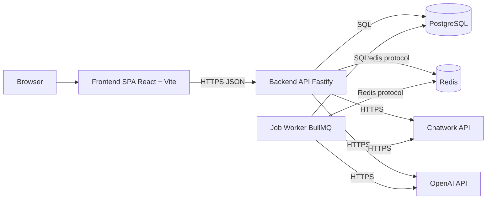

## 繝�Eャ繧�E�繧�E�繝ｳ繝峨・繧�E�繝ｳ繝昴・繝阪Φ繝亥峙�E・ML Component 逶�E�蠖難�E�・
**隱�E�譏趣�E�井ｸ€闊ｬ・・*: 繝�Eャ繧�E�繧�E�繝ｳ繝牙・驛ｨ縺�E�讒区・隕∫�E��E�縺�E�萓晏�E�倬未菫めE��遉�E�縺励∪縺吶€・ 
**縺薙�E繝励Ο繧�E�繧�E�繧�E�繝医〒縺�E�**: Routes竊辿andlers竊担ervices竊単risma縺�E�豬√ｌ縺�E�縲∝�E譛�E隕∫�E�・↑縺�E�縺�E�讖溯・縺悟ｮ溯�E�・�E�E��後※縺・∪縺吶€・
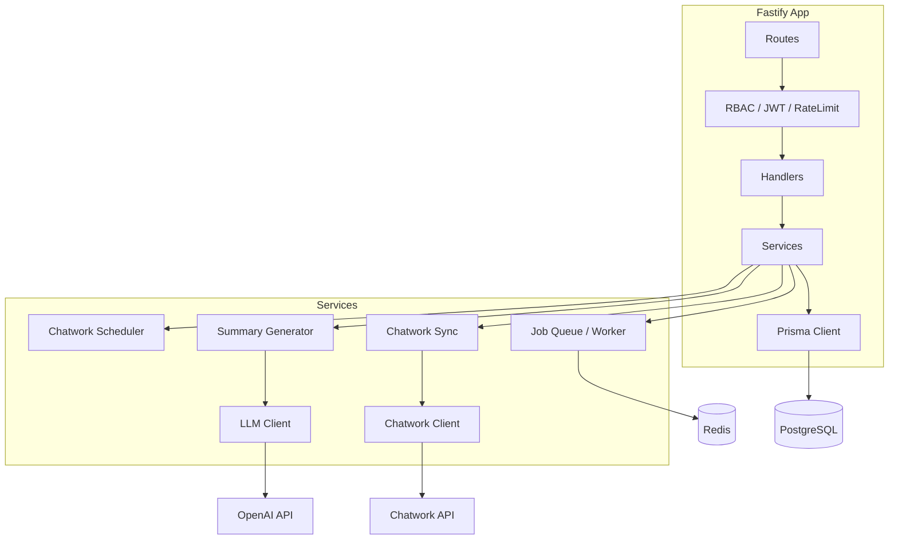

## 隲也炊繧�E�繝ｼ繧�E�繝�Eけ繝�EΕ�E亥�E��E�繝ｻ雋ｬ蜍呻�E�・
**隱�E�譏趣�E�井ｸ€闊ｬ・・*: 螻�E�縺斐�E縺�E�雋ｬ蜍吶→萓晏ｭ俶婿蜷代�E�謨�E�送E�E☁E��句峙縺�E�縺吶€・ 
**縺薙�E繝励Ο繧�E�繧�E�繧�E�繝医〒縺�E�**: UI竊佁EI竊担ervice竊棚nfra縺�E�荳€譁E��蜷代〒縲�E�B/Redis/螟夜ΚAPI縺�E�Infra蛛ｴ縺�E�髮・�E�・�E�縺�E�縺・∪縺吶€・
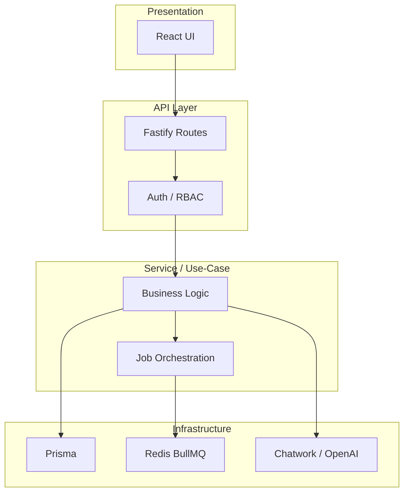

## 迚ｩ送E�EぁE��ｼ繧�E�繝�Eけ繝�EΕ�E・ev / Prod・・
**隱�E�譏趣�E�井ｸ€闊ｬ・・*: 螳溯�E�檎�E蠁E�E〒縺�E�驟咲�E��E�・医・繝ｭ繧�E�繧�E�/繧�E�繝ｳ繝�Eリ/繧�E�繝ｼ繝薙せ�E峨�E�遉�E�縺励∪縺吶€・ 
**縺薙�E繝励Ο繧�E�繧�E�繧�E�繝医〒縺�E�**: 髢狗匱縺�E�Vite+Fastify縺�E�Docker縺�E�DB/Redis縲・°逕ｨ縺�E�Render縺�E�縺溘�EDocker讒区・縺�E�縺吶€・
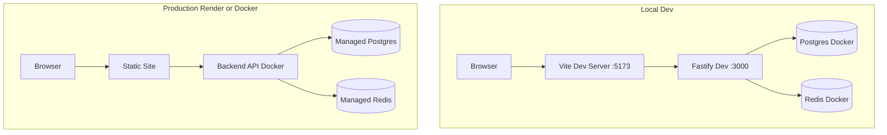

## 繝阪ャ繝医Ρ繝ｼ繧�E�讒区・ / 繝医Λ繝輔ぅ繝�Eけ繝輔Ο繝ｼ
**隱�E�譏趣�E�井ｸ€闊ｬ・・*: 繝ｪ繧�E�繧�E�繧�E�繝医・蜈･蜿�E�縺九ｉ蜀・Κ繝ｻ螟夜Κ騾�E�謳�E�縺�E�縺�E�縺�E�騾壻�E��E�邨瑚ｷ�E�繧堤�E��E�縺励∪縺吶€・ 
**縺薙�E繝励Ο繧�E�繧�E�繧�E�繝医〒縺�E�**: 繝悶Λ繧�E�繧�E�竊�Eヵ繝ｭ繝ｳ繝遺・API竊奪B/Redis竊貞､夜ΚAPI縺�E�豬√ｌ縺�E�縺�E�繧翫∪縺吶€・
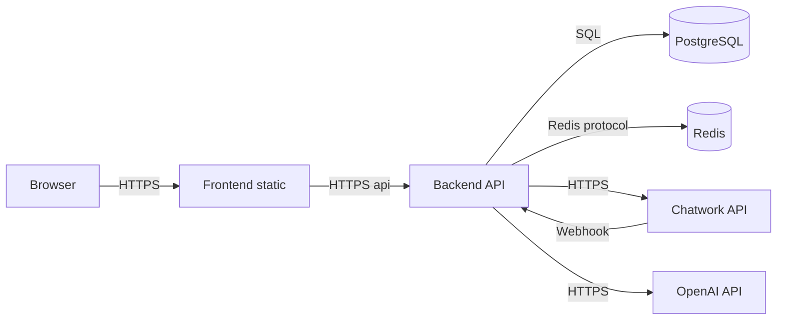

## 隱崎ｨ�E�繝ｻ隱榊庁E��E�E阜�E・rust Boundary・・
**隱�E�譏趣�E�井ｸ€闊ｬ・・*: 縺�E�縺薙〒隱崎ｨ�E�繝ｻ隱榊庁E��瑚｡後ｏ繧後ｋ縺九€∽�E��E�鬁E��蠁E�E阜繧堤�E��E�縺吝峙縺�E�縺吶€・ 
**縺薙�E繝励Ο繧�E�繧�E�繧�E�繝医〒縺�E�**: JWT讀懁E���E�縺�E�RBAC縺�E�繝�Eャ繧�E�繧�E�繝ｳ繝牙・縺�E�螳滓命縺励€√け繝ｩ繧�E�繧�E�繝ｳ繝医・譛ｪ菫�E�鬁E��蜑肴署縺�E�縺吶€・
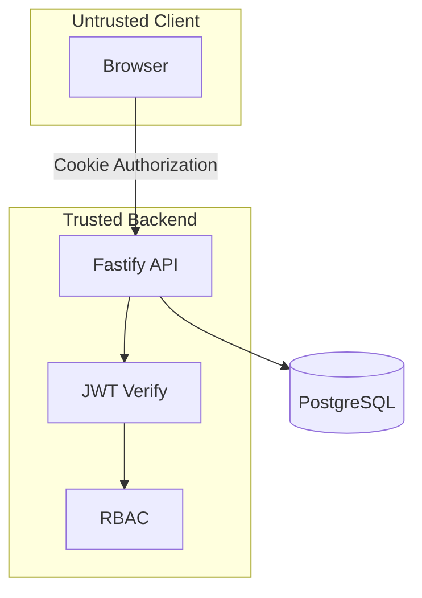

## 繧�E�繝医Ξ繝ｼ繧�E� / 繧�E�繝｣繝�Eす繝･驟咲�E��E�
**隱�E�譏趣�E�井ｸ€闊ｬ・・*: 繝�E・繧�E�縺�E�菫晏ｭ伜�E繝ｻ繧�E�繝｣繝�Eす繝･縺�E�驟咲�E��E�繧堤�E��E�縺励∪縺吶€・ 
**縺薙�E繝励Ο繧�E�繧�E�繧�E�繝医〒縺�E�**: 繝輔Ο繝ｳ繝医・useFetch縺�E�繝｡繝｢繝ｪ繧�E�繝｣繝�Eす繝･縲√ヰ繝�Eけ縺�E�PostgreSQL/Redis繧貞茜逕ｨ縺励∪縺吶€・
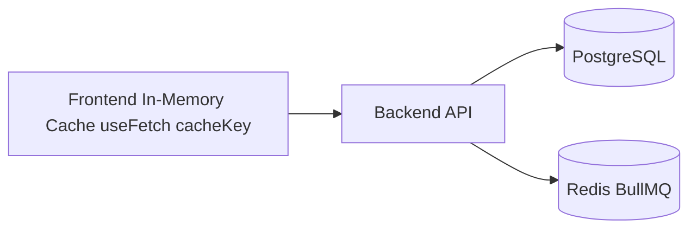

## 繧�E�繝ｧ繝門渕逶�E� / 繧�E�繝吶Φ繝磯�E�・虚縺�E�蜈ｨ菴・
**隱�E�譏趣�E�井ｸ€闊ｬ・・*: 髱槫酔譛溷・送E�E・豬√ｌ縺�E�繧�E�繝･繝ｼ/繝ｯ繝ｼ繧�E�繝ｼ縺�E�髢�E�菫めE��遉�E�縺励∪縺吶€・ 
**縺薙�E繝励Ο繧�E�繧�E�繧�E�繝医〒縺�E�**: Chatwork蜷梧悁E��・�E�∫�E�・函謌�E・繧�E�繝ｧ繝門喧縺輔ｌ縲。ullMQ繝ｯ繝ｼ繧�E�繝ｼ縺悟�E送E�E�E�縺�E�縺吶€・
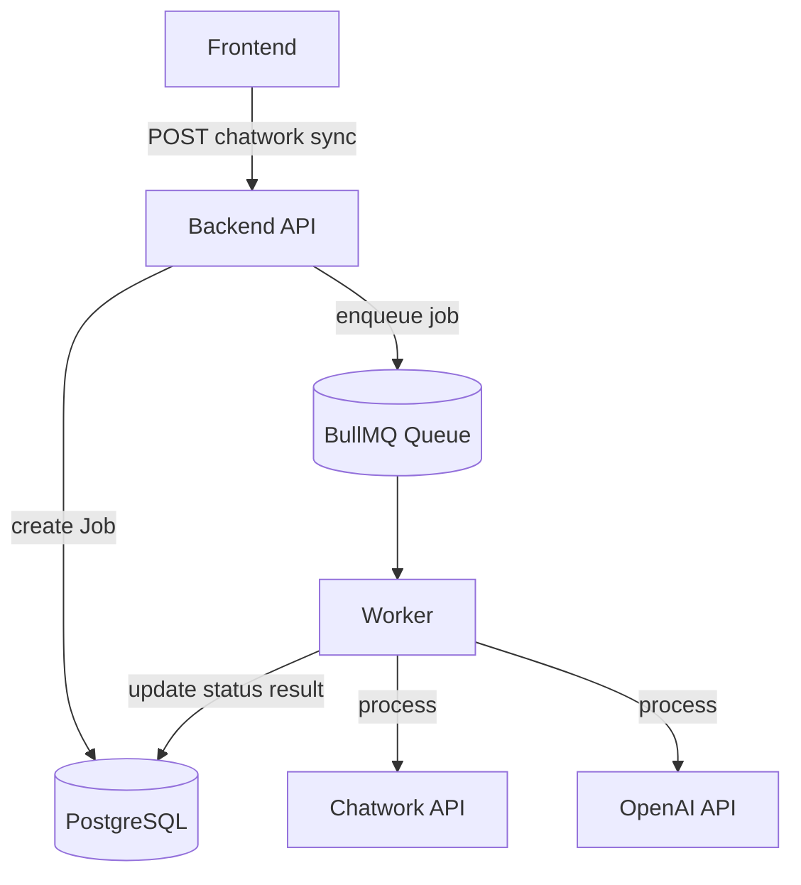

## 萓晏�E�倬未菫めE��繝ｩ繝包�E�医Δ繧�E�繝･繝ｼ繝ｫ萓晏�E�偁E��・
**隱�E�譏趣�E�井ｸ€闊ｬ・・*: 繝｢繧�E�繝･繝ｼ繝ｫ髢薙�E萓晏�E�俶婿蜷代�E�菫�E�迸�E�縺吶�E�蝗�E�縺�E�縺吶€・ 
**縺薙�E繝励Ο繧�E�繧�E�繧�E�繝医〒縺�E�**: Routes/Handlers/Services縺御�E��E�蠢・〒縲�E�risma/Redis/螟夜ΚAPI縺�E�萓晏�E�倥�E�縺�E�縺吶€・
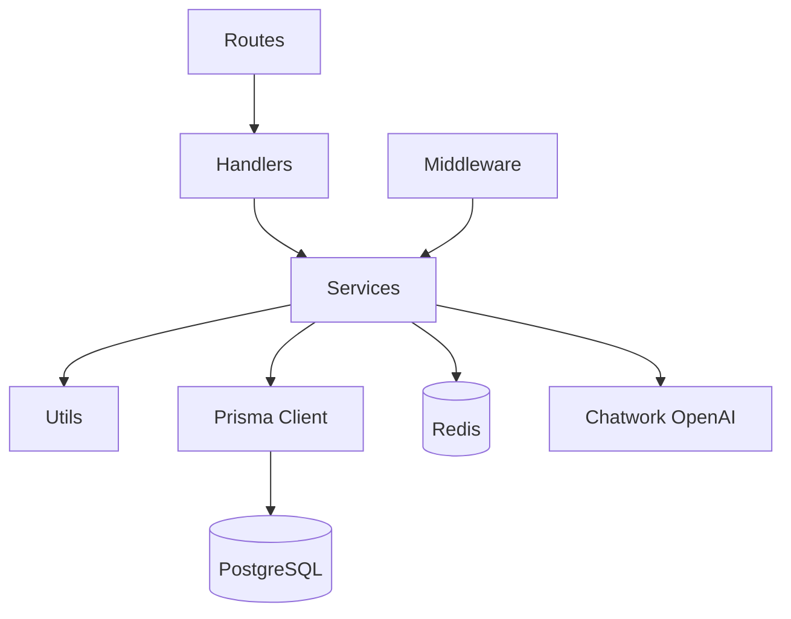

## 繝｢繧�E�繝･繝ｼ繝ｫ讒区・・医Μ繝昴ず繝医Μ�E・
**隱�E�譏趣�E�井ｸ€闊ｬ・・*: 繝ｪ繝昴ず繝医Μ縺�E�荳�E�隕�Eョ繧�E�繝ｬ繧�E�繝医Μ讒区・繧堤�E��E�縺励∪縺吶€・ 
**縺薙�E繝励Ο繧�E�繧�E�繧�E�繝医〒縺�E�**: frontend/backend/infra/Docs縺�E�蛻・牡縺励※雋ｬ蜍吶�E�譏守｢�E�蛹悶�E�縺�E�縺・∪縺吶€・
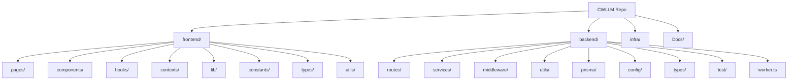

## 繝ｬ繧�E�繝､繝ｼ蝗ｳ・・resentation / Domain / Infra・・
**隱�E�譏趣�E�井ｸ€闊ｬ・・*: 繝励Ξ繧�E�繝ｳ繝�E・繧�E�繝ｧ繝ｳ/繝峨Γ繧�E�繝ｳ/繧�E�繝ｳ繝輔Λ縺�E�謚ｽ雎｡螻�E�繧堤�E��E�縺励∪縺吶€・ 
**縺薙�E繝励Ο繧�E�繧�E�繧�E�繝医〒縺�E�**: Routes/Services縺後ラ繝｡繧�E�繝ｳ逶�E�蠖薙€�E�risma/Redis/螟夜ΚAPI縺後う繝ｳ繝輔Λ逶�E�蠖薙〒縺吶€・
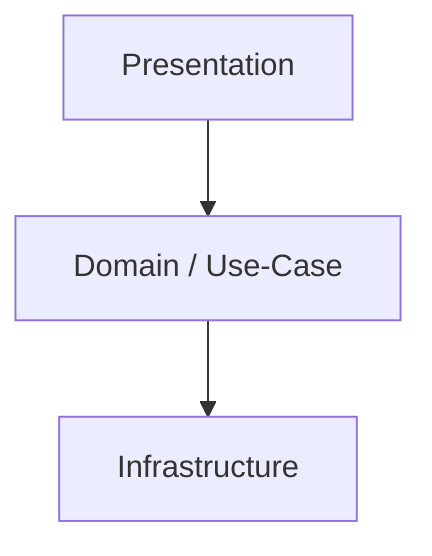

## Hexagonal・・orts & Adapters・・
**隱�E�譏趣�E�井ｸ€闊ｬ・・*: 繧�E�繧�E�縺�E�螟夜Κ繧�E�繝€繝励ち縺�E�蠁E�E阜繧堤�E��E�縺呵�E��E�險亥峙縺�E�縺吶€・ 
**縺薙�E繝励Ο繧�E�繧�E�繧�E�繝医〒縺�E�**: Inbound縺�E�HTTP/Scheduler縲�E�utbound縺�E�DB/Redis/Chatwork/OpenAI縺�E�縺吶€・
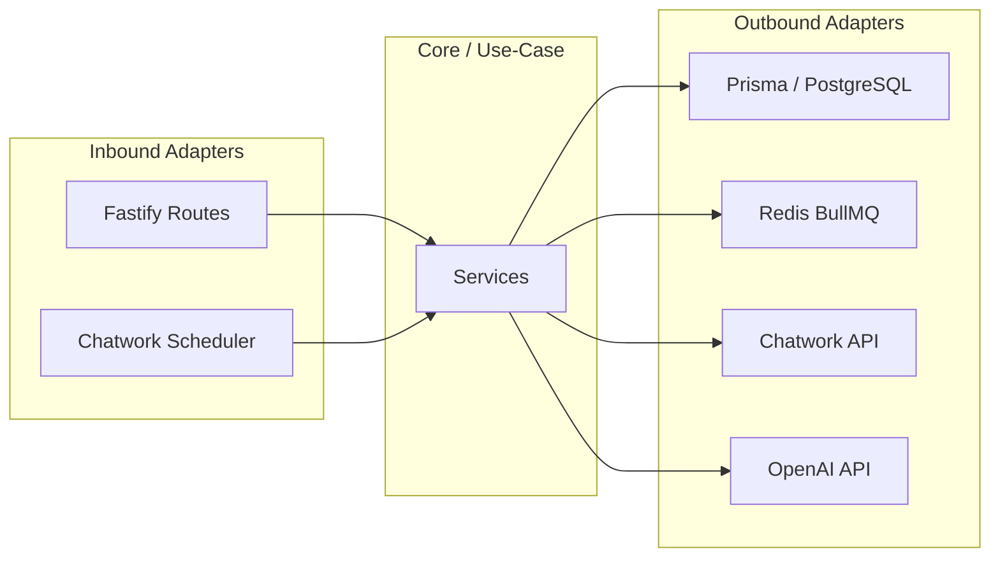

## DDD Context Map・亥�E�・阜縺�E�縺托ｼ・
**隱�E�譏趣�E�井ｸ€闊ｬ・・*: 讌ｭ蜍咎�E�伜沺・医さ繝ｳ繝�Eく繧�E�繝茨�E�蛾俣縺�E�髢�E�菫めE��遉�E�縺励∪縺吶€・ 
**縺薙�E繝励Ο繧�E�繧�E�繧�E�繝医〒縺�E�**: Companies繧剁E���E�蠢・↓Projects/Wholesales/Tasks縺碁E��E�謳�E�縺励∪縺吶€・
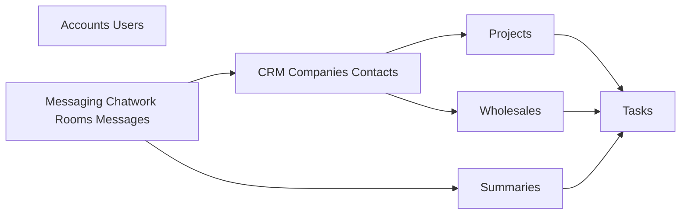

## 4+1 繝薙Η繝ｼ・亥�E��E�蠢懁E���E�・・
| View | 蟁E��蠢懷峁E|
| --- | --- |
| Logical | 隲也炊繧�E�繝ｼ繧�E�繝�Eけ繝�E΁E/ 繝ｬ繧�E�繝､繝ｼ蝗ｳ |
| Process | 繧�E�繝ｧ繝門渕逶�E� / 繧�E�繝吶Φ繝磯�E�・虁E/ 繧�E�繝ｼ繧�E�繝ｳ繧�E� |
| Development | 繝｢繧�E�繝･繝ｼ繝ｫ讒区・ / 萓晏�E�倬未菫・|
| Physical | 迚ｩ送E�EぁE��ｼ繧�E�繝�Eけ繝�E΁E/ 繝阪ャ繝医Ρ繝ｼ繧�E� |
| Scenarios | 繧�E�繝ｼ繧�E�繝ｳ繧�E�蝗ｳ・医Ο繧�E�繧�E�繝ｳ繝ｻ蜷梧悁E��ｻ隕∫�E�・�E�・|

## 雋ｬ蜍吝・蜑ｲ・医し繝槭Μ�E・
| 鬁E��沺 | 荳�E�諡・�E�・| 蠖ｹ蜑ｲ |
| --- | --- | --- |
| 逕ｻ髱�E�/UI | Frontend | 逕ｻ髱�E�陦�E�遉ｺ縲∝�E蜉帙€、PI蜻�E�縺�E�蜁E��縺・|
| 隱崎ｨ�E�/隱榊庁E| Backend | JWT逋ｺ陦後€ヽBAC縲√い繧�E�繧�E�繧�E�蛻�E�蠕｡ |
| 讌ｭ蜍吶Ο繧�E�繝�EぁE| Backend Services | 蜷梧悁E隕∫�E�・繧�E�繧�E�繧�E�蛹也ｭ・|
| 豌ｸ邯壼喧 | PostgreSQL + Prisma | 荳�E�隕�Eョ繝ｼ繧�E�縺�E�豌ｸ邯壼喧 |
| 髱槫酔譛溷・送E�E| Redis + BullMQ | Chatwork蜷梧悁E��ｻ隕∫�E�・函謌�E・螳溯�E�・|
| 螟夜Κ騾�E�謳�E� | Chatwork/OpenAI | 繝｡繝�Eそ繝ｼ繧�E�蜿門�E�励・隕∫�E�・函謌�E|

---

# 縺�E�繧九∪縺・/ 蜁E��送E�Eヵ繝ｭ繝ｼ

## 繧�E�繝ｼ繧�E�繝ｳ繧�E�・壹Ο繧�E�繧�E�繝ｳ
**隱�E�譏趣�E�井ｸ€闊ｬ・・*: 逕ｻ髱�E�謫堺�E�懊°繧陰PI蠢懁E��斐∪縺�E�縺�E�謁E���E�・→蠖ｹ蜑ｲ蛻・琁E��堤�E��E�縺励∪縺吶€・ 
**縺薙�E繝励Ο繧�E�繧�E�繧�E�繝医〒縺�E�**: 隱崎ｨ�E�謌仙粥譎ゅ↓JWT繧堤匱陦後＠縲�E�ookie縺�E�菫晏ｭ倥�E�縺�E�莉･髯阪・API隱崎ｨ�E�縺�E�菴�E�縺・∪縺吶€・
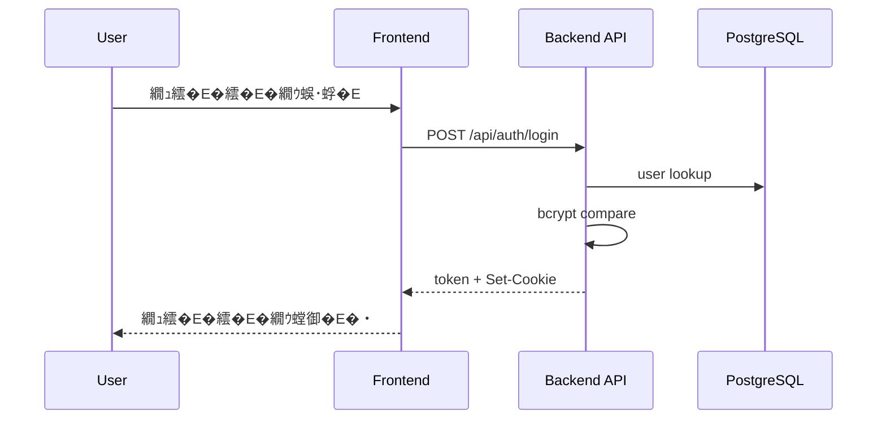

## 繧�E�繝ｼ繧�E�繝ｳ繧�E�・咾hatwork蜷梧悁E�E育�E��E�送E�E€・�E�・
**隱�E�譏趣�E�井ｸ€闊ｬ・・*: 髱槫酔譛溘ず繝ｧ繝悶・襍ｷ蜍輔�E蜁E��送E�E・豬√ｌ繧堤�E��E�縺励∪縺吶€・ 
**縺薙�E繝励Ο繧�E�繧�E�繧�E�繝医〒縺�E�**: 邂｡送E�E€・桁E��懊〒繧�E�繝ｧ繝悶�E�菴懈�E縺励€。ullMQ繝ｯ繝ｼ繧�E�繝ｼ縺悟�E譛溘ｒ螳溯�E�後＠縺�E�縺吶€・
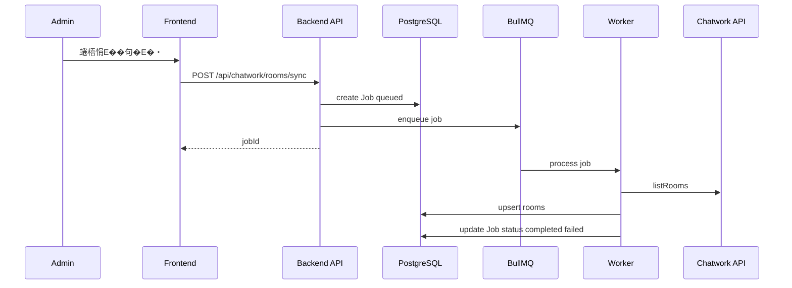

## 繧�E�繝ｼ繧�E�繝ｳ繧�E�・夊ｦ∫�E�・ラ繝ｩ繝輔ヨ逕滓�E
**隱�E�譏趣�E�井ｸ€闊ｬ・・*: 繧�E�繝｣繝�Eす繝･遒ｺ隱阪→髱槫酔譛溷・送E�E・蛻・�E�舌ｒ遉�E�縺励∪縺吶€・ 
**縺薙�E繝励Ο繧�E�繧�E�繧�E�繝医〒縺�E�**: 譛滁E��蜀・ラ繝ｩ繝輔ヨ縺後≠繧後�E蜊ｳ霑斐�E�縲√�E縺代�E�縺�E�繧�E�繝ｧ繝也ｵ檎罰縺�E�逕滓�E縺励∪縺吶€・
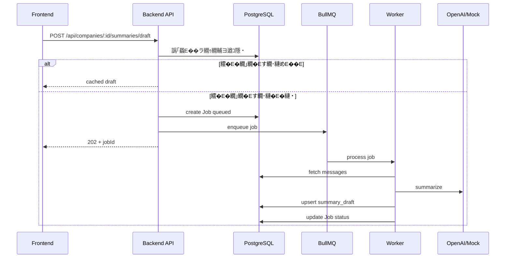

## 繧�E�繧�E�繝�EぁE��薙ユ繧�E�・咾hatwork繝｡繝�Eそ繝ｼ繧�E�蜷梧悁E
**隱�E�譏趣�E�井ｸ€闊ｬ・・*: 繝ｫ繝ｼ繝怜�E送E�E�E�E��・�E�舌ｒ蜷�E�繧€蜁E��送E�E・豬√ｌ繧堤�E��E�縺励∪縺吶€・ 
**縺薙�E繝励Ο繧�E�繧�E�繧�E�繝医〒縺�E�**: 繝ｫ繝ｼ繝縺斐�E縺�E�蜿門�E�励・菫晏ｭ倥�E�縲∝､�E�謨玲凾縺�E�繧�E�繝ｩ繝ｼ諠・�E��E�繧定ｨ倬鹸縺励∪縺吶€・
```mermaid
flowchart TD
  Start([Start]) --> LoadRooms[蟁E��雎｡繝ｫ繝ｼ繝蜿門�E�佁E
  LoadRooms --> Loop{蜷・Ν繝ｼ繝}
  Loop --> Fetch["Chatwork API listMessages"]
  Fetch -->|OK| Save["createMany + updateMany"]
  Save --> UpdateRoom["room.lastSyncAt / lastMessageId 譖ｴ譁E��"]
  UpdateRoom --> Loop
  Fetch -->|Error| MarkErr["room.lastError* 譖ｴ譁E��"]
  MarkErr --> Loop
  Loop --> End([End])
```

## 繧�E�繝�E・繝医・繧�E�繝ｳ・哽obStatus
**隱�E�譏趣�E�井ｸ€闊ｬ・・*: 繧�E�繝ｧ繝悶・迥�E�諷矩・遘ｻ繧堤�E��E�縺励∪縺吶€・ 
**縺薙�E繝励Ο繧�E�繧�E�繧�E�繝医〒縺�E�**: DB縺�E�`jobs.status`縺繋ueued竊恥rocessing竊団ompleted/failed/canceled縺�E�譖ｴ譁E��縺輔ｌ縺�E�縺吶€・
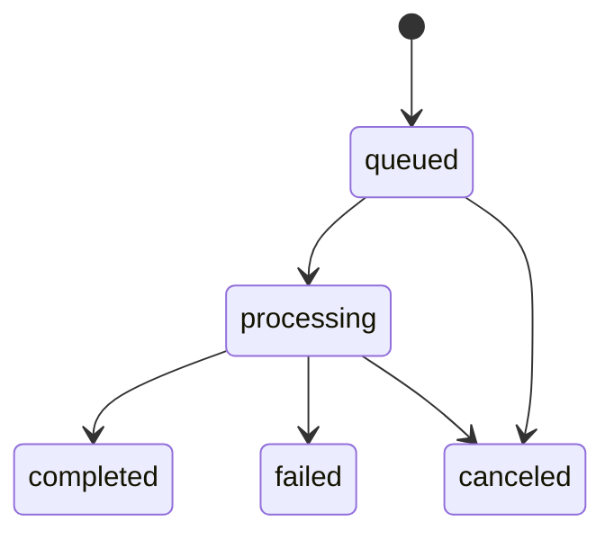

## 繧�E�繝�E・繝医・繧�E�繝ｳ・啜askStatus
**隱�E�譏趣�E�井ｸ€闊ｬ・・*: 繧�E�繧�E�繧�E�縺�E�迥�E�諷矩・遘ｻ繧堤�E��E�縺励∪縺吶€・ 
**縺薙�E繝励Ο繧�E�繧�E�繧�E�繝医〒縺�E�**: todo/in_progress/done/cancelled繧堤判髱�E�縺�E�API縺�E�邂｡送E�E�E�縺�E�縺吶€・
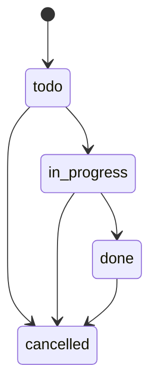

## 繧�E�繧�E�繝溘Φ繧�E�・夊�E蜍募酔譛溘せ繧�E�繧�E�繝･繝ｼ繝ｫ
**隱�E�譏趣�E�井ｸ€闊ｬ・・*: 螳壽悁E���E�送E�E・繧�E�繧�E�繝溘Φ繧�E�繧堤�E��E�縺励∪縺吶€・ 
**縺薙�E繝励Ο繧�E�繧�E�繧�E�繝医〒縺�E�**: 迺�E�蠁E�E�E�画焚縺�E�險�E�螳壹�E�縺滁E��髫斐〒Chatwork蜷梧悁E���E�繝ｧ繝悶�E�謚募・縺励∪縺吶€・
```mermaid
sequenceDiagram
  participant Scheduler as ChatworkScheduler
  participant API as Backend
  participant Q as BullMQ

  Note over Scheduler,API: env CHATWORK_AUTO_SYNC_INTERVAL_MINUTES
  loop every N minutes
    Scheduler->>API: enqueue rooms sync
    Scheduler->>API: enqueue messages sync
    API->>Q: add job
  end
```

## 逶�E�莠剁E��懁E��讎り�E�・�E�井ｻ�E�陦�E�繧�E�繝翫Μ繧�E�・・
**隱�E�譏趣�E�井ｸ€闊ｬ・・*: 莉｣陦�E�逧・↑繝ｦ繝ｼ繧�E�繝ｼ繝輔Ο繝ｼ繧堤洒縺上∪縺�E�繧√◆蝗ｳ縺�E�縺吶€・ 
**縺薙�E繝励Ο繧�E�繧�E�繧�E�繝医〒縺�E�**: 繝€繝�Eす繝･繝懊・繝峨°繧我ｼ夂､�E�隧�E�邏ｰ縺�E�騾�E�縺�E�縲∝�E譛溘ａE��∫�E�・�E�螳溯�E�後＠縺�E�縺吶€・
```mermaid
flowchart LR
  Login["繝ｭ繧�E�繧�E�繝ｳ"] --> Dashboard["繝€繝�Eす繝･繝懊・繝芽�E��E�遉ｺ"]
  Dashboard --> Company["莨夂､�E�隧�E�邏ｰ"]
  Company --> Sync["Chatwork蜷梧悁E]
  Company --> Draft["隕∫�E�・ラ繝ｩ繝輔ヨ逕滓�E"]
  Draft --> Tasks["繧�E�繧�E�繧�E�蛟呵�E�懈歓蜃�E�"]
```

## 萓句�E�紋ｼ晁E��・・PI繧�E�繝ｩ繝ｼ繝上Φ繝峨Μ繝ｳ繧�E�・・
**隱�E�譏趣�E�井ｸ€闊ｬ・・*: 萓句�E�悶′縺�E�縺�E�繧医≧縺�E�謐墓拷繝ｻ謨�E�蠖｢縺輔ｌ縺�E�霑斐�E�縺九ｒ遉�E�縺励∪縺吶€・ 
**縺薙�E繝励Ο繧�E�繧�E�繧�E�繝医〒縺�E�**: `setErrorHandler` 縺�E� `normalizeErrorPayload` 縺�E�蜈ｱ騾壼�E��E�蠑上�E謠・∴縺�E�縺吶€・
```mermaid
flowchart TD
  Request --> Handler
  Handler -->|throw or return| ErrorHandler["Fastify setErrorHandler"]
  ErrorHandler --> Normalize["normalizeErrorPayload"]
  Normalize --> Response["JSON Error Response"]
```

## 繝ｪ繝医Λ繧�E� / 繧�E�繧�E�繝繧�E�繧�E�繝�E/ 繧�E�繝ｼ繧�E�繝�Eヨ繝悶Ξ繝ｼ繧�E�
**隱�E�譏趣�E�井ｸ€闊ｬ・・*: 螟夜ΚAPI螟ｱ謨玲凾縺�E�蜀崎ｩ�E�陦後ａE���E�繧�E�繝繧�E�繧�E�繝医・謁E��縺・�E�遉�E�縺励∪縺吶€・ 
**縺薙�E繝励Ο繧�E�繧�E�繧�E�繝医〒縺�E�**: Chatwork縺�E�邁E��譏薙Μ繝医Λ繧�E�縲�E�penAI縺�E�螟ｱ謨玲凾縺�E�繧�E�繝ｧ繝門�E��E�謨励→縺励※謁E��縺・∪縺吶€・
```mermaid
flowchart TB
  ChatworkReq["Chatwork API Request"] -->|timeout 10s| Retry{"retry limit check"}
  Retry -->|yes default=1| ChatworkReq
  Retry -->|no| ChatworkErr["store error + job failed"]

  OpenAIReq["OpenAI Request"] -->|timeout 15s| LLMErr["error -> job failed"]
  JobQueue["Job Queue"] -->|attempts=1| NoRetry["No job retry"]
```

## 蜀�E�遲画€�E�縺�E�險�E�險茨�E�育樟迥�E�・・
**隱�E�譏趣�E�井ｸ€闊ｬ・・*: 蜷後§謫堺�E�懊ｒ郢�E�繧願ｿ斐＠縺�E�繧らｵ先棡縺悟ｴ�E�繧後�E縺・�E��E�螟ｫ繧堤�E��E�縺励∪縺吶€・ 
**縺薙�E繝励Ο繧�E�繧�E�繧�E�繝医〒縺�E�**: 繝ｦ繝九�E繧�E�蛻�E�邏�E→`upsert`縺�E�驥崎､・匳骭�E�繧帝∩縺代∪縺吶€・
```mermaid
flowchart TB
  MsgSync["Message Sync"] --> Unique1["unique roomId messageId"]
  MsgSync --> CreateMany["createMany skipDuplicates"]
  Draft["Summary Draft"] --> Upsert["upsert companyId period"]
  CompanyLink["CompanyRoomLink"] --> Unique2["unique companyId chatworkRoomId"]
```

## 蛯呵€・�E�域悴螳溯�E�・髱櫁E���E�蠖難�E�・
- 蛻・淵繝医Λ繝ｳ繧�E�繧�E�繧�E�繝ｧ繝ｳ / 繧�E�繧�E�・壽悴螳溯�E�・
- 譏守､�E�逧・Ο繝�Eけ險�E�險茨�E�壽悴螳溯�E�・�E�・B蛻�E�邏�E↓萓晏ｭ偁E��・
- 繧�E�繝ｼ繧�E�繝�Eヨ繝悶Ξ繝ｼ繧�E�・壽悴螳溯�E�・�E�育�E��E�譏薙Μ繝医Λ繧�E�縺�E�縺�E�・・

---

# 繝�E・繧�E�縺�E�繧上ａE

## ER 蝗ｳ・郁E��也炊・・
**隱�E�譏趣�E�井ｸ€闊ｬ・・*: 繝�E・繧�E�縺�E�繧�E�繝ｳ繝�EぁE���EぁE���E�髢�E�菫めE��菫�E�迸�E�縺吶�E�蝗�E�縺�E�縺吶€・ 
**縺薙�E繝励Ο繧�E�繧�E�繧�E�繝医〒縺�E�**: Companies繧剁E���E�蠢・↓Projects/Wholesales/Tasks/Chatwork騾�E�謳�E�縺檎ｹ九′繧翫∪縺吶€・
```mermaid
erDiagram
  USER {
    string id PK
    string email
    string role
  }
  COMPANY {
    string id PK
    string name
    string normalizedName
    string ownerId FK
  }
  CONTACT {
    string id PK
    string companyId FK
    string name
  }
  PROJECT {
    string id PK
    string companyId FK
    string ownerId FK
    string status
  }
  WHOLESALE {
    string id PK
    string projectId FK
    string companyId FK
    string ownerId FK
    string status
  }
  CHATWORK_ROOM {
    string id PK
    string roomId UK
    boolean isActive
  }
  COMPANY_ROOM_LINK {
    string id PK
    string companyId FK
    string chatworkRoomId FK
  }
  MESSAGE {
    string id PK
    string chatworkRoomId FK
    string roomId
    string messageId
    string companyId FK
    string projectId FK
    string wholesaleId FK
  }
  SUMMARY {
    string id PK
    string companyId FK
    string type
  }
  SUMMARY_DRAFT {
    string id PK
    string companyId FK
  }
  TASK {
    string id PK
    string targetType
    string targetId
    string assigneeId FK
    string status
  }
  JOB {
    string id PK
    string type
    string status
    string userId FK
  }
  AUDIT_LOG {
    string id PK
    string entityType
    string entityId
  }
  APP_SETTING {
    string id PK
    string key UK
  }

  USER ||--o{ COMPANY : owns
  COMPANY ||--o{ CONTACT : has
  COMPANY ||--o{ PROJECT : has
  PROJECT ||--o{ WHOLESALE : has
  COMPANY ||--o{ WHOLESALE : has
  CHATWORK_ROOM ||--o{ MESSAGE : contains
  COMPANY ||--o{ MESSAGE : assigned
  PROJECT ||--o{ MESSAGE : assigned
  WHOLESALE ||--o{ MESSAGE : assigned
  COMPANY ||--o{ SUMMARY : has
  COMPANY ||--o{ SUMMARY_DRAFT : has
  COMPANY ||--o{ COMPANY_ROOM_LINK : links
  CHATWORK_ROOM ||--o{ COMPANY_ROOM_LINK : links
  USER ||--o{ TASK : assigned
  USER ||--o{ JOB : created
```

## 繝�E・繧�E�繝輔Ο繝ｼ・・FD 繝ｬ繝吶΁E・・
**隱�E�譏趣�E�井ｸ€闊ｬ・・*: 繝�E・繧�E�縺後�E縺薙°繧峨←縺薙�E豬√ｌ繧九°繧堤�E��E�縺励∪縺吶€・ 
**縺薙�E繝励Ο繧�E�繧�E�繧�E�繝医〒縺�E�**: 繝輔Ο繝ｳ繝遺・API竊奪B/Redis竊貞､夜ΚAPI・・hatwork/OpenAI・峨・豬√ｌ縺�E�縺吶€・
```mermaid
flowchart LR
  User[User] --> FE[Frontend]
  FE --> API[Backend API]
  API --> DB[(PostgreSQL)]
  API --> Redis["Redis/BullMQ"]
  API --> Chatwork[Chatwork API]
  API --> OpenAI[OpenAI API]
  Chatwork --> API
```

## 繧�E�繝吶Φ繝�E/ 繧�E�繝ｧ繝悶せ繧�E�繝ｼ繝橸�E�育樟迥�E�・・
| JobType | payload | 隱�E�譏�E|
| --- | --- | --- |
| `chatwork_rooms_sync` | `{}` | 繝ｫ繝ｼ繝荳€隕ｧ蜷梧悁E|
| `chatwork_messages_sync` | `{ roomId?: string, roomLimit?: number }` | 繝｡繝�Eそ繝ｼ繧�E�蜷梧悁E|
| `summary_draft` | `{ companyId, periodStart, periodEnd }` | 隕∫�E�・ラ繝ｩ繝輔ヨ逕滓�E |

## 繝�E・繧�E�霎樊嶌�E井ｸ�E�隕�Eお繝ｳ繝�EぁE���EぁE�E・
| 繧�E�繝ｳ繝�EぁE���EぁE| 荳�E�縺�E�鬁E�E岼 | 蛯呵€・|
| --- | --- | --- |
| User | `email`, `role`, `password` | 隱崎ｨ�E�繝ｻ讓ｩ髯・|
| Company | `name`, `normalizedName`, `status`, `tags` | CRM荳�E�蠢・|
| Contact | `companyId`, `name`, `role`, `email` | 莨夂､�E�騾�E�邨�E�蜈�E|
| Project | `companyId`, `name`, `status`, `periodStart/End` | 譯井ｻ�E� |
| Wholesale | `projectId`, `companyId`, `status`, `margin` | 蜊ｸ |
| ChatworkRoom | `roomId`, `name`, `lastSyncAt`, `isActive` | 騾�E�謳�E�繝ｫ繝ｼ繝 |
| Message | `roomId`, `messageId`, `sender`, `body`, `sentAt` | 騾�E�謳�E�繝｡繝�Eそ繝ｼ繧�E� |
| Summary | `companyId`, `content`, `type` | 遒ｺ螳夊ｦ∫�E�・|
| SummaryDraft | `companyId`, `content`, `expiresAt` | 閾�E�蜍�E函謌�E|
| Task | `targetType`, `targetId`, `assigneeId`, `status` | 繧�E�繧�E�繧�E� |
| Job | `type`, `status`, `payload`, `result` | 髱槫酔譛溷・送E�E|

## 螳溯�E�・�E��E�蛻・�E�井ｸ�E�隕∬�E��E�蜉鬁E�E岼・・**隱�E�譏趣�E�井ｸ€闊ｬ・・*: ER蝗ｳ/霎樊嶌縺�E�荳�E�隕�E�E�・岼縺�E�謚懃�E�九〒縺吶€めE��溯�E�・↓縺�E�莉･荳九�E霑ｽ蜉鬁E�E岼縺後≠繧翫∪縺吶€・ 
- Company: `category`, `profile`, `ownerId`
- Contact: `phone`, `memo`, `sortOrder`
- Project: `conditions`, `unitPrice`, `periodStart`, `periodEnd`, `ownerId`
- Wholesale: `conditions`, `unitPrice`, `margin`, `agreedDate`, `ownerId`
- ChatworkRoom: `description`, `lastMessageId`, `lastErrorAt`, `lastErrorMessage`, `lastErrorStatus`
- Message: `labels`, `sender`, `sentAt`
- Summary / SummaryDraft: `periodStart`, `periodEnd`, `sourceLinks`, `model`, `promptVersion`, `sourceMessageCount`, `tokenUsage`, `expiresAt`・・raft縺�E�縺�E�・・- Task: `title`, `description`, `dueDate`, `assigneeId`
- Job: `error`, `startedAt`, `finishedAt`

## CRUD 繝槭ヨ繝ｪ繧�E�繧�E�・井ｸ�E�隕�E�E�・| 繝ｪ繧�E�繝ｼ繧�E� | Create | Read | Update | Delete |
| --- | --- | --- | --- | --- |
| Users | 笨・| 笨・| 笨・role) | - |
| Companies | 笨・| 笨・| 笨・| 笨・|
| Contacts | 笨・| 笨・| 笨・| 笨・|
| Projects | 笨・| 笨・| 笨・| 笨・|
| Wholesales | 笨・| 笨・| 笨・| 笨・|
| Messages | - | 笨・| 笨・assign/labels) | - |
| Summaries | 笨・| 笨・| - | - |
| SummaryDraft | 笨・job) | 笨・| - | - |
| Tasks | 笨・| 笨・| 笨・| 笨・|
| Jobs | 笨・enqueue) | 笨・| 笨・cancel) | - |
| Settings | - | 笨・| 笨・| - |

## 繧�E�繝ｳ繝�Eャ繧�E�繧�E� / 蛻�E�邏�E�E�域栢邊�E�E�・
| 繝�E・繝悶΁E| 繧�E�繝ｳ繝�Eャ繧�E�繧�E� / 繝ｦ繝九�E繧�E� |
| --- | --- |
| companies | `normalizedName` unique |
| contacts | `(companyId, sortOrder)` |
| projects | `(companyId)` |
| wholesales | `(companyId, projectId)` |
| chatwork_rooms | `roomId` unique |
| company_room_links | `(companyId, chatworkRoomId)` unique |
| messages | `unique(roomId, messageId)`, `(companyId)`, `(companyId, sentAt)` |
| summary_drafts | `unique(companyId, periodStart, periodEnd)`, `(companyId, periodStart, periodEnd)` |
| tasks | `(targetType, targetId)`, `(dueDate, status)`, `(assigneeId)` |
| jobs | `(type, status)`, `(createdAt)` |

## 繧�E�繝｣繝�Eす繝･繧�E�繝ｼ險�E�險茨�E�医ヵ繝ｭ繝ｳ繝茨�E�・
| 繧�E�繝ｼ | TTL | 隱�E�譏�E|
| --- | --- | --- |
| `cacheKey`・域悴謖�E�E�壽凾縺�E�URL・・| `cacheTimeMs` | `useFetch` 縺後Γ繝｢繝ｪ縺�E�菫晁E�� |

## 謨�E�蜷域€�E�繝｢繝�E΁E
- 荳�E�繝�E・繧�E�・・ostgreSQL・会ｼ壼�E��E�謨�E�蜷・
- 髱槫酔譛溷・送E�E�E�・ob/Queue・会ｼ夂ｵ先棡謨�E�蜷茨�E�医ず繝ｧ繝門�E�御�E�・�E�蠕�E▽・・
- 隕∫�E�・ラ繝ｩ繝輔ヨ・壽悁E��蝉ｻ倥″繧�E�繝｣繝�Eす繝･・・summary_drafts.expiresAt`・・

## 繝槭ぁE���E�繝ｬ繝ｼ繧�E�繝ｧ繝ｳ驕狗畑�E育樟迥�E�・・
| 迺�E�蠁E�E| 繧�E�繝槭Φ繝�E| 蛯呵€・|
| --- | --- | --- |
| 髢狗匱 | `npm run migrate:dev` | Prisma migrate dev |
| 譛ｬ逡�E� | `npm run migrate:deploy` | Prisma migrate deploy |

---

# API / 繧�E�繝ｳ繧�E�繝ｼ繝輔ぉ繝ｼ繧�E�

## API 荳€隕ｧ・井ｸ�E�隕�E�E�・
### Auth
| Endpoint | Method | Auth | Role |
| --- | --- | --- | --- |
| `/api/auth/login` | POST | - | - |
| `/api/auth/logout` | POST | - | - |
| `/api/auth/me` | GET | 笨・| any |

### Users
| Endpoint | Method | Auth | Role |
| --- | --- | --- | --- |
| `/api/users` | GET | 笨・| admin |
| `/api/users` | POST | 笨・| admin |
| `/api/users/options` | GET | 笨・| any |
| `/api/users/:id/role` | PATCH | 笨・| admin |

### Companies / Contacts / Related
| Endpoint | Method | Auth | Role |
| --- | --- | --- | --- |
| `/api/companies` | GET | 笨・| any |
| `/api/companies` | POST | 笨・| admin/employee |
| `/api/companies/:id` | GET | 笨・| any |
| `/api/companies/:id` | PATCH | 笨・| admin/employee |
| `/api/companies/:id` | DELETE | 笨・| admin/employee |
| `/api/companies/search` | GET | 笨・| any |
| `/api/companies/options` | GET | 笨・| any |
| `/api/companies/:id/contacts` | GET | 笨・| any |
| `/api/companies/:id/contacts` | POST | 笨・| admin/employee |
| `/api/companies/:id/contacts/reorder` | PATCH | 笨・| admin/employee |
| `/api/contacts/:id` | PATCH | 笨・| admin/employee |
| `/api/contacts/:id` | DELETE | 笨・| admin/employee |
| `/api/companies/:id/projects` | GET | 笨・| any |
| `/api/companies/:id/wholesales` | GET | 笨・| any |
| `/api/companies/:id/tasks` | GET | 笨・| any |
| `/api/companies/:id/messages` | GET | 笨・| any |
| `/api/companies/:id/summaries` | GET | 笨・| any |
| `/api/companies/:id/summaries` | POST | 笨・| admin/employee |
| `/api/companies/:id/summaries/draft` | POST | 笨・| admin/employee |

### Projects / Wholesales
| Endpoint | Method | Auth | Role |
| --- | --- | --- | --- |
| `/api/projects` | GET | 笨・| any |
| `/api/projects` | POST | 笨・| admin/employee |
| `/api/projects/:id` | GET | 笨・| any |
| `/api/projects/:id` | PATCH | 笨・| admin/employee |
| `/api/projects/:id` | DELETE | 笨・| admin/employee |
| `/api/projects/search` | GET | 笨・| any |
| `/api/projects/:id/wholesales` | GET | 笨・| any |
| `/api/projects/:id/tasks` | GET | 笨・| any |
| `/api/wholesales` | GET | 笨・| any |
| `/api/wholesales` | POST | 笨・| admin/employee |
| `/api/wholesales/:id` | GET | 笨・| any |
| `/api/wholesales/:id` | PATCH | 笨・| admin/employee |
| `/api/wholesales/:id` | DELETE | 笨・| admin/employee |
| `/api/wholesales/:id/tasks` | GET | 笨・| any |

### Messages
| Endpoint | Method | Auth | Role |
| --- | --- | --- | --- |
| `/api/messages/search` | GET | 笨・| any |
| `/api/messages/unassigned` | GET | 笨・| any |
| `/api/messages/:id/assign-company` | PATCH | 笨・| admin/employee |
| `/api/messages/assign-company` | PATCH | 笨・| admin/employee |
| `/api/messages/:id/labels` | POST | 笨・| admin/employee |
| `/api/messages/:id/labels/:label` | DELETE | 笨・| admin/employee |
| `/api/messages/labels` | GET | 笨・| any |
| `/api/messages/labels/bulk` | POST | 笨・| admin/employee |
| `/api/messages/labels/bulk/remove` | POST | 笨・| admin/employee |

### Tasks
| Endpoint | Method | Auth | Role |
| --- | --- | --- | --- |
| `/api/tasks` | GET | 笨・| any |
| `/api/tasks` | POST | 笨・| admin/employee |
| `/api/tasks/:id` | GET | 笨・| any |
| `/api/tasks/:id` | PATCH | 笨・| admin/employee |
| `/api/tasks/:id` | DELETE | 笨・| admin/employee |
| `/api/tasks/bulk` | PATCH | 笨・| admin/employee |
| `/api/me/tasks` | GET | 笨・| any |

### Jobs / Summaries
| Endpoint | Method | Auth | Role |
| --- | --- | --- | --- |
| `/api/jobs` | GET | 笨・| any |
| `/api/jobs/:id` | GET | 笨・| any |
| `/api/jobs/:id/cancel` | POST | 笨・| any |
| `/api/summaries/:id/tasks/candidates` | POST | 笨・| any |

### Chatwork
| Endpoint | Method | Auth | Role |
| --- | --- | --- | --- |
| `/api/chatwork/rooms` | GET | 笨・| admin |
| `/api/chatwork/rooms/sync` | POST | 笨・| admin |
| `/api/chatwork/rooms/:id` | PATCH | 笨・| admin |
| `/api/chatwork/messages/sync` | POST | 笨・| admin |
| `/api/chatwork/webhook` | POST | - | - |
| `/api/companies/:id/chatwork-rooms` | GET | 笨・| any |
| `/api/companies/:id/chatwork-rooms` | POST | 笨・| admin/employee |
| `/api/companies/:id/chatwork-rooms/:roomId` | DELETE | 笨・| admin/employee |

### Dashboard / Export / Audit / Search
| Endpoint | Method | Auth | Role |
| --- | --- | --- | --- |
| `/api/dashboard` | GET | 笨・| any |
| `/api/search` | GET | 笨・| any |

### Health
| Endpoint | Method | Auth | Role |
| --- | --- | --- | --- |
| `/healthz` | GET | - | - |

## 隱崎ｨ�E�繝輔Ο繝ｼ
**隱�E�譏趣�E�井ｸ€闊ｬ・・*: 繝ｭ繧�E�繧�E�繝ｳ縺九ｉ隱崎ｨ�E�貂医∩API蛻�E�逕ｨ縺�E�縺�E�縺�E�豬√ｌ繧堤�E��E�縺励∪縺吶€・ 
**縺薙�E繝励Ο繧�E�繧�E�繧�E�繝医〒縺�E�**: 繝ｭ繧�E�繧�E�繝ｳ縺�E�JWT繧堤匱陦後＠縲�E�ookie/Authorization縺�E�`/api/auth/me`縺�E�繧�E�繧�E�繧�E�繧�E�縺励∪縺吶€・
```mermaid
sequenceDiagram
  participant FE as Frontend
  participant API as Backend
  participant DB as PostgreSQL

  FE->>API: POST /api/auth/login
  API->>DB: find user
  API-->>FE: token + Set-Cookie
  FE->>API: GET /api/auth/me (Cookie/Authorization)
  API-->>FE: user
  FE->>API: POST /api/auth/logout
  API-->>FE: clear cookie
```

## 繧�E�繝�E・繧�E�繧�E� / 繧�E�繝ｩ繝ｼ繧�E�繝ｼ繝�E�E�€隕ｧ
| HTTP | Code | 隱�E�譏�E|
| --- | --- | --- |
| 400 | `BAD_REQUEST` | 蜈･蜉帑ｸ肴�E��E� |
| 401 | `UNAUTHORIZED` | 隱崎ｨ�E�螟ｱ謨・|
| 403 | `FORBIDDEN` | 讓ｩ髯蝉ｸ崎ｶ�E� |
| 404 | `NOT_FOUND` | 繝ｪ繧�E�繝ｼ繧�E�荳榊惠 |
| 409 | `CONFLICT` | 遶�E�蜷・|
| 422 | `VALIDATION_ERROR` | 繝�EΜ繝�E・繧�E�繝ｧ繝ｳ |
| 429 | `TOO_MANY_REQUESTS` | 繝ｬ繝ｼ繝亥宛髯・|
| 500 | `INTERNAL_SERVER_ERROR` | 莠域悄縺励↑縺・お繝ｩ繝ｼ |

Prisma 萓句�E�悶・繝�Eヴ繝ｳ繧�E�・井ｾ具�E�・
- `P2025` 竊�E404
- `P2002` 竊�E409
- `P2003` 竊�E400

## 繝ｬ繝ｼ繝亥宛髯・
| 蟁E��雎｡ | 險�E�螳・| 逕ｱ譚･ |
| --- | --- | --- |
| `/api/auth/login` | `RATE_LIMIT_MAX` / `RATE_LIMIT_WINDOW_MS` | Fastify rate-limit |
| Chatwork API | 5蛻・00蝗樒嶌蠖薙・髢馴囈蛻�E�蠕｡ | 繧�E�繝ｩ繧�E�繧�E�繝ｳ繝亥・驛ｨ蛻�E�蠕｡ |

## 繝壹・繧�E�繝ｳ繧�E� / 繝輔ぅ繝ｫ繧�E� / 繧�E�繝ｼ繝茨�E�医け繧�E�繝ｪ縺めE���E・

## 繝�E・繧�E�繝ｧ繝九Φ繧�E�譁E��驥・
- 迴�E�迥�E�縺�E� `/api` 縺�E�蝗ｺ螳夲�E�医ヰ繝ｼ繧�E�繝ｧ繝ｳ辟｡縺暦�E�・

## Webhook 繧�E�繝吶Φ繝�E
| 騾∽�E��E�蜈�E| 蜿嶺�E��E�繧�E�繝ｳ繝峨・繧�E�繝ｳ繝�E| 隱崎ｨ�E� |
| --- | --- | --- |
| Chatwork | `/api/chatwork/webhook` | `CHATWORK_WEBHOOK_TOKEN` |

## 髱槫酔譛�EAPI・医ず繝ｧ繝厄�E�・
**隱�E�譏趣�E�井ｸ€闊ｬ・・*: 繧�E�繝ｧ繝悶�E�菴�E�縺・撼蜷梧悄API縺�E�豬√ｌ繧堤�E��E�縺励∪縺吶€・ 
**縺薙�E繝励Ο繧�E�繧�E�繧�E�繝医〒縺�E�**: API縺形jobs`繧剁E��懈�E縺励€。ullMQ繝ｯ繝ｼ繧�E�繝ｼ縺悟�E送E�E�E�縺�E�邨先棡繧奪B縺�E�蜿肴丐縺励∪縺吶€・
```mermaid
flowchart LR
  API[Backend API] --> DB[(jobs)]
  API --> Queue[(BullMQ)]
  Queue --> Worker[Worker]
  Worker --> DB
```

## OpenAPI / Swagger
- `/api/docs` 縺�E� Swagger UI 繧呈署萓�E

## 螟夜Κ騾�E�謳�E�縺�E�螂�E�E�・�E�域ｦりｦ・�E�・
| 騾�E�謳�E�蜈�E| 逕ｨ騾・| 繧�E�繝ｳ繝峨・繧�E�繝ｳ繝�E|
| --- | --- | --- |
| Chatwork API | 繝ｫ繝ｼ繝/繝｡繝�Eそ繝ｼ繧�E�蜿門�E�・| `https://api.chatwork.com/v2` |
| OpenAI API | 隕∫�E�・函謌�E| `https://api.openai.com/v1/chat/completions` |

---

# 繝輔Ο繝ｳ繝医お繝ｳ繝�E/ 逕ｻ髱�E�縺�E�繧上ａE

## 繧�E�繧�E�繝医・繝�E・
**隱�E�譏趣�E�井ｸ€闊ｬ・・*: 逕ｻ髱�E�讒区・繧剁E��€隕ｧ縺�E�遉ｺ縺吝峙縺�E�縺吶€・ 
**縺薙�E繝励Ο繧�E�繧�E�繧�E�繝医〒縺�E�**: 荳�E�隕�EΜ繧�E�繝ｼ繧�E�・・ompanies/Tasks/Projects/Wholesales・峨→險�E�螳夂ｳ�E�逕ｻ髱�E�縺�E�蛻・°繧後∪縺吶€・
```mermaid
flowchart TB
  Root["/"]
  Login["/login"]
  NotFound["*"]
  Companies["/companies"]
  CompanyDetail["/companies/:id"]
  Tasks["/tasks"]
  TaskDetail["/tasks/:id"]
  Projects["/projects"]
  ProjectDetail["/projects/:id"]
  WholesaleDetail["/wholesales/:id"]
  Accounts["/settings/accounts"]
  ChatworkSettings["/settings/chatwork"]

  Root --> Companies
  Root --> Tasks
  Root --> Projects
  Root --> Accounts
  Root --> ChatworkSettings
  Companies --> CompanyDetail
  Tasks --> TaskDetail
  Projects --> ProjectDetail
  ProjectDetail --> WholesaleDetail
  Login --> Root
  Root --> NotFound
```

## 逕ｻ髱�E�驕ｷ遘ｻ・域ｦりｦ・�E�・
**隱�E�譏趣�E�井ｸ€闊ｬ・・*: 莉｣陦�E�逧・↑逕ｻ髱�E�驕ｷ遘ｻ縺�E�豬√ｌ繧堤�E��E�縺励∪縺吶€・ 
**縺薙�E繝励Ο繧�E�繧�E�繧�E�繝医〒縺�E�**: 繝€繝�Eす繝･繝懊・繝峨�E�襍ｷ轤�E�縺�E�隧�E�邏ｰ逕ｻ髱�E�繧・�E��E�螳夂判髱�E�縺�E�遘ｻ蜍輔＠縺�E�縺吶€・
```mermaid
flowchart LR
  Login[Login] --> Home[Dashboard]
  Home --> Companies
  Home --> Tasks
  Home --> Projects
  Companies --> CompanyDetail
  Projects --> ProjectDetail
  ProjectDetail --> WholesaleDetail
  Root --> Accounts
  Root --> ChatworkSettings
```

## 繧�E�繝ｳ繝昴・繝阪Φ繝医ヤ繝ｪ繝ｼ・井ｸ�E�隕�E�E�・
**隱�E�譏趣�E�井ｸ€闊ｬ・・*: UI縺�E�隕ｪ蟁E��未菫めE�E雋ｬ蜍吶・蛻・琁E��堤�E��E�縺励∪縺吶€・ 
**縺薙�E繝励Ο繧�E�繧�E�繧�E�繝医〒縺�E�**: `App` 竊�E`AuthProvider` 竊�E`ProtectedRoute` 竊�E`Layout` 竊�E蜷・・繝ｼ繧�E�縺�E�讒区・縺�E�縺吶€・
```mermaid
flowchart TB
  App --> AuthProvider
  AuthProvider --> Routes
  Routes --> ProtectedRoute
  ProtectedRoute --> Layout
  Layout --> Pages[Pages]
  Pages --> Components[UI Components]
```

## 迥�E�諷狗ｮ�E�送E�E�E�育樟迥�E�・・
**隱�E�譏趣�E�井ｸ€闊ｬ・・*: 迥�E�諷九�E鄂ｮ縺榊�E�謁E�縺�E�莨晁E��縺�E�縺励°縺溘ｒ遉�E�縺励∪縺吶€・ 
**縺薙�E繝励Ο繧�E�繧�E�繧�E�繝医〒縺�E�**: 隱崎ｨ�E�縺�E�Context縲√ョ繝ｼ繧�E�蜿門�E�励・`useFetch`縺�E�繝｡繝｢繝ｪ繧�E�繝｣繝�Eす繝･縺�E�邂｡送E�E�E�縺�E�縺吶€・
```mermaid
flowchart LR
  AuthContext["AuthContext user role"] --> ProtectedRoute2[ProtectedRoute]
  LocalState["local state useState"] --> Pages2[Pages]
  useFetch["useFetch/useMutation"] --> apiRequest[apiRequest]
  apiRequest --> BackendAPI["Backend API"]
  useFetch --> Cache["In-memory cache"]
```

## 繝�E・繧�E�蜿門�E�励ヵ繝ｭ繝ｼ
**隱�E�譏趣�E�井ｸ€闊ｬ・・*: 逕ｻ髱�E�縺窟PI縺九ｉ繝�E・繧�E�繧貞叙蠕励☁E��区�E�√ｌ繧堤�E��E�縺励∪縺吶€・ 
**縺薙�E繝励Ο繧�E�繧�E�繧�E�繝医〒縺�E�**: `useFetch` 竊�E`apiRequest` 竊�E`fetch` 竊�EAPI 縺�E�鬁E�E〒蜻�E�縺�E�蜁E��縺励∪縺吶€・
```mermaid
flowchart LR
  Component --> useFetch
  useFetch --> apiRequest
  apiRequest --> fetch[fetch API]
  fetch --> BackendAPI
  BackendAPI --> useFetch
  useFetch --> Component
```

## UI 迥�E�諷矩・遘ｻ
**隱�E�譏趣�E�井ｸ€闊ｬ・・*: 隱�E�縺�E�霎ｼ縺�E�/謌仙粥/遨�E�/繧�E�繝ｩ繝ｼ縺�E�縺�E�縺�E�UI迥�E�諷九ｒ遉�E�縺励∪縺吶€・ 
**縺薙�E繝励Ο繧�E�繧�E�繧�E�繝医〒縺�E�**: `useFetch`縺�E�迥�E�諷九�E蜷医�E�縺帙※繝ｭ繝ｼ繝�EぁE��ｳ繧�E�繧・お繝ｩ繝ｼ陦�E�遉ｺ繧貞�E繧頑崛縺医∪縺吶€・
```mermaid
stateDiagram-v2
  [*] --> idle
  idle --> loading : fetch
  loading --> success : data
  loading --> empty : no data
  loading --> error : error
  error --> loading : retry
```

## 繝輔か繝ｼ繝 / 繝�EΜ繝�E・繧�E�繝ｧ繝ｳ・域ｦりｦ・�E�・
| 逕ｻ髱�E� | 蜈･蜉�E| 繝�EΜ繝�E・繧�E�繝ｧ繝ｳ |
| --- | --- | --- |
| Login | email/password | 繧�E�繝ｼ繝仙�E(Zod)縺�E�讀懁E���E�縲√け繝ｩ繧�E�繧�E�繝ｳ繝医・譛€蟁E��剁E|
| Company/Project/Task | 蜷・�E��E�鬁E�E岼 | 繧�E�繝ｼ繝仙�E(Zod)縺�E�讀懁E���E� |

## 繧�E�繧�E�繧�E�繧�E�繝薙Μ繝�EぁE�E域悴逶�E�譟ｻ繝ｻ繝�Eぉ繝�Eけ繝ｪ繧�E�繝茨�E�・
- 繧�E�繝ｼ繝懊・繝画桁E��懊〒荳�E�隕�E�E�守ｷ壹′謫堺�E�懷庁E���E�
- 繝輔か繝ｼ繧�E�繧�E�繝ｪ繝ｳ繧�E�縺瑚ｦ冶�E�阪〒縺阪�E�E
- 荳�E�隕�E・繧�E�繝ｳ縺�E� `aria-label` 縺御�E�倁E��弱�E�E��後※縺・�E�E
- 繧�E�繝ｳ繝医Λ繧�E�繝域�E�斐′遒ｺ菫昴�E�E��後※縺・�E�E

## i18n / 繝�Eじ繧�E�繝ｳ繝医・繧�E�繝ｳ
- i18n: 譛ｪ蟁E��・・域律譛ｬ隱槫崋螳夲�E�・
- 繝�Eじ繧�E�繝ｳ繝医・繧�E�繝ｳ: 譛ｪ蟁E��・・・ailwind繝ｦ繝ｼ繝�EぁE��ｪ繝�EぁE���E�蠢・�E�・

---

# 螳溯�E�・�E��E�險・/ 隕�E�E�・

## 繧�E�繝ｩ繧�E�蝗ｳ・井ｸ�E�隕�Eさ繝ｳ繝昴・繝阪Φ繝茨�E�・
**隱�E�譏趣�E�井ｸ€闊ｬ・・*: 荳�E�隕�Eけ繝ｩ繧�E�/繧�E�繝ｳ繧�E�繝輔ぉ繝ｼ繧�E�縺�E�髢�E�菫めE��遉�E�縺励∪縺吶€・ 
**縺薙�E繝励Ο繧�E�繧�E�繧�E�繝医〒縺�E�**: `LLMClient`縺薫penAI/Mock縺�E�蛻・崛蜿�E�閭�E�縲√ず繝ｧ繝悶′蜷梧悁E隕∫�E�・�E�蜻�E�縺�E�蜁E��縺励∪縺吶€・
```mermaid
classDiagram
  class LLMClient {
    +summarize(messages)
  }
  class OpenAILLMClient
  class MockLLMClient
  LLMClient <|.. OpenAILLMClient
  LLMClient <|.. MockLLMClient

  class ChatworkClient {
    +listRooms()
    +listMessages(roomId, force)
  }

  class JobQueue {
    +enqueueJob(type, payload, userId)
    +cancelJob(jobId)
  }

  class ChatworkSync {
    +syncChatworkRooms()
    +syncChatworkMessages()
  }

  class SummaryGenerator {
    +generateSummaryDraft(companyId, periodStart, periodEnd)
  }

  SummaryGenerator --> LLMClient
  ChatworkSync --> ChatworkClient
  JobQueue --> ChatworkSync
  JobQueue --> SummaryGenerator
```

## 繧�E�繝ｳ繧�E�繝輔ぉ繝ｼ繧�E�螂�E�E�・�E�域栢邊�E�E�・
| 繧�E�繝ｳ繧�E�繝輔ぉ繝ｼ繧�E� | 蜈･蜉�E| 蜁E��蜉�E|
| --- | --- | --- |
| `LLMClient.summarize` | `LLMInputMessage[]` | `LLMResult` |
| `ChatworkClient.listRooms` | - | `ChatworkRoom[]` |
| `ChatworkClient.listMessages` | `roomId`, `force` | `ChatworkMessage[]` |
| `enqueueSummaryDraftJob` | `companyId, periodStart, periodEnd` | `Job` |
| `cancelJob` | `jobId` | `Job` |

## 萓句�E�冶�E��E�險・
| 遞ｮ蛻�E� | 逋ｺ逕滓ｺ・| 謁E��縺・|
| --- | --- | --- |
| `ChatworkApiError` | Chatwork API | 繝ｫ繝ｼ繝縺�E�繧�E�繝ｩ繝ｼ險倬鹸縲√ず繝ｧ繝門�E��E�謨・|
| `JobCanceledError` | Job蜁E��送E�E| `canceled` 縺�E�邨めE��・|
| API Error Payload | API | `buildErrorPayload` 縺�E�邨�E�荳€ |

## 繧�E�繝ｩ繝ｼ繝｡繝�Eそ繝ｼ繧�E�隕�E�E�・
```json
{
  "error": {
    "code": "BAD_REQUEST",
    "message": "Invalid period",
    "details": {}
  }
}
```

## 繝ｭ繧�E�險�E�險茨�E�・PI・・
| 繝輔ぅ繝ｼ繝ｫ繝�E| 蜀・�E��E� |
| --- | --- |
| `requestId` | `x-request-id` |
| `method` | HTTP繝｡繧�E�繝�Eラ |
| `url` | 繝ｪ繧�E�繧�E�繧�E�繝�ERL |
| `statusCode` | 繧�E�繝�E・繧�E�繧�E� |
| `userId` / `role` | JWT逕ｱ譚･ |

## 險�E�螳夐・岼・育腸蠁E�E�E�画焚�E・`NODE_ENV`, `PORT`, `BACKEND_PORT`, `JWT_SECRET`, `CORS_ORIGINS`,  
`DATABASE_URL`, `DATABASE_URL_TEST`,  
`RATE_LIMIT_MAX`, `RATE_LIMIT_WINDOW_MS`, `TRUST_PROXY`,  
`CHATWORK_API_TOKEN`, `CHATWORK_API_BASE_URL`, `CHATWORK_AUTO_SYNC_ENABLED`,  
`CHATWORK_AUTO_SYNC_INTERVAL_MINUTES`, `CHATWORK_AUTO_SYNC_ROOM_LIMIT`,  
`CHATWORK_NEW_ROOMS_ACTIVE`, `CHATWORK_WEBHOOK_TOKEN`,  
`CHATWORK_WEBHOOK_COOLDOWN_SECONDS`,  
`OPENAI_API_KEY`, `OPENAI_MODEL`, `REDIS_URL`, `JOB_WORKER_ENABLED`

### Seed / 繝�Eせ繝育畑�E井ｻ�E�諢擾�E�・`ADMIN_EMAIL`, `ADMIN_PASSWORD`, `ADMIN_ROLE`

## Feature Flags・亥�E�溯�E��E�・・
| 螟画焁E| 逶�E�逧・|
| --- | --- |
| `CHATWORK_AUTO_SYNC_ENABLED` | 閾�E�蜍募酔譛欁E/OFF |
| `JOB_WORKER_ENABLED` | Worker譛牙柑蛹・|
| `CHATWORK_NEW_ROOMS_ACTIVE` | 譁E��隕上Ν繝ｼ繝縺�E�蛻晁E��Active |

## 萓晏�E�倥Λ繧�E�繝悶Λ繝ｪ・井ｸ�E�隕�E�E�・
### Backend
- Fastify / Prisma / BullMQ / Redis / Zod / bcryptjs
- OpenAI 蜻�E�縺�E�蜁E��縺暦�E�域ｨ呎ｺ・fetch・・

### Frontend
- React / React Router
- Tailwind CSS + clsx / tailwind-merge
- @dnd-kit・・&D UI・・

## ADR
- 縺�E�縺�E�邂｡送E�E�E�E��後※縺・∪縺帙ｓ�E郁E���E�蜉縺吶�E�蝣�E�蜷医・ `Docs/ADR/` 謗ｨ螂ｨ・・

---

# 繝�Eせ繝�E/ 蜩∬�E��E�

## 繝�Eせ繝域姶逡�E�・井ｿ�E�迸�E�・・
**隱�E�譏趣�E�井ｸ€闊ｬ・・*: 縺�E�縺�E�繝ｬ繧�E�繝､繝ｼ縺�E�菴輔ｒ繝�Eせ繝医☁E��九°縺�E�蜈ｨ菴灘ワ縺�E�縺吶€・ 
**縺薙�E繝励Ο繧�E�繧�E�繧�E�繝医〒縺�E�**: Front/Back縺�E�繝ｦ繝九ャ繝医ユ繧�E�繝医→Playwright E2E繧剁E���E�逕ｨ縺励∪縺吶€・
```mermaid
flowchart TB
  UnitFE[Frontend Unit (Vitest)]
  UnitBE[Backend Unit (Vitest)]
  E2E[Playwright E2E]
  UnitFE --> E2E
  UnitBE --> E2E
```

## 繝�Eせ繝医ヴ繝ｩ繝溘ャ繝�E
**隱�E�譏趣�E�井ｸ€闊ｬ・・*: 繝ｦ繝九ャ繝遺・邨�E�蜷遺・E2E縺�E�豈皮紫繧堤�E��E�縺呵€・∴譁E��縺�E�縺吶€・ 
**縺薙�E繝励Ο繧�E�繧�E�繧�E�繝医〒縺�E�**: 繝ｦ繝九ャ繝井ｸ�E�蠢・〒縲・㍾隕�Eヵ繝ｭ繝ｼ繧脱2E縺�E�陬懷�E��E�縺励∪縺吶€・
```mermaid
flowchart TB
  E2E2[E2E]
  Integration[Integration/API]
  Unit[Unit]
  Unit --> Integration --> E2E2
```

## 繝�Eせ繝郁�E�育判・育樟迥�E�・・
| 遞ｮ蛻�E� | 逶�E�逧・| 繧�E�繝槭Φ繝�E|
| --- | --- | --- |
| Frontend Unit | 繧�E�繝ｳ繝昴・繝阪Φ繝�E繝輔ャ繧�E� | `cd frontend && npm run test` |
| Backend Unit | 繝ｫ繝ｼ繝�E繧�E�繝ｼ繝薙ぁE| `cd backend && npm run test` |
| E2E | UI荳€騾�E�蜍穂ｽ・| `cd frontend && npm run test:e2e` |

## 迺�E�蠁E�E・繝医Μ繧�E�繧�E�・育樟迥�E�・・
| 迺�E�蠁E�E| OS | 繝悶Λ繧�E�繧�E� |
| --- | --- | --- |
| 繝ｭ繝ｼ繧�E�繝ｫ | Windows/macOS/Linux | Playwright (Chromium) |
| CI | Ubuntu | Playwright (繝�Eヵ繧�E�繝ｫ繝�E |

## 繝｢繝�EぁE/ 繧�E�繧�E�繝匁婿驥・
- 螟夜ΚAPI・・hatwork/OpenAI・峨・蠢・�E�√�E蠢懊§縺�E�繝｢繝�EぁE
- 繝ｦ繝九ャ繝医ユ繧�E�繝医・DB萓晏�E�倥�E�貂帙ｉ縺・

## 蜩∬�E��E�繧�E�繝ｼ繝茨�E�・I・・
| 蟁E��雎｡ | 螳溯�E�・|
| --- | --- |
| Backend | lint 竊�Ebuild 竊�Etest |
| Frontend | lint 竊�Etypecheck 竊�Etest 竊�Ebuild |

---

# CI/CD / 繝ｪ繝ｪ繝ｼ繧�E�

## CI 繝代ぁE��励Λ繧�E�繝ｳ
**隱�E�譏趣�E�井ｸ€闊ｬ・・*: 繝薙Ν繝峨�E�E���Eせ繝医・閾�E�蜍募�E�溯�E�後�E豬√ｌ繧堤�E��E�縺励∪縺吶€・ 
**縺薙�E繝励Ο繧�E�繧�E�繧�E�繝医〒縺�E�**: Front/Back繧貞�E縺代※ lint 竊�Ebuild 竊�Etest 繧貞屓縺励∪縺吶€・
```mermaid
flowchart LR
  subgraph Backend
    B1[checkout] --> B2[setup node] --> B3[npm ci] --> B4[lint] --> B5[build] --> B6[test]
  end
  subgraph Frontend
    F1[checkout] --> F2[setup node] --> F3[npm ci] --> F4[lint] --> F5[typecheck] --> F6[test] --> F7[build]
  end
```

## CD / 繝�E・繝ｭ繧�E�繝輔Ο繝ｼ・育樟迥�E�・・
**隱�E�譏趣�E�井ｸ€闊ｬ・・*: 繝ｪ繝ｪ繝ｼ繧�E�縺�E�縺�E�縺�E�豬√ｌ繧堤�E��E�縺励∪縺吶€・ 
**縺薙�E繝励Ο繧�E�繧�E�繧�E�繝医〒縺�E�**: Docker/Static縺�E�繝薙Ν繝牙�E�後�ERender縺�E�縺溘�ECompose縺�E�繝�E・繝ｭ繧�E�縺励∪縺吶€・
```mermaid
flowchart LR
  Push[Push/Tag] --> Build[Build Docker/Static]
  Build --> Deploy[Deploy (Render or Docker Compose)]
```

## 迺�E�蠁E�E�E�€隕ｧ
| 迺�E�蠁E�E| 讒区・ |
| --- | --- |
| Dev | 繝ｭ繝ｼ繧�E�繝ｫ (Vite + Fastify + Docker DB/Redis) |
| Prod | Render or Docker Compose (docker-compose.prod.yml) |

## 繝ｭ繝ｼ繝ｫ繝�Eャ繧�E�・域婿驥晢�E�・
- Docker Compose: 蜑阪・繧�E�繝｡繝ｼ繧�E�縺�E�蜀崎ｵ�E�蜍�E
- Render: 逶�E�蜑阪・繝�E・繝ｭ繧�E�縺�E�謌ｻ縺呻�E�医ム繝�Eす繝･繝懊・繝画桁E��懶�E�・

---

# 驕狗畁E/ 逶�E�隕�E/ 繧�E�繝ｳ繧�E�繝�EΦ繝�E

## 逶�E�隕厄�E�育樟迥�E�・・
| 鬁E�E岼 | 蜿門�E�玲婿豕�E|
| --- | --- |
| 繝倥Ν繧�E�繝�Eぉ繝�EぁE| `/healthz` |
| 繧�E�繝励Μ繝ｭ繧�E� | Fastify logger |
| 繧�E�繝ｧ繝悶Ο繧�E� | Job status / error in DB |

## SLI / SLO・域悴螳夂ｾ�E�・・
| 謖�E�E�・| 逶�E�讓�E| 蛯呵€・|
| --- | --- | --- |
| API謌仙粥邁E�E| TBD | 譛ｪ螳夂ｾ�E� |
| 繝ｬ繧�E�繝�EΦ繧�E� | TBD | 譛ｪ螳夂ｾ�E� |

## 繧�E�繝ｩ繝ｼ繝医Ν繝ｼ繝ｫ・域悴螳夂ｾ�E�・・
- 逶�E�隕門渕逶�E�縺�E�謨�E�蛯吝ｾ後�E險�E�螳・

## Runbook・域怙蟆擾�E�・
1. `/healthz` 繧堤�E��E�隱・
2. 繧�E�繝励Μ繝ｭ繧�E�・・equestId・峨�E�遒�E�隱・
3. DB/Redis 縺�E�逍朱€夂｢�E�隱・
4. 蠢・�E�√�E蠢懊§縺�E�蜀崎ｵ�E�蜍�E

## 繧�E�繝ｳ繧�E�繝�EΦ繝医ち繧�E�繝繝ｩ繧�E�繝ｳ・医ユ繝ｳ繝励Ξ�E・
| 譎ょ綾 | 莠玖ｱ�E� | 蟁E��蠢・| 蠖ｱ髻�E� |
| --- | --- | --- | --- |

## 繝�Eャ繧�E�繧�E�繝�E・ / 繝ｪ繧�E�繝医ぁE
**隱�E�譏趣�E�井ｸ€闊ｬ・・*: 繝�Eャ繧�E�繧�E�繝�E・蜿門�E�励→蠕ｩ蜈�E・蝓ｺ譛ｬ逧・↑豬√ｌ繧堤�E��E�縺励∪縺吶€・ 
**縺薙�E繝励Ο繧�E�繧�E�繧�E�繝医〒縺�E�**: `pg_dump`/`pg_restore`・医∪縺溘�E繧�E�繧�E�繝ｪ繝励ヨ・峨〒PostgreSQL繧呈桶縺・∪縺吶€・
```mermaid
flowchart LR
  DB[(PostgreSQL)] -->|pg_dump| Backup[backup.dump]
  Backup -->|pg_restore| DB
```

## 萓晏�E�伜�E繧�E�繝ｼ繝薙せ荳€隕ｧ
| 繧�E�繝ｼ繝薙ぁE| 逕ｨ騾・| 蛯呵€・|
| --- | --- | --- |
| Chatwork API | 繝｡繝�Eそ繝ｼ繧�E�/繝ｫ繝ｼ繝蜿門�E�・| 螟夜΁E|
| OpenAI API | 隕∫�E�・函謌�E| 螟夜΁E|
| PostgreSQL | 荳�E�DB | Render / Docker |
| Redis | Job Queue | Render / Docker |

---

# 繧�E�繧�E�繝･繝ｪ繝�EぁE

## 閼・�E�√Δ繝�EΜ繝ｳ繧�E�・・FD + Trust Boundary・・
**隱�E�譏趣�E�井ｸ€闊ｬ・・*: 繝�E・繧�E�縺�E�豬√ｌ縺�E�菫�E�鬁E��蠁E�E阜繧貞庁E��門喧縺励※閼・�E�√ｒ豢励�E�蜃�E�縺励∪縺吶€・ 
**縺薙�E繝励Ο繧�E�繧�E�繧�E�繝医〒縺�E�**: 繝悶Λ繧�E�繧�E�縺�E�譛ｪ菫�E�鬁E��縲√ヰ繝�Eけ繧�E�繝ｳ繝峨′隱崎ｨ�E�/隱榊庁E���E�螟夜ΚAPI騾�E�謳�E�縺�E�荳�E�蠢・〒縺吶€・
```mermaid
flowchart TB
  subgraph Client[Untrusted]
    Browser[Browser]
  end
  subgraph Server[Trusted]
    API[Backend API]
    DB[(PostgreSQL)]
    Redis[(Redis)]
  end
  External["External APIs Chatwork OpenAI"]

  Browser -->|HTTPS| API
  API --> DB
  API --> Redis
  API -->|HTTPS| External
  External --> API
```

## STRIDE・育樟迥�E�縺�E�蟁E��遲厁E��・
| 閼・�E�・| 蟁E��蠢・|
| --- | --- |
| Spoofing | JWT + RBAC |
| Tampering | DB蛻�E�邏�E/ 逶�E�譟ｻ繝ｭ繧�E� |
| Information Disclosure | Cookie `httpOnly`, `secure`(prod) |
| Denial of Service | rate-limit (login) |
| Elevation of Privilege | `requireAdmin` / `requireWriteAccess` |

## 讓ｩ髯舌�E繝医Μ繧�E�繧�E�・域ｦら払・・
| 蠖ｹ蜑ｲ | 隱�E�縺�E�蜿悶�E�E| 譖ｸ縺崎ｾ�E�縺�E� | 邂｡送E�E|
| --- | --- | --- | --- |
| admin | 笨・| 笨・| 笨・|
| employee | 笨・| 笨・| - |

## 遘伜ｯ・ュ蝣�E�縺�E�蜿悶�E�謁E��縺・ヵ繝ｭ繝ｼ
**隱�E�譏趣�E�井ｸ€闊ｬ・・*: 遘伜ｯ・ュ蝣�E�縺後�E縺薙〒蛻�E�逕ｨ縺輔ｌ繧九°繧堤�E��E�縺励∪縺吶€・ 
**縺薙�E繝励Ο繧�E�繧�E�繧�E�繝医〒縺�E�**: `.env`/迺�E�蠁E�E�E�画焚縺九ｉ蜿門�E�励�E�縲�E�hatwork/OpenAI縺�E�隱崎ｨ�E�繝倥ャ繝€縺�E�菴�E�縺・∪縺吶€・
```mermaid
flowchart LR
  Env[".env / Render Env"] --> Backend["Backend Process"]
  Backend -->|Authorization: Bearer| OpenAI["OpenAI API"]
  Backend -->|x-chatworktoken| Chatwork["Chatwork API"]
```

## 證怜捷蛹・
- 繝代せ繝ｯ繝ｼ繝�E bcrypt 繝上ャ繧�E�繝･
- 騾壻�E��E�: HTTPS・医ョ繝励Ο繧�E�迺�E�蠁E�E↓萓晏ｭ偁E��・
- Cookie: `httpOnly`, `secure`(production)

## 逶�E�譟ｻ繝ｭ繧�E�險�E�險・
| 鬁E�E岼 | 蜀・�E��E� |
| --- | --- |
| entityType / entityId | 蟁E��雎｡ |
| action | create/update/delete |
| changes | before/after |
| userId | 謫堺�E�懁E�・|

## SBOM・井ｾ晏ｭ倁E��€隕ｧ・・
- `frontend/package.json`
- `backend/package.json`

## 繧�E�繧�E�繝･繝ｪ繝�EぁE���Eせ繝郁�E�育判・育樟迥�E�・・
| 遞ｮ蛻�E� | 螳滓命 |
| --- | --- |
| SAST | 譛ｪ蟁E��・ |
| DAST | 譛ｪ蟁E��・ |
| 謁E��虚繝ｬ繝薙Η繝ｼ | 驕ｩ螳・|


