# 図表（全体まとめ）

> 生成元: Docs/diagrams/*.md

---

# アーキテクチャ / 構造

## システムコンテキスト（C4 Context）
**説明（一般）**: 利用者・外部システム・自システムの関係と境界をざっくり掴む図です。  
**このプロジェクトでは**: ブラウザ利用者がフロント経由でAPIを使い、Chatwork/OpenAIと連携します。
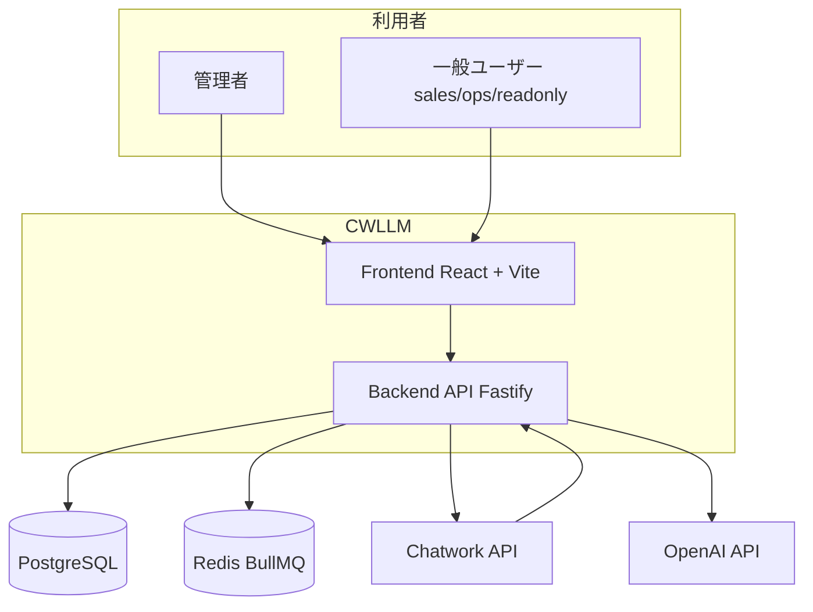

## C4 Container
**説明（一般）**: 主要な実行単位（UI/API/ワーカー/DB/キャッシュ）をまとめて示します。  
**このプロジェクトでは**: APIとBullMQワーカーがPostgreSQLとRedisを共有し、外部APIへアクセスします。
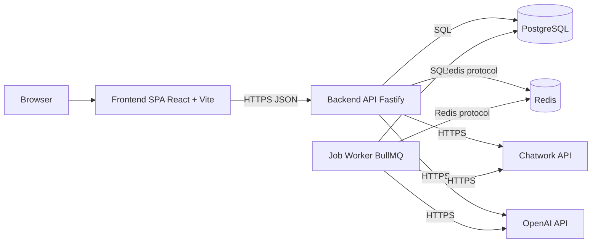

## バックエンド・コンポーネント図（UML Component 相当）
**説明（一般）**: バックエンド内部の構成要素と依存関係を示します。  
**このプロジェクトでは**: Routes→Handlers→Services→Prismaの流れで、同期/要約などの機能が実装されています。
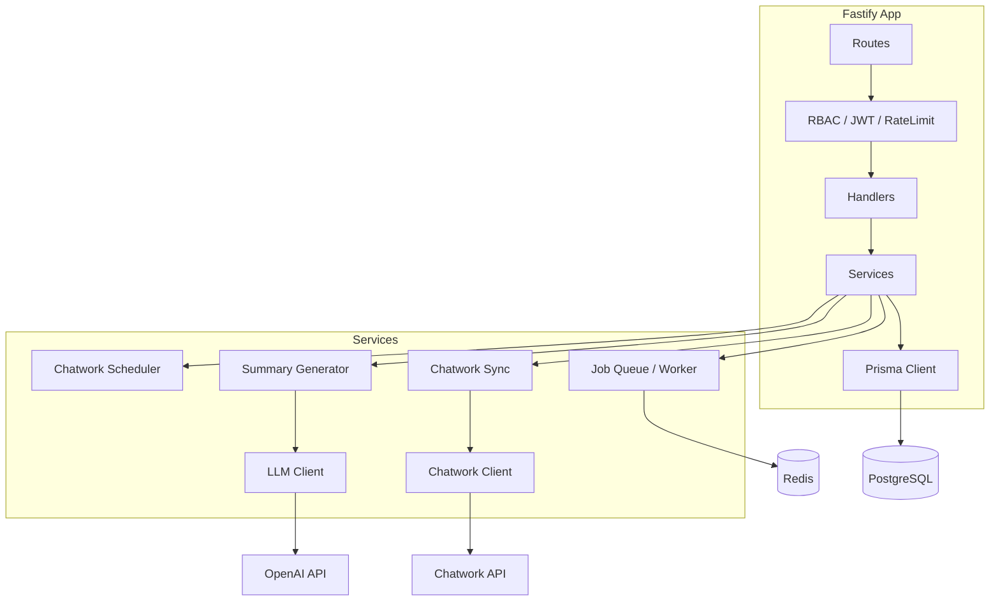

## 論理アーキテクチャ（層・責務）
**説明（一般）**: 層ごとの責務と依存方向を整理する図です。  
**このプロジェクトでは**: UI→API→Service→Infraの一方向で、DB/Redis/外部APIはInfra側に集約しています。
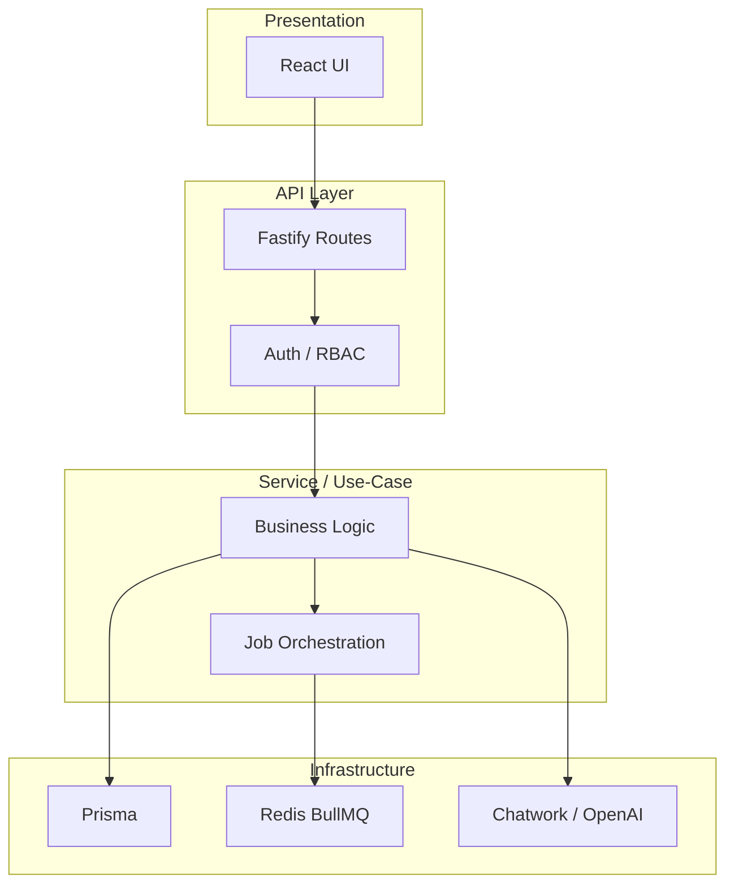

## 物理アーキテクチャ（Dev / Prod）
**説明（一般）**: 実行環境での配置（プロセス/コンテナ/サービス）を示します。  
**このプロジェクトでは**: 開発はVite+FastifyとDockerのDB/Redis、運用はRenderまたはDocker構成です。
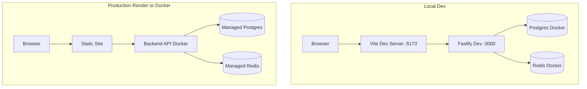

## ネットワーク構成 / トラフィックフロー
**説明（一般）**: リクエストの入口から内部・外部連携までの通信経路を示します。  
**このプロジェクトでは**: ブラウザ→フロント→API→DB/Redis→外部APIの流れになります。
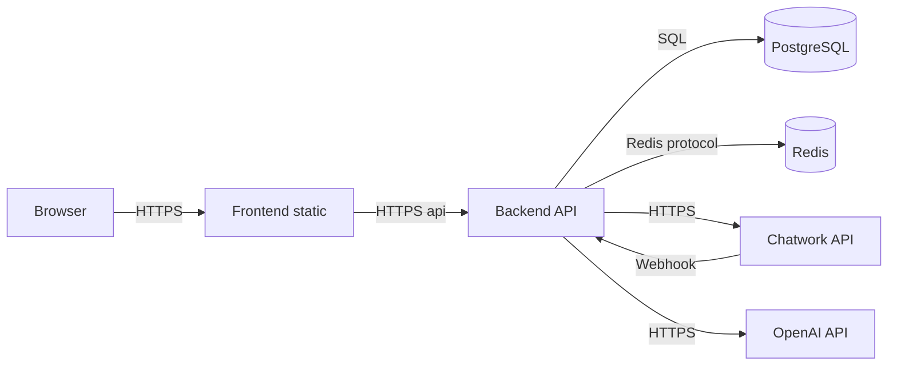

## 認証・認可境界（Trust Boundary）
**説明（一般）**: どこで認証・認可が行われるか、信頼境界を示す図です。  
**このプロジェクトでは**: JWT検証とRBACはバックエンド内で実施し、クライアントは未信頼前提です。
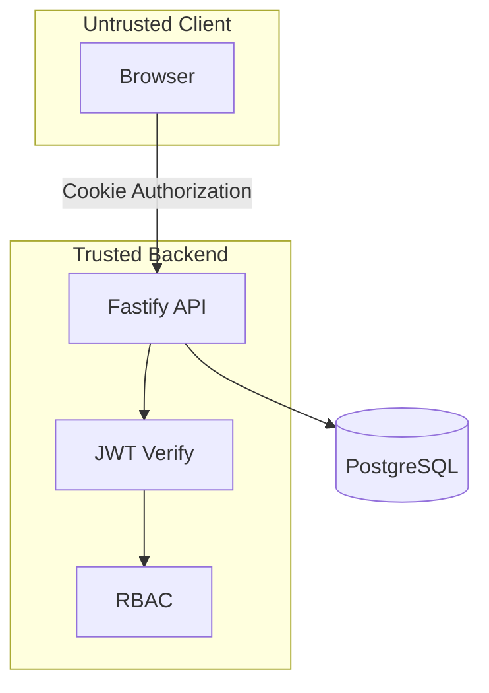

## ストレージ / キャッシュ配置
**説明（一般）**: データの保存先・キャッシュの配置を示します。  
**このプロジェクトでは**: フロントはuseFetchのメモリキャッシュ、バックはPostgreSQL/Redisを利用します。
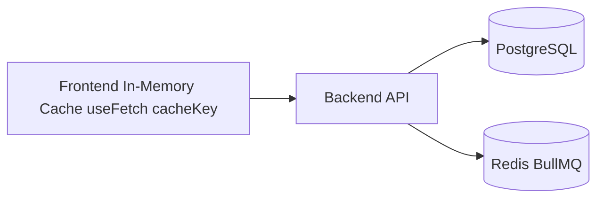

## ジョブ基盤 / イベント駆動の全体
**説明（一般）**: 非同期処理の流れとキュー/ワーカーの関係を示します。  
**このプロジェクトでは**: Chatwork同期や要約生成はジョブ化され、BullMQワーカーが処理します。
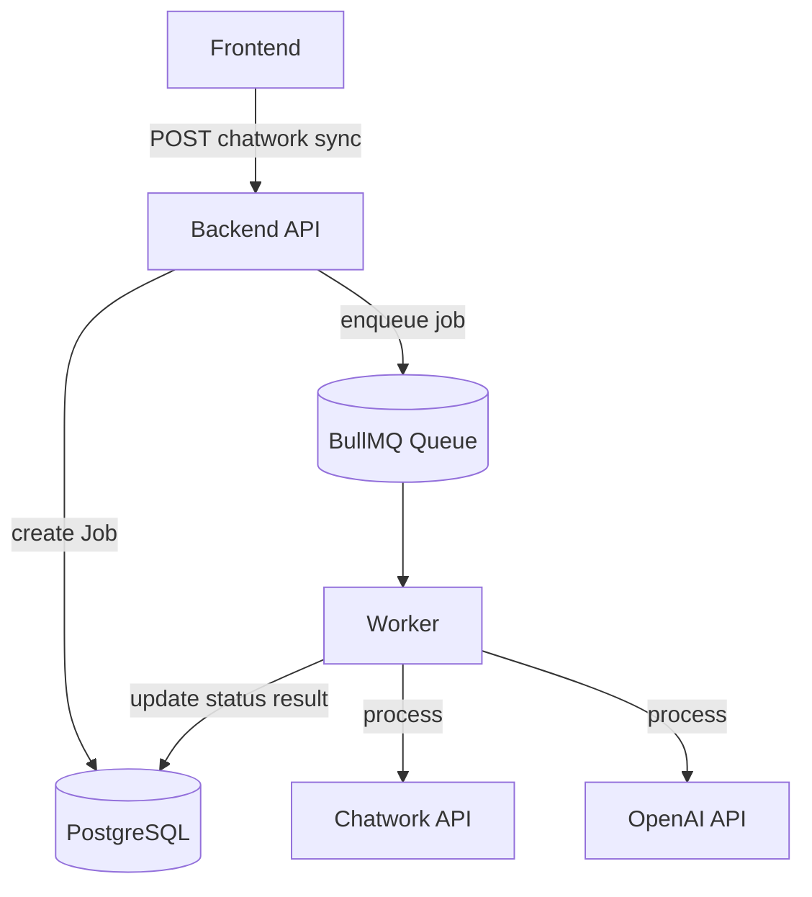

## 依存関係グラフ（モジュール依存）
**説明（一般）**: モジュール間の依存方向を俯瞰する図です。  
**このプロジェクトでは**: Routes/Handlers/Servicesが中心で、Prisma/Redis/外部APIへ依存します。
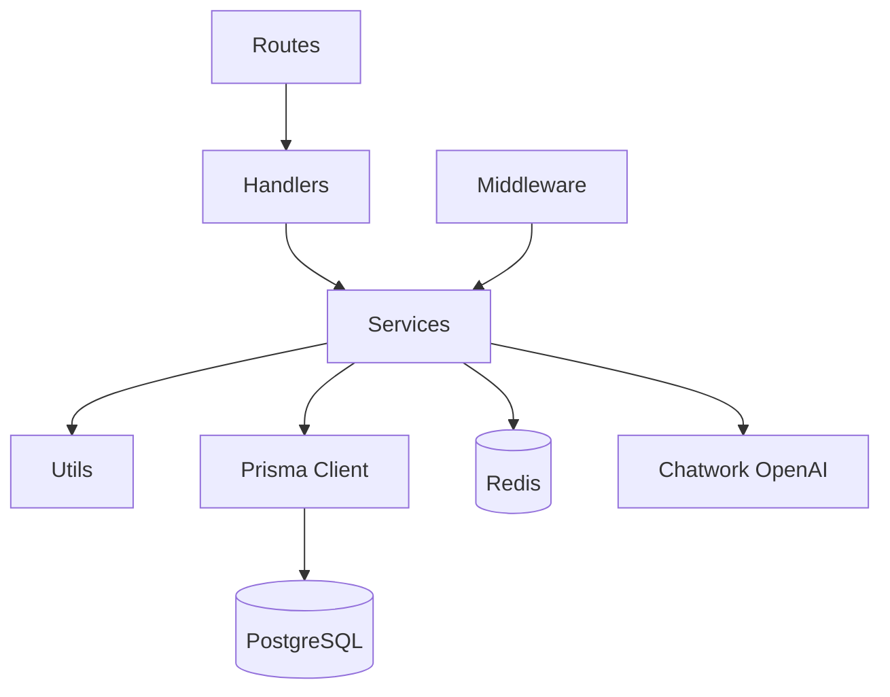

## モジュール構成（リポジトリ）
**説明（一般）**: リポジトリの主要ディレクトリ構成を示します。  
**このプロジェクトでは**: frontend/backend/infra/Docsに分割して責務を明確化しています。
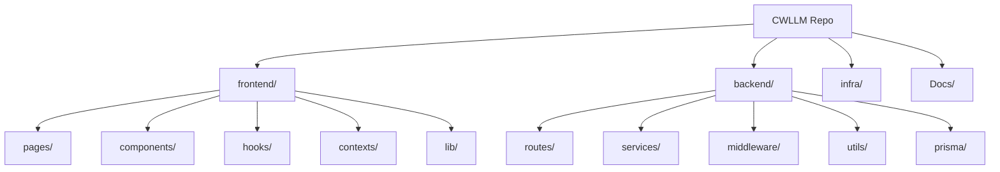

## レイヤー図（Presentation / Domain / Infra）
**説明（一般）**: プレゼンテーション/ドメイン/インフラの抽象層を示します。  
**このプロジェクトでは**: Routes/Servicesがドメイン相当、Prisma/Redis/外部APIがインフラ相当です。
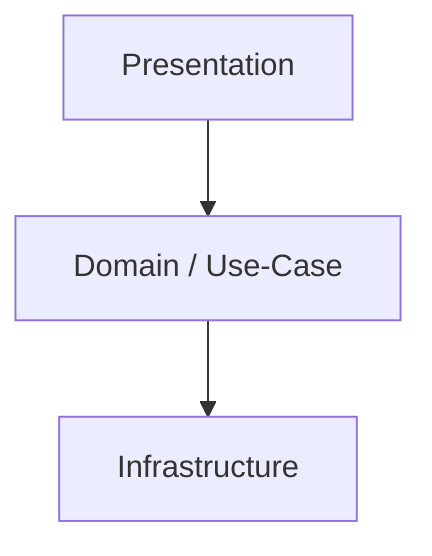

## Hexagonal（Ports & Adapters）
**説明（一般）**: コアと外部アダプタの境界を示す設計図です。  
**このプロジェクトでは**: InboundはHTTP/Scheduler、OutboundはDB/Redis/Chatwork/OpenAIです。
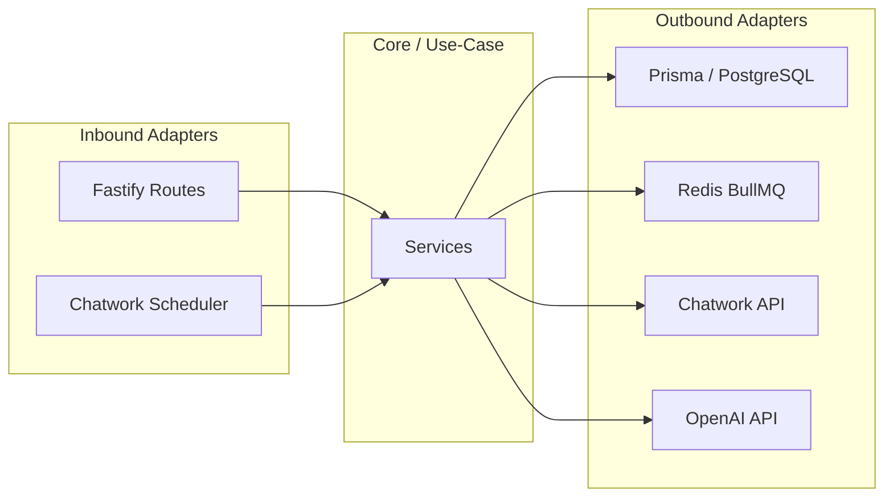

## DDD Context Map（境界づけ）
**説明（一般）**: 業務領域（コンテキスト）間の関係を示します。  
**このプロジェクトでは**: Companiesを中心にProjects/Wholesales/Tasksが連携します。
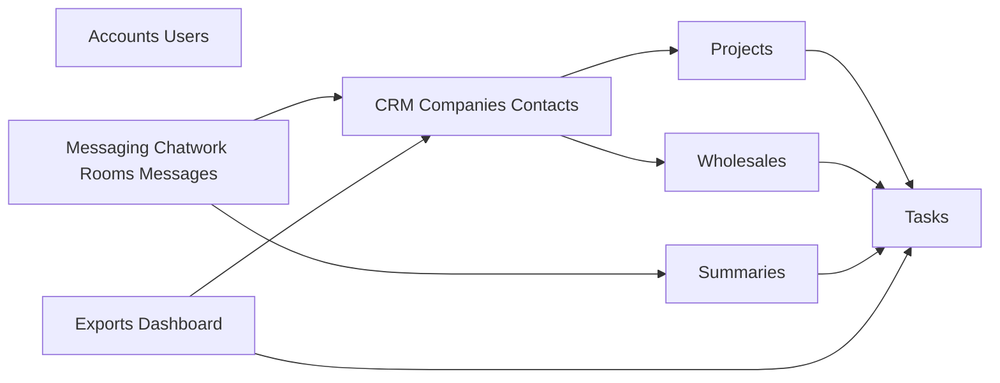

## 4+1 ビュー（対応表）
| View | 対応図 |
| --- | --- |
| Logical | 論理アーキテクチャ / レイヤー図 |
| Process | ジョブ基盤 / イベント駆動 / シーケンス |
| Development | モジュール構成 / 依存関係 |
| Physical | 物理アーキテクチャ / ネットワーク |
| Scenarios | シーケンス図（ログイン・同期・要約） |

## 責務分割（サマリ）
| 領域 | 主担当 | 役割 |
| --- | --- | --- |
| 画面/UI | Frontend | 画面表示、入力、API呼び出し |
| 認証/認可 | Backend | JWT発行、RBAC、アクセス制御 |
| 業務ロジック | Backend Services | 同期/要約/タスク化等 |
| 永続化 | PostgreSQL + Prisma | 主要データの永続化 |
| 非同期処理 | Redis + BullMQ | Chatwork同期・要約生成の実行 |
| 外部連携 | Chatwork/OpenAI | メッセージ取得・要約生成 |

---

# ふるまい / 処理フロー

## シーケンス：ログイン
**説明（一般）**: 画面操作からAPI応答までの手順と役割分担を示します。  
**このプロジェクトでは**: 認証成功時にJWTを発行し、Cookieに保存して以降のAPI認証に使います。
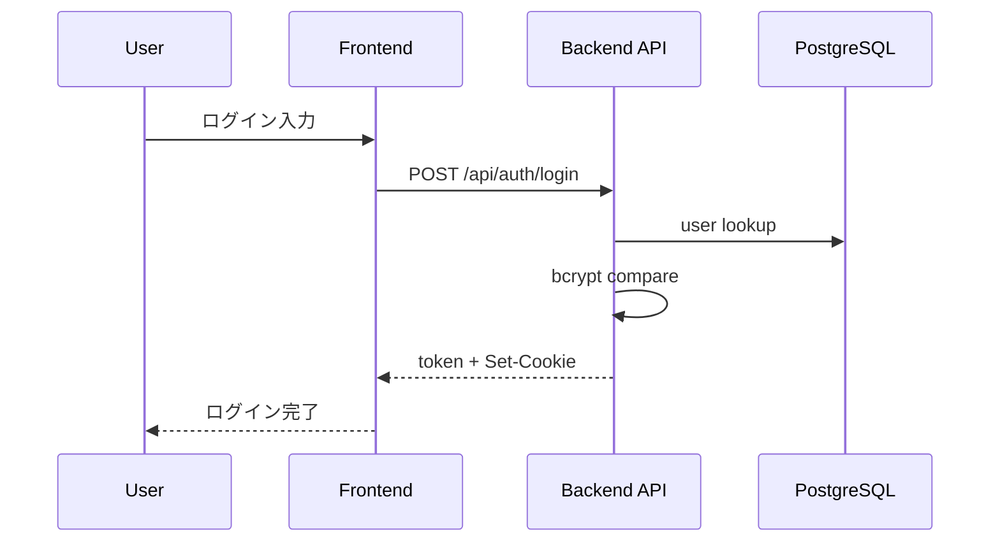

## シーケンス：Chatwork同期（管理者）
**説明（一般）**: 非同期ジョブの起動と処理の流れを示します。  
**このプロジェクトでは**: 管理者操作でジョブを作成し、BullMQワーカーが同期を実行します。
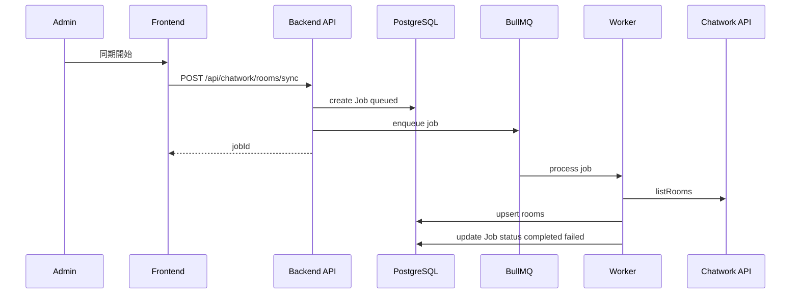

## シーケンス：要約ドラフト生成
**説明（一般）**: キャッシュ確認と非同期処理の分岐を示します。  
**このプロジェクトでは**: 期限内ドラフトがあれば即返し、なければジョブ経由で生成します。
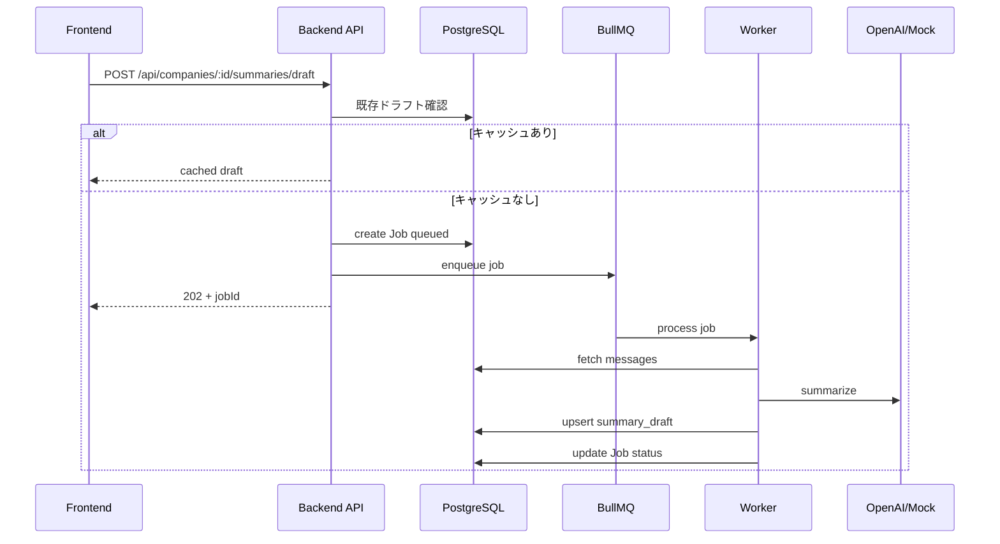

## アクティビティ：Chatworkメッセージ同期
**説明（一般）**: ループ処理や分岐を含む処理の流れを示します。  
**このプロジェクトでは**: ルームごとに取得・保存し、失敗時はエラー情報を記録します。
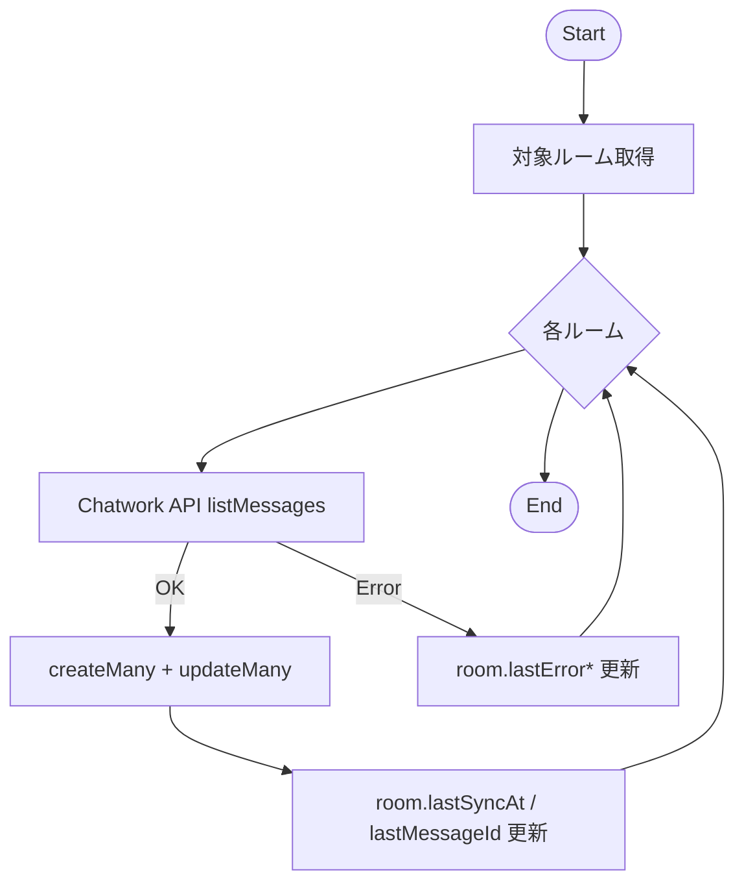

## ステートマシン：JobStatus
**説明（一般）**: ジョブの状態遷移を示します。  
**このプロジェクトでは**: DBの`jobs.status`がqueued→processing→completed/failed/canceledで更新されます。
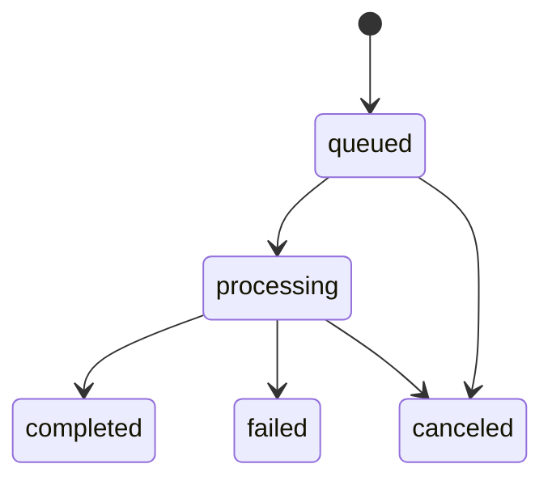

## ステートマシン：TaskStatus
**説明（一般）**: タスクの状態遷移を示します。  
**このプロジェクトでは**: todo/in_progress/done/cancelledを画面とAPIで管理します。
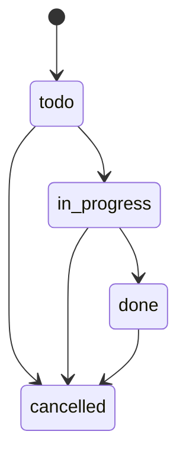

## タイミング：自動同期スケジュール
**説明（一般）**: 定期処理のタイミングを示します。  
**このプロジェクトでは**: 環境変数で設定した間隔でChatwork同期ジョブを投入します。
```mermaid
sequenceDiagram
  participant Scheduler as ChatworkScheduler
  participant API as Backend
  participant Q as BullMQ

  Note over Scheduler,API: env CHATWORK_AUTO_SYNC_INTERVAL_MINUTES
  loop every N minutes
    Scheduler->>API: enqueue rooms sync
    Scheduler->>API: enqueue messages sync
    API->>Q: add job
  end
```

## 相互作用概要（代表シナリオ）
**説明（一般）**: 代表的なユーザーフローを短くまとめた図です。  
**このプロジェクトでは**: ダッシュボードから会社詳細へ進み、同期や要約を実行します。
```mermaid
flowchart LR
  Login["ログイン"] --> Dashboard["ダッシュボード表示"]
  Dashboard --> Company["会社詳細"]
  Company --> Sync["Chatwork同期"]
  Company --> Draft["要約ドラフト生成"]
  Draft --> Tasks["タスク候補抽出"]
```

## 例外伝播（APIエラーハンドリング）
**説明（一般）**: 例外がどのように捕捉・整形されて返るかを示します。  
**このプロジェクトでは**: `setErrorHandler` と `normalizeErrorPayload` で共通形式に揃えます。
```mermaid
flowchart TD
  Request --> Handler
  Handler -->|throw or return| ErrorHandler["Fastify setErrorHandler"]
  ErrorHandler --> Normalize["normalizeErrorPayload"]
  Normalize --> Response["JSON Error Response"]
```

## リトライ / タイムアウト / サーキットブレーカ
**説明（一般）**: 外部API失敗時の再試行やタイムアウトの扱いを示します。  
**このプロジェクトでは**: Chatworkは簡易リトライ、OpenAIは失敗時にジョブ失敗として扱います。
```mermaid
flowchart TB
  ChatworkReq["Chatwork API Request"] -->|timeout 10s| Retry{"retry limit check"}
  Retry -->|yes default=1| ChatworkReq
  Retry -->|no| ChatworkErr["store error + job failed"]

  OpenAIReq["OpenAI Request"] -->|timeout 15s| LLMErr["error -> job failed"]
  JobQueue["Job Queue"] -->|attempts=1| NoRetry["No job retry"]
```

## 冪等性の設計（現状）
**説明（一般）**: 同じ操作を繰り返しても結果が崩れない工夫を示します。  
**このプロジェクトでは**: ユニーク制約と`upsert`で重複登録を避けます。
```mermaid
flowchart TB
  MsgSync["Message Sync"] --> Unique1["unique roomId messageId"]
  MsgSync --> CreateMany["createMany skipDuplicates"]
  Draft["Summary Draft"] --> Upsert["upsert companyId period"]
  CompanyLink["CompanyRoomLink"] --> Unique2["unique companyId chatworkRoomId"]
```

## 備考（未実装/非該当）
- 分散トランザクション / サガ：未実装
- 明示的ロック設計：未実装（DB制約に依存）
- サーキットブレーカ：未実装（簡易リトライのみ）

---

# データまわり

## ER 図（論理）
**説明（一般）**: データのエンティティと関係を俯瞰する図です。  
**このプロジェクトでは**: Companiesを中心にProjects/Wholesales/Tasks/Chatwork連携が繋がります。
```mermaid
erDiagram
  USER {
    string id PK
    string email
    string role
  }
  COMPANY {
    string id PK
    string name
    string normalizedName
    string ownerId FK
  }
  CONTACT {
    string id PK
    string companyId FK
    string name
  }
  PROJECT {
    string id PK
    string companyId FK
    string ownerId FK
    string status
  }
  WHOLESALE {
    string id PK
    string projectId FK
    string companyId FK
    string ownerId FK
    string status
  }
  CHATWORK_ROOM {
    string id PK
    string roomId UK
    boolean isActive
  }
  COMPANY_ROOM_LINK {
    string id PK
    string companyId FK
    string chatworkRoomId FK
  }
  MESSAGE {
    string id PK
    string chatworkRoomId FK
    string roomId
    string messageId
    string companyId FK
    string projectId FK
    string wholesaleId FK
  }
  SUMMARY {
    string id PK
    string companyId FK
    string type
  }
  SUMMARY_DRAFT {
    string id PK
    string companyId FK
  }
  TASK {
    string id PK
    string targetType
    string targetId
    string assigneeId FK
    string status
  }
  JOB {
    string id PK
    string type
    string status
    string userId FK
  }
  AUDIT_LOG {
    string id PK
    string entityType
    string entityId
  }
  APP_SETTING {
    string id PK
    string key UK
  }

  USER ||--o{ COMPANY : owns
  COMPANY ||--o{ CONTACT : has
  COMPANY ||--o{ PROJECT : has
  PROJECT ||--o{ WHOLESALE : has
  COMPANY ||--o{ WHOLESALE : has
  CHATWORK_ROOM ||--o{ MESSAGE : contains
  COMPANY ||--o{ MESSAGE : assigned
  PROJECT ||--o{ MESSAGE : assigned
  WHOLESALE ||--o{ MESSAGE : assigned
  COMPANY ||--o{ SUMMARY : has
  COMPANY ||--o{ SUMMARY_DRAFT : has
  COMPANY ||--o{ COMPANY_ROOM_LINK : links
  CHATWORK_ROOM ||--o{ COMPANY_ROOM_LINK : links
  USER ||--o{ TASK : assigned
  USER ||--o{ JOB : created
```

## データフロー（DFD レベル0）
**説明（一般）**: データがどこからどこへ流れるかを示します。  
**このプロジェクトでは**: フロント→API→DB/Redis→外部API（Chatwork/OpenAI）の流れです。
```mermaid
flowchart LR
  User[User] --> FE[Frontend]
  FE --> API[Backend API]
  API --> DB[(PostgreSQL)]
  API --> Redis["Redis/BullMQ"]
  API --> Chatwork[Chatwork API]
  API --> OpenAI[OpenAI API]
  Chatwork --> API
```

## イベント / ジョブスキーマ（現状）
| JobType | payload | 説明 |
| --- | --- | --- |
| `chatwork_rooms_sync` | `{}` | ルーム一覧同期 |
| `chatwork_messages_sync` | `{ roomId?: string, roomLimit?: number }` | メッセージ同期 |
| `summary_draft` | `{ companyId, periodStart, periodEnd }` | 要約ドラフト生成 |

## データ辞書（主要エンティティ）
| エンティティ | 主な項目 | 備考 |
| --- | --- | --- |
| User | `email`, `role`, `password` | 認証・権限 |
| Company | `name`, `normalizedName`, `status`, `tags` | CRM中心 |
| Contact | `companyId`, `name`, `role`, `email` | 会社連絡先 |
| Project | `companyId`, `name`, `status`, `periodStart/End` | 案件 |
| Wholesale | `projectId`, `companyId`, `status`, `margin` | 卸 |
| ChatworkRoom | `roomId`, `name`, `lastSyncAt`, `isActive` | 連携ルーム |
| Message | `roomId`, `messageId`, `sender`, `body`, `sentAt` | 連携メッセージ |
| Summary | `companyId`, `content`, `type` | 確定要約 |
| SummaryDraft | `companyId`, `content`, `expiresAt` | 自動生成 |
| Task | `targetType`, `targetId`, `assigneeId`, `status` | タスク |
| Job | `type`, `status`, `payload`, `result` | 非同期処理 |
| AuditLog | `entityType`, `entityId`, `action`, `changes` | 監査 |
| AppSetting | `key`, `value` | 設定 |

## CRUD マトリクス（主要）
| リソース | Create | Read | Update | Delete |
| --- | --- | --- | --- | --- |
| Users | ✅ | ✅ | ✅(role) | - |
| Companies | ✅ | ✅ | ✅ | ✅ |
| Contacts | ✅ | ✅ | ✅ | ✅ |
| Projects | ✅ | ✅ | ✅ | ✅ |
| Wholesales | ✅ | ✅ | ✅ | ✅ |
| Messages | - | ✅ | ✅(assign/labels) | - |
| Summaries | ✅ | ✅ | - | - |
| SummaryDraft | ✅(job) | ✅ | - | - |
| Tasks | ✅ | ✅ | ✅ | ✅ |
| Jobs | ✅(enqueue) | ✅ | ✅(cancel) | - |
| AuditLogs | - | ✅ | - | - |
| Settings | - | ✅ | ✅ | - |

## インデックス / 制約（抜粋）
| テーブル | インデックス / ユニーク |
| --- | --- |
| companies | `normalizedName` unique |
| contacts | `(companyId, sortOrder)` |
| projects | `(companyId)` |
| wholesales | `(companyId, projectId)` |
| chatwork_rooms | `roomId` unique |
| company_room_links | `(companyId, chatworkRoomId)` unique |
| messages | `unique(roomId, messageId)`, `(companyId)`, `(companyId, sentAt)` |
| summary_drafts | `unique(companyId, periodStart, periodEnd)`, `(companyId, periodStart, periodEnd)` |
| tasks | `(targetType, targetId)`, `(dueDate, status)`, `(assigneeId)` |
| jobs | `(type, status)`, `(createdAt)` |
| app_settings | `key` unique |

## キャッシュキー設計（フロント）
| キー | TTL | 説明 |
| --- | --- | --- |
| `cacheKey`（未指定時はURL） | `cacheTimeMs` | `useFetch` がメモリに保持 |

## 整合性モデル
- 主データ（PostgreSQL）：強整合
- 非同期処理（Job/Queue）：結果整合（ジョブ完了を待つ）
- 要約ドラフト：期限付きキャッシュ（`summary_drafts.expiresAt`）

## マイグレーション運用（現状）
| 環境 | コマンド | 備考 |
| --- | --- | --- |
| 開発 | `npm run migrate:dev` | Prisma migrate dev |
| 本番 | `npm run migrate:deploy` | Prisma migrate deploy |

---

# API / インターフェース

## API 一覧（主要）
### Auth
| Endpoint | Method | Auth | Role |
| --- | --- | --- | --- |
| `/api/auth/login` | POST | - | - |
| `/api/auth/logout` | POST | - | - |
| `/api/auth/me` | GET | ✅ | any |

### Users
| Endpoint | Method | Auth | Role |
| --- | --- | --- | --- |
| `/api/users` | GET | ✅ | admin |
| `/api/users` | POST | ✅ | admin |
| `/api/users/options` | GET | ✅ | any |
| `/api/users/:id/role` | PATCH | ✅ | admin |

### Companies / Contacts / Related
| Endpoint | Method | Auth | Role |
| --- | --- | --- | --- |
| `/api/companies` | GET | ✅ | any |
| `/api/companies` | POST | ✅ | admin/sales/ops |
| `/api/companies/:id` | GET | ✅ | any |
| `/api/companies/:id` | PATCH | ✅ | admin/sales/ops |
| `/api/companies/:id` | DELETE | ✅ | admin/sales/ops |
| `/api/companies/search` | GET | ✅ | any |
| `/api/companies/options` | GET | ✅ | any |
| `/api/companies/:id/contacts` | GET | ✅ | any |
| `/api/companies/:id/contacts` | POST | ✅ | admin/sales/ops |
| `/api/companies/:id/contacts/reorder` | PATCH | ✅ | admin/sales/ops |
| `/api/contacts/:id` | PATCH | ✅ | admin/sales/ops |
| `/api/contacts/:id` | DELETE | ✅ | admin/sales/ops |
| `/api/companies/:id/projects` | GET | ✅ | any |
| `/api/companies/:id/wholesales` | GET | ✅ | any |
| `/api/companies/:id/tasks` | GET | ✅ | any |
| `/api/companies/:id/messages` | GET | ✅ | any |
| `/api/companies/:id/summaries` | GET | ✅ | any |
| `/api/companies/:id/summaries` | POST | ✅ | admin/sales/ops |
| `/api/companies/:id/summaries/draft` | POST | ✅ | admin/sales/ops |

### Projects / Wholesales
| Endpoint | Method | Auth | Role |
| --- | --- | --- | --- |
| `/api/projects` | GET | ✅ | any |
| `/api/projects` | POST | ✅ | admin/sales/ops |
| `/api/projects/:id` | GET | ✅ | any |
| `/api/projects/:id` | PATCH | ✅ | admin/sales/ops |
| `/api/projects/:id` | DELETE | ✅ | admin/sales/ops |
| `/api/projects/search` | GET | ✅ | any |
| `/api/projects/:id/wholesales` | GET | ✅ | any |
| `/api/projects/:id/tasks` | GET | ✅ | any |
| `/api/wholesales` | GET | ✅ | any |
| `/api/wholesales` | POST | ✅ | admin/sales/ops |
| `/api/wholesales/:id` | GET | ✅ | any |
| `/api/wholesales/:id` | PATCH | ✅ | admin/sales/ops |
| `/api/wholesales/:id` | DELETE | ✅ | admin/sales/ops |
| `/api/wholesales/:id/tasks` | GET | ✅ | any |

### Messages
| Endpoint | Method | Auth | Role |
| --- | --- | --- | --- |
| `/api/messages/search` | GET | ✅ | any |
| `/api/messages/unassigned` | GET | ✅ | any |
| `/api/messages/:id/assign-company` | PATCH | ✅ | admin/sales/ops |
| `/api/messages/assign-company` | PATCH | ✅ | admin/sales/ops |
| `/api/messages/:id/labels` | POST | ✅ | admin/sales/ops |
| `/api/messages/:id/labels/:label` | DELETE | ✅ | admin/sales/ops |
| `/api/messages/labels` | GET | ✅ | any |
| `/api/messages/labels/bulk` | POST | ✅ | admin/sales/ops |
| `/api/messages/labels/bulk/remove` | POST | ✅ | admin/sales/ops |

### Tasks
| Endpoint | Method | Auth | Role |
| --- | --- | --- | --- |
| `/api/tasks` | GET | ✅ | any |
| `/api/tasks` | POST | ✅ | admin/sales/ops |
| `/api/tasks/:id` | GET | ✅ | any |
| `/api/tasks/:id` | PATCH | ✅ | admin/sales/ops |
| `/api/tasks/:id` | DELETE | ✅ | admin/sales/ops |
| `/api/tasks/bulk` | PATCH | ✅ | admin/sales/ops |
| `/api/me/tasks` | GET | ✅ | any |

### Jobs / Summaries
| Endpoint | Method | Auth | Role |
| --- | --- | --- | --- |
| `/api/jobs` | GET | ✅ | any |
| `/api/jobs/:id` | GET | ✅ | any |
| `/api/jobs/:id/cancel` | POST | ✅ | any |
| `/api/summaries/:id/tasks/candidates` | POST | ✅ | any |

### Chatwork
| Endpoint | Method | Auth | Role |
| --- | --- | --- | --- |
| `/api/chatwork/rooms` | GET | ✅ | admin |
| `/api/chatwork/rooms/sync` | POST | ✅ | admin |
| `/api/chatwork/rooms/:id` | PATCH | ✅ | admin |
| `/api/chatwork/messages/sync` | POST | ✅ | admin |
| `/api/chatwork/webhook` | POST | - | - |
| `/api/companies/:id/chatwork-rooms` | GET | ✅ | any |
| `/api/companies/:id/chatwork-rooms` | POST | ✅ | admin/sales/ops |
| `/api/companies/:id/chatwork-rooms/:roomId` | DELETE | ✅ | admin/sales/ops |

### Dashboard / Settings / Export / Audit / Search
| Endpoint | Method | Auth | Role |
| --- | --- | --- | --- |
| `/api/dashboard` | GET | ✅ | any |
| `/api/settings` | GET | ✅ | admin |
| `/api/settings` | PATCH | ✅ | admin |
| `/api/export/companies.csv` | GET | ✅ | admin |
| `/api/export/tasks.csv` | GET | ✅ | admin |
| `/api/audit-logs` | GET | ✅ | any |
| `/api/search` | GET | ✅ | any |

### Health
| Endpoint | Method | Auth | Role |
| --- | --- | --- | --- |
| `/healthz` | GET | - | - |

## 認証フロー
**説明（一般）**: ログインから認証済みAPI利用までの流れを示します。  
**このプロジェクトでは**: ログインでJWTを発行し、Cookie/Authorizationで`/api/auth/me`にアクセスします。
```mermaid
sequenceDiagram
  participant FE as Frontend
  participant API as Backend
  participant DB as PostgreSQL

  FE->>API: POST /api/auth/login
  API->>DB: find user
  API-->>FE: token + Set-Cookie
  FE->>API: GET /api/auth/me (Cookie/Authorization)
  API-->>FE: user
  FE->>API: POST /api/auth/logout
  API-->>FE: clear cookie
```

## ステータス / エラーコード一覧
| HTTP | Code | 説明 |
| --- | --- | --- |
| 400 | `BAD_REQUEST` | 入力不正 |
| 401 | `UNAUTHORIZED` | 認証失敗 |
| 403 | `FORBIDDEN` | 権限不足 |
| 404 | `NOT_FOUND` | リソース不在 |
| 409 | `CONFLICT` | 競合 |
| 422 | `VALIDATION_ERROR` | バリデーション |
| 429 | `TOO_MANY_REQUESTS` | レート制限 |
| 500 | `INTERNAL_SERVER_ERROR` | 予期しないエラー |

Prisma 例外マッピング（例）:
- `P2025` → 404
- `P2002` → 409
- `P2003` → 400

## レート制限
| 対象 | 設定 | 由来 |
| --- | --- | --- |
| `/api/auth/login` | `RATE_LIMIT_MAX` / `RATE_LIMIT_WINDOW_MS` | Fastify rate-limit |
| Chatwork API | 5分300回相当の間隔制御 | クライアント内部制御 |

## ページング / フィルタ / ソート（クエリあり）
対象: `/api/companies`, `/api/projects`, `/api/wholesales`, `/api/tasks`, `/api/messages/*`, `/api/jobs`, `/api/audit-logs`, `/api/export/*`

## バージョニング方針
- 現状は `/api` で固定（バージョン無し）

## Webhook イベント
| 送信元 | 受信エンドポイント | 認証 |
| --- | --- | --- |
| Chatwork | `/api/chatwork/webhook` | `CHATWORK_WEBHOOK_TOKEN` |

## 非同期 API（ジョブ）
**説明（一般）**: ジョブを使う非同期APIの流れを示します。  
**このプロジェクトでは**: APIが`jobs`を作成し、BullMQワーカーが処理して結果をDBに反映します。
```mermaid
flowchart LR
  API[Backend API] --> DB[(jobs)]
  API --> Queue[(BullMQ)]
  Queue --> Worker[Worker]
  Worker --> DB
```

## OpenAPI / Swagger
- `/api/docs` で Swagger UI を提供

## 外部連携の契約（概要）
| 連携先 | 用途 | エンドポイント |
| --- | --- | --- |
| Chatwork API | ルーム/メッセージ取得 | `https://api.chatwork.com/v2` |
| OpenAI API | 要約生成 | `https://api.openai.com/v1/chat/completions` |

---

# フロントエンド / 画面まわり

## サイトマップ
**説明（一般）**: 画面構成を一覧で示す図です。  
**このプロジェクトでは**: 主要リソース（Companies/Tasks/Projects/Wholesales）と設定系画面に分かれます。
```mermaid
flowchart TB
  Root["/"]
  Login["/login"]
  NotFound["*"]
  Companies["/companies"]
  CompanyDetail["/companies/:id"]
  Tasks["/tasks"]
  TaskDetail["/tasks/:id"]
  Projects["/projects"]
  ProjectDetail["/projects/:id"]
  Wholesales["/wholesales"]
  WholesaleDetail["/wholesales/:id"]
  Settings["/settings"]
  Accounts["/settings/accounts"]
  ChatworkSettings["/settings/chatwork"]
  Exports["/exports"]

  Root --> Companies
  Root --> Tasks
  Root --> Projects
  Root --> Wholesales
  Root --> Settings
  Settings --> Accounts
  Settings --> ChatworkSettings
  Settings --> Exports
  Companies --> CompanyDetail
  Tasks --> TaskDetail
  Projects --> ProjectDetail
  Wholesales --> WholesaleDetail
  Login --> Root
  Root --> NotFound
```

## 画面遷移（概要）
**説明（一般）**: 代表的な画面遷移の流れを示します。  
**このプロジェクトでは**: ダッシュボードを起点に詳細画面や設定画面へ移動します。
```mermaid
flowchart LR
  Login[Login] --> Home[Dashboard]
  Home --> Companies
  Home --> Tasks
  Home --> Projects
  Home --> Wholesales
  Companies --> CompanyDetail
  Projects --> ProjectDetail
  Wholesales --> WholesaleDetail
  Settings --> Accounts
  Settings --> ChatworkSettings
  Settings --> Exports
```

## コンポーネントツリー（主要）
**説明（一般）**: UIの親子関係と責務の分担を示します。  
**このプロジェクトでは**: `App` → `AuthProvider` → `ProtectedRoute` → `Layout` → 各ページの構成です。
```mermaid
flowchart TB
  App --> AuthProvider
  AuthProvider --> Routes
  Routes --> ProtectedRoute
  ProtectedRoute --> Layout
  Layout --> Pages[Pages]
  Pages --> Components[UI Components]
```

## 状態管理（現状）
**説明（一般）**: 状態の置き場所と伝播のしかたを示します。  
**このプロジェクトでは**: 認証はContext、データ取得は`useFetch`とメモリキャッシュで管理します。
```mermaid
flowchart LR
  AuthContext["AuthContext user role"] --> ProtectedRoute2[ProtectedRoute]
  LocalState["local state useState"] --> Pages2[Pages]
  useFetch["useFetch/useMutation"] --> apiRequest[apiRequest]
  apiRequest --> BackendAPI["Backend API"]
  useFetch --> Cache["In-memory cache"]
```

## データ取得フロー
**説明（一般）**: 画面がAPIからデータを取得する流れを示します。  
**このプロジェクトでは**: `useFetch` → `apiRequest` → `fetch` → API の順で呼び出します。
```mermaid
flowchart LR
  Component --> useFetch
  useFetch --> apiRequest
  apiRequest --> fetch[fetch API]
  fetch --> BackendAPI
  BackendAPI --> useFetch
  useFetch --> Component
```

## UI 状態遷移
**説明（一般）**: 読み込み/成功/空/エラーなどのUI状態を示します。  
**このプロジェクトでは**: `useFetch`の状態に合わせてローディングやエラー表示を切り替えます。
```mermaid
stateDiagram-v2
  [*] --> idle
  idle --> loading : fetch
  loading --> success : data
  loading --> empty : no data
  loading --> error : error
  error --> loading : retry
```

## フォーム / バリデーション（概要）
| 画面 | 入力 | バリデーション |
| --- | --- | --- |
| Login | email/password | サーバ側(Zod)で検証、クライアントは最小限 |
| Company/Project/Task | 各種項目 | サーバ側(Zod)で検証 |

## アクセシビリティ（未監査・チェックリスト）
- キーボード操作で主要導線が操作可能
- フォーカスリングが視認できる
- 主要ボタンに `aria-label` が付与されている
- コントラスト比が確保されている

## i18n / デザイントークン
- i18n: 未導入（日本語固定）
- デザイントークン: 未導入（Tailwindユーティリティ中心）

---

# 実装設計 / 規約

## クラス図（主要コンポーネント）
**説明（一般）**: 主要クラス/インタフェースの関係を示します。  
**このプロジェクトでは**: `LLMClient`がOpenAI/Mockで切替可能、ジョブが同期/要約を呼び出します。
```mermaid
classDiagram
  class LLMClient {
    +summarize(messages)
  }
  class OpenAILLMClient
  class MockLLMClient
  LLMClient <|.. OpenAILLMClient
  LLMClient <|.. MockLLMClient

  class ChatworkClient {
    +listRooms()
    +listMessages(roomId, force)
  }

  class JobQueue {
    +enqueueJob(type, payload, userId)
    +cancelJob(jobId)
  }

  class ChatworkSync {
    +syncChatworkRooms()
    +syncChatworkMessages()
  }

  class SummaryGenerator {
    +generateSummaryDraft(companyId, periodStart, periodEnd)
  }

  SummaryGenerator --> LLMClient
  ChatworkSync --> ChatworkClient
  JobQueue --> ChatworkSync
  JobQueue --> SummaryGenerator
```

## インタフェース契約（抜粋）
| インタフェース | 入力 | 出力 |
| --- | --- | --- |
| `LLMClient.summarize` | `LLMInputMessage[]` | `LLMResult` |
| `ChatworkClient.listRooms` | - | `ChatworkRoom[]` |
| `ChatworkClient.listMessages` | `roomId`, `force` | `ChatworkMessage[]` |
| `enqueueSummaryDraftJob` | `companyId, periodStart, periodEnd` | `Job` |
| `cancelJob` | `jobId` | `Job` |

## 例外設計
| 種別 | 発生源 | 扱い |
| --- | --- | --- |
| `ChatworkApiError` | Chatwork API | ルームにエラー記録、ジョブ失敗 |
| `JobCanceledError` | Job処理 | `canceled` で終了 |
| API Error Payload | API | `buildErrorPayload` に統一 |

## エラーメッセージ規約
```json
{
  "error": {
    "code": "BAD_REQUEST",
    "message": "Invalid period",
    "details": {}
  }
}
```

## ログ設計（API）
| フィールド | 内容 |
| --- | --- |
| `requestId` | `x-request-id` |
| `method` | HTTPメソッド |
| `url` | リクエストURL |
| `statusCode` | ステータス |
| `userId` / `role` | JWT由来 |

## 設定項目（環境変数）
`NODE_ENV`, `PORT`, `BACKEND_PORT`, `JWT_SECRET`, `CORS_ORIGINS`,  
`RATE_LIMIT_MAX`, `RATE_LIMIT_WINDOW_MS`, `TRUST_PROXY`,  
`CHATWORK_API_TOKEN`, `CHATWORK_API_BASE_URL`, `CHATWORK_AUTO_SYNC_ENABLED`,  
`CHATWORK_AUTO_SYNC_INTERVAL_MINUTES`, `CHATWORK_AUTO_SYNC_ROOM_LIMIT`,  
`CHATWORK_NEW_ROOMS_ACTIVE`, `CHATWORK_WEBHOOK_TOKEN`,  
`CHATWORK_WEBHOOK_COOLDOWN_SECONDS`,  
`OPENAI_API_KEY`, `OPENAI_MODEL`, `REDIS_URL`, `JOB_WORKER_ENABLED`

## Feature Flags（実質）
| 変数 | 目的 |
| --- | --- |
| `CHATWORK_AUTO_SYNC_ENABLED` | 自動同期ON/OFF |
| `JOB_WORKER_ENABLED` | Worker有効化 |
| `CHATWORK_NEW_ROOMS_ACTIVE` | 新規ルームの初期Active |

## 依存ライブラリ（主要）
### Backend
- Fastify / Prisma / BullMQ / Redis / Zod / bcryptjs
- OpenAI 呼び出し（標準 fetch）

### Frontend
- React / React Router
- Tailwind CSS + clsx / tailwind-merge
- @dnd-kit（D&D UI）

## ADR
- まだ管理されていません（追加する場合は `Docs/ADR/` 推奨）

---

# テスト / 品質

## テスト戦略（俯瞰）
**説明（一般）**: どのレイヤーで何をテストするかの全体像です。  
**このプロジェクトでは**: Front/BackのユニットテストとPlaywright E2Eを併用します。
```mermaid
flowchart TB
  UnitFE[Frontend Unit (Vitest)]
  UnitBE[Backend Unit (Vitest)]
  E2E[Playwright E2E]
  UnitFE --> E2E
  UnitBE --> E2E
```

## テストピラミッド
**説明（一般）**: ユニット→統合→E2Eの比率を示す考え方です。  
**このプロジェクトでは**: ユニット中心で、重要フローをE2Eで補強します。
```mermaid
flowchart TB
  E2E2[E2E]
  Integration[Integration/API]
  Unit[Unit]
  Unit --> Integration --> E2E2
```

## テスト計画（現状）
| 種別 | 目的 | コマンド |
| --- | --- | --- |
| Frontend Unit | コンポーネント/フック | `cd frontend && npm run test` |
| Backend Unit | ルート/サービス | `cd backend && npm run test` |
| E2E | UI一連動作 | `cd frontend && npm run test:e2e` |

## 環境マトリクス（現状）
| 環境 | OS | ブラウザ |
| --- | --- | --- |
| ローカル | Windows/macOS/Linux | Playwright (Chromium) |
| CI | Ubuntu | Playwright (デフォルト) |

## モック / スタブ方針
- 外部API（Chatwork/OpenAI）は必要に応じてモック
- ユニットテストはDB依存を減らす

## 品質ゲート（CI）
| 対象 | 実行 |
| --- | --- |
| Backend | lint → build → test |
| Frontend | lint → typecheck → test → build |

---

# CI/CD / リリース

## CI パイプライン
**説明（一般）**: ビルドやテストの自動実行の流れを示します。  
**このプロジェクトでは**: Front/Backを分けて lint → build → test を回します。
```mermaid
flowchart LR
  subgraph Backend
    B1[checkout] --> B2[setup node] --> B3[npm ci] --> B4[lint] --> B5[build] --> B6[test]
  end
  subgraph Frontend
    F1[checkout] --> F2[setup node] --> F3[npm ci] --> F4[lint] --> F5[typecheck] --> F6[test] --> F7[build]
  end
```

## CD / デプロイフロー（現状）
**説明（一般）**: リリースまでの流れを示します。  
**このプロジェクトでは**: Docker/Staticのビルド後にRenderまたはComposeでデプロイします。
```mermaid
flowchart LR
  Push[Push/Tag] --> Build[Build Docker/Static]
  Build --> Deploy[Deploy (Render or Docker Compose)]
```

## 環境一覧
| 環境 | 構成 |
| --- | --- |
| Dev | ローカル (Vite + Fastify + Docker DB/Redis) |
| Prod | Render or Docker Compose (docker-compose.prod.yml) |

## ロールバック（方針）
- Docker Compose: 前のイメージで再起動
- Render: 直前のデプロイに戻す（ダッシュボード操作）

---

# 運用 / 監視 / インシデント

## 監視（現状）
| 項目 | 取得方法 |
| --- | --- |
| ヘルスチェック | `/healthz` |
| アプリログ | Fastify logger |
| ジョブログ | Job status / error in DB |

## SLI / SLO（未定義）
| 指標 | 目標 | 備考 |
| --- | --- | --- |
| API成功率 | TBD | 未定義 |
| レイテンシ | TBD | 未定義 |

## アラートルール（未定義）
- 監視基盤の整備後に設定

## Runbook（最小）
1. `/healthz` を確認
2. アプリログ（requestId）を確認
3. DB/Redis の疎通確認
4. 必要に応じて再起動

## インシデントタイムライン（テンプレ）
| 時刻 | 事象 | 対応 | 影響 |
| --- | --- | --- | --- |

## バックアップ / リストア
**説明（一般）**: バックアップ取得と復元の基本的な流れを示します。  
**このプロジェクトでは**: `pg_dump`/`pg_restore`（またはスクリプト）でPostgreSQLを扱います。
```mermaid
flowchart LR
  DB[(PostgreSQL)] -->|pg_dump| Backup[backup.dump]
  Backup -->|pg_restore| DB
```

## 依存先サービス一覧
| サービス | 用途 | 備考 |
| --- | --- | --- |
| Chatwork API | メッセージ/ルーム取得 | 外部 |
| OpenAI API | 要約生成 | 外部 |
| PostgreSQL | 主DB | Render / Docker |
| Redis | Job Queue | Render / Docker |

---

# セキュリティ

## 脅威モデリング（DFD + Trust Boundary）
**説明（一般）**: データの流れと信頼境界を可視化して脅威を洗い出します。  
**このプロジェクトでは**: ブラウザは未信頼、バックエンドが認証/認可と外部API連携の中心です。
```mermaid
flowchart TB
  subgraph Client[Untrusted]
    Browser[Browser]
  end
  subgraph Server[Trusted]
    API[Backend API]
    DB[(PostgreSQL)]
    Redis[(Redis)]
  end
  External["External APIs Chatwork OpenAI"]

  Browser -->|HTTPS| API
  API --> DB
  API --> Redis
  API -->|HTTPS| External
  External --> API
```

## STRIDE（現状の対策）
| 脅威 | 対応 |
| --- | --- |
| Spoofing | JWT + RBAC |
| Tampering | DB制約 / 監査ログ |
| Repudiation | AuditLog |
| Information Disclosure | Cookie `httpOnly`, `secure`(prod) |
| Denial of Service | rate-limit (login) |
| Elevation of Privilege | `requireAdmin` / `requireWriteAccess` |

## 権限マトリクス（概略）
| 役割 | 読み取り | 書き込み | 管理 |
| --- | --- | --- | --- |
| admin | ✅ | ✅ | ✅ |
| sales | ✅ | ✅ | - |
| ops | ✅ | ✅ | - |
| readonly | ✅ | - | - |

## 秘密情報の取り扱いフロー
**説明（一般）**: 秘密情報がどこで利用されるかを示します。  
**このプロジェクトでは**: `.env`/環境変数から取得し、Chatwork/OpenAIの認証ヘッダで使います。
```mermaid
flowchart LR
  Env[".env / Render Env"] --> Backend["Backend Process"]
  Backend -->|Authorization: Bearer| OpenAI["OpenAI API"]
  Backend -->|x-chatworktoken| Chatwork["Chatwork API"]
```

## 暗号化
- パスワード: bcrypt ハッシュ
- 通信: HTTPS（デプロイ環境に依存）
- Cookie: `httpOnly`, `secure`(production)

## 監査ログ設計
| 項目 | 内容 |
| --- | --- |
| entityType / entityId | 対象 |
| action | create/update/delete |
| changes | before/after |
| userId | 操作者 |

## SBOM（依存一覧）
- `frontend/package.json`
- `backend/package.json`

## セキュリティテスト計画（現状）
| 種別 | 実施 |
| --- | --- |
| SAST | 未導入 |
| DAST | 未導入 |
| 手動レビュー | 適宜 |
