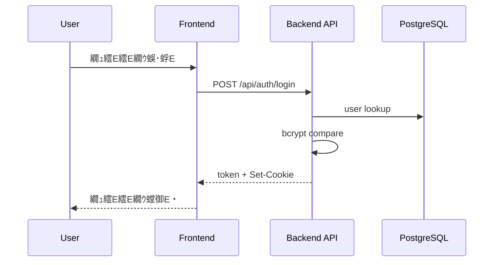
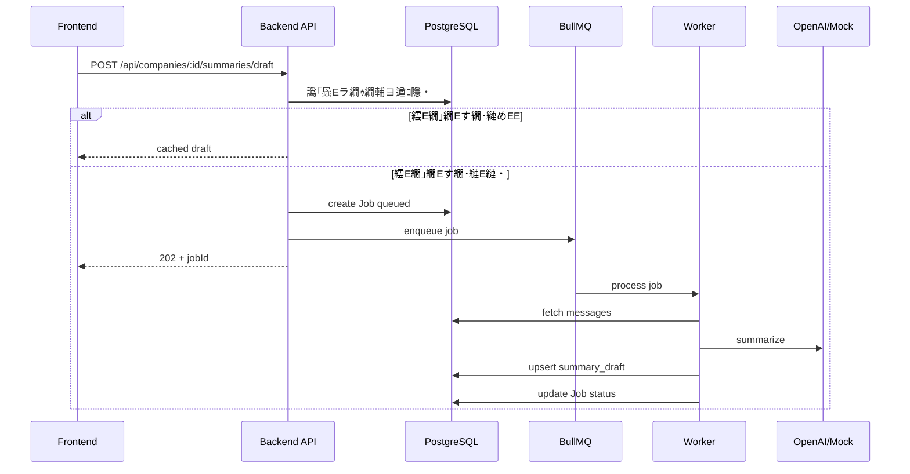

# 蝗ｳ陦E・亥・菴薙∪縺E繧・E・

> 逕滓E蜈E Docs/diagrams/*.md

---

# 繧E繝ｼ繧E繝Eけ繝E΁E/ 讒矩€E

## 繧E繧E繝EΒ繧E繝ｳ繝Eく繧E繝茨E・4 Context・・
**隱E譏趣E井ｸ€闊ｬ・・*: 蛻E逕ｨ閠・・螟夜Κ繧E繧E繝EΒ繝ｻ閾E繧E繧E繝EΒ縺E髢E菫めEE蠁EE阜繧偵E縺E縺上ｊ謗ｴ繧€蝗ｳ縺E縺吶€・ 
**縺薙E繝励Ο繧E繧E繧E繝医〒縺E**: 繝悶Λ繧E繧E蛻E逕ｨ閠・′繝輔Ο繝ｳ繝育E檎罰縺EAPI繧剁EE縺・€Ehatwork/OpenAI縺E騾E謳E縺励∪縺吶€・
```mermaid
flowchart TB
  subgraph Users[蛻E逕ｨ閠・
    Admin[邂｡送EE€・
    Staff["荳€闊ｬ繝ｦ繝ｼ繧E繝ｼ employee"]
  end

  subgraph System[CWLLM]
    FE["Frontend React + Vite"]
    BE["Backend API Fastify"]
  end

  DB[(PostgreSQL)]
  Redis[(Redis BullMQ)]
  Chatwork[Chatwork API]
  OpenAI[OpenAI API]

  Admin --> FE
  Staff --> FE
  FE --> BE
  BE --> DB
  BE --> Redis
  BE --> Chatwork
  BE --> OpenAI
  Chatwork --> BE
```

## C4 Container
**隱E譏趣E井ｸ€闊ｬ・・*: 荳E隕E↑螳溯E悟E菴搾E・I/API/繝ｯ繝ｼ繧E繝ｼ/DB/繧E繝｣繝Eす繝･・峨E縺E縺E繧√※遉ｺ縺励∪縺吶€・ 
**縺薙E繝励Ο繧E繧E繧E繝医〒縺E**: API縺EBullMQ繝ｯ繝ｼ繧E繝ｼ縺訓ostgreSQL縺ERedis繧貞E譛峨E縲∝､夜ΚAPI縺E繧E繧E繧E繧E縺励∪縺吶€・


## 繝Eャ繧E繧E繝ｳ繝峨・繧E繝ｳ繝昴・繝阪Φ繝亥峙E・ML Component 逶E蠖難E・
**隱E譏趣E井ｸ€闊ｬ・・*: 繝Eャ繧E繧E繝ｳ繝牙・驛ｨ縺E讒区・隕∫EE縺E萓晏E倬未菫めE遉E縺励∪縺吶€・ 
**縺薙E繝励Ο繧E繧E繧E繝医〒縺E**: Routes竊辿andlers竊担ervices竊単risma縺E豬√ｌ縺E縲∝E譛E隕∫E・↑縺E縺E讖溯・縺悟ｮ溯E・EE後※縺・∪縺吶€・


## 隲也炊繧E繝ｼ繧E繝Eけ繝EΕE亥EE繝ｻ雋ｬ蜍呻E・
**隱E譏趣E井ｸ€闊ｬ・・*: 螻E縺斐E縺E雋ｬ蜍吶→萓晏ｭ俶婿蜷代E謨E送EE☁E句峙縺E縺吶€・ 
**縺薙E繝励Ο繧E繧E繧E繝医〒縺E**: UI竊佁EI竊担ervice竊棚nfra縺E荳€譁E蜷代〒縲EB/Redis/螟夜ΚAPI縺EInfra蛛ｴ縺E髮・E・E縺E縺・∪縺吶€・


## 迚ｩ送EEぁEｼ繧E繝Eけ繝EΕE・ev / Prod・・
**隱E譏趣E井ｸ€闊ｬ・・*: 螳溯E檎E蠁EE〒縺E驟咲EE・医・繝ｭ繧E繧E/繧E繝ｳ繝Eリ/繧E繝ｼ繝薙せE峨E遉E縺励∪縺吶€・ 
**縺薙E繝励Ο繧E繧E繧E繝医〒縺E**: 髢狗匱縺EVite+Fastify縺EDocker縺EDB/Redis縲・°逕ｨ縺ERender縺E縺溘EDocker讒区・縺E縺吶€・


## 繝阪ャ繝医Ρ繝ｼ繧E讒区・ / 繝医Λ繝輔ぅ繝Eけ繝輔Ο繝ｼ
**隱E譏趣E井ｸ€闊ｬ・・*: 繝ｪ繧E繧E繧E繝医・蜈･蜿E縺九ｉ蜀・Κ繝ｻ螟夜Κ騾E謳E縺E縺E縺E騾壻EE邨瑚ｷE繧堤EE縺励∪縺吶€・ 
**縺薙E繝励Ο繧E繧E繧E繝医〒縺E**: 繝悶Λ繧E繧E竊Eヵ繝ｭ繝ｳ繝遺・API竊奪B/Redis竊貞､夜ΚAPI縺E豬√ｌ縺E縺E繧翫∪縺吶€・


## 隱崎ｨE繝ｻ隱榊庁EEE阜E・rust Boundary・・
**隱E譏趣E井ｸ€闊ｬ・・*: 縺E縺薙〒隱崎ｨE繝ｻ隱榊庁E瑚｡後ｏ繧後ｋ縺九€∽EE鬁E蠁EE阜繧堤EE縺吝峙縺E縺吶€・ 
**縺薙E繝励Ο繧E繧E繧E繝医〒縺E**: JWT讀懁EE縺ERBAC縺E繝Eャ繧E繧E繝ｳ繝牙・縺E螳滓命縺励€√け繝ｩ繧E繧E繝ｳ繝医・譛ｪ菫E鬁E蜑肴署縺E縺吶€・


## 繧E繝医Ξ繝ｼ繧E / 繧E繝｣繝Eす繝･驟咲EE
**隱E譏趣E井ｸ€闊ｬ・・*: 繝E・繧E縺E菫晏ｭ伜E繝ｻ繧E繝｣繝Eす繝･縺E驟咲EE繧堤EE縺励∪縺吶€・ 
**縺薙E繝励Ο繧E繧E繧E繝医〒縺E**: 繝輔Ο繝ｳ繝医・useFetch縺E繝｡繝｢繝ｪ繧E繝｣繝Eす繝･縲√ヰ繝Eけ縺EPostgreSQL/Redis繧貞茜逕ｨ縺励∪縺吶€・


## 繧E繝ｧ繝門渕逶E / 繧E繝吶Φ繝磯E・虚縺E蜈ｨ菴・
**隱E譏趣E井ｸ€闊ｬ・・*: 髱槫酔譛溷・送EE・豬√ｌ縺E繧E繝･繝ｼ/繝ｯ繝ｼ繧E繝ｼ縺E髢E菫めE遉E縺励∪縺吶€・ 
**縺薙E繝励Ο繧E繧E繧E繝医〒縺E**: Chatwork蜷梧悁E・E∫E・函謌E・繧E繝ｧ繝門喧縺輔ｌ縲。ullMQ繝ｯ繝ｼ繧E繝ｼ縺悟E送EEE縺E縺吶€・


## 萓晏E倬未菫めE繝ｩ繝包E医Δ繧E繝･繝ｼ繝ｫ萓晏E偁E・
**隱E譏趣E井ｸ€闊ｬ・・*: 繝｢繧E繝･繝ｼ繝ｫ髢薙E萓晏E俶婿蜷代E菫E迸E縺吶E蝗E縺E縺吶€・ 
**縺薙E繝励Ο繧E繧E繧E繝医〒縺E**: Routes/Handlers/Services縺御EE蠢・〒縲Erisma/Redis/螟夜ΚAPI縺E萓晏E倥E縺E縺吶€・


## 繝｢繧E繝･繝ｼ繝ｫ讒区・・医Μ繝昴ず繝医ΜE・
**隱E譏趣E井ｸ€闊ｬ・・*: 繝ｪ繝昴ず繝医Μ縺E荳E隕Eョ繧E繝ｬ繧E繝医Μ讒区・繧堤EE縺励∪縺吶€・ 
**縺薙E繝励Ο繧E繧E繧E繝医〒縺E**: frontend/backend/infra/Docs縺E蛻・牡縺励※雋ｬ蜍吶E譏守｢E蛹悶E縺E縺・∪縺吶€・


## 繝ｬ繧E繝､繝ｼ蝗ｳ・・resentation / Domain / Infra・・
**隱E譏趣E井ｸ€闊ｬ・・*: 繝励Ξ繧E繝ｳ繝E・繧E繝ｧ繝ｳ/繝峨Γ繧E繝ｳ/繧E繝ｳ繝輔Λ縺E謚ｽ雎｡螻E繧堤EE縺励∪縺吶€・ 
**縺薙E繝励Ο繧E繧E繧E繝医〒縺E**: Routes/Services縺後ラ繝｡繧E繝ｳ逶E蠖薙€Erisma/Redis/螟夜ΚAPI縺後う繝ｳ繝輔Λ逶E蠖薙〒縺吶€・


## Hexagonal・・orts & Adapters・・
**隱E譏趣E井ｸ€闊ｬ・・*: 繧E繧E縺E螟夜Κ繧E繝€繝励ち縺E蠁EE阜繧堤EE縺呵EE險亥峙縺E縺吶€・ 
**縺薙E繝励Ο繧E繧E繧E繝医〒縺E**: Inbound縺EHTTP/Scheduler縲Eutbound縺EDB/Redis/Chatwork/OpenAI縺E縺吶€・


## DDD Context Map・亥E・阜縺E縺托ｼ・
**隱E譏趣E井ｸ€闊ｬ・・*: 讌ｭ蜍咎E伜沺・医さ繝ｳ繝Eく繧E繝茨E蛾俣縺E髢E菫めE遉E縺励∪縺吶€・ 
**縺薙E繝励Ο繧E繧E繧E繝医〒縺E**: Companies繧剁EE蠢・↓Projects/Wholesales/Tasks縺碁EE謳E縺励∪縺吶€・


## 4+1 繝薙Η繝ｼ・亥EE蠢懁EE・・
| View | 蟁E蠢懷峁E|
| --- | --- |
| Logical | 隲也炊繧E繝ｼ繧E繝Eけ繝E΁E/ 繝ｬ繧E繝､繝ｼ蝗ｳ |
| Process | 繧E繝ｧ繝門渕逶E / 繧E繝吶Φ繝磯E・虁E/ 繧E繝ｼ繧E繝ｳ繧E |
| Development | 繝｢繧E繝･繝ｼ繝ｫ讒区・ / 萓晏E倬未菫・|
| Physical | 迚ｩ送EEぁEｼ繧E繝Eけ繝E΁E/ 繝阪ャ繝医Ρ繝ｼ繧E |
| Scenarios | 繧E繝ｼ繧E繝ｳ繧E蝗ｳ・医Ο繧E繧E繝ｳ繝ｻ蜷梧悁Eｻ隕∫E・E・|

## 雋ｬ蜍吝・蜑ｲ・医し繝槭ΜE・
| 鬁E沺 | 荳E諡・E・| 蠖ｹ蜑ｲ |
| --- | --- | --- |
| 逕ｻ髱E/UI | Frontend | 逕ｻ髱E陦E遉ｺ縲∝E蜉帙€、PI蜻E縺E蜁E縺・|
| 隱崎ｨE/隱榊庁E| Backend | JWT逋ｺ陦後€ヽBAC縲√い繧E繧E繧E蛻E蠕｡ |
| 讌ｭ蜍吶Ο繧E繝EぁE| Backend Services | 蜷梧悁E隕∫E・繧E繧E繧E蛹也ｭ・|
| 豌ｸ邯壼喧 | PostgreSQL + Prisma | 荳E隕Eョ繝ｼ繧E縺E豌ｸ邯壼喧 |
| 髱槫酔譛溷・送EE| Redis + BullMQ | Chatwork蜷梧悁Eｻ隕∫E・函謌E・螳溯E・|
| 螟夜Κ騾E謳E | Chatwork/OpenAI | 繝｡繝Eそ繝ｼ繧E蜿門E励・隕∫E・函謌E|

---

# 縺E繧九∪縺・/ 蜁E送EEヵ繝ｭ繝ｼ

## 繧E繝ｼ繧E繝ｳ繧E・壹Ο繧E繧E繝ｳ
**隱E譏趣E井ｸ€闊ｬ・・*: 逕ｻ髱E謫堺E懊°繧陰PI蠢懁E斐∪縺E縺E謁EE・→蠖ｹ蜑ｲ蛻・琁E堤EE縺励∪縺吶€・ 
**縺薙E繝励Ο繧E繧E繧E繝医〒縺E**: 隱崎ｨE謌仙粥譎ゅ↓JWT繧堤匱陦後＠縲Eookie縺E菫晏ｭ倥E縺E莉･髯阪・API隱崎ｨE縺E菴E縺・∪縺吶€・


## 繧E繝ｼ繧E繝ｳ繧E・咾hatwork蜷梧悁EE育EE送EE€・E・
**隱E譏趣E井ｸ€闊ｬ・・*: 髱槫酔譛溘ず繝ｧ繝悶・襍ｷ蜍輔E蜁E送EE・豬√ｌ繧堤EE縺励∪縺吶€・ 
**縺薙E繝励Ο繧E繧E繧E繝医〒縺E**: 邂｡送EE€・桁E懊〒繧E繝ｧ繝悶E菴懈E縺励€。ullMQ繝ｯ繝ｼ繧E繝ｼ縺悟E譛溘ｒ螳溯E後＠縺E縺吶€・


## 繧E繝ｼ繧E繝ｳ繧E・夊ｦ∫E・ラ繝ｩ繝輔ヨ逕滓E
**隱E譏趣E井ｸ€闊ｬ・・*: 繧E繝｣繝Eす繝･遒ｺ隱阪→髱槫酔譛溷・送EE・蛻・E舌ｒ遉E縺励∪縺吶€・ 
**縺薙E繝励Ο繧E繧E繧E繝医〒縺E**: 譛滁E蜀・ラ繝ｩ繝輔ヨ縺後≠繧後E蜊ｳ霑斐E縲√E縺代E縺E繧E繝ｧ繝也ｵ檎罰縺E逕滓E縺励∪縺吶€・


## 繧E繧E繝EぁE薙ユ繧E・咾hatwork繝｡繝Eそ繝ｼ繧E蜷梧悁E
**隱E譏趣E井ｸ€闊ｬ・・*: 繝ｫ繝ｼ繝怜E送EEEE・E舌ｒ蜷E繧€蜁E送EE・豬√ｌ繧堤EE縺励∪縺吶€・ 
**縺薙E繝励Ο繧E繧E繧E繝医〒縺E**: 繝ｫ繝ｼ繝縺斐E縺E蜿門E励・菫晏ｭ倥E縲∝､E謨玲凾縺E繧E繝ｩ繝ｼ諠・EE繧定ｨ倬鹸縺励∪縺吶€・
```mermaid
flowchart TD
  Start([Start]) --> LoadRooms[蟁E雎｡繝ｫ繝ｼ繝蜿門E佁E
  LoadRooms --> Loop{蜷・Ν繝ｼ繝}
  Loop --> Fetch["Chatwork API listMessages"]
  Fetch -->|OK| Save["createMany + updateMany"]
  Save --> UpdateRoom["room.lastSyncAt / lastMessageId 譖ｴ譁E"]
  UpdateRoom --> Loop
  Fetch -->|Error| MarkErr["room.lastError* 譖ｴ譁E"]
  MarkErr --> Loop
  Loop --> End([End])
```

## 繧E繝E・繝医・繧E繝ｳ・哽obStatus
**隱E譏趣E井ｸ€闊ｬ・・*: 繧E繝ｧ繝悶・迥E諷矩・遘ｻ繧堤EE縺励∪縺吶€・ 
**縺薙E繝励Ο繧E繧E繧E繝医〒縺E**: DB縺E`jobs.status`縺繋ueued竊恥rocessing竊団ompleted/failed/canceled縺E譖ｴ譁E縺輔ｌ縺E縺吶€・


## 繧E繝E・繝医・繧E繝ｳ・啜askStatus
**隱E譏趣E井ｸ€闊ｬ・・*: 繧E繧E繧E縺E迥E諷矩・遘ｻ繧堤EE縺励∪縺吶€・ 
**縺薙E繝励Ο繧E繧E繧E繝医〒縺E**: todo/in_progress/done/cancelled繧堤判髱E縺EAPI縺E邂｡送EEE縺E縺吶€・


## 繧E繧E繝溘Φ繧E・夊E蜍募酔譛溘せ繧E繧E繝･繝ｼ繝ｫ
**隱E譏趣E井ｸ€闊ｬ・・*: 螳壽悁EE送EE・繧E繧E繝溘Φ繧E繧堤EE縺励∪縺吶€・ 
**縺薙E繝励Ο繧E繧E繧E繝医〒縺E**: 迺E蠁EEE画焚縺E險E螳壹E縺滁E髫斐〒Chatwork蜷梧悁EE繝ｧ繝悶E謚募・縺励∪縺吶€・
```mermaid
sequenceDiagram
  participant Scheduler as ChatworkScheduler
  participant API as Backend
  participant Q as BullMQ

  Note over Scheduler,API: env CHATWORK_AUTO_SYNC_INTERVAL_MINUTES
  loop every N minutes
    Scheduler->>API: enqueue rooms sync
    Scheduler->>API: enqueue messages sync
    API->>Q: add job
  end
```

## 逶E莠剁E懁E讎りE・E井ｻE陦E繧E繝翫Μ繧E・・
**隱E譏趣E井ｸ€闊ｬ・・*: 莉｣陦E逧・↑繝ｦ繝ｼ繧E繝ｼ繝輔Ο繝ｼ繧堤洒縺上∪縺E繧√◆蝗ｳ縺E縺吶€・ 
**縺薙E繝励Ο繧E繧E繧E繝医〒縺E**: 繝€繝Eす繝･繝懊・繝峨°繧我ｼ夂､E隧E邏ｰ縺E騾E縺E縲∝E譛溘ａE∫E・E螳溯E後＠縺E縺吶€・
```mermaid
flowchart LR
  Login["繝ｭ繧E繧E繝ｳ"] --> Dashboard["繝€繝Eす繝･繝懊・繝芽EE遉ｺ"]
  Dashboard --> Company["莨夂､E隧E邏ｰ"]
  Company --> Sync["Chatwork蜷梧悁E]
  Company --> Draft["隕∫E・ラ繝ｩ繝輔ヨ逕滓E"]
  Draft --> Tasks["繧E繧E繧E蛟呵E懈歓蜃E"]
```

## 萓句E紋ｼ晁E・・PI繧E繝ｩ繝ｼ繝上Φ繝峨Μ繝ｳ繧E・・
**隱E譏趣E井ｸ€闊ｬ・・*: 萓句E悶′縺E縺E繧医≧縺E謐墓拷繝ｻ謨E蠖｢縺輔ｌ縺E霑斐E縺九ｒ遉E縺励∪縺吶€・ 
**縺薙E繝励Ο繧E繧E繧E繝医〒縺E**: `setErrorHandler` 縺E `normalizeErrorPayload` 縺E蜈ｱ騾壼EE蠑上E謠・∴縺E縺吶€・
```mermaid
flowchart TD
  Request --> Handler
  Handler -->|throw or return| ErrorHandler["Fastify setErrorHandler"]
  ErrorHandler --> Normalize["normalizeErrorPayload"]
  Normalize --> Response["JSON Error Response"]
```

## 繝ｪ繝医Λ繧E / 繧E繧E繝繧E繧E繝E/ 繧E繝ｼ繧E繝Eヨ繝悶Ξ繝ｼ繧E
**隱E譏趣E井ｸ€闊ｬ・・*: 螟夜ΚAPI螟ｱ謨玲凾縺E蜀崎ｩE陦後ａEE繧E繝繧E繧E繝医・謁E縺・E遉E縺励∪縺吶€・ 
**縺薙E繝励Ο繧E繧E繧E繝医〒縺E**: Chatwork縺E邁E譏薙Μ繝医Λ繧E縲EpenAI縺E螟ｱ謨玲凾縺E繧E繝ｧ繝門EE謨励→縺励※謁E縺・∪縺吶€・
```mermaid
flowchart TB
  ChatworkReq["Chatwork API Request"] -->|timeout 10s| Retry{"retry limit check"}
  Retry -->|yes default=1| ChatworkReq
  Retry -->|no| ChatworkErr["store error + job failed"]

  OpenAIReq["OpenAI Request"] -->|timeout 15s| LLMErr["error -> job failed"]
  JobQueue["Job Queue"] -->|attempts=1| NoRetry["No job retry"]
```

## 蜀E遲画€E縺E險E險茨E育樟迥E・・
**隱E譏趣E井ｸ€闊ｬ・・*: 蜷後§謫堺E懊ｒ郢E繧願ｿ斐＠縺E繧らｵ先棡縺悟ｴE繧後E縺・EE螟ｫ繧堤EE縺励∪縺吶€・ 
**縺薙E繝励Ο繧E繧E繧E繝医〒縺E**: 繝ｦ繝九E繧E蛻E邏E→`upsert`縺E驥崎､・匳骭E繧帝∩縺代∪縺吶€・
```mermaid
flowchart TB
  MsgSync["Message Sync"] --> Unique1["unique roomId messageId"]
  MsgSync --> CreateMany["createMany skipDuplicates"]
  Draft["Summary Draft"] --> Upsert["upsert companyId period"]
  CompanyLink["CompanyRoomLink"] --> Unique2["unique companyId chatworkRoomId"]
```

## 蛯呵€・E域悴螳溯E・髱櫁EE蠖難E・
- 蛻・淵繝医Λ繝ｳ繧E繧E繧E繝ｧ繝ｳ / 繧E繧E・壽悴螳溯E・
- 譏守､E逧・Ο繝Eけ險E險茨E壽悴螳溯E・E・B蛻E邏E↓萓晏ｭ偁E・
- 繧E繝ｼ繧E繝Eヨ繝悶Ξ繝ｼ繧E・壽悴螳溯E・E育EE譏薙Μ繝医Λ繧E縺E縺E・・

---

# 繝E・繧E縺E繧上ａE

## ER 蝗ｳ・郁E也炊・・
**隱E譏趣E井ｸ€闊ｬ・・*: 繝E・繧E縺E繧E繝ｳ繝EぁEEぁEE髢E菫めE菫E迸E縺吶E蝗E縺E縺吶€・ 
**縺薙E繝励Ο繧E繧E繧E繝医〒縺E**: Companies繧剁EE蠢・↓Projects/Wholesales/Tasks/Chatwork騾E謳E縺檎ｹ九′繧翫∪縺吶€・
```mermaid
erDiagram
  USER {
    string id PK
    string email
    string role
  }
  COMPANY {
    string id PK
    string name
    string normalizedName
    string ownerId FK
  }
  CONTACT {
    string id PK
    string companyId FK
    string name
  }
  PROJECT {
    string id PK
    string companyId FK
    string ownerId FK
    string status
  }
  WHOLESALE {
    string id PK
    string projectId FK
    string companyId FK
    string ownerId FK
    string status
  }
  CHATWORK_ROOM {
    string id PK
    string roomId UK
    boolean isActive
  }
  COMPANY_ROOM_LINK {
    string id PK
    string companyId FK
    string chatworkRoomId FK
  }
  MESSAGE {
    string id PK
    string chatworkRoomId FK
    string roomId
    string messageId
    string companyId FK
    string projectId FK
    string wholesaleId FK
  }
  SUMMARY {
    string id PK
    string companyId FK
    string type
  }
  SUMMARY_DRAFT {
    string id PK
    string companyId FK
  }
  TASK {
    string id PK
    string targetType
    string targetId
    string assigneeId FK
    string status
  }
  JOB {
    string id PK
    string type
    string status
    string userId FK
  }
  AUDIT_LOG {
    string id PK
    string entityType
    string entityId
  }
  APP_SETTING {
    string id PK
    string key UK
  }

  USER ||--o{ COMPANY : owns
  COMPANY ||--o{ CONTACT : has
  COMPANY ||--o{ PROJECT : has
  PROJECT ||--o{ WHOLESALE : has
  COMPANY ||--o{ WHOLESALE : has
  CHATWORK_ROOM ||--o{ MESSAGE : contains
  COMPANY ||--o{ MESSAGE : assigned
  PROJECT ||--o{ MESSAGE : assigned
  WHOLESALE ||--o{ MESSAGE : assigned
  COMPANY ||--o{ SUMMARY : has
  COMPANY ||--o{ SUMMARY_DRAFT : has
  COMPANY ||--o{ COMPANY_ROOM_LINK : links
  CHATWORK_ROOM ||--o{ COMPANY_ROOM_LINK : links
  USER ||--o{ TASK : assigned
  USER ||--o{ JOB : created
```

## 繝E・繧E繝輔Ο繝ｼ・・FD 繝ｬ繝吶΁E・・
**隱E譏趣E井ｸ€闊ｬ・・*: 繝E・繧E縺後E縺薙°繧峨←縺薙E豬√ｌ繧九°繧堤EE縺励∪縺吶€・ 
**縺薙E繝励Ο繧E繧E繧E繝医〒縺E**: 繝輔Ο繝ｳ繝遺・API竊奪B/Redis竊貞､夜ΚAPI・・hatwork/OpenAI・峨・豬√ｌ縺E縺吶€・
```mermaid
flowchart LR
  User[User] --> FE[Frontend]
  FE --> API[Backend API]
  API --> DB[(PostgreSQL)]
  API --> Redis["Redis/BullMQ"]
  API --> Chatwork[Chatwork API]
  API --> OpenAI[OpenAI API]
  Chatwork --> API
```

## 繧E繝吶Φ繝E/ 繧E繝ｧ繝悶せ繧E繝ｼ繝橸E育樟迥E・・
| JobType | payload | 隱E譏E|
| --- | --- | --- |
| `chatwork_rooms_sync` | `{}` | 繝ｫ繝ｼ繝荳€隕ｧ蜷梧悁E|
| `chatwork_messages_sync` | `{ roomId?: string, roomLimit?: number }` | 繝｡繝Eそ繝ｼ繧E蜷梧悁E|
| `summary_draft` | `{ companyId, periodStart, periodEnd }` | 隕∫E・ラ繝ｩ繝輔ヨ逕滓E |

## 繝E・繧E霎樊嶌E井ｸE隕Eお繝ｳ繝EぁEEぁEE・
| 繧E繝ｳ繝EぁEEぁE| 荳E縺E鬁EE岼 | 蛯呵€・|
| --- | --- | --- |
| User | `email`, `role`, `password` | 隱崎ｨE繝ｻ讓ｩ髯・|
| Company | `name`, `normalizedName`, `status`, `tags` | CRM荳E蠢・|
| Contact | `companyId`, `name`, `role`, `email` | 莨夂､E騾E邨E蜈E|
| Project | `companyId`, `name`, `status`, `periodStart/End` | 譯井ｻE |
| Wholesale | `projectId`, `companyId`, `status`, `margin` | 蜊ｸ |
| ChatworkRoom | `roomId`, `name`, `lastSyncAt`, `isActive` | 騾E謳E繝ｫ繝ｼ繝 |
| Message | `roomId`, `messageId`, `sender`, `body`, `sentAt` | 騾E謳E繝｡繝Eそ繝ｼ繧E |
| Summary | `companyId`, `content`, `type` | 遒ｺ螳夊ｦ∫E・|
| SummaryDraft | `companyId`, `content`, `expiresAt` | 閾E蜍E函謌E|
| Task | `targetType`, `targetId`, `assigneeId`, `status` | 繧E繧E繧E |
| Job | `type`, `status`, `payload`, `result` | 髱槫酔譛溷・送EE|

## 螳溯E・EE蛻・E井ｸE隕∬EE蜉鬁EE岼・・**隱E譏趣E井ｸ€闊ｬ・・*: ER蝗ｳ/霎樊嶌縺E荳E隕EE・岼縺E謚懃E九〒縺吶€めE溯E・↓縺E莉･荳九E霑ｽ蜉鬁EE岼縺後≠繧翫∪縺吶€・ 
- Company: `category`, `profile`, `ownerId`
- Contact: `phone`, `memo`, `sortOrder`
- Project: `conditions`, `unitPrice`, `periodStart`, `periodEnd`, `ownerId`
- Wholesale: `conditions`, `unitPrice`, `margin`, `agreedDate`, `ownerId`
- ChatworkRoom: `description`, `lastMessageId`, `lastErrorAt`, `lastErrorMessage`, `lastErrorStatus`
- Message: `labels`, `sender`, `sentAt`
- Summary / SummaryDraft: `periodStart`, `periodEnd`, `sourceLinks`, `model`, `promptVersion`, `sourceMessageCount`, `tokenUsage`, `expiresAt`・・raft縺E縺E・・- Task: `title`, `description`, `dueDate`, `assigneeId`
- Job: `error`, `startedAt`, `finishedAt`

## CRUD 繝槭ヨ繝ｪ繧E繧E・井ｸE隕EE・| 繝ｪ繧E繝ｼ繧E | Create | Read | Update | Delete |
| --- | --- | --- | --- | --- |
| Users | 笨・| 笨・| 笨・role) | - |
| Companies | 笨・| 笨・| 笨・| 笨・|
| Contacts | 笨・| 笨・| 笨・| 笨・|
| Projects | 笨・| 笨・| 笨・| 笨・|
| Wholesales | 笨・| 笨・| 笨・| 笨・|
| Messages | - | 笨・| 笨・assign/labels) | - |
| Summaries | 笨・| 笨・| - | - |
| SummaryDraft | 笨・job) | 笨・| - | - |
| Tasks | 笨・| 笨・| 笨・| 笨・|
| Jobs | 笨・enqueue) | 笨・| 笨・cancel) | - |
| Settings | - | 笨・| 笨・| - |

## 繧E繝ｳ繝Eャ繧E繧E / 蛻E邏EE域栢邊EE・
| 繝E・繝悶΁E| 繧E繝ｳ繝Eャ繧E繧E / 繝ｦ繝九E繧E |
| --- | --- |
| companies | `normalizedName` unique |
| contacts | `(companyId, sortOrder)` |
| projects | `(companyId)` |
| wholesales | `(companyId, projectId)` |
| chatwork_rooms | `roomId` unique |
| company_room_links | `(companyId, chatworkRoomId)` unique |
| messages | `unique(roomId, messageId)`, `(companyId)`, `(companyId, sentAt)` |
| summary_drafts | `unique(companyId, periodStart, periodEnd)`, `(companyId, periodStart, periodEnd)` |
| tasks | `(targetType, targetId)`, `(dueDate, status)`, `(assigneeId)` |
| jobs | `(type, status)`, `(createdAt)` |

## 繧E繝｣繝Eす繝･繧E繝ｼ險E險茨E医ヵ繝ｭ繝ｳ繝茨E・
| 繧E繝ｼ | TTL | 隱E譏E|
| --- | --- | --- |
| `cacheKey`・域悴謖EE壽凾縺EURL・・| `cacheTimeMs` | `useFetch` 縺後Γ繝｢繝ｪ縺E菫晁E |

## 謨E蜷域€E繝｢繝E΁E
- 荳E繝E・繧E・・ostgreSQL・会ｼ壼EE謨E蜷・
- 髱槫酔譛溷・送EEE・ob/Queue・会ｼ夂ｵ先棡謨E蜷茨E医ず繝ｧ繝門E御E・E蠕E▽・・
- 隕∫E・ラ繝ｩ繝輔ヨ・壽悁E蝉ｻ倥″繧E繝｣繝Eす繝･・・summary_drafts.expiresAt`・・

## 繝槭ぁEE繝ｬ繝ｼ繧E繝ｧ繝ｳ驕狗畑E育樟迥E・・
| 迺E蠁EE| 繧E繝槭Φ繝E| 蛯呵€・|
| --- | --- | --- |
| 髢狗匱 | `npm run migrate:dev` | Prisma migrate dev |
| 譛ｬ逡E | `npm run migrate:deploy` | Prisma migrate deploy |

---

# API / 繧E繝ｳ繧E繝ｼ繝輔ぉ繝ｼ繧E

## API 荳€隕ｧ・井ｸE隕EE・
### Auth
| Endpoint | Method | Auth | Role |
| --- | --- | --- | --- |
| `/api/auth/login` | POST | - | - |
| `/api/auth/logout` | POST | - | - |
| `/api/auth/me` | GET | 笨・| any |

### Users
| Endpoint | Method | Auth | Role |
| --- | --- | --- | --- |
| `/api/users` | GET | 笨・| admin |
| `/api/users` | POST | 笨・| admin |
| `/api/users/options` | GET | 笨・| any |
| `/api/users/:id/role` | PATCH | 笨・| admin |

### Companies / Contacts / Related
| Endpoint | Method | Auth | Role |
| --- | --- | --- | --- |
| `/api/companies` | GET | 笨・| any |
| `/api/companies` | POST | 笨・| admin/employee |
| `/api/companies/:id` | GET | 笨・| any |
| `/api/companies/:id` | PATCH | 笨・| admin/employee |
| `/api/companies/:id` | DELETE | 笨・| admin/employee |
| `/api/companies/search` | GET | 笨・| any |
| `/api/companies/options` | GET | 笨・| any |
| `/api/companies/:id/contacts` | GET | 笨・| any |
| `/api/companies/:id/contacts` | POST | 笨・| admin/employee |
| `/api/companies/:id/contacts/reorder` | PATCH | 笨・| admin/employee |
| `/api/contacts/:id` | PATCH | 笨・| admin/employee |
| `/api/contacts/:id` | DELETE | 笨・| admin/employee |
| `/api/companies/:id/projects` | GET | 笨・| any |
| `/api/companies/:id/wholesales` | GET | 笨・| any |
| `/api/companies/:id/tasks` | GET | 笨・| any |
| `/api/companies/:id/messages` | GET | 笨・| any |
| `/api/companies/:id/summaries` | GET | 笨・| any |
| `/api/companies/:id/summaries` | POST | 笨・| admin/employee |
| `/api/companies/:id/summaries/draft` | POST | 笨・| admin/employee |

### Projects / Wholesales
| Endpoint | Method | Auth | Role |
| --- | --- | --- | --- |
| `/api/projects` | GET | 笨・| any |
| `/api/projects` | POST | 笨・| admin/employee |
| `/api/projects/:id` | GET | 笨・| any |
| `/api/projects/:id` | PATCH | 笨・| admin/employee |
| `/api/projects/:id` | DELETE | 笨・| admin/employee |
| `/api/projects/search` | GET | 笨・| any |
| `/api/projects/:id/wholesales` | GET | 笨・| any |
| `/api/projects/:id/tasks` | GET | 笨・| any |
| `/api/wholesales` | GET | 笨・| any |
| `/api/wholesales` | POST | 笨・| admin/employee |
| `/api/wholesales/:id` | GET | 笨・| any |
| `/api/wholesales/:id` | PATCH | 笨・| admin/employee |
| `/api/wholesales/:id` | DELETE | 笨・| admin/employee |
| `/api/wholesales/:id/tasks` | GET | 笨・| any |

### Messages
| Endpoint | Method | Auth | Role |
| --- | --- | --- | --- |
| `/api/messages/search` | GET | 笨・| any |
| `/api/messages/unassigned` | GET | 笨・| any |
| `/api/messages/:id/assign-company` | PATCH | 笨・| admin/employee |
| `/api/messages/assign-company` | PATCH | 笨・| admin/employee |
| `/api/messages/:id/labels` | POST | 笨・| admin/employee |
| `/api/messages/:id/labels/:label` | DELETE | 笨・| admin/employee |
| `/api/messages/labels` | GET | 笨・| any |
| `/api/messages/labels/bulk` | POST | 笨・| admin/employee |
| `/api/messages/labels/bulk/remove` | POST | 笨・| admin/employee |

### Tasks
| Endpoint | Method | Auth | Role |
| --- | --- | --- | --- |
| `/api/tasks` | GET | 笨・| any |
| `/api/tasks` | POST | 笨・| admin/employee |
| `/api/tasks/:id` | GET | 笨・| any |
| `/api/tasks/:id` | PATCH | 笨・| admin/employee |
| `/api/tasks/:id` | DELETE | 笨・| admin/employee |
| `/api/tasks/bulk` | PATCH | 笨・| admin/employee |
| `/api/me/tasks` | GET | 笨・| any |

### Jobs / Summaries
| Endpoint | Method | Auth | Role |
| --- | --- | --- | --- |
| `/api/jobs` | GET | 笨・| any |
| `/api/jobs/:id` | GET | 笨・| any |
| `/api/jobs/:id/cancel` | POST | 笨・| any |
| `/api/summaries/:id/tasks/candidates` | POST | 笨・| any |

### Chatwork
| Endpoint | Method | Auth | Role |
| --- | --- | --- | --- |
| `/api/chatwork/rooms` | GET | 笨・| admin |
| `/api/chatwork/rooms/sync` | POST | 笨・| admin |
| `/api/chatwork/rooms/:id` | PATCH | 笨・| admin |
| `/api/chatwork/messages/sync` | POST | 笨・| admin |
| `/api/chatwork/webhook` | POST | - | - |
| `/api/companies/:id/chatwork-rooms` | GET | 笨・| any |
| `/api/companies/:id/chatwork-rooms` | POST | 笨・| admin/employee |
| `/api/companies/:id/chatwork-rooms/:roomId` | DELETE | 笨・| admin/employee |

### Dashboard / Export / Audit / Search
| Endpoint | Method | Auth | Role |
| --- | --- | --- | --- |
| `/api/dashboard` | GET | 笨・| any |
| `/api/search` | GET | 笨・| any |

### Health
| Endpoint | Method | Auth | Role |
| --- | --- | --- | --- |
| `/healthz` | GET | - | - |

## 隱崎ｨE繝輔Ο繝ｼ
**隱E譏趣E井ｸ€闊ｬ・・*: 繝ｭ繧E繧E繝ｳ縺九ｉ隱崎ｨE貂医∩API蛻E逕ｨ縺E縺E縺E豬√ｌ繧堤EE縺励∪縺吶€・ 
**縺薙E繝励Ο繧E繧E繧E繝医〒縺E**: 繝ｭ繧E繧E繝ｳ縺EJWT繧堤匱陦後＠縲Eookie/Authorization縺E`/api/auth/me`縺E繧E繧E繧E繧E縺励∪縺吶€・
```mermaid
sequenceDiagram
  participant FE as Frontend
  participant API as Backend
  participant DB as PostgreSQL

  FE->>API: POST /api/auth/login
  API->>DB: find user
  API-->>FE: token + Set-Cookie
  FE->>API: GET /api/auth/me (Cookie/Authorization)
  API-->>FE: user
  FE->>API: POST /api/auth/logout
  API-->>FE: clear cookie
```

## 繧E繝E・繧E繧E / 繧E繝ｩ繝ｼ繧E繝ｼ繝EE€隕ｧ
| HTTP | Code | 隱E譏E|
| --- | --- | --- |
| 400 | `BAD_REQUEST` | 蜈･蜉帑ｸ肴EE |
| 401 | `UNAUTHORIZED` | 隱崎ｨE螟ｱ謨・|
| 403 | `FORBIDDEN` | 讓ｩ髯蝉ｸ崎ｶE |
| 404 | `NOT_FOUND` | 繝ｪ繧E繝ｼ繧E荳榊惠 |
| 409 | `CONFLICT` | 遶E蜷・|
| 422 | `VALIDATION_ERROR` | 繝EΜ繝E・繧E繝ｧ繝ｳ |
| 429 | `TOO_MANY_REQUESTS` | 繝ｬ繝ｼ繝亥宛髯・|
| 500 | `INTERNAL_SERVER_ERROR` | 莠域悄縺励↑縺・お繝ｩ繝ｼ |

Prisma 萓句E悶・繝Eヴ繝ｳ繧E・井ｾ具E・
- `P2025` 竊E404
- `P2002` 竊E409
- `P2003` 竊E400

## 繝ｬ繝ｼ繝亥宛髯・
| 蟁E雎｡ | 險E螳・| 逕ｱ譚･ |
| --- | --- | --- |
| `/api/auth/login` | `RATE_LIMIT_MAX` / `RATE_LIMIT_WINDOW_MS` | Fastify rate-limit |
| Chatwork API | 5蛻・00蝗樒嶌蠖薙・髢馴囈蛻E蠕｡ | 繧E繝ｩ繧E繧E繝ｳ繝亥・驛ｨ蛻E蠕｡ |

## 繝壹・繧E繝ｳ繧E / 繝輔ぅ繝ｫ繧E / 繧E繝ｼ繝茨E医け繧E繝ｪ縺めEE・

## 繝E・繧E繝ｧ繝九Φ繧E譁E驥・
- 迴E迥E縺E `/api` 縺E蝗ｺ螳夲E医ヰ繝ｼ繧E繝ｧ繝ｳ辟｡縺暦E・

## Webhook 繧E繝吶Φ繝E
| 騾∽EE蜈E| 蜿嶺EE繧E繝ｳ繝峨・繧E繝ｳ繝E| 隱崎ｨE |
| --- | --- | --- |
| Chatwork | `/api/chatwork/webhook` | `CHATWORK_WEBHOOK_TOKEN` |

## 髱槫酔譛EAPI・医ず繝ｧ繝厄E・
**隱E譏趣E井ｸ€闊ｬ・・*: 繧E繝ｧ繝悶E菴E縺・撼蜷梧悄API縺E豬√ｌ繧堤EE縺励∪縺吶€・ 
**縺薙E繝励Ο繧E繧E繧E繝医〒縺E**: API縺形jobs`繧剁E懈E縺励€。ullMQ繝ｯ繝ｼ繧E繝ｼ縺悟E送EEE縺E邨先棡繧奪B縺E蜿肴丐縺励∪縺吶€・
```mermaid
flowchart LR
  API[Backend API] --> DB[(jobs)]
  API --> Queue[(BullMQ)]
  Queue --> Worker[Worker]
  Worker --> DB
```

## OpenAPI / Swagger
- `/api/docs` 縺E Swagger UI 繧呈署萓E

## 螟夜Κ騾E謳E縺E螂EE・E域ｦりｦ・E・
| 騾E謳E蜈E| 逕ｨ騾・| 繧E繝ｳ繝峨・繧E繝ｳ繝E|
| --- | --- | --- |
| Chatwork API | 繝ｫ繝ｼ繝/繝｡繝Eそ繝ｼ繧E蜿門E・| `https://api.chatwork.com/v2` |
| OpenAI API | 隕∫E・函謌E| `https://api.openai.com/v1/chat/completions` |

---

# 繝輔Ο繝ｳ繝医お繝ｳ繝E/ 逕ｻ髱E縺E繧上ａE

## 繧E繧E繝医・繝E・
**隱E譏趣E井ｸ€闊ｬ・・*: 逕ｻ髱E讒区・繧剁E€隕ｧ縺E遉ｺ縺吝峙縺E縺吶€・ 
**縺薙E繝励Ο繧E繧E繧E繝医〒縺E**: 荳E隕EΜ繧E繝ｼ繧E・・ompanies/Tasks/Projects/Wholesales・峨→險E螳夂ｳE逕ｻ髱E縺E蛻・°繧後∪縺吶€・
```mermaid
flowchart TB
  Root["/"]
  Login["/login"]
  NotFound["*"]
  Companies["/companies"]
  CompanyDetail["/companies/:id"]
  Tasks["/tasks"]
  TaskDetail["/tasks/:id"]
  Projects["/projects"]
  ProjectDetail["/projects/:id"]
  WholesaleDetail["/wholesales/:id"]
  Accounts["/settings/accounts"]
  ChatworkSettings["/settings/chatwork"]

  Root --> Companies
  Root --> Tasks
  Root --> Projects
  Root --> Accounts
  Root --> ChatworkSettings
  Companies --> CompanyDetail
  Tasks --> TaskDetail
  Projects --> ProjectDetail
  ProjectDetail --> WholesaleDetail
  Login --> Root
  Root --> NotFound
```

## 逕ｻ髱E驕ｷ遘ｻ・域ｦりｦ・E・
**隱E譏趣E井ｸ€闊ｬ・・*: 莉｣陦E逧・↑逕ｻ髱E驕ｷ遘ｻ縺E豬√ｌ繧堤EE縺励∪縺吶€・ 
**縺薙E繝励Ο繧E繧E繧E繝医〒縺E**: 繝€繝Eす繝･繝懊・繝峨E襍ｷ轤E縺E隧E邏ｰ逕ｻ髱E繧・EE螳夂判髱E縺E遘ｻ蜍輔＠縺E縺吶€・
```mermaid
flowchart LR
  Login[Login] --> Home[Dashboard]
  Home --> Companies
  Home --> Tasks
  Home --> Projects
  Companies --> CompanyDetail
  Projects --> ProjectDetail
  ProjectDetail --> WholesaleDetail
  Root --> Accounts
  Root --> ChatworkSettings
```

## 繧E繝ｳ繝昴・繝阪Φ繝医ヤ繝ｪ繝ｼ・井ｸE隕EE・
**隱E譏趣E井ｸ€闊ｬ・・*: UI縺E隕ｪ蟁E未菫めEE雋ｬ蜍吶・蛻・琁E堤EE縺励∪縺吶€・ 
**縺薙E繝励Ο繧E繧E繧E繝医〒縺E**: `App` 竊E`AuthProvider` 竊E`ProtectedRoute` 竊E`Layout` 竊E蜷・・繝ｼ繧E縺E讒区・縺E縺吶€・
```mermaid
flowchart TB
  App --> AuthProvider
  AuthProvider --> Routes
  Routes --> ProtectedRoute
  ProtectedRoute --> Layout
  Layout --> Pages[Pages]
  Pages --> Components[UI Components]
```

## 迥E諷狗ｮE送EEE育樟迥E・・
**隱E譏趣E井ｸ€闊ｬ・・*: 迥E諷九E鄂ｮ縺榊E謁E縺E莨晁E縺E縺励°縺溘ｒ遉E縺励∪縺吶€・ 
**縺薙E繝励Ο繧E繧E繧E繝医〒縺E**: 隱崎ｨE縺EContext縲√ョ繝ｼ繧E蜿門E励・`useFetch`縺E繝｡繝｢繝ｪ繧E繝｣繝Eす繝･縺E邂｡送EEE縺E縺吶€・
```mermaid
flowchart LR
  AuthContext["AuthContext user role"] --> ProtectedRoute2[ProtectedRoute]
  LocalState["local state useState"] --> Pages2[Pages]
  useFetch["useFetch/useMutation"] --> apiRequest[apiRequest]
  apiRequest --> BackendAPI["Backend API"]
  useFetch --> Cache["In-memory cache"]
```

## 繝E・繧E蜿門E励ヵ繝ｭ繝ｼ
**隱E譏趣E井ｸ€闊ｬ・・*: 逕ｻ髱E縺窟PI縺九ｉ繝E・繧E繧貞叙蠕励☁E区E√ｌ繧堤EE縺励∪縺吶€・ 
**縺薙E繝励Ο繧E繧E繧E繝医〒縺E**: `useFetch` 竊E`apiRequest` 竊E`fetch` 竊EAPI 縺E鬁EE〒蜻E縺E蜁E縺励∪縺吶€・
```mermaid
flowchart LR
  Component --> useFetch
  useFetch --> apiRequest
  apiRequest --> fetch[fetch API]
  fetch --> BackendAPI
  BackendAPI --> useFetch
  useFetch --> Component
```

## UI 迥E諷矩・遘ｻ
**隱E譏趣E井ｸ€闊ｬ・・*: 隱E縺E霎ｼ縺E/謌仙粥/遨E/繧E繝ｩ繝ｼ縺E縺E縺EUI迥E諷九ｒ遉E縺励∪縺吶€・ 
**縺薙E繝励Ο繧E繧E繧E繝医〒縺E**: `useFetch`縺E迥E諷九E蜷医E縺帙※繝ｭ繝ｼ繝EぁEｳ繧E繧・お繝ｩ繝ｼ陦E遉ｺ繧貞E繧頑崛縺医∪縺吶€・
```mermaid
stateDiagram-v2
  [*] --> idle
  idle --> loading : fetch
  loading --> success : data
  loading --> empty : no data
  loading --> error : error
  error --> loading : retry
```

## 繝輔か繝ｼ繝 / 繝EΜ繝E・繧E繝ｧ繝ｳ・域ｦりｦ・E・
| 逕ｻ髱E | 蜈･蜉E| 繝EΜ繝E・繧E繝ｧ繝ｳ |
| --- | --- | --- |
| Login | email/password | 繧E繝ｼ繝仙E(Zod)縺E讀懁EE縲√け繝ｩ繧E繧E繝ｳ繝医・譛€蟁E剁E|
| Company/Project/Task | 蜷・EE鬁EE岼 | 繧E繝ｼ繝仙E(Zod)縺E讀懁EE |

## 繧E繧E繧E繧E繝薙Μ繝EぁEE域悴逶E譟ｻ繝ｻ繝Eぉ繝Eけ繝ｪ繧E繝茨E・
- 繧E繝ｼ繝懊・繝画桁E懊〒荳E隕EE守ｷ壹′謫堺E懷庁EE
- 繝輔か繝ｼ繧E繧E繝ｪ繝ｳ繧E縺瑚ｦ冶E阪〒縺阪EE
- 荳E隕E・繧E繝ｳ縺E `aria-label` 縺御E倁E弱EE後※縺・EE
- 繧E繝ｳ繝医Λ繧E繝域E斐′遒ｺ菫昴EE後※縺・EE

## i18n / 繝Eじ繧E繝ｳ繝医・繧E繝ｳ
- i18n: 譛ｪ蟁E・・域律譛ｬ隱槫崋螳夲E・
- 繝Eじ繧E繝ｳ繝医・繧E繝ｳ: 譛ｪ蟁E・・・ailwind繝ｦ繝ｼ繝EぁEｪ繝EぁEE蠢・E・

---

# 螳溯E・EE險・/ 隕EE・

## 繧E繝ｩ繧E蝗ｳ・井ｸE隕Eさ繝ｳ繝昴・繝阪Φ繝茨E・
**隱E譏趣E井ｸ€闊ｬ・・*: 荳E隕Eけ繝ｩ繧E/繧E繝ｳ繧E繝輔ぉ繝ｼ繧E縺E髢E菫めE遉E縺励∪縺吶€・ 
**縺薙E繝励Ο繧E繧E繧E繝医〒縺E**: `LLMClient`縺薫penAI/Mock縺E蛻・崛蜿E閭E縲√ず繝ｧ繝悶′蜷梧悁E隕∫E・E蜻E縺E蜁E縺励∪縺吶€・
```mermaid
classDiagram
  class LLMClient {
    +summarize(messages)
  }
  class OpenAILLMClient
  class MockLLMClient
  LLMClient <|.. OpenAILLMClient
  LLMClient <|.. MockLLMClient

  class ChatworkClient {
    +listRooms()
    +listMessages(roomId, force)
  }

  class JobQueue {
    +enqueueJob(type, payload, userId)
    +cancelJob(jobId)
  }

  class ChatworkSync {
    +syncChatworkRooms()
    +syncChatworkMessages()
  }

  class SummaryGenerator {
    +generateSummaryDraft(companyId, periodStart, periodEnd)
  }

  SummaryGenerator --> LLMClient
  ChatworkSync --> ChatworkClient
  JobQueue --> ChatworkSync
  JobQueue --> SummaryGenerator
```

## 繧E繝ｳ繧E繝輔ぉ繝ｼ繧E螂EE・E域栢邊EE・
| 繧E繝ｳ繧E繝輔ぉ繝ｼ繧E | 蜈･蜉E| 蜁E蜉E|
| --- | --- | --- |
| `LLMClient.summarize` | `LLMInputMessage[]` | `LLMResult` |
| `ChatworkClient.listRooms` | - | `ChatworkRoom[]` |
| `ChatworkClient.listMessages` | `roomId`, `force` | `ChatworkMessage[]` |
| `enqueueSummaryDraftJob` | `companyId, periodStart, periodEnd` | `Job` |
| `cancelJob` | `jobId` | `Job` |

## 萓句E冶EE險・
| 遞ｮ蛻E | 逋ｺ逕滓ｺ・| 謁E縺・|
| --- | --- | --- |
| `ChatworkApiError` | Chatwork API | 繝ｫ繝ｼ繝縺E繧E繝ｩ繝ｼ險倬鹸縲√ず繝ｧ繝門EE謨・|
| `JobCanceledError` | Job蜁E送EE| `canceled` 縺E邨めE・|
| API Error Payload | API | `buildErrorPayload` 縺E邨E荳€ |

## 繧E繝ｩ繝ｼ繝｡繝Eそ繝ｼ繧E隕EE・
```json
{
  "error": {
    "code": "BAD_REQUEST",
    "message": "Invalid period",
    "details": {}
  }
}
```

## 繝ｭ繧E險E險茨E・PI・・
| 繝輔ぅ繝ｼ繝ｫ繝E| 蜀・EE |
| --- | --- |
| `requestId` | `x-request-id` |
| `method` | HTTP繝｡繧E繝Eラ |
| `url` | 繝ｪ繧E繧E繧E繝ERL |
| `statusCode` | 繧E繝E・繧E繧E |
| `userId` / `role` | JWT逕ｱ譚･ |

## 險E螳夐・岼・育腸蠁EEE画焚E・`NODE_ENV`, `PORT`, `BACKEND_PORT`, `JWT_SECRET`, `CORS_ORIGINS`,  
`DATABASE_URL`, `DATABASE_URL_TEST`,  
`RATE_LIMIT_MAX`, `RATE_LIMIT_WINDOW_MS`, `TRUST_PROXY`,  
`CHATWORK_API_TOKEN`, `CHATWORK_API_BASE_URL`, `CHATWORK_AUTO_SYNC_ENABLED`,  
`CHATWORK_AUTO_SYNC_INTERVAL_MINUTES`, `CHATWORK_AUTO_SYNC_ROOM_LIMIT`,  
`CHATWORK_NEW_ROOMS_ACTIVE`, `CHATWORK_WEBHOOK_TOKEN`,  
`CHATWORK_WEBHOOK_COOLDOWN_SECONDS`,  
`OPENAI_API_KEY`, `OPENAI_MODEL`, `REDIS_URL`, `JOB_WORKER_ENABLED`

### Seed / 繝Eせ繝育畑E井ｻE諢擾E・`ADMIN_EMAIL`, `ADMIN_PASSWORD`, `ADMIN_ROLE`

## Feature Flags・亥E溯EE・・
| 螟画焁E| 逶E逧・|
| --- | --- |
| `CHATWORK_AUTO_SYNC_ENABLED` | 閾E蜍募酔譛欁E/OFF |
| `JOB_WORKER_ENABLED` | Worker譛牙柑蛹・|
| `CHATWORK_NEW_ROOMS_ACTIVE` | 譁E隕上Ν繝ｼ繝縺E蛻晁EActive |

## 萓晏E倥Λ繧E繝悶Λ繝ｪ・井ｸE隕EE・
### Backend
- Fastify / Prisma / BullMQ / Redis / Zod / bcryptjs
- OpenAI 蜻E縺E蜁E縺暦E域ｨ呎ｺ・fetch・・

### Frontend
- React / React Router
- Tailwind CSS + clsx / tailwind-merge
- @dnd-kit・・&D UI・・

## ADR
- 縺E縺E邂｡送EEEE後※縺・∪縺帙ｓE郁EE蜉縺吶E蝣E蜷医・ `Docs/ADR/` 謗ｨ螂ｨ・・

---

# 繝Eせ繝E/ 蜩∬EE

## 繝Eせ繝域姶逡E・井ｿE迸E・・
**隱E譏趣E井ｸ€闊ｬ・・*: 縺E縺E繝ｬ繧E繝､繝ｼ縺E菴輔ｒ繝Eせ繝医☁E九°縺E蜈ｨ菴灘ワ縺E縺吶€・ 
**縺薙E繝励Ο繧E繧E繧E繝医〒縺E**: Front/Back縺E繝ｦ繝九ャ繝医ユ繧E繝医→Playwright E2E繧剁EE逕ｨ縺励∪縺吶€・
```mermaid
flowchart TB
  UnitFE[Frontend Unit (Vitest)]
  UnitBE[Backend Unit (Vitest)]
  E2E[Playwright E2E]
  UnitFE --> E2E
  UnitBE --> E2E
```

## 繝Eせ繝医ヴ繝ｩ繝溘ャ繝E
**隱E譏趣E井ｸ€闊ｬ・・*: 繝ｦ繝九ャ繝遺・邨E蜷遺・E2E縺E豈皮紫繧堤EE縺呵€・∴譁E縺E縺吶€・ 
**縺薙E繝励Ο繧E繧E繧E繝医〒縺E**: 繝ｦ繝九ャ繝井ｸE蠢・〒縲・㍾隕Eヵ繝ｭ繝ｼ繧脱2E縺E陬懷EE縺励∪縺吶€・
```mermaid
flowchart TB
  E2E2[E2E]
  Integration[Integration/API]
  Unit[Unit]
  Unit --> Integration --> E2E2
```

## 繝Eせ繝郁E育判・育樟迥E・・
| 遞ｮ蛻E | 逶E逧・| 繧E繝槭Φ繝E|
| --- | --- | --- |
| Frontend Unit | 繧E繝ｳ繝昴・繝阪Φ繝E繝輔ャ繧E | `cd frontend && npm run test` |
| Backend Unit | 繝ｫ繝ｼ繝E繧E繝ｼ繝薙ぁE| `cd backend && npm run test` |
| E2E | UI荳€騾E蜍穂ｽ・| `cd frontend && npm run test:e2e` |

## 迺E蠁EE・繝医Μ繧E繧E・育樟迥E・・
| 迺E蠁EE| OS | 繝悶Λ繧E繧E |
| --- | --- | --- |
| 繝ｭ繝ｼ繧E繝ｫ | Windows/macOS/Linux | Playwright (Chromium) |
| CI | Ubuntu | Playwright (繝Eヵ繧E繝ｫ繝E |

## 繝｢繝EぁE/ 繧E繧E繝匁婿驥・
- 螟夜ΚAPI・・hatwork/OpenAI・峨・蠢・E√E蠢懊§縺E繝｢繝EぁE
- 繝ｦ繝九ャ繝医ユ繧E繝医・DB萓晏E倥E貂帙ｉ縺・

## 蜩∬EE繧E繝ｼ繝茨E・I・・
| 蟁E雎｡ | 螳溯E・|
| --- | --- |
| Backend | lint 竊Ebuild 竊Etest |
| Frontend | lint 竊Etypecheck 竊Etest 竊Ebuild |

---

# CI/CD / 繝ｪ繝ｪ繝ｼ繧E

## CI 繝代ぁE励Λ繧E繝ｳ
**隱E譏趣E井ｸ€闊ｬ・・*: 繝薙Ν繝峨EEEせ繝医・閾E蜍募E溯E後E豬√ｌ繧堤EE縺励∪縺吶€・ 
**縺薙E繝励Ο繧E繧E繧E繝医〒縺E**: Front/Back繧貞E縺代※ lint 竊Ebuild 竊Etest 繧貞屓縺励∪縺吶€・
```mermaid
flowchart LR
  subgraph Backend
    B1[checkout] --> B2[setup node] --> B3[npm ci] --> B4[lint] --> B5[build] --> B6[test]
  end
  subgraph Frontend
    F1[checkout] --> F2[setup node] --> F3[npm ci] --> F4[lint] --> F5[typecheck] --> F6[test] --> F7[build]
  end
```

## CD / 繝E・繝ｭ繧E繝輔Ο繝ｼ・育樟迥E・・
**隱E譏趣E井ｸ€闊ｬ・・*: 繝ｪ繝ｪ繝ｼ繧E縺E縺E縺E豬√ｌ繧堤EE縺励∪縺吶€・ 
**縺薙E繝励Ο繧E繧E繧E繝医〒縺E**: Docker/Static縺E繝薙Ν繝牙E後ERender縺E縺溘ECompose縺E繝E・繝ｭ繧E縺励∪縺吶€・
```mermaid
flowchart LR
  Push[Push/Tag] --> Build[Build Docker/Static]
  Build --> Deploy[Deploy (Render or Docker Compose)]
```

## 迺E蠁EEE€隕ｧ
| 迺E蠁EE| 讒区・ |
| --- | --- |
| Dev | 繝ｭ繝ｼ繧E繝ｫ (Vite + Fastify + Docker DB/Redis) |
| Prod | Render or Docker Compose (docker-compose.prod.yml) |

## 繝ｭ繝ｼ繝ｫ繝Eャ繧E・域婿驥晢E・
- Docker Compose: 蜑阪・繧E繝｡繝ｼ繧E縺E蜀崎ｵE蜍E
- Render: 逶E蜑阪・繝E・繝ｭ繧E縺E謌ｻ縺呻E医ム繝Eす繝･繝懊・繝画桁E懶E・

---

# 驕狗畁E/ 逶E隕E/ 繧E繝ｳ繧E繝EΦ繝E

## 逶E隕厄E育樟迥E・・
| 鬁EE岼 | 蜿門E玲婿豕E|
| --- | --- |
| 繝倥Ν繧E繝Eぉ繝EぁE| `/healthz` |
| 繧E繝励Μ繝ｭ繧E | Fastify logger |
| 繧E繝ｧ繝悶Ο繧E | Job status / error in DB |

## SLI / SLO・域悴螳夂ｾE・・
| 謖EE・| 逶E讓E| 蛯呵€・|
| --- | --- | --- |
| API謌仙粥邁EE| TBD | 譛ｪ螳夂ｾE |
| 繝ｬ繧E繝EΦ繧E | TBD | 譛ｪ螳夂ｾE |

## 繧E繝ｩ繝ｼ繝医Ν繝ｼ繝ｫ・域悴螳夂ｾE・・
- 逶E隕門渕逶E縺E謨E蛯吝ｾ後E險E螳・

## Runbook・域怙蟆擾E・
1. `/healthz` 繧堤EE隱・
2. 繧E繝励Μ繝ｭ繧E・・equestId・峨E遒E隱・
3. DB/Redis 縺E逍朱€夂｢E隱・
4. 蠢・E√E蠢懊§縺E蜀崎ｵE蜍E

## 繧E繝ｳ繧E繝EΦ繝医ち繧E繝繝ｩ繧E繝ｳ・医ユ繝ｳ繝励ΞE・
| 譎ょ綾 | 莠玖ｱE | 蟁E蠢・| 蠖ｱ髻E |
| --- | --- | --- | --- |

## 繝Eャ繧E繧E繝E・ / 繝ｪ繧E繝医ぁE
**隱E譏趣E井ｸ€闊ｬ・・*: 繝Eャ繧E繧E繝E・蜿門E励→蠕ｩ蜈E・蝓ｺ譛ｬ逧・↑豬√ｌ繧堤EE縺励∪縺吶€・ 
**縺薙E繝励Ο繧E繧E繧E繝医〒縺E**: `pg_dump`/`pg_restore`・医∪縺溘E繧E繧E繝ｪ繝励ヨ・峨〒PostgreSQL繧呈桶縺・∪縺吶€・
```mermaid
flowchart LR
  DB[(PostgreSQL)] -->|pg_dump| Backup[backup.dump]
  Backup -->|pg_restore| DB
```

## 萓晏E伜E繧E繝ｼ繝薙せ荳€隕ｧ
| 繧E繝ｼ繝薙ぁE| 逕ｨ騾・| 蛯呵€・|
| --- | --- | --- |
| Chatwork API | 繝｡繝Eそ繝ｼ繧E/繝ｫ繝ｼ繝蜿門E・| 螟夜΁E|
| OpenAI API | 隕∫E・函謌E| 螟夜΁E|
| PostgreSQL | 荳EDB | Render / Docker |
| Redis | Job Queue | Render / Docker |

---

# 繧E繧E繝･繝ｪ繝EぁE

## 閼・E√Δ繝EΜ繝ｳ繧E・・FD + Trust Boundary・・
**隱E譏趣E井ｸ€闊ｬ・・*: 繝E・繧E縺E豬√ｌ縺E菫E鬁E蠁EE阜繧貞庁E門喧縺励※閼・E√ｒ豢励E蜃E縺励∪縺吶€・ 
**縺薙E繝励Ο繧E繧E繧E繝医〒縺E**: 繝悶Λ繧E繧E縺E譛ｪ菫E鬁E縲√ヰ繝Eけ繧E繝ｳ繝峨′隱崎ｨE/隱榊庁EE螟夜ΚAPI騾E謳E縺E荳E蠢・〒縺吶€・
```mermaid
flowchart TB
  subgraph Client[Untrusted]
    Browser[Browser]
  end
  subgraph Server[Trusted]
    API[Backend API]
    DB[(PostgreSQL)]
    Redis[(Redis)]
  end
  External["External APIs Chatwork OpenAI"]

  Browser -->|HTTPS| API
  API --> DB
  API --> Redis
  API -->|HTTPS| External
  External --> API
```

## STRIDE・育樟迥E縺E蟁E遲厁E・
| 閼・E・| 蟁E蠢・|
| --- | --- |
| Spoofing | JWT + RBAC |
| Tampering | DB蛻E邏E/ 逶E譟ｻ繝ｭ繧E |
| Information Disclosure | Cookie `httpOnly`, `secure`(prod) |
| Denial of Service | rate-limit (login) |
| Elevation of Privilege | `requireAdmin` / `requireWriteAccess` |

## 讓ｩ髯舌E繝医Μ繧E繧E・域ｦら払・・
| 蠖ｹ蜑ｲ | 隱E縺E蜿悶EE| 譖ｸ縺崎ｾE縺E | 邂｡送EE|
| --- | --- | --- | --- |
| admin | 笨・| 笨・| 笨・|
| employee | 笨・| 笨・| - |

## 遘伜ｯ・ュ蝣E縺E蜿悶E謁E縺・ヵ繝ｭ繝ｼ
**隱E譏趣E井ｸ€闊ｬ・・*: 遘伜ｯ・ュ蝣E縺後E縺薙〒蛻E逕ｨ縺輔ｌ繧九°繧堤EE縺励∪縺吶€・ 
**縺薙E繝励Ο繧E繧E繧E繝医〒縺E**: `.env`/迺E蠁EEE画焚縺九ｉ蜿門E励E縲Ehatwork/OpenAI縺E隱崎ｨE繝倥ャ繝€縺E菴E縺・∪縺吶€・
```mermaid
flowchart LR
  Env[".env / Render Env"] --> Backend["Backend Process"]
  Backend -->|Authorization: Bearer| OpenAI["OpenAI API"]
  Backend -->|x-chatworktoken| Chatwork["Chatwork API"]
```

## 證怜捷蛹・
- 繝代せ繝ｯ繝ｼ繝E bcrypt 繝上ャ繧E繝･
- 騾壻EE: HTTPS・医ョ繝励Ο繧E迺E蠁EE↓萓晏ｭ偁E・
- Cookie: `httpOnly`, `secure`(production)

## 逶E譟ｻ繝ｭ繧E險E險・
| 鬁EE岼 | 蜀・EE |
| --- | --- |
| entityType / entityId | 蟁E雎｡ |
| action | create/update/delete |
| changes | before/after |
| userId | 謫堺E懁E・|

## SBOM・井ｾ晏ｭ倁E€隕ｧ・・
- `frontend/package.json`
- `backend/package.json`

## 繧E繧E繝･繝ｪ繝EぁEEせ繝郁E育判・育樟迥E・・
| 遞ｮ蛻E | 螳滓命 |
| --- | --- |
| SAST | 譛ｪ蟁E・ |
| DAST | 譛ｪ蟁E・ |
| 謁E虚繝ｬ繝薙Η繝ｼ | 驕ｩ螳・|


