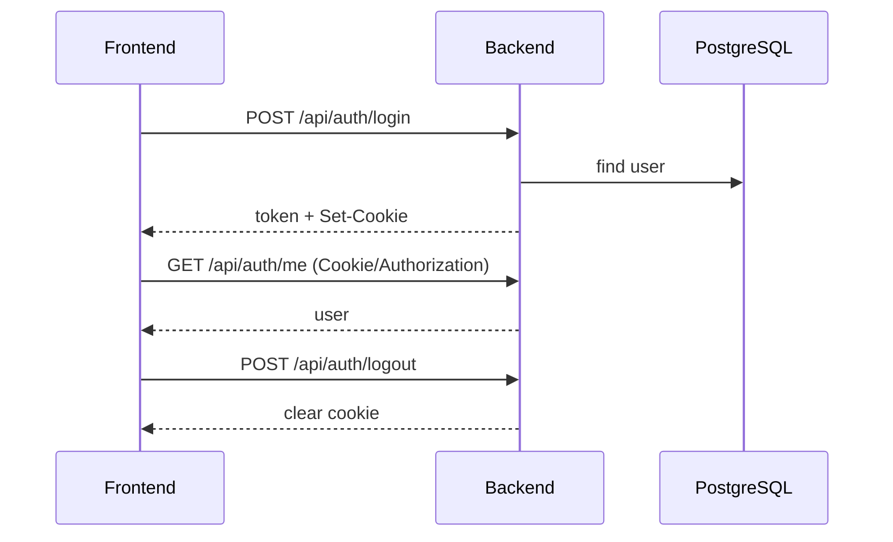
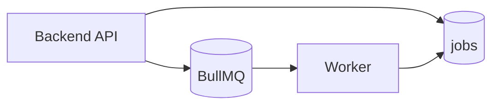

# API / インターフェース

## API 一覧（主要）
### Auth
| Endpoint | Method | Auth | Role |
| --- | --- | --- | --- |
| `/api/auth/login` | POST | - | - |
| `/api/auth/logout` | POST | - | - |
| `/api/auth/me` | GET | ✅ | any |

### Users
| Endpoint | Method | Auth | Role |
| --- | --- | --- | --- |
| `/api/users` | GET | ✅ | admin |
| `/api/users` | POST | ✅ | admin |
| `/api/users/options` | GET | ✅ | any |
| `/api/users/:id/role` | PATCH | ✅ | admin |

### Companies / Contacts / Related
| Endpoint | Method | Auth | Role |
| --- | --- | --- | --- |
| `/api/companies` | GET | ✅ | any |
| `/api/companies` | POST | ✅ | admin/sales/ops |
| `/api/companies/:id` | GET | ✅ | any |
| `/api/companies/:id` | PATCH | ✅ | admin/sales/ops |
| `/api/companies/:id` | DELETE | ✅ | admin/sales/ops |
| `/api/companies/search` | GET | ✅ | any |
| `/api/companies/options` | GET | ✅ | any |
| `/api/companies/:id/contacts` | GET | ✅ | any |
| `/api/companies/:id/contacts` | POST | ✅ | admin/sales/ops |
| `/api/companies/:id/contacts/reorder` | PATCH | ✅ | admin/sales/ops |
| `/api/contacts/:id` | PATCH | ✅ | admin/sales/ops |
| `/api/contacts/:id` | DELETE | ✅ | admin/sales/ops |
| `/api/companies/:id/projects` | GET | ✅ | any |
| `/api/companies/:id/wholesales` | GET | ✅ | any |
| `/api/companies/:id/tasks` | GET | ✅ | any |
| `/api/companies/:id/messages` | GET | ✅ | any |
| `/api/companies/:id/summaries` | GET | ✅ | any |
| `/api/companies/:id/summaries` | POST | ✅ | admin/sales/ops |
| `/api/companies/:id/summaries/draft` | POST | ✅ | admin/sales/ops |

### Projects / Wholesales
| Endpoint | Method | Auth | Role |
| --- | --- | --- | --- |
| `/api/projects` | GET | ✅ | any |
| `/api/projects` | POST | ✅ | admin/sales/ops |
| `/api/projects/:id` | GET | ✅ | any |
| `/api/projects/:id` | PATCH | ✅ | admin/sales/ops |
| `/api/projects/:id` | DELETE | ✅ | admin/sales/ops |
| `/api/projects/search` | GET | ✅ | any |
| `/api/projects/:id/wholesales` | GET | ✅ | any |
| `/api/projects/:id/tasks` | GET | ✅ | any |
| `/api/wholesales` | GET | ✅ | any |
| `/api/wholesales` | POST | ✅ | admin/sales/ops |
| `/api/wholesales/:id` | GET | ✅ | any |
| `/api/wholesales/:id` | PATCH | ✅ | admin/sales/ops |
| `/api/wholesales/:id` | DELETE | ✅ | admin/sales/ops |
| `/api/wholesales/:id/tasks` | GET | ✅ | any |

### Messages
| Endpoint | Method | Auth | Role |
| --- | --- | --- | --- |
| `/api/messages/search` | GET | ✅ | any |
| `/api/messages/unassigned` | GET | ✅ | any |
| `/api/messages/:id/assign-company` | PATCH | ✅ | admin/sales/ops |
| `/api/messages/assign-company` | PATCH | ✅ | admin/sales/ops |
| `/api/messages/:id/labels` | POST | ✅ | admin/sales/ops |
| `/api/messages/:id/labels/:label` | DELETE | ✅ | admin/sales/ops |
| `/api/messages/labels` | GET | ✅ | any |
| `/api/messages/labels/bulk` | POST | ✅ | admin/sales/ops |
| `/api/messages/labels/bulk/remove` | POST | ✅ | admin/sales/ops |

### Tasks
| Endpoint | Method | Auth | Role |
| --- | --- | --- | --- |
| `/api/tasks` | GET | ✅ | any |
| `/api/tasks` | POST | ✅ | admin/sales/ops |
| `/api/tasks/:id` | GET | ✅ | any |
| `/api/tasks/:id` | PATCH | ✅ | admin/sales/ops |
| `/api/tasks/:id` | DELETE | ✅ | admin/sales/ops |
| `/api/tasks/bulk` | PATCH | ✅ | admin/sales/ops |
| `/api/me/tasks` | GET | ✅ | any |

### Jobs / Summaries
| Endpoint | Method | Auth | Role |
| --- | --- | --- | --- |
| `/api/jobs` | GET | ✅ | any |
| `/api/jobs/:id` | GET | ✅ | any |
| `/api/jobs/:id/cancel` | POST | ✅ | any |
| `/api/summaries/:id/tasks/candidates` | POST | ✅ | any |

### Chatwork
| Endpoint | Method | Auth | Role |
| --- | --- | --- | --- |
| `/api/chatwork/rooms` | GET | ✅ | admin |
| `/api/chatwork/rooms/sync` | POST | ✅ | admin |
| `/api/chatwork/rooms/:id` | PATCH | ✅ | admin |
| `/api/chatwork/messages/sync` | POST | ✅ | admin |
| `/api/chatwork/webhook` | POST | - | - |
| `/api/companies/:id/chatwork-rooms` | GET | ✅ | any |
| `/api/companies/:id/chatwork-rooms` | POST | ✅ | admin/sales/ops |
| `/api/companies/:id/chatwork-rooms/:roomId` | DELETE | ✅ | admin/sales/ops |

### Dashboard / Settings / Export / Audit / Search
| Endpoint | Method | Auth | Role |
| --- | --- | --- | --- |
| `/api/dashboard` | GET | ✅ | any |
| `/api/settings` | GET | ✅ | admin |
| `/api/settings` | PATCH | ✅ | admin |
| `/api/export/companies.csv` | GET | ✅ | admin |
| `/api/export/tasks.csv` | GET | ✅ | admin |
| `/api/audit-logs` | GET | ✅ | any |
| `/api/search` | GET | ✅ | any |

### Health
| Endpoint | Method | Auth | Role |
| --- | --- | --- | --- |
| `/healthz` | GET | - | - |

## 認証フロー
**説明（一般）**: ログインから認証済みAPI利用までの流れを示します。  
**このプロジェクトでは**: ログインでJWTを発行し、Cookie/Authorizationで`/api/auth/me`にアクセスします。

## ステータス / エラーコード一覧
| HTTP | Code | 説明 |
| --- | --- | --- |
| 400 | `BAD_REQUEST` | 入力不正 |
| 401 | `UNAUTHORIZED` | 認証失敗 |
| 403 | `FORBIDDEN` | 権限不足 |
| 404 | `NOT_FOUND` | リソース不在 |
| 409 | `CONFLICT` | 競合 |
| 422 | `VALIDATION_ERROR` | バリデーション |
| 429 | `TOO_MANY_REQUESTS` | レート制限 |
| 500 | `INTERNAL_SERVER_ERROR` | 予期しないエラー |

Prisma 例外マッピング（例）:
- `P2025` → 404
- `P2002` → 409
- `P2003` → 400

## レート制限
| 対象 | 設定 | 由来 |
| --- | --- | --- |
| `/api/auth/login` | `RATE_LIMIT_MAX` / `RATE_LIMIT_WINDOW_MS` | Fastify rate-limit |
| Chatwork API | 5分300回相当の間隔制御 | クライアント内部制御 |

## ページング / フィルタ / ソート（クエリあり）
対象: `/api/companies`, `/api/projects`, `/api/wholesales`, `/api/tasks`, `/api/messages/*`, `/api/jobs`, `/api/audit-logs`, `/api/export/*`

## バージョニング方針
- 現状は `/api` で固定（バージョン無し）

## Webhook イベント
| 送信元 | 受信エンドポイント | 認証 |
| --- | --- | --- |
| Chatwork | `/api/chatwork/webhook` | `CHATWORK_WEBHOOK_TOKEN` |

## 非同期 API（ジョブ）
**説明（一般）**: ジョブを使う非同期APIの流れを示します。  
**このプロジェクトでは**: APIが`jobs`を作成し、BullMQワーカーが処理して結果をDBに反映します。

## OpenAPI / Swagger
- `/api/docs` で Swagger UI を提供

## 外部連携の契約（概要）
| 連携先 | 用途 | エンドポイント |
| --- | --- | --- |
| Chatwork API | ルーム/メッセージ取得 | `https://api.chatwork.com/v2` |
| OpenAI API | 要約生成 | `https://api.openai.com/v1/chat/completions` |
