# アーキテクチャ / 構造

## システムコンテキスト（C4 Context）
**説明（一般）**: 利用者・外部システム・自システムの関係と境界をざっくり掴む図です。  
**このプロジェクトでは**: ブラウザ利用者がフロント経由でAPIを使い、Chatwork/OpenAIと連携します。
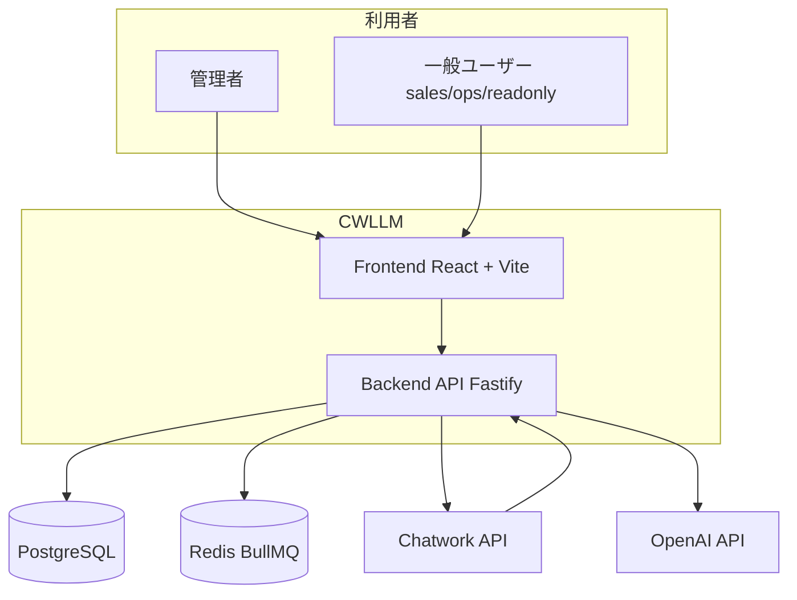

## C4 Container
**説明（一般）**: 主要な実行単位（UI/API/ワーカー/DB/キャッシュ）をまとめて示します。  
**このプロジェクトでは**: APIとBullMQワーカーがPostgreSQLとRedisを共有し、外部APIへアクセスします。
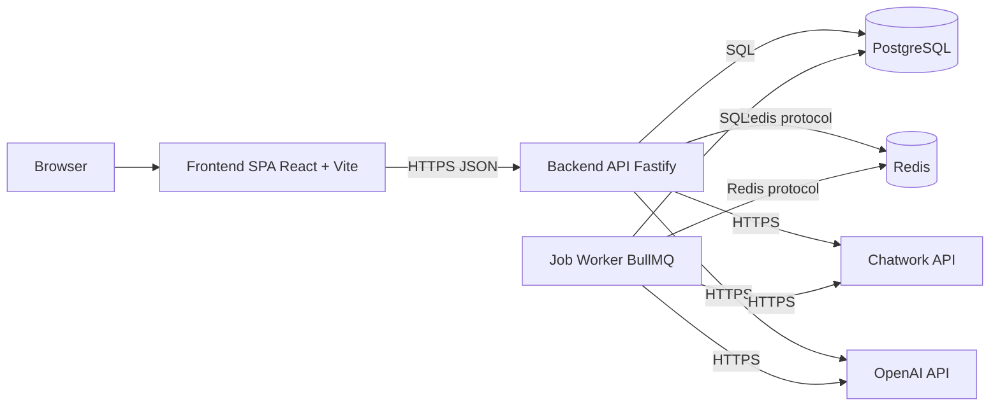

## バックエンド・コンポーネント図（UML Component 相当）
**説明（一般）**: バックエンド内部の構成要素と依存関係を示します。  
**このプロジェクトでは**: Routes→Handlers→Services→Prismaの流れで、同期/要約などの機能が実装されています。
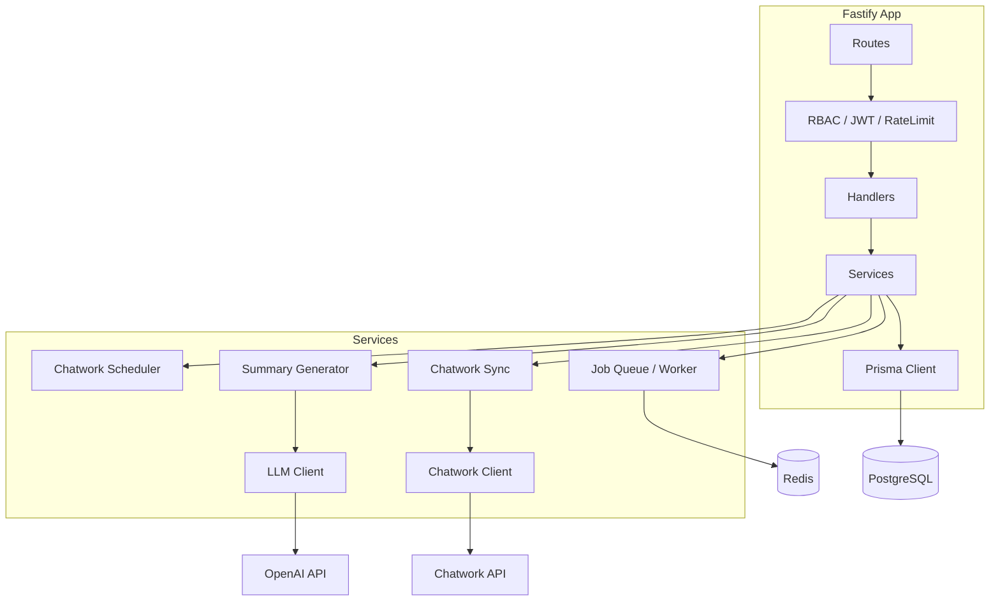

## 論理アーキテクチャ（層・責務）
**説明（一般）**: 層ごとの責務と依存方向を整理する図です。  
**このプロジェクトでは**: UI→API→Service→Infraの一方向で、DB/Redis/外部APIはInfra側に集約しています。
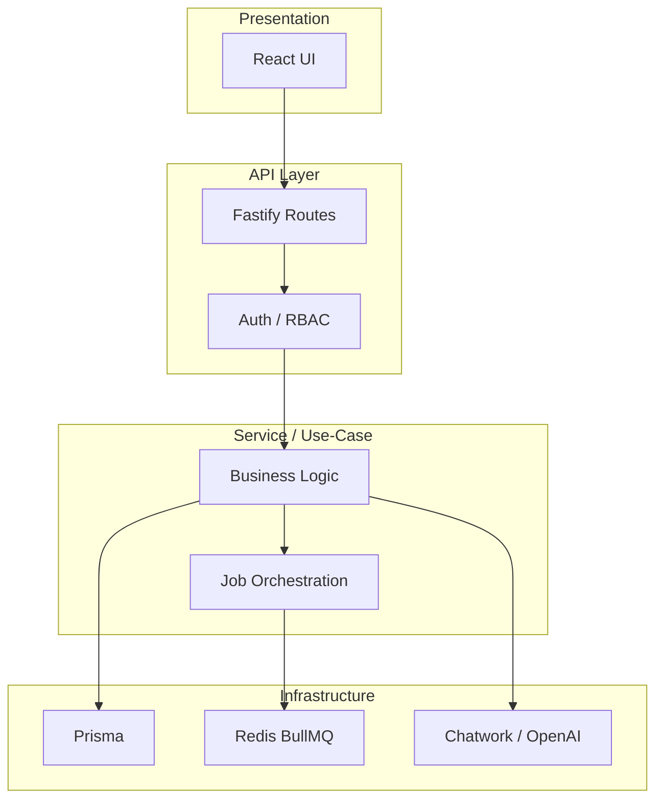

## 物理アーキテクチャ（Dev / Prod）
**説明（一般）**: 実行環境での配置（プロセス/コンテナ/サービス）を示します。  
**このプロジェクトでは**: 開発はVite+FastifyとDockerのDB/Redis、運用はRenderまたはDocker構成です。
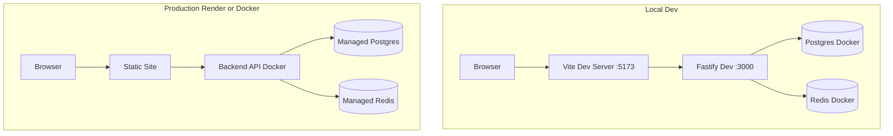

## ネットワーク構成 / トラフィックフロー
**説明（一般）**: リクエストの入口から内部・外部連携までの通信経路を示します。  
**このプロジェクトでは**: ブラウザ→フロント→API→DB/Redis→外部APIの流れになります。
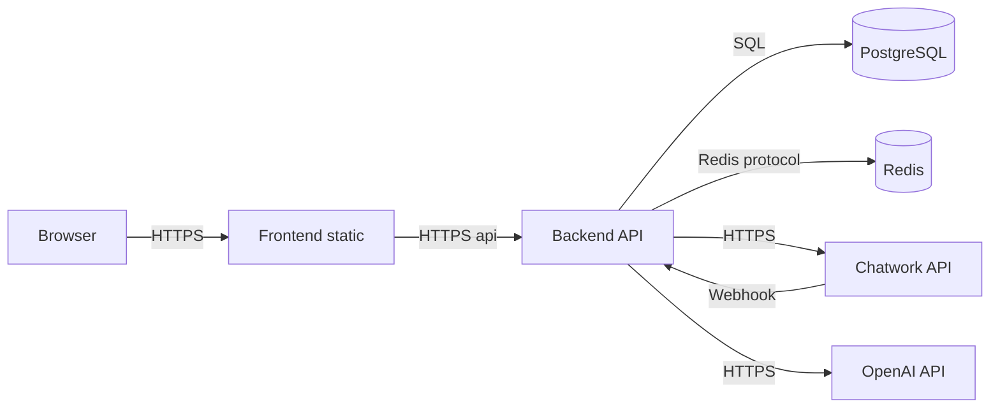

## 認証・認可境界（Trust Boundary）
**説明（一般）**: どこで認証・認可が行われるか、信頼境界を示す図です。  
**このプロジェクトでは**: JWT検証とRBACはバックエンド内で実施し、クライアントは未信頼前提です。
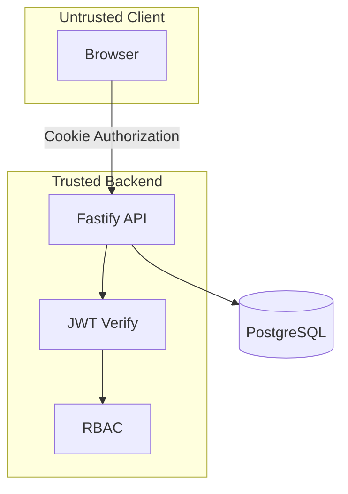

## ストレージ / キャッシュ配置
**説明（一般）**: データの保存先・キャッシュの配置を示します。  
**このプロジェクトでは**: フロントはuseFetchのメモリキャッシュ、バックはPostgreSQL/Redisを利用します。
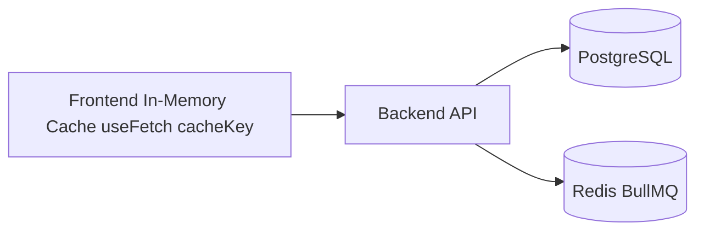

## ジョブ基盤 / イベント駆動の全体
**説明（一般）**: 非同期処理の流れとキュー/ワーカーの関係を示します。  
**このプロジェクトでは**: Chatwork同期や要約生成はジョブ化され、BullMQワーカーが処理します。
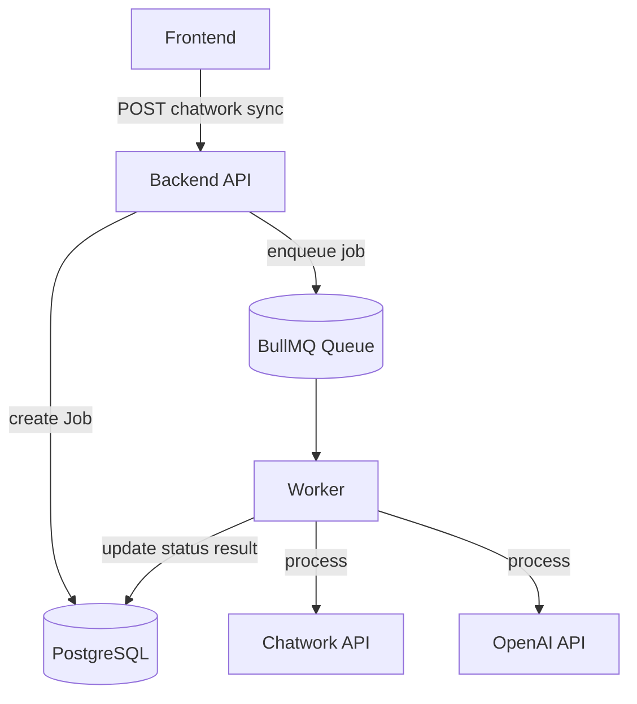

## 依存関係グラフ（モジュール依存）
**説明（一般）**: モジュール間の依存方向を俯瞰する図です。  
**このプロジェクトでは**: Routes/Handlers/Servicesが中心で、Prisma/Redis/外部APIへ依存します。
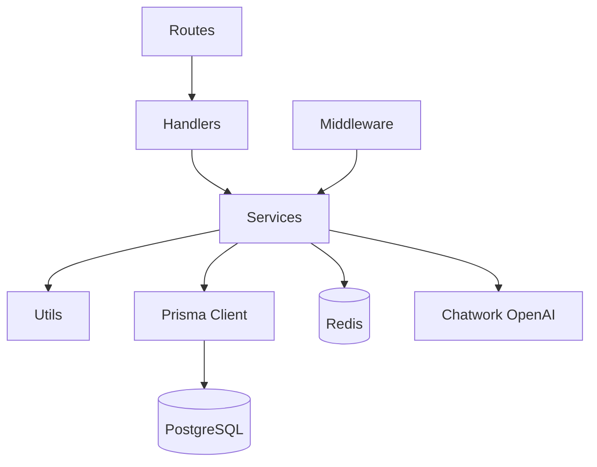

## モジュール構成（リポジトリ）
**説明（一般）**: リポジトリの主要ディレクトリ構成を示します。  
**このプロジェクトでは**: frontend/backend/infra/Docsに分割して責務を明確化しています。
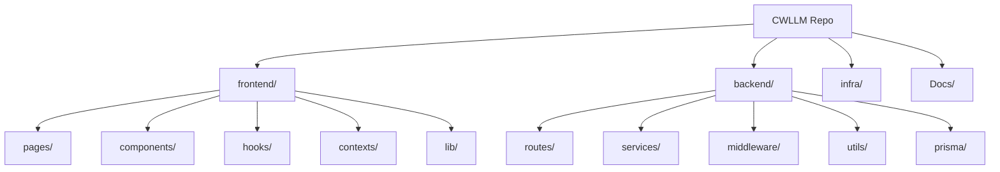

## レイヤー図（Presentation / Domain / Infra）
**説明（一般）**: プレゼンテーション/ドメイン/インフラの抽象層を示します。  
**このプロジェクトでは**: Routes/Servicesがドメイン相当、Prisma/Redis/外部APIがインフラ相当です。
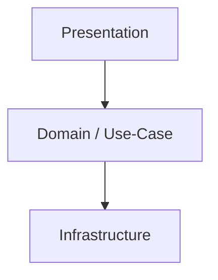

## Hexagonal（Ports & Adapters）
**説明（一般）**: コアと外部アダプタの境界を示す設計図です。  
**このプロジェクトでは**: InboundはHTTP/Scheduler、OutboundはDB/Redis/Chatwork/OpenAIです。
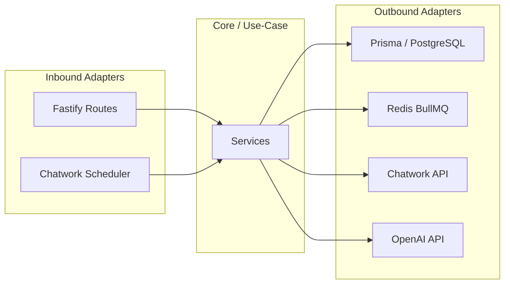

## DDD Context Map（境界づけ）
**説明（一般）**: 業務領域（コンテキスト）間の関係を示します。  
**このプロジェクトでは**: Companiesを中心にProjects/Wholesales/Tasksが連携します。
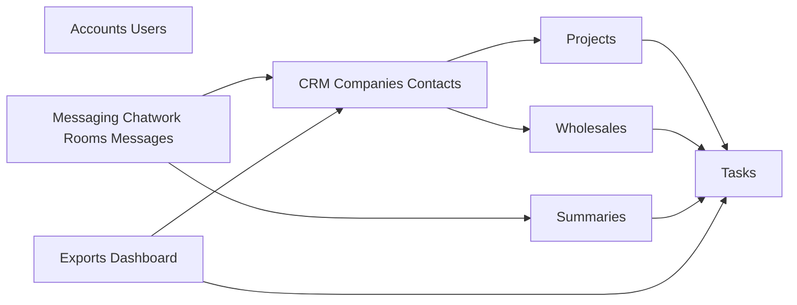

## 4+1 ビュー（対応表）
| View | 対応図 |
| --- | --- |
| Logical | 論理アーキテクチャ / レイヤー図 |
| Process | ジョブ基盤 / イベント駆動 / シーケンス |
| Development | モジュール構成 / 依存関係 |
| Physical | 物理アーキテクチャ / ネットワーク |
| Scenarios | シーケンス図（ログイン・同期・要約） |

## 責務分割（サマリ）
| 領域 | 主担当 | 役割 |
| --- | --- | --- |
| 画面/UI | Frontend | 画面表示、入力、API呼び出し |
| 認証/認可 | Backend | JWT発行、RBAC、アクセス制御 |
| 業務ロジック | Backend Services | 同期/要約/タスク化等 |
| 永続化 | PostgreSQL + Prisma | 主要データの永続化 |
| 非同期処理 | Redis + BullMQ | Chatwork同期・要約生成の実行 |
| 外部連携 | Chatwork/OpenAI | メッセージ取得・要約生成 |
