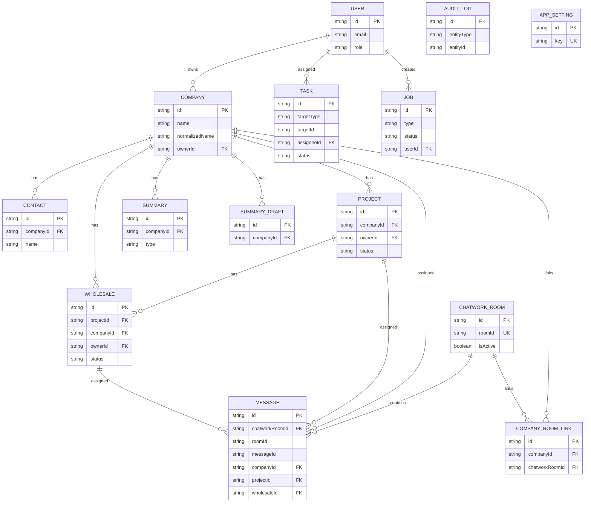
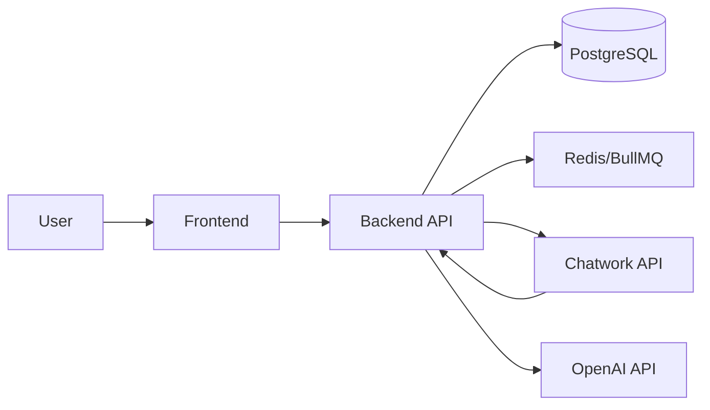

# データまわり

## ER 図（論理）
**説明（一般）**: データのエンティティと関係を俯瞰する図です。  
**このプロジェクトでは**: Companiesを中心にProjects/Wholesales/Tasks/Chatwork連携が繋がります。

## データフロー（DFD レベル0）
**説明（一般）**: データがどこからどこへ流れるかを示します。  
**このプロジェクトでは**: フロント→API→DB/Redis→外部API（Chatwork/OpenAI）の流れです。

## イベント / ジョブスキーマ（現状）
| JobType | payload | 説明 |
| --- | --- | --- |
| `chatwork_rooms_sync` | `{}` | ルーム一覧同期 |
| `chatwork_messages_sync` | `{ roomId?: string, roomLimit?: number }` | メッセージ同期 |
| `summary_draft` | `{ companyId, periodStart, periodEnd }` | 要約ドラフト生成 |

## データ辞書（主要エンティティ）
| エンティティ | 主な項目 | 備考 |
| --- | --- | --- |
| User | `email`, `role`, `password` | 認証・権限 |
| Company | `name`, `normalizedName`, `status`, `tags` | CRM中心 |
| Contact | `companyId`, `name`, `role`, `email` | 会社連絡先 |
| Project | `companyId`, `name`, `status`, `periodStart/End` | 案件 |
| Wholesale | `projectId`, `companyId`, `status`, `margin` | 卸 |
| ChatworkRoom | `roomId`, `name`, `lastSyncAt`, `isActive` | 連携ルーム |
| Message | `roomId`, `messageId`, `sender`, `body`, `sentAt` | 連携メッセージ |
| Summary | `companyId`, `content`, `type` | 確定要約 |
| SummaryDraft | `companyId`, `content`, `expiresAt` | 自動生成 |
| Task | `targetType`, `targetId`, `assigneeId`, `status` | タスク |
| Job | `type`, `status`, `payload`, `result` | 非同期処理 |
| AuditLog | `entityType`, `entityId`, `action`, `changes` | 監査 |
| AppSetting | `key`, `value` | 設定 |

## 実装差分（主要追加項目）
**説明（一般）**: ER図/辞書は主要項目の抜粋です。実装には以下の追加項目があります。  
- Company: `category`, `profile`, `ownerId`
- Contact: `phone`, `memo`, `sortOrder`
- Project: `conditions`, `unitPrice`, `periodStart`, `periodEnd`, `ownerId`
- Wholesale: `conditions`, `unitPrice`, `margin`, `agreedDate`, `ownerId`
- ChatworkRoom: `description`, `lastMessageId`, `lastErrorAt`, `lastErrorMessage`, `lastErrorStatus`
- Message: `labels`, `sender`, `sentAt`
- Summary / SummaryDraft: `periodStart`, `periodEnd`, `sourceLinks`, `model`, `promptVersion`, `sourceMessageCount`, `tokenUsage`, `expiresAt`（Draftのみ）
- Task: `title`, `description`, `dueDate`, `assigneeId`
- Job: `error`, `startedAt`, `finishedAt`

## CRUD マトリクス（主要）
| リソース | Create | Read | Update | Delete |
| --- | --- | --- | --- | --- |
| Users | ✅ | ✅ | ✅(role) | - |
| Companies | ✅ | ✅ | ✅ | ✅ |
| Contacts | ✅ | ✅ | ✅ | ✅ |
| Projects | ✅ | ✅ | ✅ | ✅ |
| Wholesales | ✅ | ✅ | ✅ | ✅ |
| Messages | - | ✅ | ✅(assign/labels) | - |
| Summaries | ✅ | ✅ | - | - |
| SummaryDraft | ✅(job) | ✅ | - | - |
| Tasks | ✅ | ✅ | ✅ | ✅ |
| Jobs | ✅(enqueue) | ✅ | ✅(cancel) | - |
| AuditLogs | - | ✅ | - | - |
| Settings | - | ✅ | ✅ | - |

## インデックス / 制約（抜粋）
| テーブル | インデックス / ユニーク |
| --- | --- |
| companies | `normalizedName` unique |
| contacts | `(companyId, sortOrder)` |
| projects | `(companyId)` |
| wholesales | `(companyId, projectId)` |
| chatwork_rooms | `roomId` unique |
| company_room_links | `(companyId, chatworkRoomId)` unique |
| messages | `unique(roomId, messageId)`, `(companyId)`, `(companyId, sentAt)` |
| summary_drafts | `unique(companyId, periodStart, periodEnd)`, `(companyId, periodStart, periodEnd)` |
| tasks | `(targetType, targetId)`, `(dueDate, status)`, `(assigneeId)` |
| jobs | `(type, status)`, `(createdAt)` |
| app_settings | `key` unique |

## キャッシュキー設計（フロント）
| キー | TTL | 説明 |
| --- | --- | --- |
| `cacheKey`（未指定時はURL） | `cacheTimeMs` | `useFetch` がメモリに保持 |

## 整合性モデル
- 主データ（PostgreSQL）：強整合
- 非同期処理（Job/Queue）：結果整合（ジョブ完了を待つ）
- 要約ドラフト：期限付きキャッシュ（`summary_drafts.expiresAt`）

## マイグレーション運用（現状）
| 環境 | コマンド | 備考 |
| --- | --- | --- |
| 開発 | `npm run migrate:dev` | Prisma migrate dev |
| 本番 | `npm run migrate:deploy` | Prisma migrate deploy |
