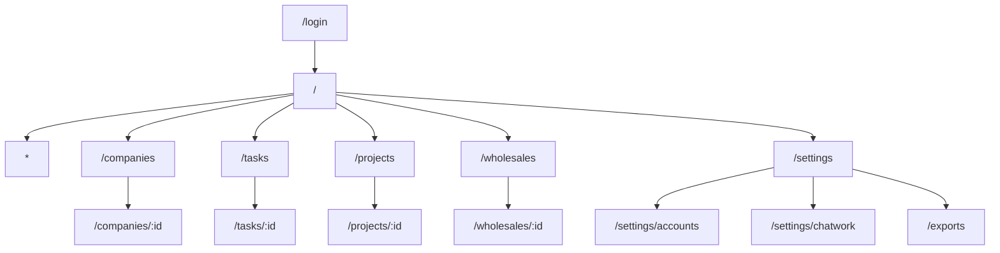
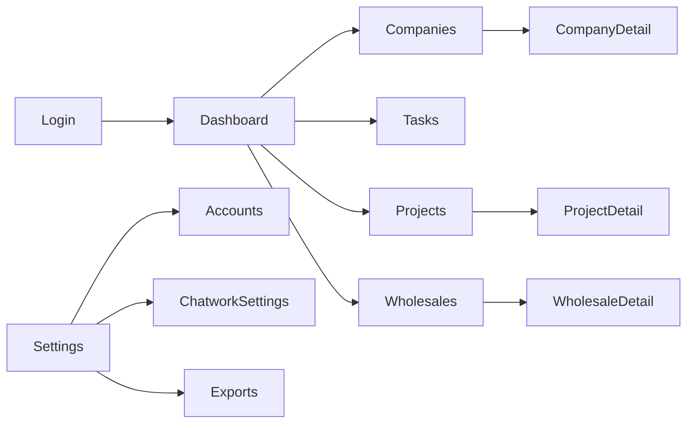
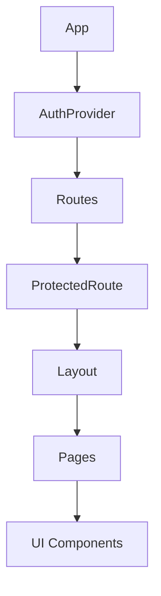
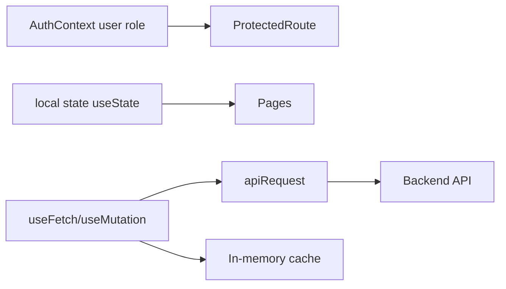
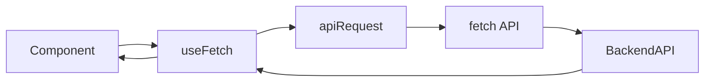
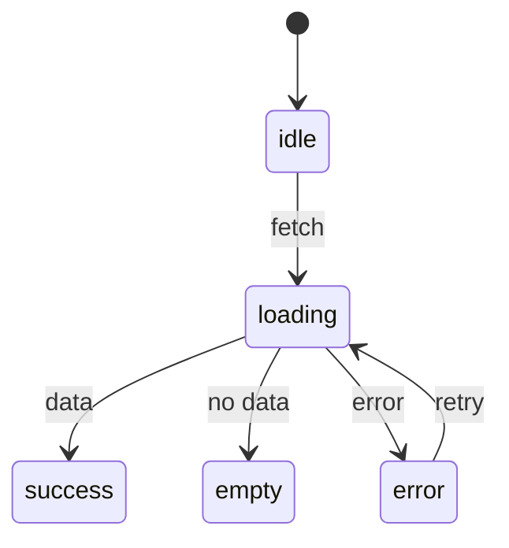

# フロントエンド / 画面まわり

## サイトマップ
**説明（一般）**: 画面構成を一覧で示す図です。  
**このプロジェクトでは**: 主要リソース（Companies/Tasks/Projects/Wholesales）と設定系画面に分かれます。

## 画面遷移（概要）
**説明（一般）**: 代表的な画面遷移の流れを示します。  
**このプロジェクトでは**: ダッシュボードを起点に詳細画面や設定画面へ移動します。

## コンポーネントツリー（主要）
**説明（一般）**: UIの親子関係と責務の分担を示します。  
**このプロジェクトでは**: `App` → `AuthProvider` → `ProtectedRoute` → `Layout` → 各ページの構成です。

## 状態管理（現状）
**説明（一般）**: 状態の置き場所と伝播のしかたを示します。  
**このプロジェクトでは**: 認証はContext、データ取得は`useFetch`とメモリキャッシュで管理します。

## データ取得フロー
**説明（一般）**: 画面がAPIからデータを取得する流れを示します。  
**このプロジェクトでは**: `useFetch` → `apiRequest` → `fetch` → API の順で呼び出します。

## UI 状態遷移
**説明（一般）**: 読み込み/成功/空/エラーなどのUI状態を示します。  
**このプロジェクトでは**: `useFetch`の状態に合わせてローディングやエラー表示を切り替えます。

## フォーム / バリデーション（概要）
| 画面 | 入力 | バリデーション |
| --- | --- | --- |
| Login | email/password | サーバ側(Zod)で検証、クライアントは最小限 |
| Company/Project/Task | 各種項目 | サーバ側(Zod)で検証 |

## アクセシビリティ（未監査・チェックリスト）
- キーボード操作で主要導線が操作可能
- フォーカスリングが視認できる
- 主要ボタンに `aria-label` が付与されている
- コントラスト比が確保されている

## i18n / デザイントークン
- i18n: 未導入（日本語固定）
- デザイントークン: 未導入（Tailwindユーティリティ中心）
