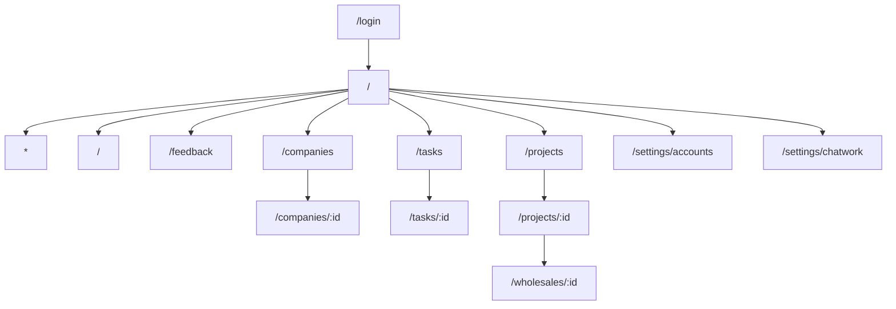
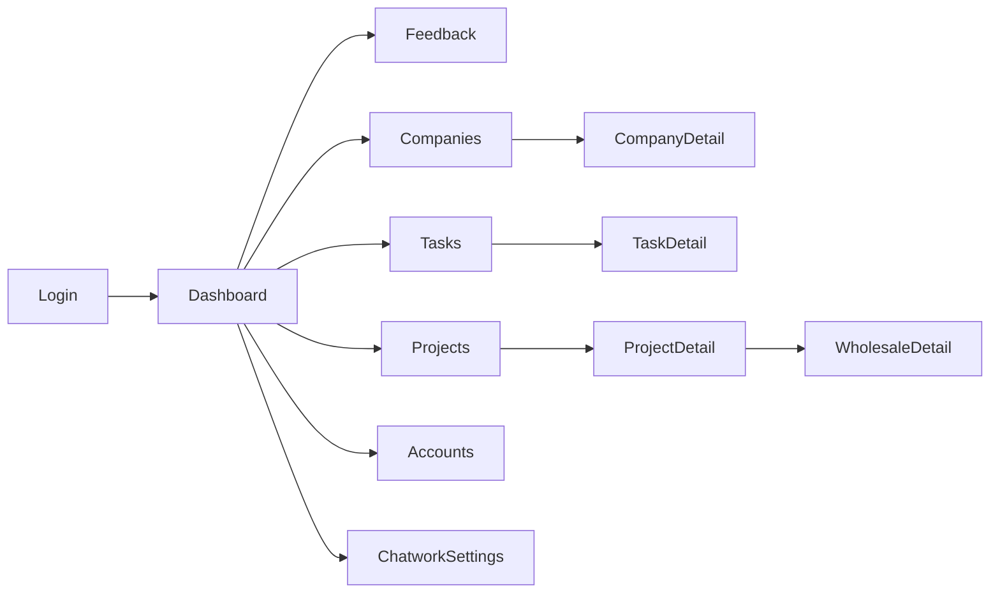
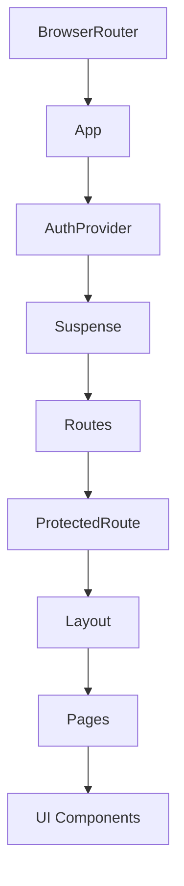
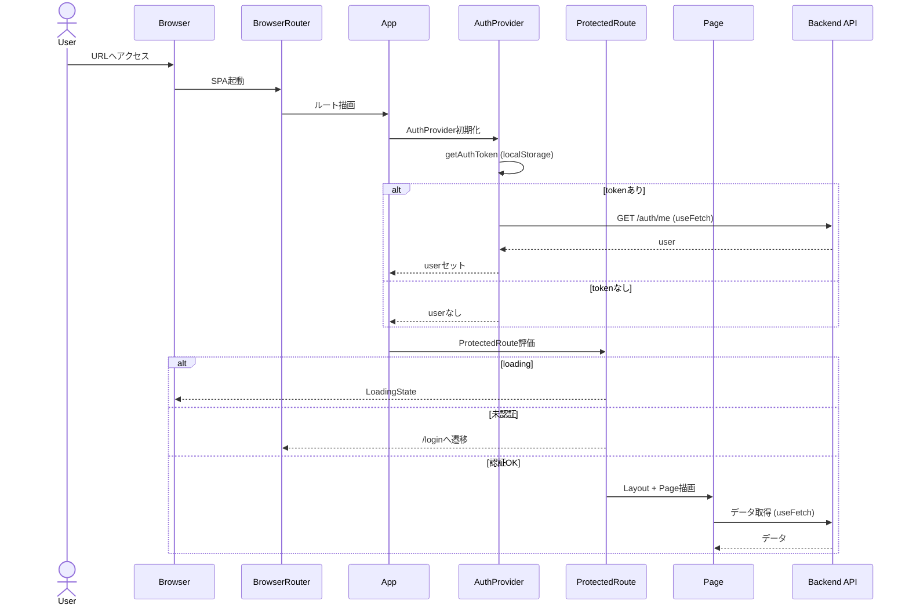
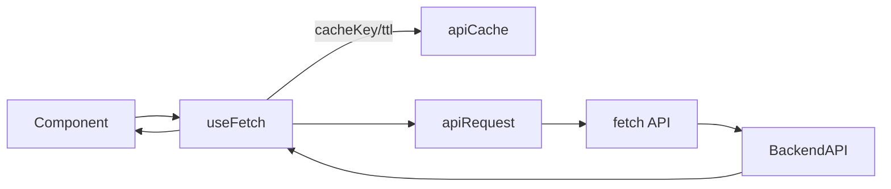
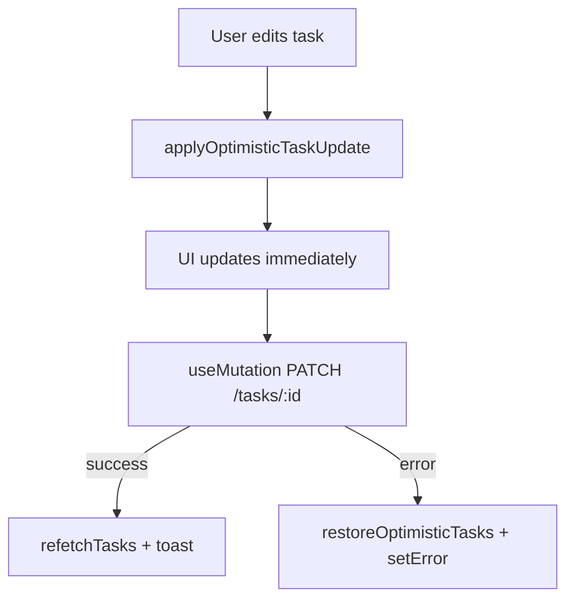
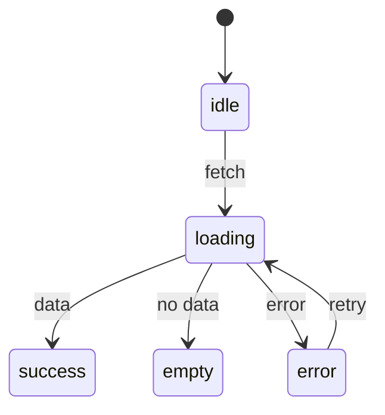

# フロントエンド / 画面・ルーティング・状態

## 目的
- フロントエンドの処理フローを俯瞰できるようにする
- ルート、認証、データ取得、状態遷移の関係を可視化する

## サイトマップ / ルート一覧
**出典**: `frontend/src/App.tsx`, `frontend/src/constants/routes.tsx`


## 画面遷移（代表フロー）
**説明**: ログイン後に主要画面へ遷移する流れを示す。


## コンポーネント構成（起点）
**説明**: ルーティングとレイアウトの責務の流れ。


## 認証とルートガード
**説明**: トークン確認、認証済み判定、ガードの流れ。


## データ取得とキャッシュ
**説明**: `useFetch` を中心とした取得とキャッシュの流れ。


## 楽観的更新（Tasks）
**説明**: 更新即時反映 + 失敗時ロールバック。


## 一覧ページのURL同期（useListPage）
**説明**: フィルタ・ページネーションの状態をURLと同期。
```mermaid
flowchart LR
  URL[location.search] --> UrlSync[useUrlSync]
  UrlSync --> Filters[filters / extraParams / pagination]
  Filters --> Query[useListQuery -> queryString]
  Query --> Fetch[useFetch(buildUrl)]
  Fetch --> API
  API --> Fetch
  Fetch --> Data[setData]
  Data --> Paginate[usePaginationSync]
  Paginate --> UrlSync
```

## UI状態遷移（useFetch / useMutation）


## i18n
- i18nは未導入（文言は各コンポーネントに直書き）。