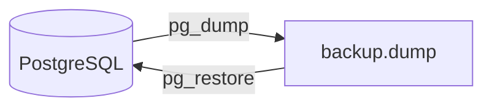

# 運用 / 監視 / インシデント

## 監視（現状）
| 項目 | 取得方法 |
| --- | --- |
| ヘルスチェック | `/healthz` |
| アプリログ | Fastify logger |
| ジョブログ | Job status / error in DB |

## SLI / SLO（未定義）
| 指標 | 目標 | 備考 |
| --- | --- | --- |
| API成功率 | TBD | 未定義 |
| レイテンシ | TBD | 未定義 |

## アラートルール（未定義）
- 監視基盤の整備後に設定

## Runbook（最小）
1. `/healthz` を確認
2. アプリログ（requestId）を確認
3. DB/Redis の疎通確認
4. 必要に応じて再起動

## インシデントタイムライン（テンプレ）
| 時刻 | 事象 | 対応 | 影響 |
| --- | --- | --- | --- |

## バックアップ / リストア
**説明（一般）**: バックアップ取得と復元の基本的な流れを示します。  
**このプロジェクトでは**: `pg_dump`/`pg_restore`（またはスクリプト）でPostgreSQLを扱います。

## 依存先サービス一覧
| サービス | 用途 | 備考 |
| --- | --- | --- |
| Chatwork API | メッセージ/ルーム取得 | 外部 |
| OpenAI API | 要約生成 | 外部 |
| PostgreSQL | 主DB | Render / Docker |
| Redis | Job Queue | Render / Docker |
