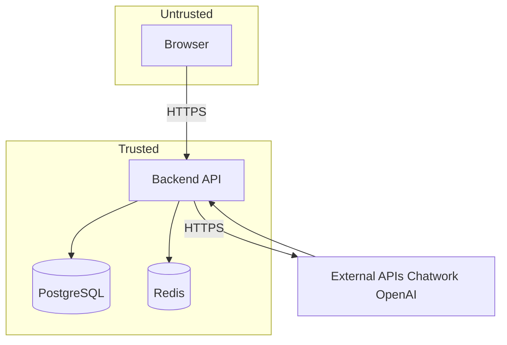
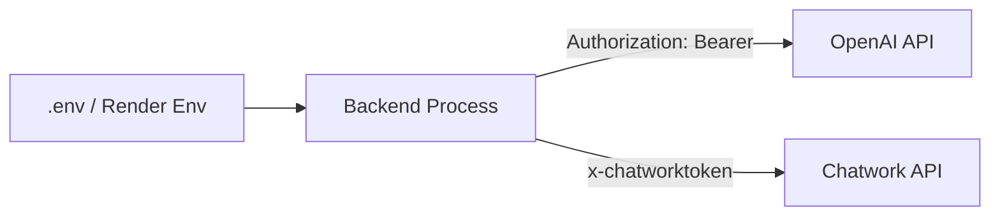

# セキュリティ

## 脅威モデリング（DFD + Trust Boundary）
**説明（一般）**: データの流れと信頼境界を可視化して脅威を洗い出します。  
**このプロジェクトでは**: ブラウザは未信頼、バックエンドが認証/認可と外部API連携の中心です。

## STRIDE（現状の対策）
| 脅威 | 対応 |
| --- | --- |
| Spoofing | JWT + RBAC |
| Tampering | DB制約 / 監査ログ |
| Repudiation | AuditLog |
| Information Disclosure | Cookie `httpOnly`, `secure`(prod) |
| Denial of Service | rate-limit (login) |
| Elevation of Privilege | `requireAdmin` / `requireWriteAccess` |

## 権限マトリクス（概略）
| 役割 | 読み取り | 書き込み | 管理 |
| --- | --- | --- | --- |
| admin | ✅ | ✅ | ✅ |
| sales | ✅ | ✅ | - |
| ops | ✅ | ✅ | - |
| readonly | ✅ | - | - |

## 秘密情報の取り扱いフロー
**説明（一般）**: 秘密情報がどこで利用されるかを示します。  
**このプロジェクトでは**: `.env`/環境変数から取得し、Chatwork/OpenAIの認証ヘッダで使います。

## 暗号化
- パスワード: bcrypt ハッシュ
- 通信: HTTPS（デプロイ環境に依存）
- Cookie: `httpOnly`, `secure`(production)

## 監査ログ設計
| 項目 | 内容 |
| --- | --- |
| entityType / entityId | 対象 |
| action | create/update/delete |
| changes | before/after |
| userId | 操作者 |

## SBOM（依存一覧）
- `frontend/package.json`
- `backend/package.json`

## セキュリティテスト計画（現状）
| 種別 | 実施 |
| --- | --- |
| SAST | 未導入 |
| DAST | 未導入 |
| 手動レビュー | 適宜 |
