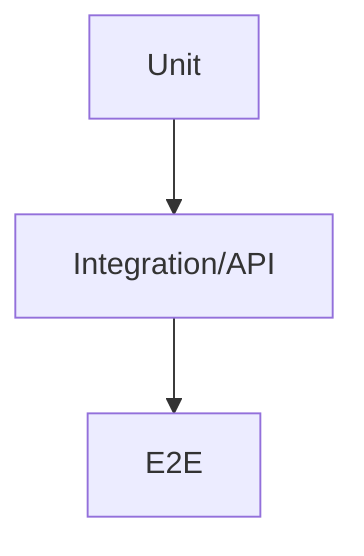

# テスト / 品質

## テスト戦略（俯瞰）
**説明（一般）**: どのレイヤーで何をテストするかの全体像です。  
**このプロジェクトでは**: Front/BackのユニットテストとPlaywright E2Eを併用します。
```mermaid
flowchart TB
  UnitFE[Frontend Unit (Vitest)]
  UnitBE[Backend Unit (Vitest)]
  E2E[Playwright E2E]
  UnitFE --> E2E
  UnitBE --> E2E
```

## テストピラミッド
**説明（一般）**: ユニット→統合→E2Eの比率を示す考え方です。  
**このプロジェクトでは**: ユニット中心で、重要フローをE2Eで補強します。


## テスト計画（現状）
| 種別 | 目的 | コマンド |
| --- | --- | --- |
| Frontend Unit | コンポーネント/フック | `cd frontend && npm run test` |
| Backend Unit | ルート/サービス | `cd backend && npm run test` |
| E2E | UI一連動作 | `cd frontend && npm run test:e2e` |

## 環境マトリクス（現状）
| 環境 | OS | ブラウザ |
| --- | --- | --- |
| ローカル | Windows/macOS/Linux | Playwright (Chromium) |
| CI | Ubuntu | Playwright (デフォルト) |

## モック / スタブ方針
- 外部API（Chatwork/OpenAI）は必要に応じてモック
- ユニットテストはDB依存を減らす

## 品質ゲート（CI）
| 対象 | 実行 |
| --- | --- |
| Backend | lint → build → test |
| Frontend | lint → typecheck → test → build |
