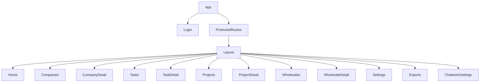
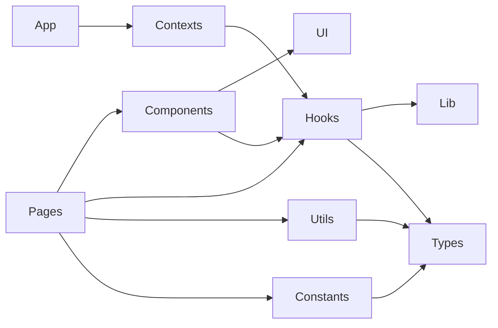
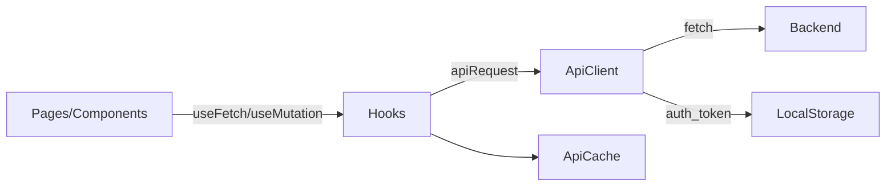

# フロントエンド棚卸し（リファクタリング準備）

このドキュメントは、依存関係と関数の棚卸し結果をまとめたものです。

## 分割版リンク
- Docs/frontend-refactor-inventory/index.md
- Docs/frontend-refactor-inventory/features/companies.md
- Docs/frontend-refactor-inventory/features/tasks.md
- Docs/frontend-refactor-inventory/features/projects.md
- Docs/frontend-refactor-inventory/features/api/companies.md
- Docs/frontend-refactor-inventory/features/api/tasks.md
- Docs/frontend-refactor-inventory/features/api/projects.md
## 対象範囲
- 対象: frontend/src のみ
- 除外: frontend/src/**/*.test.*, frontend/dist, frontend/node_modules

## 実行時依存関係
| パッケージ | 備考 | 使用箇所 |
| --- | --- | --- |
| react | UIランタイム | main.tsx, pages, components |
| react-dom | React DOM | main.tsx |
| react-router-dom | ルーティング | main.tsx, App.tsx, pages |
| @dnd-kit/core | ドラッグ&ドロップ | components/KanbanBoard.tsx, components/KanbanColumn.tsx, components/KanbanCard.tsx |
| @dnd-kit/utilities | DnDユーティリティ | components/KanbanCard.tsx |

## 開発時依存関係
| パッケージ | 備考 |
| --- | --- |
| vite, @vitejs/plugin-react | ビルド/開発サーバ |
| typescript | 型チェック |
| tailwindcss, postcss, autoprefixer | スタイリング |
| eslint, eslint-plugin-* | Lint |
| prettier | フォーマット |
| vitest, @testing-library/*, jsdom | 単体テスト |
| @playwright/test | E2Eテスト |

## エントリポイントと認証
- frontend/src/main.tsx: ReactDOM root, BrowserRouter
- frontend/src/App.tsx: AuthProvider, ルート設定
- frontend/src/contexts/AuthContext.tsx: 認証状態/ログイン/ログアウト、auth_token の保存
- frontend/src/components/ProtectedRoute.tsx: 認可ガード
- frontend/src/components/Layout.tsx: サイドバー/ナビゲーション/ロールによる表示切替

## ルート一覧
ラベルは `frontend/src/constants/routes.tsx` から抜粋。

| パス | ページ | ラベル | セクション | 認証 | ロール |
| --- | --- | --- | --- | --- | --- |
| /login | Login | なし | public | public | - |
| / | Home | ダッシュボード | main | protected | - |
| /companies | Companies | 企業管理 | main | protected | - |
| /companies/:id | CompanyDetail | なし | - | protected | - |
| /tasks | Tasks | タスク管理 | main | protected | - |
| /tasks/:id | TaskDetail | なし | - | protected | - |
| /projects | Projects | 案件管理 | main | protected | - |
| /projects/:id | ProjectDetail | なし | - | protected | - |
| /wholesales | Wholesales | 卸管理 | main | protected | - |
| /wholesales/:id | WholesaleDetail | なし | - | protected | - |
| /settings | Settings | 設定 | settings | protected | admin |
| /exports | Exports | エクスポート | settings | protected | admin |
| /settings/chatwork | ChatworkSettings | Chatwork設定 | settings | protected | admin |

## ページ依存マップ
| ページ | コンポーネント | Hooks/Contexts | Utils/Constants |
| --- | --- | --- | --- |
| ChatworkSettings | Button, ErrorAlert, JobProgressCard, LoadingState, Toast | useApi, usePermissions, useToast | - |
| Companies | ErrorAlert, LoadingState, FilterBadge, FormInput, FormSelect, FormTextarea, Pagination, SkeletonTable, StatusBadge | useApi, usePermissions, useDebouncedValue, useKeyboardShortcut, useUrlSync | getAvatarColor, getInitials, COMPANY_CATEGORY_DEFAULT_OPTIONS, COMPANY_STATUS_DEFAULT_OPTIONS |
| CompanyDetail | CompanyTasksSection, Badge, ConfirmDialog, ErrorAlert, Pagination, Skeleton, SkeletonAvatar, SkeletonText, StatusBadge, Tabs, Toast, FormSelect | useApi, usePagination, usePermissions, useToast | formatDateGroup, getAvatarColor, getInitials, COMPANY_CATEGORY_DEFAULT_OPTIONS, COMPANY_STATUS_DEFAULT_OPTIONS |
| Exports | Button, ErrorAlert, FormInput, FormSelect | useApi | apiDownload, TASK_STATUS_OPTIONS, TARGET_TYPE_OPTIONS, statusLabel, targetTypeLabel |
| Home | ErrorAlert | useAuth, useApi | statusLabel, targetTypeLabel, formatDate, getTargetPath |
| Login | - | useAuth | - |
| ProjectDetail | CompanySearchSelect, ConfirmDialog, ErrorAlert, EmptyState, LoadingState, FormInput, FormSelect, FormTextarea, StatusBadge | useApi, usePermissions | PROJECT_STATUS_OPTIONS, statusLabel, formatDate, formatDateInput, formatCurrency |
| Projects | CompanySearchSelect, ErrorAlert, EmptyState, FilterBadge, FormInput, FormSelect, FormTextarea, Pagination, SkeletonTable, StatusBadge | useApi, usePermissions, useDebouncedValue, useKeyboardShortcut, useUrlSync | PROJECT_STATUS_OPTIONS, statusLabel, formatCurrency |
| Settings | Button, ErrorAlert, FormInput, FormTextarea, SuccessAlert | useApi | - |
| TaskDetail | ConfirmDialog, ErrorAlert, FormInput, FormSelect, FormTextarea, StatusBadge | useApi, usePermissions | TASK_STATUS_OPTIONS, statusLabel, targetTypeLabel, formatDate, formatDateInput, getTargetPath |
| Tasks | ConfirmDialog, ErrorAlert, EmptyState, FilterBadge, FormInput, FormSelect, StatusBadge, Pagination, SkeletonTable, KanbanBoard | useApi, usePermissions, useKeyboardShortcut, useUrlSync | TASK_STATUS_OPTIONS, TARGET_TYPE_OPTIONS, statusLabel, targetTypeLabel, formatDate, formatDateInput, getTargetPath |
| WholesaleDetail | ConfirmDialog, ErrorAlert, Pagination, SkeletonTable, StatusBadge, Toast, LoadingState | useApi, usePagination, usePermissions, useToast | WHOLESALE_STATUS_OPTIONS, statusLabel, formatDate, formatDateInput, formatCurrency |
| Wholesales | CompanySearchSelect, ProjectSearchSelect, ConfirmDialog, ErrorAlert, EmptyState, FilterBadge, FormInput, FormSelect, FormTextarea, Modal, Pagination, SkeletonTable, StatusBadge | useApi, usePermissions, useKeyboardShortcut, useUrlSync | WHOLESALE_STATUS_OPTIONS, statusLabel, formatDateInput, formatCurrency |

## 機能コンポーネント
| コンポーネント | 役割 | API利用 | 使用箇所 |
| --- | --- | --- | --- |
| components/CompanyTasksSection.tsx | 企業タスク | GET /api/companies/:id/tasks, POST /api/tasks, PATCH /api/tasks/:id | CompanyDetail |
| components/KanbanBoard.tsx | タスクKanban | - | Tasks |
| components/KanbanColumn.tsx | Kanban列 | - | KanbanBoard |
| components/KanbanCard.tsx | Kanbanカード | - | KanbanBoard |
| components/Layout.tsx | サイドバー | - | App |
| components/ProtectedRoute.tsx | 認証ガード | useAuth | App |
| components/SearchSelect.tsx | 検索セレクト | GET searchEndpoint, GET detailEndpoint | Projects, ProjectDetail, Wholesales |

## UIコンポーネント
| コンポーネント | 役割 |
| --- | --- |
| components/ui/Alert.tsx | 汎用アラート |
| components/ui/Badge.tsx | バッジ |
| components/ui/Button.tsx | ボタン |
| components/ui/Card.tsx | カード |
| components/ui/ConfirmDialog.tsx | 確認ダイアログ |
| components/ui/EmptyState.tsx | 空状態 |
| components/ui/ErrorAlert.tsx | エラー表示 |
| components/ui/FilterBadge.tsx | フィルタバッジ |
| components/ui/FormInput.tsx | 入力 |
| components/ui/FormSelect.tsx | セレクト |
| components/ui/FormTextarea.tsx | テキストエリア |
| components/ui/JobProgressCard.tsx | ジョブ進捗 |
| components/ui/LoadingState.tsx | ローディング |
| components/ui/Modal.tsx | モーダル |
| components/ui/Pagination.tsx | ページング |
| components/ui/Skeleton.tsx | スケルトン |
| components/ui/StatusBadge.tsx | ステータス |
| components/ui/SuccessAlert.tsx | 成功表示 |
| components/ui/Tabs.tsx | タブ |
| components/ui/Toast.tsx | トースト |

## Hooks/Contexts
| ファイル | エクスポート | 備考 |
| --- | --- | --- |
| contexts/AuthContext.tsx | AuthProvider, useAuth | 認証状態、login/logout、auth_token を localStorage に保存 |
| hooks/useApi.ts | useFetch, useMutation | apiRequest ラッパー、キャッシュ/リトライ対応 |
| hooks/useDebouncedValue.ts | useDebouncedValue | デバウンス |
| hooks/useKeyboardShortcut.ts | useKeyboardShortcut | ショートカット |
| hooks/usePagination.ts | usePagination | ページング状態 |
| hooks/usePermissions.ts | usePermissions | ロール判定 |
| hooks/useToast.ts | useToast | トースト |
| hooks/useUrlSync.ts | useUrlSync | URL同期 |

## Lib/Utils/Constants（関数カタログ）
| ファイル | エクスポート |
| --- | --- |
| lib/apiClient.ts | ApiRequestError, apiRequest, apiDownload, apiGet, apiSend |
| lib/apiCache.ts | getCache, setCache, clearCache |
| lib/apiRoutes.ts | apiRoutes |
| utils/date.ts | formatDate, formatDateInput, formatDateGroup, isToday, isYesterday |
| utils/format.ts | formatCurrency |
| utils/string.ts | getInitials, getAvatarColor |
| utils/routes.ts | getTargetPath |
| constants/labels.ts | TASK_STATUS_OPTIONS, PROJECT_STATUS_OPTIONS, WHOLESALE_STATUS_OPTIONS, TARGET_TYPE_OPTIONS, COMPANY_CATEGORY_DEFAULT_OPTIONS, COMPANY_STATUS_DEFAULT_OPTIONS, statusLabel, targetTypeLabel |

## API一覧
### 認証
| エンドポイント | Method | 参照元 |
| --- | --- | --- |
| /api/auth/me | GET | AuthContext |
| /api/auth/login | POST | AuthContext |
| /api/auth/logout | POST | AuthContext |

### ダッシュボード
| エンドポイント | Method | 参照元 |
| --- | --- | --- |
| /api/dashboard | GET | Home |

### 企業
| エンドポイント | Method | 参照元 |
| --- | --- | --- |
| /api/companies?{q,category,status,tag,ownerId,page,pageSize} | GET | Companies |
| /api/companies | POST | Companies |
| /api/companies/options | GET | Companies, CompanyDetail, Exports |
| /api/companies/:id | GET | CompanyDetail, CompanySearchSelect, Wholesales |
| /api/companies/:id | PATCH | CompanyDetail |
| /api/companies/:id/contacts | GET | CompanyDetail |
| /api/companies/:id/contacts | POST | CompanyDetail |
| /api/companies/:id/contacts/reorder | PATCH | CompanyDetail |
| /api/companies/:id/chatwork-rooms | GET | CompanyDetail |
| /api/companies/:id/chatwork-rooms | POST | Companies, CompanyDetail |
| /api/companies/:id/chatwork-rooms | DELETE | CompanyDetail |
| /api/companies/:id/messages?{page,pageSize,from,to,label,q,companyId} | GET | CompanyDetail |
| /api/companies/:id/tasks?{page,pageSize,status} | GET | CompanyTasksSection |
| /api/companies/search?q=... | GET | CompanySearchSelect |

### 連絡先
| エンドポイント | Method | 参照元 |
| --- | --- | --- |
| /api/contacts/:id | PATCH | CompanyDetail |
| /api/contacts/:id | DELETE | CompanyDetail |

### メッセージ
| エンドポイント | Method | 参照元 |
| --- | --- | --- |
| /api/messages/search?{q,companyId,page,pageSize,from,to,label} | GET | CompanyDetail |
| /api/messages/labels?limit=20 | GET | CompanyDetail |
| /api/messages | POST | CompanyDetail |
| /api/messages | DELETE | CompanyDetail |

### Chatwork
| エンドポイント | Method | 参照元 |
| --- | --- | --- |
| /api/chatwork/rooms | GET | ChatworkSettings, Companies, CompanyDetail |
| /api/chatwork/rooms/:id | PATCH | ChatworkSettings |
| /api/chatwork/rooms/sync | POST | ChatworkSettings |
| /api/chatwork/messages/sync | POST | ChatworkSettings |

### タスク
| エンドポイント | Method | 参照元 |
| --- | --- | --- |
| /api/tasks?{status,targetType,dueFrom,dueTo,assigneeId,page,pageSize} | GET | Tasks |
| /api/me/tasks?{status,targetType,dueFrom,dueTo,assigneeId,page,pageSize} | GET | Tasks |
| /api/tasks/:id | GET | TaskDetail |
| /api/tasks | POST | CompanyTasksSection |
| /api/tasks/:id | PATCH | Tasks, TaskDetail, CompanyTasksSection |
| /api/tasks/bulk | PATCH | Tasks |
| /api/tasks/:id | DELETE | Tasks, TaskDetail |
| /api/wholesales/:id/tasks?{page,pageSize} | GET | WholesaleDetail |

### ユーザー
| エンドポイント | Method | 参照元 |
| --- | --- | --- |
| /api/users | GET | Projects, ProjectDetail |
| /api/users/options | GET | Tasks, TaskDetail, Exports |

### 案件
| エンドポイント | Method | 参照元 |
| --- | --- | --- |
| /api/projects?{q,status,companyId,ownerId,page,pageSize} | GET | Projects |
| /api/projects | POST | Projects |
| /api/projects/:id | GET | ProjectDetail, ProjectSearchSelect, Wholesales |
| /api/projects/:id | PATCH | ProjectDetail |
| /api/projects/:id/wholesales | GET | ProjectDetail |
| /api/projects/search?q=... | GET | ProjectSearchSelect |

### 卸
| エンドポイント | Method | 参照元 |
| --- | --- | --- |
| /api/wholesales?{status,projectId,companyId,unitPriceMin,unitPriceMax,page,pageSize} | GET | Wholesales |
| /api/wholesales | POST | ProjectDetail |
| /api/wholesales/:id | GET | WholesaleDetail |
| /api/wholesales/:id | PATCH | ProjectDetail, Wholesales, WholesaleDetail |
| /api/wholesales/:id | DELETE | ProjectDetail, Wholesales, WholesaleDetail |

### ジョブ
| エンドポイント | Method | 参照元 |
| --- | --- | --- |
| /api/jobs/:id | GET | ChatworkSettings |
| /api/jobs/:id/cancel | POST | ChatworkSettings |

### 設定
| エンドポイント | Method | 参照元 |
| --- | --- | --- |
| /api/settings | GET | Settings |
| /api/settings | PATCH | Settings |

### エクスポート
| エンドポイント | Method | 参照元 |
| --- | --- | --- |
| /api/export/companies.csv | GET | Exports (apiDownload) |
| /api/export/tasks.csv | GET | Exports (apiDownload) |

## 図
### ルートフロー

### レイヤーマップ

### APIフロー

## リファクタリング観点
- 一覧ページのURL同期を useUrlSync に統一
- 未参照の Company*Section を削除
- @dnd-kit/sortable を依存から削除
- lib/apiRoutes.ts を追加して API パス生成を集約

