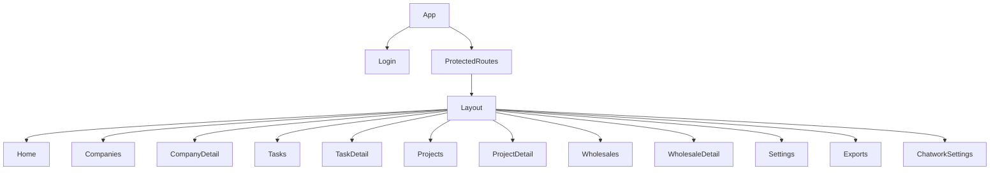
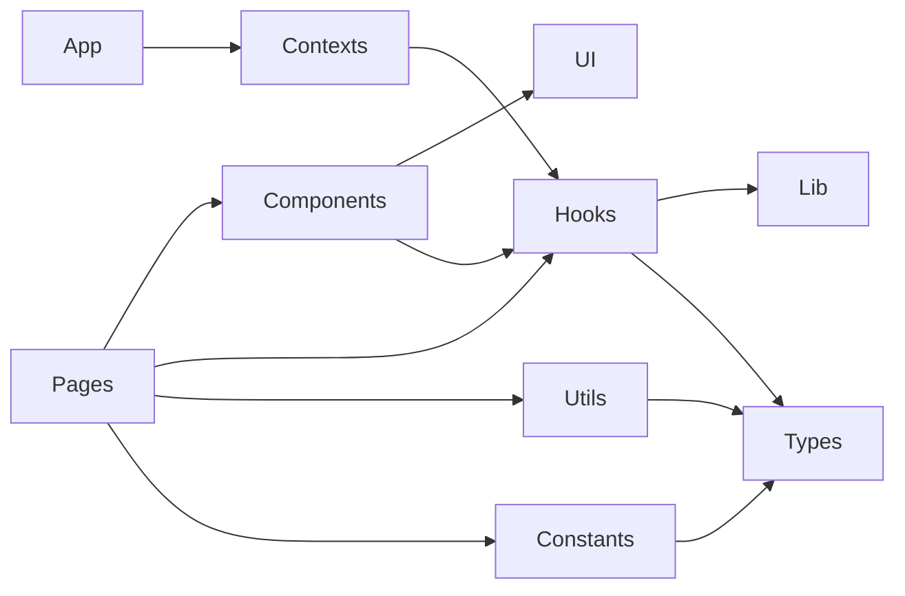
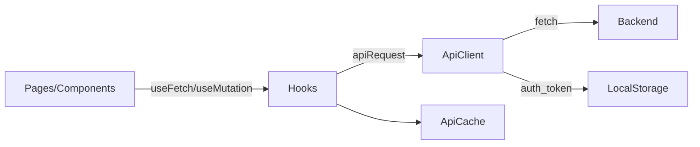

# 図

## ルートフロー

```mermaid
graph TD
  App --> Login
  App --> ProtectedRoutes
  ProtectedRoutes --> Layout
  Layout --> Home
  Layout --> Companies
  Layout --> CompanyDetail
  Layout --> Tasks
  Layout --> TaskDetail
  Layout --> Projects
  Layout --> ProjectDetail
  Layout --> Wholesales
  Layout --> WholesaleDetail
  Layout --> Settings
  Layout --> Exports
  Layout --> ChatworkSettings
```

## レイヤーマップ

```mermaid
graph LR
  Pages --> Components
  Pages --> Hooks
  Pages --> Utils
  Pages --> Constants
  Components --> UI
  Components --> Hooks
  Hooks --> Lib
  Hooks --> Types
  Utils --> Types
  Constants --> Types
  Contexts --> Hooks
  App --> Contexts
```

## APIフロー

```mermaid
graph LR
  UI[Pages/Components] -->|useFetch/useMutation| Hooks
  Hooks -->|apiRequest| ApiClient
  Hooks --> ApiCache
  ApiClient -->|fetch| Backend
  ApiClient -->|auth_token| LocalStorage
```
