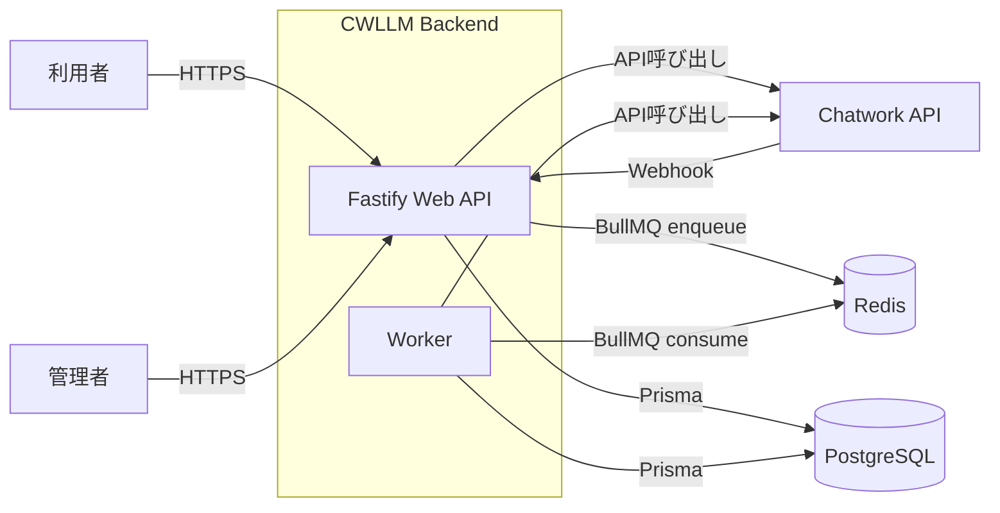
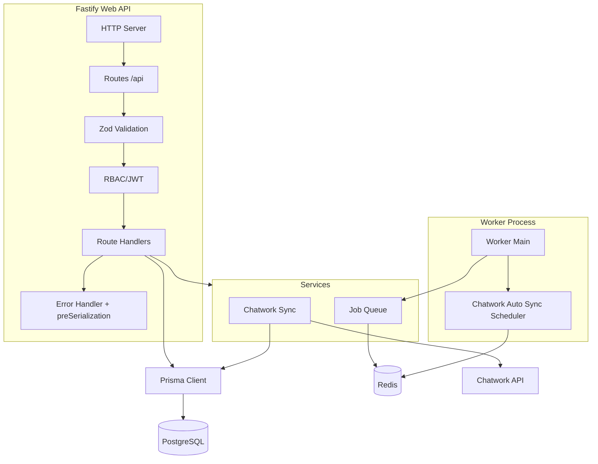
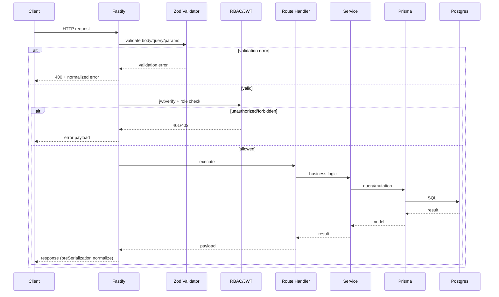
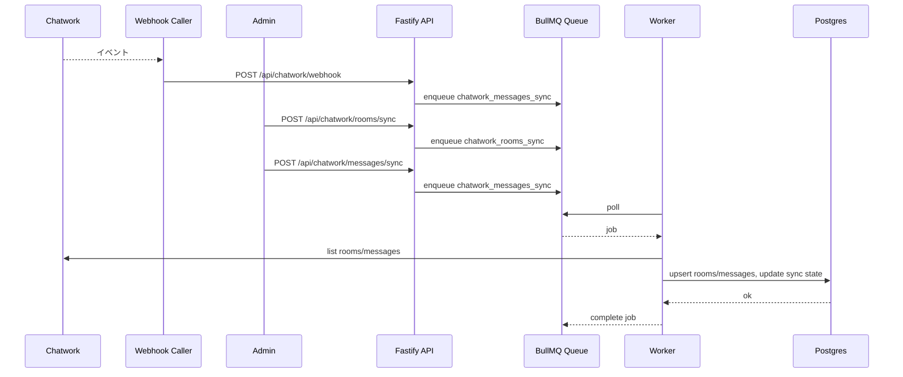
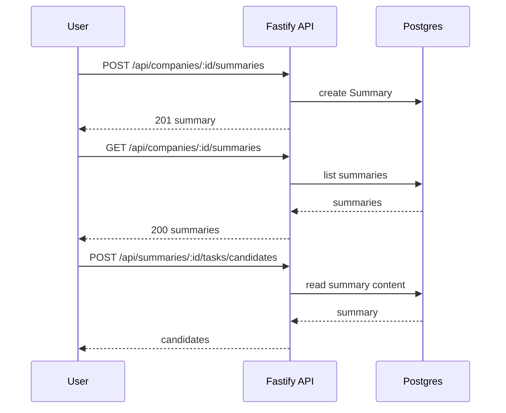
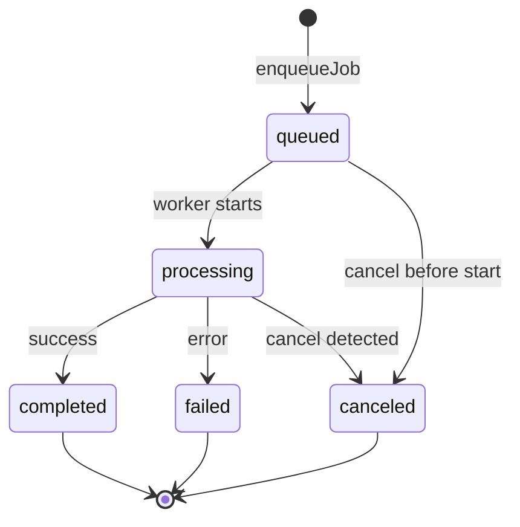
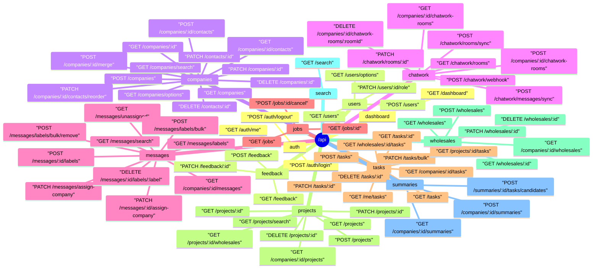
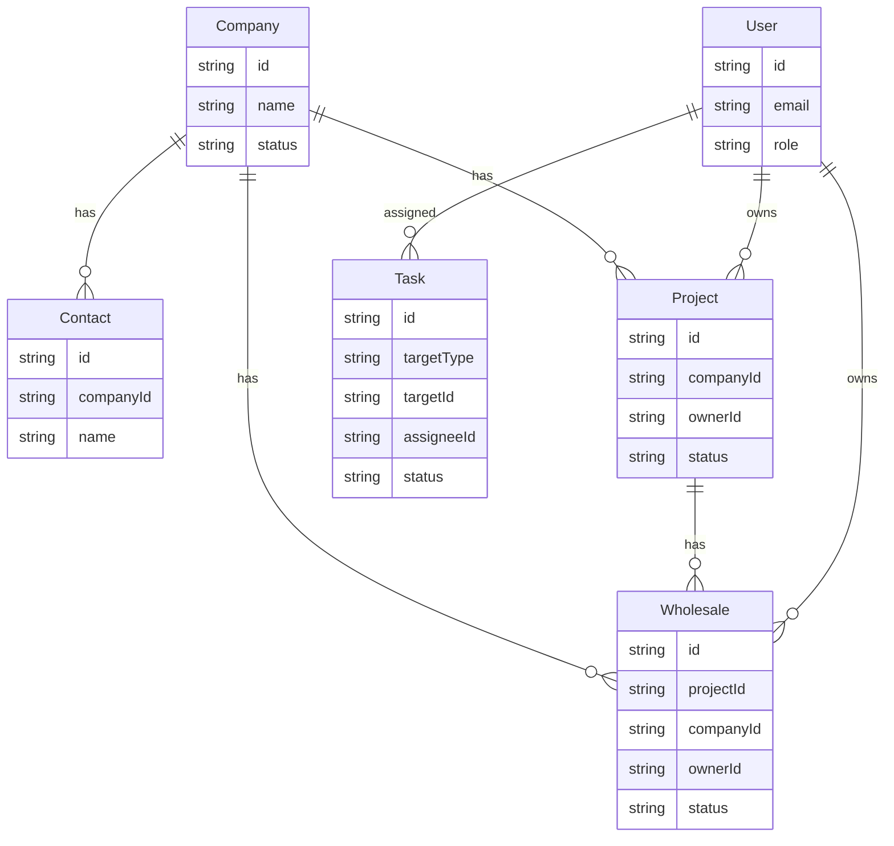
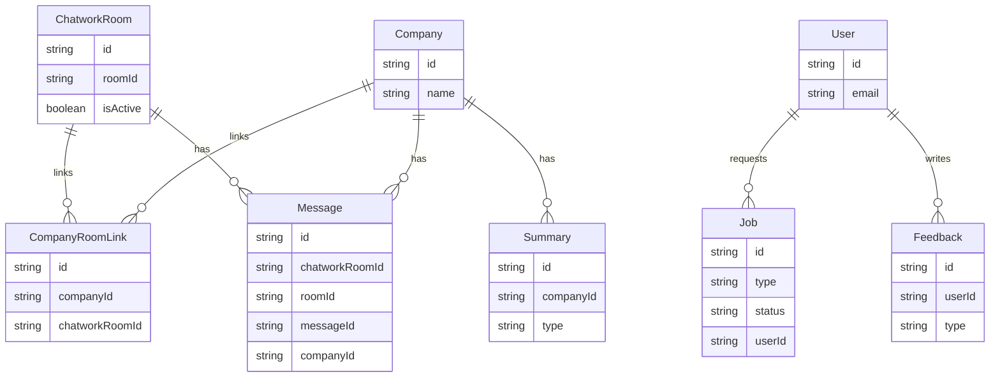

# CWLLM Backend Architecture (Mermaid)

このドキュメントは、`CWLLM` バックエンドの主要コンポーネントとデータフローをMermaidで可視化したものです。
図の対象は Web API, Worker, Job Queue, Chatwork連携, Prisma/Postgres, Redis, 認証/RBAC, 主要CRUD を含みます。

**System Context**
目的: 外部システムとBackend全体の関係を俯瞰する。

範囲: Web/Workerプロセスと外部依存の接続点。
参照ソース:
- `src/index.ts`
- `src/worker.ts`
- `src/services/jobQueue.ts`
- `src/services/chatworkScheduler.ts`
- `src/config/env.ts`
- `prisma/schema.prisma`

**Container and Component Map**
目的: Web API と Worker 内部の主要コンポーネント依存を把握する。

範囲: Fastify内部の構成とWorker実行系、主要サービスの依存。
参照ソース:
- `src/index.ts`
- `src/worker.ts`
- `src/routes/index.ts`
- `src/middleware/rbac.ts`
- `src/services/chatworkSync.ts`
- `src/services/jobQueue.ts`
- `src/config/env.ts`

**Request Lifecycle**
目的: HTTPリクエストがAPIを通過する流れを整理する。

範囲: Web API の一般的なリクエスト処理とエラー整形。
参照ソース:
- `src/index.ts`
- `src/middleware/rbac.ts`
- `src/routes/*.ts`
- `src/routes/*.handlers.ts`
- `src/utils/errors.ts`

**Chatwork同期フロー**
目的: Webhookと手動同期がJob Queueを介して実行される流れを把握する。

範囲: Chatwork Webhook と手動同期のジョブ化および実行。
参照ソース:
- `src/routes/chatwork.ts`
- `src/routes/chatwork.handlers.ts`
- `src/services/jobQueue.ts`
- `src/services/chatworkSync.ts`
- `src/services/chatworkScheduler.ts`
- `src/config/env.ts`

**サマリ作成フロー**
目的: サマリ作成と候補抽出の流れを追う。

範囲: Summary作成、一覧取得、候補抽出。
参照ソース:
- `src/routes/summaries.ts`
- `src/routes/summaries.handlers.ts`

**Jobライフサイクル**
目的: Job状態遷移を整理する。

範囲: Jobの状態遷移とキャンセルパス。
参照ソース:
- `src/services/jobQueue.ts`
- `prisma/schema.prisma`

補足: `REDIS_URL` が無い非本番環境では、Webプロセス内でJobを即時実行する分岐があります。

**Route Map**
目的: APIエンドポイントの全体像を把握する。

範囲: `registerRoutes` に登録される `/api` 配下のエンドポイント。
参照ソース:
- `src/routes/index.ts`
- `src/routes/*.ts`

**ER Diagram: 業務エンティティ**
目的: 会社、案件、タスクなど主要業務データの関係を整理する。

範囲: 会社、プロジェクト、卸、タスク、ユーザーの関連。
参照ソース:
- `prisma/schema.prisma`

補足: `Task.targetType + targetId` は `Company` `Project` `Wholesale` `General` を参照するポリモーフィック構造です。

**ER Diagram: 連携と運用エンティティ**
目的: Chatwork連携、メッセージ、サマリ、ジョブ、フィードバックの関係を整理する。

範囲: Chatwork連携、メッセージ、サマリ、ジョブ、フィードバック。
参照ソース:
- `prisma/schema.prisma`
- `src/services/chatworkSync.ts`
- `src/services/jobQueue.ts`

補足: `Message` は `Project` `Wholesale` にも任意で紐付きます。

**Mermaidプレビュー**
目的: 生成した図が破綻していないか確認する。
- VSCodeのMermaid拡張やGitHubのMarkdownプレビューでレンダリング確認が可能。
- 文字数が多い図は拡大表示で確認してください。
