# ARCHITECTURE

## 概要
`src/` 配下の全ファイル（テスト除外）を対象に、import依存を可視化した図解。
修正影響の追跡を目的に、ファイル単位で依存関係を示す。

## 実行時フロー
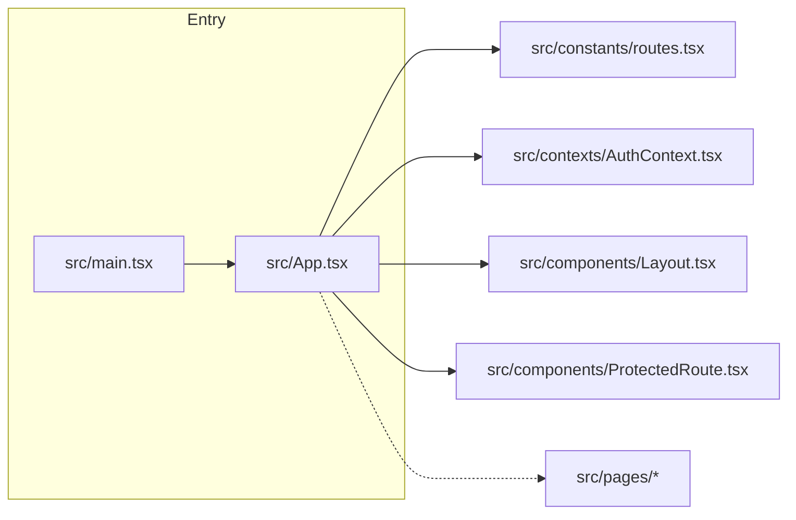

## ルーティング / 認証ガード
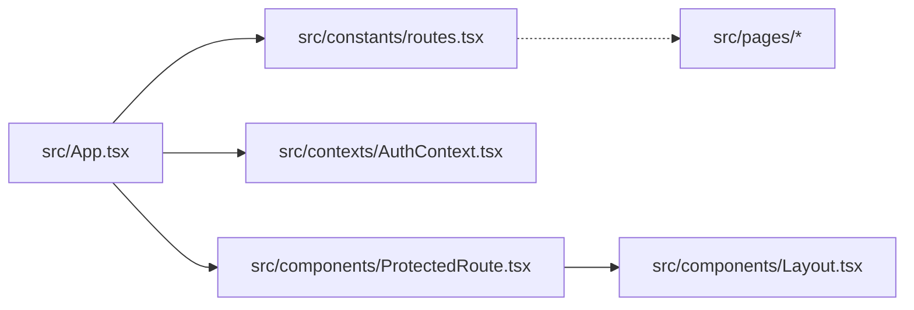

## API / データ取得の流れ
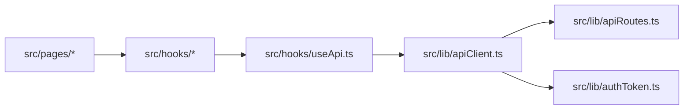

## レイヤー別依存図: entry
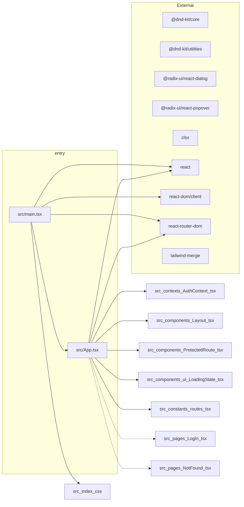

## レイヤー別依存図: contexts
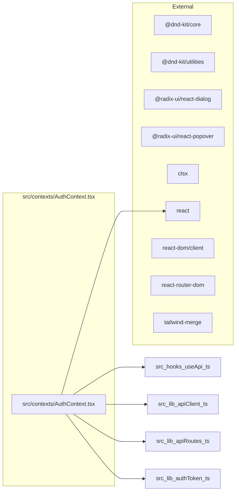

## レイヤー別依存図: pages
```mermaid
flowchart LR
  subgraph src/pages/AccountCreate.tsx
    src_pages_AccountCreate_tsx["src/pages/AccountCreate.tsx"]
  end
  subgraph src/pages/ChatworkSettings.tsx
    src_pages_ChatworkSettings_tsx["src/pages/ChatworkSettings.tsx"]
  end
  subgraph src/pages/Companies.tsx
    src_pages_Companies_tsx["src/pages/Companies.tsx"]
  end
  subgraph src/pages/CompanyDetail.tsx
    src_pages_CompanyDetail_tsx["src/pages/CompanyDetail.tsx"]
  end
  subgraph src/pages/Feedback.tsx
    src_pages_Feedback_tsx["src/pages/Feedback.tsx"]
  end
  subgraph src/pages/Home.tsx
    src_pages_Home_tsx["src/pages/Home.tsx"]
  end
  subgraph src/pages/Login.tsx
    src_pages_Login_tsx["src/pages/Login.tsx"]
  end
  subgraph src/pages/NotFound.tsx
    src_pages_NotFound_tsx["src/pages/NotFound.tsx"]
  end
  subgraph src/pages/ProjectDetail.tsx
    src_pages_ProjectDetail_tsx["src/pages/ProjectDetail.tsx"]
  end
  subgraph src/pages/Projects.tsx
    src_pages_Projects_tsx["src/pages/Projects.tsx"]
  end
  subgraph src/pages/TaskDetail.tsx
    src_pages_TaskDetail_tsx["src/pages/TaskDetail.tsx"]
  end
  subgraph src/pages/Tasks.tsx
    src_pages_Tasks_tsx["src/pages/Tasks.tsx"]
  end
  subgraph src/pages/WholesaleDetail.tsx
    src_pages_WholesaleDetail_tsx["src/pages/WholesaleDetail.tsx"]
  end
  src_pages_AccountCreate_tsx --> src_components_ui_Button_tsx
  src_pages_AccountCreate_tsx --> src_components_ui_Card_tsx
  src_pages_AccountCreate_tsx --> src_components_ui_EmptyState_tsx
  src_pages_AccountCreate_tsx --> src_components_ui_ErrorAlert_tsx
  src_pages_AccountCreate_tsx --> src_components_ui_FormInput_tsx
  src_pages_AccountCreate_tsx --> src_components_ui_FormSelect_tsx
  src_pages_AccountCreate_tsx --> src_components_ui_Skeleton_tsx
  src_pages_AccountCreate_tsx --> src_components_ui_Toast_tsx
  src_pages_AccountCreate_tsx --> src_hooks_useApi_ts
  src_pages_AccountCreate_tsx --> src_hooks_useToast_ts
  src_pages_AccountCreate_tsx --> src_lib_apiRoutes_ts
  src_pages_AccountCreate_tsx --> src_utils_date_ts
  src_pages_AccountCreate_tsx --> src_utils_errorState_ts
  src_pages_AccountCreate_tsx --> src_types_index_ts
  src_pages_AccountCreate_tsx --> src_contexts_AuthContext_tsx
  src_pages_ChatworkSettings_tsx --> src_components_ui_Button_tsx
  src_pages_ChatworkSettings_tsx --> src_components_ui_ErrorAlert_tsx
  src_pages_ChatworkSettings_tsx --> src_components_ui_JobProgressCard_tsx
  src_pages_ChatworkSettings_tsx --> src_components_ui_LoadingState_tsx
  src_pages_ChatworkSettings_tsx --> src_components_ui_Toast_tsx
  src_pages_ChatworkSettings_tsx --> src_components_ui_FormInput_tsx
  src_pages_ChatworkSettings_tsx --> src_components_ui_FormSelect_tsx
  src_pages_ChatworkSettings_tsx --> src_components_ui_Pagination_tsx
  src_pages_ChatworkSettings_tsx --> src_components_ui_EmptyState_tsx
  src_pages_ChatworkSettings_tsx --> src_components_ui_ActiveFilters_tsx
  src_pages_ChatworkSettings_tsx --> src_components_ui_FilterBadge_tsx
  src_pages_ChatworkSettings_tsx --> src_hooks_useApi_ts
  src_pages_ChatworkSettings_tsx --> src_hooks_usePermissions_ts
  src_pages_ChatworkSettings_tsx --> src_hooks_useToast_ts
  src_pages_ChatworkSettings_tsx --> src_lib_apiClient_ts
  src_pages_ChatworkSettings_tsx --> src_lib_apiRoutes_ts
  src_pages_ChatworkSettings_tsx --> src_lib_cn_ts
  src_pages_ChatworkSettings_tsx --> src_utils_errorState_ts
  src_pages_ChatworkSettings_tsx --> src_types_index_ts
  src_pages_Companies_tsx --> src_hooks_usePermissions_ts
  src_pages_Companies_tsx --> src_components_ui_Button_tsx
  src_pages_Companies_tsx --> src_components_ui_ErrorAlert_tsx
  src_pages_Companies_tsx --> src_components_ui_Pagination_tsx
  src_pages_Companies_tsx --> src_components_companies_CompanyFilters_tsx
  src_pages_Companies_tsx --> src_components_companies_CompanyTable_tsx
  src_pages_Companies_tsx --> src_components_companies_CompanyCreateForm_tsx
  src_pages_Companies_tsx --> src_hooks_useApi_ts
  src_pages_Companies_tsx --> src_hooks_useToast_ts
  src_pages_Companies_tsx --> src_components_ui_Toast_tsx
  src_pages_Companies_tsx --> src_hooks_useKeyboardShortcut_ts
  src_pages_Companies_tsx --> src_hooks_useListPage_ts
  src_pages_Companies_tsx --> src_lib_apiRoutes_ts
  src_pages_Companies_tsx --> src_constants_labels_ts
  src_pages_Companies_tsx --> src_types_index_ts
  src_pages_CompanyDetail_tsx --> src_components_SearchSelect_tsx
  src_pages_CompanyDetail_tsx --> src_components_companies_CompanyContactsSection_tsx
  src_pages_CompanyDetail_tsx --> src_components_companies_CompanyOverviewTab_tsx
  src_pages_CompanyDetail_tsx --> src_components_companies_CompanyProjectsTab_tsx
  src_pages_CompanyDetail_tsx --> src_components_companies_CompanySummariesTab_tsx
  src_pages_CompanyDetail_tsx --> src_components_companies_CompanyTasksSection_tsx
  src_pages_CompanyDetail_tsx --> src_components_companies_CompanyTimelineTab_tsx
  src_pages_CompanyDetail_tsx --> src_components_companies_CompanyWholesalesTab_tsx
  src_pages_CompanyDetail_tsx --> src_components_ui_ConfirmDialog_tsx
  src_pages_CompanyDetail_tsx --> src_components_ui_ErrorAlert_tsx
  src_pages_CompanyDetail_tsx --> src_components_ui_Modal_tsx
  src_pages_CompanyDetail_tsx --> src_components_ui_Skeleton_tsx
  src_pages_CompanyDetail_tsx --> src_components_ui_StatusBadge_tsx
  src_pages_CompanyDetail_tsx --> src_components_ui_Tabs_tsx
  src_pages_CompanyDetail_tsx --> src_components_ui_Toast_tsx
  src_pages_CompanyDetail_tsx --> src_hooks_usePermissions_ts
  src_pages_CompanyDetail_tsx --> src_hooks_useApi_ts
  src_pages_CompanyDetail_tsx --> src_hooks_useCompanyContacts_ts
  src_pages_CompanyDetail_tsx --> src_hooks_useCompanyDetailData_ts
  src_pages_CompanyDetail_tsx --> src_hooks_useCompanyOverviewForm_ts
  src_pages_CompanyDetail_tsx --> src_hooks_useToast_ts
  src_pages_CompanyDetail_tsx --> src_lib_apiRoutes_ts
  src_pages_CompanyDetail_tsx --> src_lib_cn_ts
  src_pages_CompanyDetail_tsx --> src_types_index_ts
  src_pages_CompanyDetail_tsx --> src_utils_string_ts
  src_pages_CompanyDetail_tsx --> src_constants_labels_ts
  src_pages_Feedback_tsx --> src_components_ui_ErrorAlert_tsx
  src_pages_Feedback_tsx --> src_components_ui_SuccessAlert_tsx
  src_pages_Feedback_tsx --> src_components_ui_Button_tsx
  src_pages_Feedback_tsx --> src_components_ui_FormInput_tsx
  src_pages_Feedback_tsx --> src_components_ui_FormSelect_tsx
  src_pages_Feedback_tsx --> src_components_ui_FormTextarea_tsx
  src_pages_Feedback_tsx --> src_contexts_AuthContext_tsx
  src_pages_Feedback_tsx --> src_hooks_usePermissions_ts
  src_pages_Feedback_tsx --> src_hooks_useApi_ts
  src_pages_Feedback_tsx --> src_lib_apiRoutes_ts
  src_pages_Feedback_tsx --> src_utils_errorState_ts
  src_pages_Home_tsx --> src_components_ui_ErrorAlert_tsx
  src_pages_Home_tsx --> src_contexts_AuthContext_tsx
  src_pages_Home_tsx --> src_hooks_useApi_ts
  src_pages_Home_tsx --> src_lib_apiRoutes_ts
  src_pages_Home_tsx --> src_lib_cn_ts
  src_pages_Home_tsx --> src_types_index_ts
  src_pages_Login_tsx --> src_components_ui_Button_tsx
  src_pages_Login_tsx --> src_contexts_AuthContext_tsx
  src_pages_Login_tsx --> src_utils_errorState_ts
  src_pages_ProjectDetail_tsx --> src_components_SearchSelect_tsx
  src_pages_ProjectDetail_tsx --> src_components_ui_ConfirmDialog_tsx
  src_pages_ProjectDetail_tsx --> src_components_ui_Modal_tsx
  src_pages_ProjectDetail_tsx --> src_components_ui_ErrorAlert_tsx
  src_pages_ProjectDetail_tsx --> src_components_ui_EmptyState_tsx
  src_pages_ProjectDetail_tsx --> src_components_ui_LoadingState_tsx
  src_pages_ProjectDetail_tsx --> src_components_ui_Button_tsx
  src_pages_ProjectDetail_tsx --> src_components_ui_Card_tsx
  src_pages_ProjectDetail_tsx --> src_components_ui_FormInput_tsx
  src_pages_ProjectDetail_tsx --> src_components_ui_FormSelect_tsx
  src_pages_ProjectDetail_tsx --> src_components_ui_FormTextarea_tsx
  src_pages_ProjectDetail_tsx --> src_components_ui_DateInput_tsx
  src_pages_ProjectDetail_tsx --> src_components_ui_StatusBadge_tsx
  src_pages_ProjectDetail_tsx --> src_hooks_useApi_ts
  src_pages_ProjectDetail_tsx --> src_hooks_usePermissions_ts
  src_pages_ProjectDetail_tsx --> src_hooks_useToast_ts
  src_pages_ProjectDetail_tsx --> src_components_ui_Toast_tsx
  src_pages_ProjectDetail_tsx --> src_lib_apiRoutes_ts
  src_pages_ProjectDetail_tsx --> src_constants_labels_ts
  src_pages_ProjectDetail_tsx --> src_utils_date_ts
  src_pages_ProjectDetail_tsx --> src_utils_format_ts
  src_pages_ProjectDetail_tsx --> src_types_index_ts
  src_pages_Projects_tsx --> src_components_SearchSelect_tsx
  src_pages_Projects_tsx --> src_components_ui_ErrorAlert_tsx
  src_pages_Projects_tsx --> src_components_ui_EmptyState_tsx
  src_pages_Projects_tsx --> src_components_ui_ActiveFilters_tsx
  src_pages_Projects_tsx --> src_components_ui_FilterBadge_tsx
  src_pages_Projects_tsx --> src_components_ui_Button_tsx
  src_pages_Projects_tsx --> src_components_ui_FormInput_tsx
  src_pages_Projects_tsx --> src_components_ui_FormSelect_tsx
  src_pages_Projects_tsx --> src_components_ui_FormTextarea_tsx
  src_pages_Projects_tsx --> src_components_ui_DateInput_tsx
  src_pages_Projects_tsx --> src_components_ui_Card_tsx
  src_pages_Projects_tsx --> src_components_ui_Pagination_tsx
  src_pages_Projects_tsx --> src_components_ui_Skeleton_tsx
  src_pages_Projects_tsx --> src_components_ui_StatusBadge_tsx
  src_pages_Projects_tsx --> src_components_ui_Toast_tsx
  src_pages_Projects_tsx --> src_hooks_usePermissions_ts
  src_pages_Projects_tsx --> src_hooks_useApi_ts
  src_pages_Projects_tsx --> src_hooks_useToast_ts
  src_pages_Projects_tsx --> src_hooks_useKeyboardShortcut_ts
  src_pages_Projects_tsx --> src_hooks_useListPage_ts
  src_pages_Projects_tsx --> src_constants_labels_ts
  src_pages_Projects_tsx --> src_types_index_ts
  src_pages_Projects_tsx --> src_utils_format_ts
  src_pages_Projects_tsx --> src_lib_apiRoutes_ts
  src_pages_TaskDetail_tsx --> src_components_ui_ConfirmDialog_tsx
  src_pages_TaskDetail_tsx --> src_components_ui_ErrorAlert_tsx
  src_pages_TaskDetail_tsx --> src_components_ui_FormInput_tsx
  src_pages_TaskDetail_tsx --> src_components_ui_DateInput_tsx
  src_pages_TaskDetail_tsx --> src_components_ui_FormSelect_tsx
  src_pages_TaskDetail_tsx --> src_components_ui_FormTextarea_tsx
  src_pages_TaskDetail_tsx --> src_components_ui_StatusBadge_tsx
  src_pages_TaskDetail_tsx --> src_hooks_useApi_ts
  src_pages_TaskDetail_tsx --> src_hooks_usePermissions_ts
  src_pages_TaskDetail_tsx --> src_hooks_useToast_ts
  src_pages_TaskDetail_tsx --> src_components_ui_Toast_tsx
  src_pages_TaskDetail_tsx --> src_lib_apiRoutes_ts
  src_pages_TaskDetail_tsx --> src_constants_labels_ts
  src_pages_TaskDetail_tsx --> src_utils_date_ts
  src_pages_TaskDetail_tsx --> src_utils_routes_ts
  src_pages_TaskDetail_tsx --> src_types_index_ts
  src_pages_TaskDetail_tsx --> src_strings_tasks_ts
  src_pages_Tasks_tsx --> src_hooks_usePermissions_ts
  src_pages_Tasks_tsx --> src_components_ui_ConfirmDialog_tsx
  src_pages_Tasks_tsx --> src_components_ui_ErrorAlert_tsx
  src_pages_Tasks_tsx --> src_components_ui_Button_tsx
  src_pages_Tasks_tsx --> src_components_ui_FormInput_tsx
  src_pages_Tasks_tsx --> src_components_ui_DateInput_tsx
  src_pages_Tasks_tsx --> src_components_ui_FormTextarea_tsx
  src_pages_Tasks_tsx --> src_components_ui_FormSelect_tsx
  src_pages_Tasks_tsx --> src_components_ui_SlidePanel_tsx
  src_pages_Tasks_tsx --> src_components_ui_Pagination_tsx
  src_pages_Tasks_tsx --> src_components_ui_Skeleton_tsx
  src_pages_Tasks_tsx --> src_components_SearchSelect_tsx
  src_pages_Tasks_tsx --> src_components_tasks_TaskFilters_tsx
  src_pages_Tasks_tsx --> src_components_tasks_TaskTable_tsx
  src_pages_Tasks_tsx --> src_components_tasks_TaskKanban_tsx
  src_pages_Tasks_tsx --> src_components_tasks_TaskBulkActions_tsx
  src_pages_Tasks_tsx --> src_hooks_useApi_ts
  src_pages_Tasks_tsx --> src_hooks_useToast_ts
  src_pages_Tasks_tsx --> src_components_ui_Toast_tsx
  src_pages_Tasks_tsx --> src_hooks_useKeyboardShortcut_ts
  src_pages_Tasks_tsx --> src_hooks_useListPage_ts
  src_pages_Tasks_tsx --> src_utils_errorState_ts
  src_pages_Tasks_tsx --> src_lib_cn_ts
  src_pages_Tasks_tsx --> src_types_index_ts
  src_pages_Tasks_tsx --> src_lib_apiRoutes_ts
  src_pages_Tasks_tsx --> src_strings_tasks_ts
  src_pages_Tasks_tsx --> src_constants_labels_ts
  src_pages_WholesaleDetail_tsx --> src_components_ui_ConfirmDialog_tsx
  src_pages_WholesaleDetail_tsx --> src_components_ui_ErrorAlert_tsx
  src_pages_WholesaleDetail_tsx --> src_components_ui_Pagination_tsx
  src_pages_WholesaleDetail_tsx --> src_components_ui_Skeleton_tsx
  src_pages_WholesaleDetail_tsx --> src_components_ui_StatusBadge_tsx
  src_pages_WholesaleDetail_tsx --> src_components_ui_Toast_tsx
  src_pages_WholesaleDetail_tsx --> src_components_ui_LoadingState_tsx
  src_pages_WholesaleDetail_tsx --> src_components_ui_FormInput_tsx
  src_pages_WholesaleDetail_tsx --> src_components_ui_FormSelect_tsx
  src_pages_WholesaleDetail_tsx --> src_components_ui_FormTextarea_tsx
  src_pages_WholesaleDetail_tsx --> src_components_ui_DateInput_tsx
  src_pages_WholesaleDetail_tsx --> src_components_ui_Button_tsx
  src_pages_WholesaleDetail_tsx --> src_components_ui_Card_tsx
  src_pages_WholesaleDetail_tsx --> src_hooks_useApi_ts
  src_pages_WholesaleDetail_tsx --> src_hooks_usePagination_ts
  src_pages_WholesaleDetail_tsx --> src_hooks_usePaginationSync_ts
  src_pages_WholesaleDetail_tsx --> src_hooks_usePermissions_ts
  src_pages_WholesaleDetail_tsx --> src_hooks_useToast_ts
  src_pages_WholesaleDetail_tsx --> src_lib_apiRoutes_ts
  src_pages_WholesaleDetail_tsx --> src_utils_date_ts
  src_pages_WholesaleDetail_tsx --> src_utils_format_ts
  src_pages_WholesaleDetail_tsx --> src_types_index_ts
  src_pages_WholesaleDetail_tsx --> src_constants_labels_ts
  subgraph External
    EXT__dnd_kit_core["@dnd-kit/core"]
    EXT__dnd_kit_utilities["@dnd-kit/utilities"]
    EXT__radix_ui_react_dialog["@radix-ui/react-dialog"]
    EXT__radix_ui_react_popover["@radix-ui/react-popover"]
    EXT_clsx["clsx"]
    EXT_react["react"]
    EXT_react_dom_client["react-dom/client"]
    EXT_react_router_dom["react-router-dom"]
    EXT_tailwind_merge["tailwind-merge"]
  end
  src_pages_AccountCreate_tsx --> EXT_react
  src_pages_ChatworkSettings_tsx --> EXT_react
  src_pages_Companies_tsx --> EXT_react
  src_pages_CompanyDetail_tsx --> EXT_react
  src_pages_CompanyDetail_tsx --> EXT_react_router_dom
  src_pages_Feedback_tsx --> EXT_react
  src_pages_Home_tsx --> EXT_react_router_dom
  src_pages_Home_tsx --> EXT_react
  src_pages_Login_tsx --> EXT_react
  src_pages_Login_tsx --> EXT_react_router_dom
  src_pages_NotFound_tsx --> EXT_react_router_dom
  src_pages_ProjectDetail_tsx --> EXT_react
  src_pages_ProjectDetail_tsx --> EXT_react_router_dom
  src_pages_Projects_tsx --> EXT_react
  src_pages_Projects_tsx --> EXT_react_router_dom
  src_pages_TaskDetail_tsx --> EXT_react
  src_pages_TaskDetail_tsx --> EXT_react_router_dom
  src_pages_Tasks_tsx --> EXT_react
  src_pages_WholesaleDetail_tsx --> EXT_react
  src_pages_WholesaleDetail_tsx --> EXT_react_router_dom
```

## レイヤー別依存図: components
```mermaid
flowchart LR
  subgraph src/components/KanbanBoard.tsx
    src_components_KanbanBoard_tsx["src/components/KanbanBoard.tsx"]
  end
  subgraph src/components/KanbanCard.tsx
    src_components_KanbanCard_tsx["src/components/KanbanCard.tsx"]
  end
  subgraph src/components/KanbanColumn.tsx
    src_components_KanbanColumn_tsx["src/components/KanbanColumn.tsx"]
  end
  subgraph src/components/Layout.tsx
    src_components_Layout_tsx["src/components/Layout.tsx"]
  end
  subgraph src/components/ProtectedRoute.tsx
    src_components_ProtectedRoute_tsx["src/components/ProtectedRoute.tsx"]
  end
  subgraph src/components/SearchSelect.tsx
    src_components_SearchSelect_tsx["src/components/SearchSelect.tsx"]
  end
  subgraph src/components/companies
    src_components_companies_CompanyContactsSection_tsx["src/components/companies/CompanyContactsSection.tsx"]
    src_components_companies_CompanyCreateForm_tsx["src/components/companies/CompanyCreateForm.tsx"]
    src_components_companies_CompanyFilters_tsx["src/components/companies/CompanyFilters.tsx"]
    src_components_companies_CompanyOverviewTab_tsx["src/components/companies/CompanyOverviewTab.tsx"]
    src_components_companies_CompanyProjectsTab_tsx["src/components/companies/CompanyProjectsTab.tsx"]
    src_components_companies_CompanySummariesTab_tsx["src/components/companies/CompanySummariesTab.tsx"]
    src_components_companies_CompanyTable_tsx["src/components/companies/CompanyTable.tsx"]
    src_components_companies_CompanyTasksSection_tsx["src/components/companies/CompanyTasksSection.tsx"]
    src_components_companies_CompanyTimelineTab_tsx["src/components/companies/CompanyTimelineTab.tsx"]
    src_components_companies_CompanyWholesalesTab_tsx["src/components/companies/CompanyWholesalesTab.tsx"]
  end
  subgraph src/components/tasks
    src_components_tasks_index_ts["src/components/tasks/index.ts"]
    src_components_tasks_TaskBulkActions_tsx["src/components/tasks/TaskBulkActions.tsx"]
    src_components_tasks_TaskFilters_tsx["src/components/tasks/TaskFilters.tsx"]
    src_components_tasks_TaskKanban_tsx["src/components/tasks/TaskKanban.tsx"]
    src_components_tasks_TaskTable_tsx["src/components/tasks/TaskTable.tsx"]
  end
  subgraph src/components/ui
    src_components_ui_ActiveFilters_tsx["src/components/ui/ActiveFilters.tsx"]
    src_components_ui_Alert_tsx["src/components/ui/Alert.tsx"]
    src_components_ui_Badge_tsx["src/components/ui/Badge.tsx"]
    src_components_ui_Button_tsx["src/components/ui/Button.tsx"]
    src_components_ui_Card_tsx["src/components/ui/Card.tsx"]
    src_components_ui_CloseIcon_tsx["src/components/ui/CloseIcon.tsx"]
    src_components_ui_ConfirmDialog_tsx["src/components/ui/ConfirmDialog.tsx"]
    src_components_ui_DateInput_tsx["src/components/ui/DateInput.tsx"]
    src_components_ui_EmptyState_tsx["src/components/ui/EmptyState.tsx"]
    src_components_ui_ErrorAlert_tsx["src/components/ui/ErrorAlert.tsx"]
    src_components_ui_FilterBadge_tsx["src/components/ui/FilterBadge.tsx"]
    src_components_ui_FormInput_tsx["src/components/ui/FormInput.tsx"]
    src_components_ui_FormSelect_tsx["src/components/ui/FormSelect.tsx"]
    src_components_ui_FormTextarea_tsx["src/components/ui/FormTextarea.tsx"]
    src_components_ui_JobProgressCard_tsx["src/components/ui/JobProgressCard.tsx"]
    src_components_ui_LoadingState_tsx["src/components/ui/LoadingState.tsx"]
    src_components_ui_Modal_tsx["src/components/ui/Modal.tsx"]
    src_components_ui_MultiSelect_tsx["src/components/ui/MultiSelect.tsx"]
    src_components_ui_Pagination_tsx["src/components/ui/Pagination.tsx"]
    src_components_ui_Popover_tsx["src/components/ui/Popover.tsx"]
    src_components_ui_Skeleton_tsx["src/components/ui/Skeleton.tsx"]
    src_components_ui_SlidePanel_tsx["src/components/ui/SlidePanel.tsx"]
    src_components_ui_StatusBadge_tsx["src/components/ui/StatusBadge.tsx"]
    src_components_ui_SuccessAlert_tsx["src/components/ui/SuccessAlert.tsx"]
    src_components_ui_Tabs_tsx["src/components/ui/Tabs.tsx"]
    src_components_ui_Toast_tsx["src/components/ui/Toast.tsx"]
  end
  src_components_KanbanBoard_tsx --> src_components_KanbanColumn_tsx
  src_components_KanbanBoard_tsx --> src_components_KanbanCard_tsx
  src_components_KanbanBoard_tsx --> src_types_index_ts
  src_components_KanbanBoard_tsx --> src_constants_labels_ts
  src_components_KanbanCard_tsx --> src_types_index_ts
  src_components_KanbanCard_tsx --> src_utils_date_ts
  src_components_KanbanCard_tsx --> src_utils_routes_ts
  src_components_KanbanCard_tsx --> src_lib_cn_ts
  src_components_KanbanCard_tsx --> src_components_ui_FormSelect_tsx
  src_components_KanbanCard_tsx --> src_components_ui_StatusBadge_tsx
  src_components_KanbanColumn_tsx --> src_components_KanbanCard_tsx
  src_components_KanbanColumn_tsx --> src_types_index_ts
  src_components_KanbanColumn_tsx --> src_lib_cn_ts
  src_components_Layout_tsx --> src_constants_routes_tsx
  src_components_Layout_tsx --> src_hooks_usePermissions_ts
  src_components_Layout_tsx --> src_lib_cn_ts
  src_components_ProtectedRoute_tsx --> src_contexts_AuthContext_tsx
  src_components_ProtectedRoute_tsx --> src_components_ui_LoadingState_tsx
  src_components_SearchSelect_tsx --> src_hooks_useApi_ts
  src_components_SearchSelect_tsx --> src_hooks_useDebouncedValue_ts
  src_components_SearchSelect_tsx --> src_lib_apiRoutes_ts
  src_components_SearchSelect_tsx --> src_components_ui_FormInput_tsx
  src_components_SearchSelect_tsx --> src_components_ui_CloseIcon_tsx
  src_components_companies_CompanyContactsSection_tsx --> src_components_ui_ErrorAlert_tsx
  src_components_companies_CompanyContactsSection_tsx --> src_components_ui_FormInput_tsx
  src_components_companies_CompanyContactsSection_tsx --> src_components_ui_FormTextarea_tsx
  src_components_companies_CompanyContactsSection_tsx --> src_components_ui_Modal_tsx
  src_components_companies_CompanyContactsSection_tsx --> src_components_ui_EmptyState_tsx
  src_components_companies_CompanyContactsSection_tsx --> src_lib_cn_ts
  src_components_companies_CompanyContactsSection_tsx --> src_utils_string_ts
  src_components_companies_CompanyContactsSection_tsx --> src_types_index_ts
  src_components_companies_CompanyCreateForm_tsx --> src_components_ui_LoadingState_tsx
  src_components_companies_CompanyCreateForm_tsx --> src_components_ui_FormInput_tsx
  src_components_companies_CompanyCreateForm_tsx --> src_components_ui_FormSelect_tsx
  src_components_companies_CompanyCreateForm_tsx --> src_components_ui_FormTextarea_tsx
  src_components_companies_CompanyCreateForm_tsx --> src_components_ui_SlidePanel_tsx
  src_components_companies_CompanyCreateForm_tsx --> src_components_ui_MultiSelect_tsx
  src_components_companies_CompanyCreateForm_tsx --> src_components_ui_Button_tsx
  src_components_companies_CompanyCreateForm_tsx --> src_lib_cn_ts
  src_components_companies_CompanyCreateForm_tsx --> src_types_index_ts
  src_components_companies_CompanyFilters_tsx --> src_components_ui_Button_tsx
  src_components_companies_CompanyFilters_tsx --> src_components_ui_ActiveFilters_tsx
  src_components_companies_CompanyFilters_tsx --> src_components_ui_FilterBadge_tsx
  src_components_companies_CompanyFilters_tsx --> src_components_ui_FormInput_tsx
  src_components_companies_CompanyFilters_tsx --> src_components_ui_FormSelect_tsx
  src_components_companies_CompanyFilters_tsx --> src_components_ui_Popover_tsx
  src_components_companies_CompanyFilters_tsx --> src_types_index_ts
  src_components_companies_CompanyOverviewTab_tsx --> src_components_ui_Badge_tsx
  src_components_companies_CompanyOverviewTab_tsx --> src_components_ui_CloseIcon_tsx
  src_components_companies_CompanyOverviewTab_tsx --> src_components_ui_ErrorAlert_tsx
  src_components_companies_CompanyOverviewTab_tsx --> src_components_ui_FormInput_tsx
  src_components_companies_CompanyOverviewTab_tsx --> src_components_ui_FormSelect_tsx
  src_components_companies_CompanyOverviewTab_tsx --> src_components_ui_FormTextarea_tsx
  src_components_companies_CompanyOverviewTab_tsx --> src_components_ui_StatusBadge_tsx
  src_components_companies_CompanyOverviewTab_tsx --> src_types_index_ts
  src_components_companies_CompanyProjectsTab_tsx --> src_components_ui_EmptyState_tsx
  src_components_companies_CompanyProjectsTab_tsx --> src_components_ui_ErrorAlert_tsx
  src_components_companies_CompanyProjectsTab_tsx --> src_components_ui_Skeleton_tsx
  src_components_companies_CompanyProjectsTab_tsx --> src_components_ui_StatusBadge_tsx
  src_components_companies_CompanyProjectsTab_tsx --> src_utils_date_ts
  src_components_companies_CompanyProjectsTab_tsx --> src_utils_format_ts
  src_components_companies_CompanyProjectsTab_tsx --> src_types_index_ts
  src_components_companies_CompanySummariesTab_tsx --> src_components_ui_EmptyState_tsx
  src_components_companies_CompanySummariesTab_tsx --> src_components_ui_ErrorAlert_tsx
  src_components_companies_CompanySummariesTab_tsx --> src_components_ui_Skeleton_tsx
  src_components_companies_CompanySummariesTab_tsx --> src_utils_date_ts
  src_components_companies_CompanySummariesTab_tsx --> src_types_index_ts
  src_components_companies_CompanyTable_tsx --> src_components_ui_Button_tsx
  src_components_companies_CompanyTable_tsx --> src_components_ui_MultiSelect_tsx
  src_components_companies_CompanyTable_tsx --> src_components_ui_StatusBadge_tsx
  src_components_companies_CompanyTable_tsx --> src_components_ui_Skeleton_tsx
  src_components_companies_CompanyTable_tsx --> src_components_ui_EmptyState_tsx
  src_components_companies_CompanyTable_tsx --> src_utils_string_ts
  src_components_companies_CompanyTable_tsx --> src_lib_cn_ts
  src_components_companies_CompanyTable_tsx --> src_types_index_ts
  src_components_companies_CompanyTasksSection_tsx --> src_components_ui_ErrorAlert_tsx
  src_components_companies_CompanyTasksSection_tsx --> src_components_ui_FormInput_tsx
  src_components_companies_CompanyTasksSection_tsx --> src_components_ui_DateInput_tsx
  src_components_companies_CompanyTasksSection_tsx --> src_components_ui_FormSelect_tsx
  src_components_companies_CompanyTasksSection_tsx --> src_components_ui_FormTextarea_tsx
  src_components_companies_CompanyTasksSection_tsx --> src_components_ui_LoadingState_tsx
  src_components_companies_CompanyTasksSection_tsx --> src_components_ui_StatusBadge_tsx
  src_components_companies_CompanyTasksSection_tsx --> src_components_ui_EmptyState_tsx
  src_components_companies_CompanyTasksSection_tsx --> src_hooks_useApi_ts
  src_components_companies_CompanyTasksSection_tsx --> src_lib_apiRoutes_ts
  src_components_companies_CompanyTasksSection_tsx --> src_utils_date_ts
  src_components_companies_CompanyTasksSection_tsx --> src_utils_errorState_ts
  src_components_companies_CompanyTasksSection_tsx --> src_types_index_ts
  src_components_companies_CompanyTasksSection_tsx --> src_constants_labels_ts
  src_components_companies_CompanyTimelineTab_tsx --> src_components_ui_CloseIcon_tsx
  src_components_companies_CompanyTimelineTab_tsx --> src_components_ui_ErrorAlert_tsx
  src_components_companies_CompanyTimelineTab_tsx --> src_components_ui_FormInput_tsx
  src_components_companies_CompanyTimelineTab_tsx --> src_components_ui_DateInput_tsx
  src_components_companies_CompanyTimelineTab_tsx --> src_components_ui_Pagination_tsx
  src_components_companies_CompanyTimelineTab_tsx --> src_components_ui_Skeleton_tsx
  src_components_companies_CompanyTimelineTab_tsx --> src_components_ui_EmptyState_tsx
  src_components_companies_CompanyTimelineTab_tsx --> src_types_index_ts
  src_components_companies_CompanyTimelineTab_tsx --> src_utils_date_ts
  src_components_companies_CompanyWholesalesTab_tsx --> src_components_ui_EmptyState_tsx
  src_components_companies_CompanyWholesalesTab_tsx --> src_components_ui_ErrorAlert_tsx
  src_components_companies_CompanyWholesalesTab_tsx --> src_components_ui_Skeleton_tsx
  src_components_companies_CompanyWholesalesTab_tsx --> src_components_ui_StatusBadge_tsx
  src_components_companies_CompanyWholesalesTab_tsx --> src_utils_date_ts
  src_components_companies_CompanyWholesalesTab_tsx --> src_utils_format_ts
  src_components_companies_CompanyWholesalesTab_tsx --> src_types_index_ts
  src_components_tasks_TaskBulkActions_tsx --> src_components_ui_DateInput_tsx
  src_components_tasks_TaskBulkActions_tsx --> src_components_ui_FormSelect_tsx
  src_components_tasks_TaskBulkActions_tsx --> src_constants_labels_ts
  src_components_tasks_TaskBulkActions_tsx --> src_strings_tasks_ts
  src_components_tasks_TaskFilters_tsx --> src_components_ui_Button_tsx
  src_components_tasks_TaskFilters_tsx --> src_components_ui_ActiveFilters_tsx
  src_components_tasks_TaskFilters_tsx --> src_components_ui_FilterBadge_tsx
  src_components_tasks_TaskFilters_tsx --> src_components_ui_DateInput_tsx
  src_components_tasks_TaskFilters_tsx --> src_components_ui_FormInput_tsx
  src_components_tasks_TaskFilters_tsx --> src_components_ui_FormSelect_tsx
  src_components_tasks_TaskFilters_tsx --> src_components_ui_Popover_tsx
  src_components_tasks_TaskFilters_tsx --> src_constants_labels_ts
  src_components_tasks_TaskFilters_tsx --> src_types_index_ts
  src_components_tasks_TaskFilters_tsx --> src_strings_tasks_ts
  src_components_tasks_TaskKanban_tsx --> src_components_KanbanBoard_tsx
  src_components_tasks_TaskKanban_tsx --> src_types_index_ts
  src_components_tasks_TaskTable_tsx --> src_components_ui_EmptyState_tsx
  src_components_tasks_TaskTable_tsx --> src_components_ui_DateInput_tsx
  src_components_tasks_TaskTable_tsx --> src_components_ui_FormSelect_tsx
  src_components_tasks_TaskTable_tsx --> src_components_ui_Popover_tsx
  src_components_tasks_TaskTable_tsx --> src_components_ui_StatusBadge_tsx
  src_components_tasks_TaskTable_tsx --> src_utils_date_ts
  src_components_tasks_TaskTable_tsx --> src_utils_routes_ts
  src_components_tasks_TaskTable_tsx --> src_lib_cn_ts
  src_components_tasks_TaskTable_tsx --> src_constants_labels_ts
  src_components_tasks_TaskTable_tsx --> src_types_index_ts
  src_components_tasks_TaskTable_tsx --> src_strings_tasks_ts
  src_components_ui_ActiveFilters_tsx --> src_lib_cn_ts
  src_components_ui_Alert_tsx --> src_components_ui_CloseIcon_tsx
  src_components_ui_Alert_tsx --> src_lib_cn_ts
  src_components_ui_Badge_tsx --> src_lib_cn_ts
  src_components_ui_Button_tsx --> src_lib_cn_ts
  src_components_ui_Card_tsx --> src_lib_cn_ts
  src_components_ui_ConfirmDialog_tsx --> src_components_ui_Modal_tsx
  src_components_ui_DateInput_tsx --> src_components_ui_FormInput_tsx
  src_components_ui_DateInput_tsx --> src_lib_cn_ts
  src_components_ui_EmptyState_tsx --> src_lib_cn_ts
  src_components_ui_ErrorAlert_tsx --> src_components_ui_Alert_tsx
  src_components_ui_FilterBadge_tsx --> src_lib_cn_ts
  src_components_ui_FormInput_tsx --> src_lib_cn_ts
  src_components_ui_FormSelect_tsx --> src_lib_cn_ts
  src_components_ui_FormTextarea_tsx --> src_lib_cn_ts
  src_components_ui_JobProgressCard_tsx --> src_components_ui_Button_tsx
  src_components_ui_JobProgressCard_tsx --> src_types_index_ts
  src_components_ui_JobProgressCard_tsx --> src_lib_cn_ts
  src_components_ui_LoadingState_tsx --> src_lib_cn_ts
  src_components_ui_Modal_tsx --> src_components_ui_CloseIcon_tsx
  src_components_ui_Modal_tsx --> src_lib_cn_ts
  src_components_ui_MultiSelect_tsx --> src_lib_cn_ts
  src_components_ui_MultiSelect_tsx --> src_components_ui_Popover_tsx
  src_components_ui_Pagination_tsx --> src_lib_cn_ts
  src_components_ui_Popover_tsx --> src_lib_cn_ts
  src_components_ui_Skeleton_tsx --> src_lib_cn_ts
  src_components_ui_SlidePanel_tsx --> src_components_ui_CloseIcon_tsx
  src_components_ui_SlidePanel_tsx --> src_lib_cn_ts
  src_components_ui_StatusBadge_tsx --> src_constants_labels_ts
  src_components_ui_StatusBadge_tsx --> src_lib_cn_ts
  src_components_ui_SuccessAlert_tsx --> src_components_ui_Alert_tsx
  src_components_ui_Tabs_tsx --> src_lib_cn_ts
  src_components_ui_Toast_tsx --> src_components_ui_CloseIcon_tsx
  src_components_ui_Toast_tsx --> src_lib_cn_ts
  subgraph External
    EXT__dnd_kit_core["@dnd-kit/core"]
    EXT__dnd_kit_utilities["@dnd-kit/utilities"]
    EXT__radix_ui_react_dialog["@radix-ui/react-dialog"]
    EXT__radix_ui_react_popover["@radix-ui/react-popover"]
    EXT_clsx["clsx"]
    EXT_react["react"]
    EXT_react_dom_client["react-dom/client"]
    EXT_react_router_dom["react-router-dom"]
    EXT_tailwind_merge["tailwind-merge"]
  end
  src_components_companies_CompanyContactsSection_tsx --> EXT_react
  src_components_companies_CompanyOverviewTab_tsx --> EXT_react
  src_components_companies_CompanyProjectsTab_tsx --> EXT_react_router_dom
  src_components_companies_CompanyTable_tsx --> EXT_react_router_dom
  src_components_companies_CompanyTasksSection_tsx --> EXT_react
  src_components_companies_CompanyTimelineTab_tsx --> EXT_react
  src_components_companies_CompanyWholesalesTab_tsx --> EXT_react_router_dom
  src_components_KanbanBoard_tsx --> EXT_react
  src_components_KanbanBoard_tsx --> EXT__dnd_kit_core
  src_components_KanbanCard_tsx --> EXT__dnd_kit_core
  src_components_KanbanCard_tsx --> EXT__dnd_kit_utilities
  src_components_KanbanCard_tsx --> EXT_react_router_dom
  src_components_KanbanColumn_tsx --> EXT__dnd_kit_core
  src_components_Layout_tsx --> EXT_react
  src_components_Layout_tsx --> EXT_react_router_dom
  src_components_ProtectedRoute_tsx --> EXT_react
  src_components_ProtectedRoute_tsx --> EXT_react_router_dom
  src_components_SearchSelect_tsx --> EXT_react
  src_components_tasks_TaskTable_tsx --> EXT_react_router_dom
  src_components_ui_ActiveFilters_tsx --> EXT_react
  src_components_ui_Alert_tsx --> EXT_react
  src_components_ui_Button_tsx --> EXT_react
  src_components_ui_CloseIcon_tsx --> EXT_react
  src_components_ui_DateInput_tsx --> EXT_react
  src_components_ui_EmptyState_tsx --> EXT_react
  src_components_ui_ErrorAlert_tsx --> EXT_react
  src_components_ui_FormInput_tsx --> EXT_react
  src_components_ui_FormSelect_tsx --> EXT_react
  src_components_ui_FormTextarea_tsx --> EXT_react
  src_components_ui_LoadingState_tsx --> EXT_react
  src_components_ui_Modal_tsx --> EXT_react
  src_components_ui_MultiSelect_tsx --> EXT_react
  src_components_ui_Popover_tsx --> EXT_react
  src_components_ui_Popover_tsx --> EXT_react
  src_components_ui_Popover_tsx --> EXT__radix_ui_react_popover
  src_components_ui_SlidePanel_tsx --> EXT__radix_ui_react_dialog
  src_components_ui_SuccessAlert_tsx --> EXT_react
  src_components_ui_Tabs_tsx --> EXT_react
```

## レイヤー別依存図: hooks
```mermaid
flowchart LR
  subgraph src/hooks/useApi.ts
    src_hooks_useApi_ts["src/hooks/useApi.ts"]
  end
  subgraph src/hooks/useCompanyContacts.ts
    src_hooks_useCompanyContacts_ts["src/hooks/useCompanyContacts.ts"]
  end
  subgraph src/hooks/useCompanyDetailData.ts
    src_hooks_useCompanyDetailData_ts["src/hooks/useCompanyDetailData.ts"]
  end
  subgraph src/hooks/useCompanyOverviewForm.ts
    src_hooks_useCompanyOverviewForm_ts["src/hooks/useCompanyOverviewForm.ts"]
  end
  subgraph src/hooks/useDebouncedValue.ts
    src_hooks_useDebouncedValue_ts["src/hooks/useDebouncedValue.ts"]
  end
  subgraph src/hooks/useFilterForm.ts
    src_hooks_useFilterForm_ts["src/hooks/useFilterForm.ts"]
  end
  subgraph src/hooks/useFormState.ts
    src_hooks_useFormState_ts["src/hooks/useFormState.ts"]
  end
  subgraph src/hooks/useKeyboardShortcut.ts
    src_hooks_useKeyboardShortcut_ts["src/hooks/useKeyboardShortcut.ts"]
  end
  subgraph src/hooks/useListPage.ts
    src_hooks_useListPage_ts["src/hooks/useListPage.ts"]
  end
  subgraph src/hooks/useListQuery.ts
    src_hooks_useListQuery_ts["src/hooks/useListQuery.ts"]
  end
  subgraph src/hooks/usePagination.ts
    src_hooks_usePagination_ts["src/hooks/usePagination.ts"]
  end
  subgraph src/hooks/usePaginationSync.ts
    src_hooks_usePaginationSync_ts["src/hooks/usePaginationSync.ts"]
  end
  subgraph src/hooks/usePermissions.ts
    src_hooks_usePermissions_ts["src/hooks/usePermissions.ts"]
  end
  subgraph src/hooks/useToast.ts
    src_hooks_useToast_ts["src/hooks/useToast.ts"]
  end
  subgraph src/hooks/useUrlSync.ts
    src_hooks_useUrlSync_ts["src/hooks/useUrlSync.ts"]
  end
  src_hooks_useApi_ts --> src_lib_apiClient_ts
  src_hooks_useApi_ts --> src_lib_apiCache_ts
  src_hooks_useApi_ts --> src_lib_apiRequest_ts
  src_hooks_useCompanyContacts_ts --> src_lib_apiRoutes_ts
  src_hooks_useCompanyContacts_ts --> src_hooks_useApi_ts
  src_hooks_useCompanyContacts_ts --> src_types_index_ts
  src_hooks_useCompanyContacts_ts --> src_hooks_useToast_ts
  src_hooks_useCompanyContacts_ts --> src_utils_errorState_ts
  src_hooks_useCompanyDetailData_ts --> src_hooks_useApi_ts
  src_hooks_useCompanyDetailData_ts --> src_hooks_usePagination_ts
  src_hooks_useCompanyDetailData_ts --> src_hooks_usePaginationSync_ts
  src_hooks_useCompanyDetailData_ts --> src_lib_apiRoutes_ts
  src_hooks_useCompanyDetailData_ts --> src_types_index_ts
  src_hooks_useCompanyOverviewForm_ts --> src_hooks_useApi_ts
  src_hooks_useCompanyOverviewForm_ts --> src_lib_apiRoutes_ts
  src_hooks_useCompanyOverviewForm_ts --> src_types_index_ts
  src_hooks_useCompanyOverviewForm_ts --> src_hooks_useToast_ts
  src_hooks_useCompanyOverviewForm_ts --> src_utils_errorState_ts
  src_hooks_useFilterForm_ts --> src_hooks_useUrlSync_ts
  src_hooks_useListPage_ts --> src_hooks_useApi_ts
  src_hooks_useListPage_ts --> src_hooks_useDebouncedValue_ts
  src_hooks_useListPage_ts --> src_hooks_useListQuery_ts
  src_hooks_useListPage_ts --> src_hooks_usePaginationSync_ts
  src_hooks_useListPage_ts --> src_hooks_useUrlSync_ts
  src_hooks_useListPage_ts --> src_types_index_ts
  src_hooks_useListPage_ts --> src_utils_queryString_ts
  src_hooks_useListQuery_ts --> src_types_index_ts
  src_hooks_useListQuery_ts --> src_utils_queryString_ts
  src_hooks_usePagination_ts --> src_types_index_ts
  src_hooks_usePaginationSync_ts --> src_types_index_ts
  src_hooks_usePermissions_ts --> src_contexts_AuthContext_tsx
  src_hooks_useUrlSync_ts --> src_types_index_ts
  subgraph External
    EXT__dnd_kit_core["@dnd-kit/core"]
    EXT__dnd_kit_utilities["@dnd-kit/utilities"]
    EXT__radix_ui_react_dialog["@radix-ui/react-dialog"]
    EXT__radix_ui_react_popover["@radix-ui/react-popover"]
    EXT_clsx["clsx"]
    EXT_react["react"]
    EXT_react_dom_client["react-dom/client"]
    EXT_react_router_dom["react-router-dom"]
    EXT_tailwind_merge["tailwind-merge"]
  end
  src_hooks_useApi_ts --> EXT_react
  src_hooks_useCompanyContacts_ts --> EXT_react
  src_hooks_useCompanyDetailData_ts --> EXT_react
  src_hooks_useCompanyOverviewForm_ts --> EXT_react
  src_hooks_useDebouncedValue_ts --> EXT_react
  src_hooks_useFilterForm_ts --> EXT_react
  src_hooks_useFormState_ts --> EXT_react
  src_hooks_useKeyboardShortcut_ts --> EXT_react
  src_hooks_useListPage_ts --> EXT_react
  src_hooks_useListQuery_ts --> EXT_react
  src_hooks_usePagination_ts --> EXT_react
  src_hooks_usePaginationSync_ts --> EXT_react
  src_hooks_usePermissions_ts --> EXT_react
  src_hooks_useToast_ts --> EXT_react
  src_hooks_useUrlSync_ts --> EXT_react
  src_hooks_useUrlSync_ts --> EXT_react_router_dom
```

## レイヤー別依存図: lib
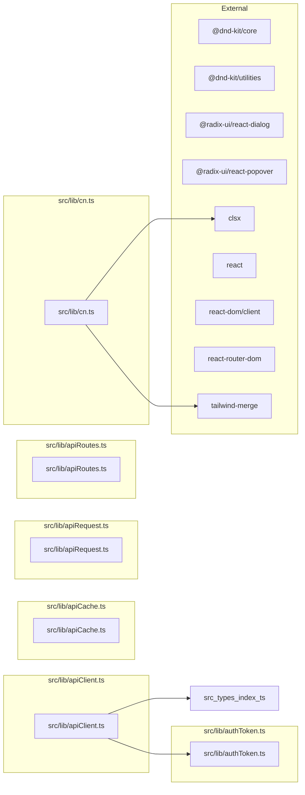

## レイヤー別依存図: utils
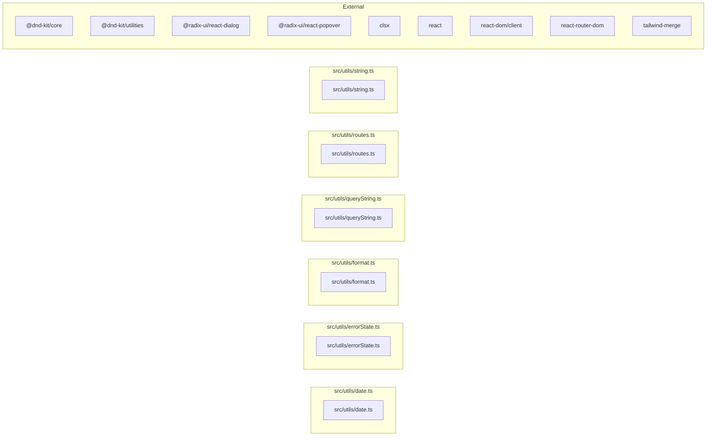

## レイヤー別依存図: types
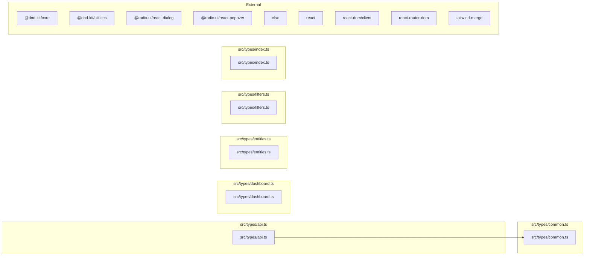

## レイヤー別依存図: constants
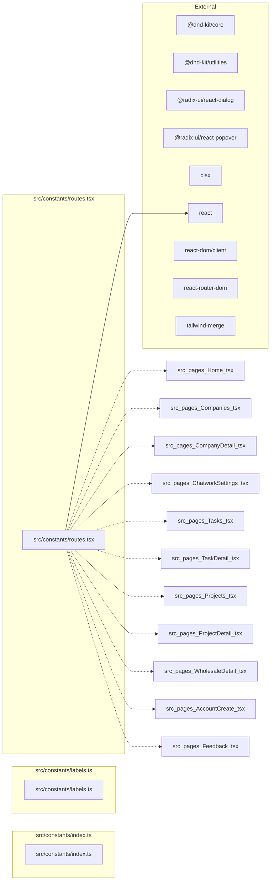

## レイヤー別依存図: strings
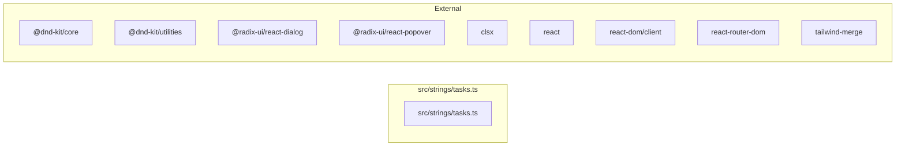

## レイヤー別依存図: styles
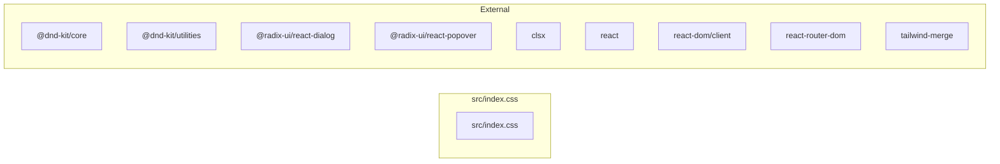

## レイヤー別依存図: other
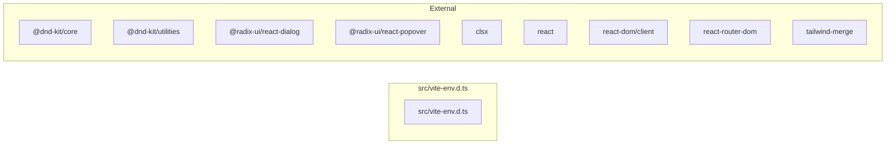

## 全ファイル索引（依存先 / 依存元）

### 依存先（このファイルがimportしているもの）

| ファイル | 依存先 |
| --- | --- |
| src/App.tsx | src/components/Layout.tsx<br>src/components/ProtectedRoute.tsx<br>src/components/ui/LoadingState.tsx<br>src/constants/routes.tsx<br>src/contexts/AuthContext.tsx<br>src/pages/Login.tsx (dynamic)<br>src/pages/NotFound.tsx (dynamic) |
| src/components/companies/CompanyContactsSection.tsx | — |
| src/components/companies/CompanyCreateForm.tsx | — |
| src/components/companies/CompanyFilters.tsx | — |
| src/components/companies/CompanyOverviewTab.tsx | — |
| src/components/companies/CompanyProjectsTab.tsx | — |
| src/components/companies/CompanySummariesTab.tsx | — |
| src/components/companies/CompanyTable.tsx | — |
| src/components/companies/CompanyTasksSection.tsx | — |
| src/components/companies/CompanyTimelineTab.tsx | — |
| src/components/companies/CompanyWholesalesTab.tsx | — |
| src/components/KanbanBoard.tsx | src/components/KanbanCard.tsx<br>src/components/KanbanColumn.tsx |
| src/components/KanbanCard.tsx | src/components/ui/FormSelect.tsx<br>src/components/ui/StatusBadge.tsx |
| src/components/KanbanColumn.tsx | src/components/KanbanCard.tsx |
| src/components/Layout.tsx | — |
| src/components/ProtectedRoute.tsx | src/components/ui/LoadingState.tsx |
| src/components/SearchSelect.tsx | src/components/ui/CloseIcon.tsx<br>src/components/ui/FormInput.tsx |
| src/components/tasks/index.ts | — |
| src/components/tasks/TaskBulkActions.tsx | — |
| src/components/tasks/TaskFilters.tsx | — |
| src/components/tasks/TaskKanban.tsx | — |
| src/components/tasks/TaskTable.tsx | — |
| src/components/ui/ActiveFilters.tsx | — |
| src/components/ui/Alert.tsx | src/components/ui/CloseIcon.tsx |
| src/components/ui/Badge.tsx | — |
| src/components/ui/Button.tsx | — |
| src/components/ui/Card.tsx | — |
| src/components/ui/CloseIcon.tsx | — |
| src/components/ui/ConfirmDialog.tsx | src/components/ui/Modal.tsx |
| src/components/ui/DateInput.tsx | src/components/ui/FormInput.tsx |
| src/components/ui/EmptyState.tsx | — |
| src/components/ui/ErrorAlert.tsx | src/components/ui/Alert.tsx |
| src/components/ui/FilterBadge.tsx | — |
| src/components/ui/FormInput.tsx | — |
| src/components/ui/FormSelect.tsx | — |
| src/components/ui/FormTextarea.tsx | — |
| src/components/ui/JobProgressCard.tsx | src/components/ui/Button.tsx |
| src/components/ui/LoadingState.tsx | — |
| src/components/ui/Modal.tsx | src/components/ui/CloseIcon.tsx |
| src/components/ui/MultiSelect.tsx | src/components/ui/Popover.tsx |
| src/components/ui/Pagination.tsx | — |
| src/components/ui/Popover.tsx | — |
| src/components/ui/Skeleton.tsx | — |
| src/components/ui/SlidePanel.tsx | src/components/ui/CloseIcon.tsx |
| src/components/ui/StatusBadge.tsx | — |
| src/components/ui/SuccessAlert.tsx | src/components/ui/Alert.tsx |
| src/components/ui/Tabs.tsx | — |
| src/components/ui/Toast.tsx | src/components/ui/CloseIcon.tsx |
| src/constants/index.ts | — |
| src/constants/labels.ts | — |
| src/constants/routes.tsx | — |
| src/contexts/AuthContext.tsx | — |
| src/hooks/useApi.ts | — |
| src/hooks/useCompanyContacts.ts | src/hooks/useApi.ts<br>src/hooks/useToast.ts |
| src/hooks/useCompanyDetailData.ts | src/hooks/useApi.ts<br>src/hooks/usePagination.ts<br>src/hooks/usePaginationSync.ts |
| src/hooks/useCompanyOverviewForm.ts | src/hooks/useApi.ts<br>src/hooks/useToast.ts |
| src/hooks/useDebouncedValue.ts | — |
| src/hooks/useFilterForm.ts | src/hooks/useUrlSync.ts |
| src/hooks/useFormState.ts | — |
| src/hooks/useKeyboardShortcut.ts | — |
| src/hooks/useListPage.ts | src/hooks/useApi.ts<br>src/hooks/useDebouncedValue.ts<br>src/hooks/useListQuery.ts<br>src/hooks/usePaginationSync.ts<br>src/hooks/useUrlSync.ts |
| src/hooks/useListQuery.ts | — |
| src/hooks/usePagination.ts | — |
| src/hooks/usePaginationSync.ts | — |
| src/hooks/usePermissions.ts | — |
| src/hooks/useToast.ts | — |
| src/hooks/useUrlSync.ts | — |
| src/index.css | — |
| src/lib/apiCache.ts | — |
| src/lib/apiClient.ts | src/lib/authToken.ts |
| src/lib/apiRequest.ts | — |
| src/lib/apiRoutes.ts | — |
| src/lib/authToken.ts | — |
| src/lib/cn.ts | — |
| src/main.tsx | src/App.tsx<br>src/index.css |
| src/pages/AccountCreate.tsx | — |
| src/pages/ChatworkSettings.tsx | — |
| src/pages/Companies.tsx | — |
| src/pages/CompanyDetail.tsx | — |
| src/pages/Feedback.tsx | — |
| src/pages/Home.tsx | — |
| src/pages/Login.tsx | — |
| src/pages/NotFound.tsx | — |
| src/pages/ProjectDetail.tsx | — |
| src/pages/Projects.tsx | — |
| src/pages/TaskDetail.tsx | — |
| src/pages/Tasks.tsx | — |
| src/pages/WholesaleDetail.tsx | — |
| src/strings/tasks.ts | — |
| src/types/api.ts | src/types/common.ts |
| src/types/common.ts | — |
| src/types/dashboard.ts | — |
| src/types/entities.ts | — |
| src/types/filters.ts | — |
| src/types/index.ts | — |
| src/utils/date.ts | — |
| src/utils/errorState.ts | — |
| src/utils/format.ts | — |
| src/utils/queryString.ts | — |
| src/utils/routes.ts | — |
| src/utils/string.ts | — |
| src/vite-env.d.ts | — |

### 依存元（このファイルをimportしているもの）

| ファイル | 依存元 |
| --- | --- |
| src/App.tsx | src/main.tsx |
| src/components/companies/CompanyContactsSection.tsx | — |
| src/components/companies/CompanyCreateForm.tsx | — |
| src/components/companies/CompanyFilters.tsx | — |
| src/components/companies/CompanyOverviewTab.tsx | — |
| src/components/companies/CompanyProjectsTab.tsx | — |
| src/components/companies/CompanySummariesTab.tsx | — |
| src/components/companies/CompanyTable.tsx | — |
| src/components/companies/CompanyTasksSection.tsx | — |
| src/components/companies/CompanyTimelineTab.tsx | — |
| src/components/companies/CompanyWholesalesTab.tsx | — |
| src/components/KanbanBoard.tsx | — |
| src/components/KanbanCard.tsx | src/components/KanbanBoard.tsx<br>src/components/KanbanColumn.tsx |
| src/components/KanbanColumn.tsx | src/components/KanbanBoard.tsx |
| src/components/Layout.tsx | src/App.tsx |
| src/components/ProtectedRoute.tsx | src/App.tsx |
| src/components/SearchSelect.tsx | — |
| src/components/tasks/index.ts | — |
| src/components/tasks/TaskBulkActions.tsx | — |
| src/components/tasks/TaskFilters.tsx | — |
| src/components/tasks/TaskKanban.tsx | — |
| src/components/tasks/TaskTable.tsx | — |
| src/components/ui/ActiveFilters.tsx | — |
| src/components/ui/Alert.tsx | src/components/ui/ErrorAlert.tsx<br>src/components/ui/SuccessAlert.tsx |
| src/components/ui/Badge.tsx | — |
| src/components/ui/Button.tsx | src/components/ui/JobProgressCard.tsx |
| src/components/ui/Card.tsx | — |
| src/components/ui/CloseIcon.tsx | src/components/SearchSelect.tsx<br>src/components/ui/Alert.tsx<br>src/components/ui/Modal.tsx<br>src/components/ui/SlidePanel.tsx<br>src/components/ui/Toast.tsx |
| src/components/ui/ConfirmDialog.tsx | — |
| src/components/ui/DateInput.tsx | — |
| src/components/ui/EmptyState.tsx | — |
| src/components/ui/ErrorAlert.tsx | — |
| src/components/ui/FilterBadge.tsx | — |
| src/components/ui/FormInput.tsx | src/components/SearchSelect.tsx<br>src/components/ui/DateInput.tsx |
| src/components/ui/FormSelect.tsx | src/components/KanbanCard.tsx |
| src/components/ui/FormTextarea.tsx | — |
| src/components/ui/JobProgressCard.tsx | — |
| src/components/ui/LoadingState.tsx | src/App.tsx<br>src/components/ProtectedRoute.tsx |
| src/components/ui/Modal.tsx | src/components/ui/ConfirmDialog.tsx |
| src/components/ui/MultiSelect.tsx | — |
| src/components/ui/Pagination.tsx | — |
| src/components/ui/Popover.tsx | src/components/ui/MultiSelect.tsx |
| src/components/ui/Skeleton.tsx | — |
| src/components/ui/SlidePanel.tsx | — |
| src/components/ui/StatusBadge.tsx | src/components/KanbanCard.tsx |
| src/components/ui/SuccessAlert.tsx | — |
| src/components/ui/Tabs.tsx | — |
| src/components/ui/Toast.tsx | — |
| src/constants/index.ts | — |
| src/constants/labels.ts | — |
| src/constants/routes.tsx | src/App.tsx |
| src/contexts/AuthContext.tsx | src/App.tsx |
| src/hooks/useApi.ts | src/hooks/useCompanyContacts.ts<br>src/hooks/useCompanyDetailData.ts<br>src/hooks/useCompanyOverviewForm.ts<br>src/hooks/useListPage.ts |
| src/hooks/useCompanyContacts.ts | — |
| src/hooks/useCompanyDetailData.ts | — |
| src/hooks/useCompanyOverviewForm.ts | — |
| src/hooks/useDebouncedValue.ts | src/hooks/useListPage.ts |
| src/hooks/useFilterForm.ts | — |
| src/hooks/useFormState.ts | — |
| src/hooks/useKeyboardShortcut.ts | — |
| src/hooks/useListPage.ts | — |
| src/hooks/useListQuery.ts | src/hooks/useListPage.ts |
| src/hooks/usePagination.ts | src/hooks/useCompanyDetailData.ts |
| src/hooks/usePaginationSync.ts | src/hooks/useCompanyDetailData.ts<br>src/hooks/useListPage.ts |
| src/hooks/usePermissions.ts | — |
| src/hooks/useToast.ts | src/hooks/useCompanyContacts.ts<br>src/hooks/useCompanyOverviewForm.ts |
| src/hooks/useUrlSync.ts | src/hooks/useFilterForm.ts<br>src/hooks/useListPage.ts |
| src/index.css | src/main.tsx |
| src/lib/apiCache.ts | — |
| src/lib/apiClient.ts | — |
| src/lib/apiRequest.ts | — |
| src/lib/apiRoutes.ts | — |
| src/lib/authToken.ts | src/lib/apiClient.ts |
| src/lib/cn.ts | — |
| src/main.tsx | — |
| src/pages/AccountCreate.tsx | — |
| src/pages/ChatworkSettings.tsx | — |
| src/pages/Companies.tsx | — |
| src/pages/CompanyDetail.tsx | — |
| src/pages/Feedback.tsx | — |
| src/pages/Home.tsx | — |
| src/pages/Login.tsx | src/App.tsx (dynamic) |
| src/pages/NotFound.tsx | src/App.tsx (dynamic) |
| src/pages/ProjectDetail.tsx | — |
| src/pages/Projects.tsx | — |
| src/pages/TaskDetail.tsx | — |
| src/pages/Tasks.tsx | — |
| src/pages/WholesaleDetail.tsx | — |
| src/strings/tasks.ts | — |
| src/types/api.ts | — |
| src/types/common.ts | src/types/api.ts |
| src/types/dashboard.ts | — |
| src/types/entities.ts | — |
| src/types/filters.ts | — |
| src/types/index.ts | — |
| src/utils/date.ts | — |
| src/utils/errorState.ts | — |
| src/utils/format.ts | — |
| src/utils/queryString.ts | — |
| src/utils/routes.ts | — |
| src/utils/string.ts | — |
| src/vite-env.d.ts | — |
